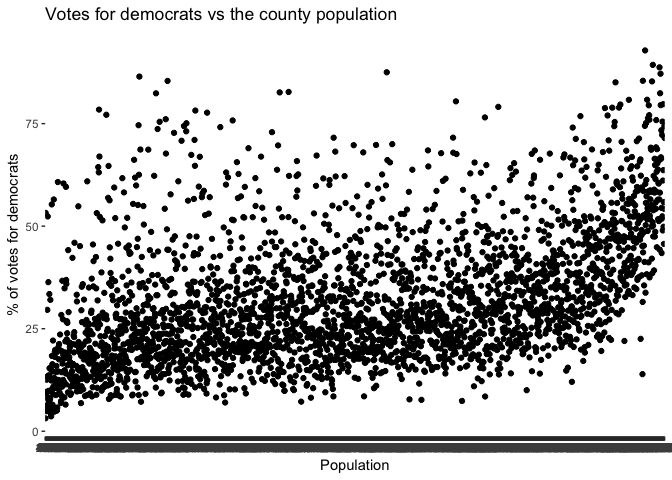
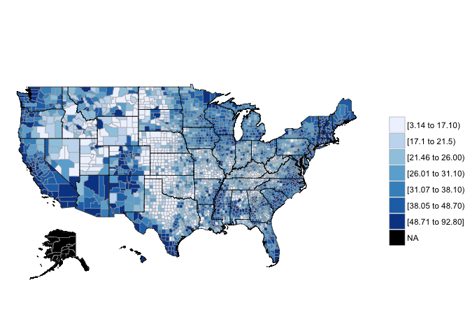
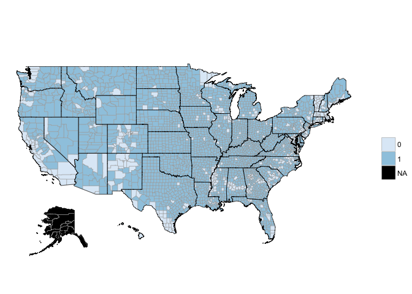

2016 Election Results analysis using dplyr and ggplot2

I have used the following datasets to analyze the US 2016 election
results by county.

US\_County\_Level\_Presidential\_Results\_08-16.csv.bz2
county\_data.csv.bz2

``` r
library(ggplot2)
library(dplyr)
```

    ## 
    ## Attaching package: 'dplyr'

    ## The following objects are masked from 'package:stats':
    ## 
    ##     filter, lag

    ## The following objects are masked from 'package:base':
    ## 
    ##     intersect, setdiff, setequal, union

``` r
library(gmodels)
library(rpart)
library(ggmap)
library(fiftystater)
library(choroplethr)
```

    ## Loading required package: acs

    ## Loading required package: stringr

    ## Loading required package: XML

    ## 
    ## Attaching package: 'acs'

    ## The following object is masked from 'package:dplyr':
    ## 
    ##     combine

    ## The following object is masked from 'package:base':
    ## 
    ##     apply

``` r
library(maps)
library(pscl)
```

    ## Classes and Methods for R developed in the
    ## Political Science Computational Laboratory
    ## Department of Political Science
    ## Stanford University
    ## Simon Jackman
    ## hurdle and zeroinfl functions by Achim Zeileis

``` r
library(mfx)
```

    ## Loading required package: sandwich

    ## Loading required package: lmtest

    ## Loading required package: zoo

    ## 
    ## Attaching package: 'zoo'

    ## The following objects are masked from 'package:base':
    ## 
    ##     as.Date, as.Date.numeric

    ## Loading required package: MASS

    ## 
    ## Attaching package: 'MASS'

    ## The following object is masked from 'package:dplyr':
    ## 
    ##     select

    ## Loading required package: betareg

``` r
#Read the data
pres_results <- read.csv("US_County_Level_Presidential_Results_08-16.csv.bz2")
county_data <-read.csv("county_data.csv.bz2")

#Statistics for presidential results
str(pres_results)
```

    ## 'data.frame':    3112 obs. of  14 variables:
    ##  $ fips_code : int  26041 48295 1127 48389 56017 20043 37183 37147 48497 21207 ...
    ##  $ county    : Factor w/ 1845 levels "Abbeville County",..: 468 973 1728 1381 779 495 1725 1306 1809 1432 ...
    ##  $ total_2008: int  19064 1256 28652 3077 2546 3564 442245 74884 20639 7475 ...
    ##  $ dem_2008  : int  9974 155 7420 1606 619 1115 250891 40501 4471 1569 ...
    ##  $ gop_2008  : int  8763 1093 20722 1445 1834 2372 187001 33927 15973 5779 ...
    ##  $ oth_2008  : int  327 8 510 26 93 77 4353 456 195 127 ...
    ##  $ total_2012: int  18043 1168 28497 2867 2495 3369 526805 76814 20692 7907 ...
    ##  $ dem_2012  : int  8330 119 6551 1649 523 885 286939 40701 3219 1445 ...
    ##  $ gop_2012  : int  9533 1044 21633 1185 1894 2397 232933 35534 17178 6346 ...
    ##  $ oth_2012  : int  180 5 313 33 78 87 6933 579 295 116 ...
    ##  $ total_2016: int  18467 1322 29243 3184 2535 3366 510940 78264 24661 8171 ...
    ##  $ dem_2016  : int  6431 135 4486 1659 400 584 298353 40967 3412 1093 ...
    ##  $ gop_2016  : int  11112 1159 24208 1417 1939 2601 193607 35191 20655 6863 ...
    ##  $ oth_2016  : int  924 28 549 108 196 181 18980 2106 594 215 ...

``` r
#Statistics for county data
str(county_data)
```

    ## 'data.frame':    3193 obs. of  116 variables:
    ##  $ SUMLEV               : int  40 50 50 50 50 50 50 50 50 50 ...
    ##  $ REGION               : int  3 3 3 3 3 3 3 3 3 3 ...
    ##  $ DIVISION             : int  6 6 6 6 6 6 6 6 6 6 ...
    ##  $ STATE                : int  1 1 1 1 1 1 1 1 1 1 ...
    ##  $ COUNTY               : int  0 1 3 5 7 9 11 13 15 17 ...
    ##  $ STNAME               : Factor w/ 51 levels "Alabama","Alaska",..: 1 1 1 1 1 1 1 1 1 1 ...
    ##  $ CTYNAME              : Factor w/ 1927 levels "Abbeville County",..: 10 87 94 105 154 169 230 240 253 302 ...
    ##  $ CENSUS2010POP        : int  4779736 54571 182265 27457 22915 57322 10914 20947 118572 34215 ...
    ##  $ ESTIMATESBASE2010    : int  4780131 54571 182265 27457 22919 57324 10911 20946 118586 34170 ...
    ##  $ POPESTIMATE2010      : int  4785492 54742 183199 27348 22861 57376 10892 20938 118468 34101 ...
    ##  $ POPESTIMATE2011      : int  4799918 55255 186653 27326 22736 57707 10722 20848 117736 34006 ...
    ##  $ POPESTIMATE2012      : int  4815960 55027 190403 27132 22645 57772 10654 20665 117208 34084 ...
    ##  $ POPESTIMATE2013      : int  4829479 54792 195147 26938 22501 57746 10576 20330 116475 34123 ...
    ##  $ POPESTIMATE2014      : int  4843214 54977 199745 26763 22511 57621 10712 20283 115837 33996 ...
    ##  $ POPESTIMATE2015      : int  4853875 55035 203690 26270 22561 57676 10455 20126 115285 34043 ...
    ##  $ POPESTIMATE2016      : int  4863300 55416 208563 25965 22643 57704 10362 19998 114611 33843 ...
    ##  $ NPOPCHG_2010         : int  5361 171 934 -109 -58 52 -19 -8 -118 -69 ...
    ##  $ NPOPCHG_2011         : int  14426 513 3454 -22 -125 331 -170 -90 -732 -95 ...
    ##  $ NPOPCHG_2012         : int  16042 -228 3750 -194 -91 65 -68 -183 -528 78 ...
    ##  $ NPOPCHG_2013         : int  13519 -235 4744 -194 -144 -26 -78 -335 -733 39 ...
    ##  $ NPOPCHG_2014         : int  13735 185 4598 -175 10 -125 136 -47 -638 -127 ...
    ##  $ NPOPCHG_2015         : int  10661 58 3945 -493 50 55 -257 -157 -552 47 ...
    ##  $ NPOPCHG_2016         : int  9425 381 4873 -305 82 28 -93 -128 -674 -200 ...
    ##  $ BIRTHS2010           : int  14231 151 516 70 44 183 39 65 318 81 ...
    ##  $ BIRTHS2011           : int  59689 636 2188 335 266 744 169 276 1384 401 ...
    ##  $ BIRTHS2012           : int  59066 614 2092 300 245 711 122 241 1357 393 ...
    ##  $ BIRTHS2013           : int  57939 574 2161 283 258 646 131 240 1309 406 ...
    ##  $ BIRTHS2014           : int  58906 640 2214 265 254 620 124 250 1317 425 ...
    ##  $ BIRTHS2015           : int  59034 636 2237 258 259 689 115 248 1289 423 ...
    ##  $ BIRTHS2016           : int  58556 631 2274 253 266 663 114 236 1237 419 ...
    ##  $ DEATHS2010           : int  11086 154 532 128 34 132 52 60 313 80 ...
    ##  $ DEATHS2011           : int  48817 507 1825 318 277 568 132 261 1326 441 ...
    ##  $ DEATHS2012           : int  48372 560 1882 293 239 593 117 272 1357 475 ...
    ##  $ DEATHS2013           : int  50845 582 1903 295 281 584 120 261 1411 452 ...
    ##  $ DEATHS2014           : int  49693 575 1989 313 250 587 115 288 1392 454 ...
    ##  $ DEATHS2015           : int  51407 475 2080 319 207 634 108 268 1427 465 ...
    ##  $ DEATHS2016           : int  52405 494 2113 314 237 622 111 241 1441 476 ...
    ##  $ NATURALINC2010       : int  3145 -3 -16 -58 10 51 -13 5 5 1 ...
    ##  $ NATURALINC2011       : int  10872 129 363 17 -11 176 37 15 58 -40 ...
    ##  $ NATURALINC2012       : int  10694 54 210 7 6 118 5 -31 0 -82 ...
    ##  $ NATURALINC2013       : int  7094 -8 258 -12 -23 62 11 -21 -102 -46 ...
    ##  $ NATURALINC2014       : int  9213 65 225 -48 4 33 9 -38 -75 -29 ...
    ##  $ NATURALINC2015       : int  7627 161 157 -61 52 55 7 -20 -138 -42 ...
    ##  $ NATURALINC2016       : int  6151 137 161 -61 29 41 3 -5 -204 -57 ...
    ##  $ INTERNATIONALMIG2010 : int  1360 33 66 2 2 5 7 0 6 7 ...
    ##  $ INTERNATIONALMIG2011 : int  4816 18 183 -4 10 -3 19 2 39 31 ...
    ##  $ INTERNATIONALMIG2012 : int  4695 2 176 -10 13 18 16 5 63 19 ...
    ##  $ INTERNATIONALMIG2013 : int  4179 2 209 -9 13 29 9 7 26 17 ...
    ##  $ INTERNATIONALMIG2014 : int  4732 6 239 -8 18 32 10 8 24 19 ...
    ##  $ INTERNATIONALMIG2015 : int  5110 8 257 -6 18 36 9 8 29 18 ...
    ##  $ INTERNATIONALMIG2016 : int  4738 7 243 -5 18 38 9 8 27 18 ...
    ##  $ DOMESTICMIG2010      : int  866 134 867 -54 -69 -3 -13 -11 -124 -71 ...
    ##  $ DOMESTICMIG2011      : int  -1416 321 2731 -31 -123 104 -242 -105 -788 -85 ...
    ##  $ DOMESTICMIG2012      : int  414 -294 3333 -192 -111 -67 -90 -160 -591 138 ...
    ##  $ DOMESTICMIG2013      : int  1619 -253 4178 -190 -148 -94 -92 -312 -647 70 ...
    ##  $ DOMESTICMIG2014      : int  420 118 3759 -113 2 -161 117 -8 -518 -117 ...
    ##  $ DOMESTICMIG2015      : int  -3114 -154 3492 -440 2 -81 -280 -150 -457 49 ...
    ##  $ DOMESTICMIG2016      : int  -864 228 4046 -248 34 -65 -101 -127 -462 -155 ...
    ##  $ NETMIG2010           : int  2226 167 933 -52 -67 2 -6 -11 -118 -64 ...
    ##  $ NETMIG2011           : int  3400 339 2914 -35 -113 101 -223 -103 -749 -54 ...
    ##  $ NETMIG2012           : int  5109 -292 3509 -202 -98 -49 -74 -155 -528 157 ...
    ##  $ NETMIG2013           : int  5798 -251 4387 -199 -135 -65 -83 -305 -621 87 ...
    ##  $ NETMIG2014           : int  5152 124 3998 -121 20 -129 127 0 -494 -98 ...
    ##  $ NETMIG2015           : int  1996 -146 3749 -446 20 -45 -271 -142 -428 67 ...
    ##  $ NETMIG2016           : int  3874 235 4289 -253 52 -27 -92 -119 -435 -137 ...
    ##  $ RESIDUAL2010         : int  -10 7 17 1 -1 -1 0 -2 -5 -6 ...
    ##  $ RESIDUAL2011         : int  154 45 177 -4 -1 54 16 -2 -41 -1 ...
    ##  $ RESIDUAL2012         : int  239 10 31 1 1 -4 1 3 0 3 ...
    ##  $ RESIDUAL2013         : int  627 24 99 17 14 -23 -6 -9 -10 -2 ...
    ##  $ RESIDUAL2014         : int  -630 -4 375 -6 -14 -29 0 -9 -69 0 ...
    ##  $ RESIDUAL2015         : int  1038 43 39 14 -22 45 7 5 14 22 ...
    ##  $ RESIDUAL2016         : int  -600 9 423 9 1 14 -4 -4 -35 -6 ...
    ##  $ GQESTIMATESBASE2010  : int  116185 455 2307 3193 2224 489 1690 333 2933 458 ...
    ##  $ GQESTIMATES2010      : int  116214 455 2307 3193 2224 489 1690 333 2934 458 ...
    ##  $ GQESTIMATES2011      : int  115521 455 2263 3379 2224 489 1690 333 2883 458 ...
    ##  $ GQESTIMATES2012      : int  115697 455 2242 3388 2225 489 1776 333 2959 458 ...
    ##  $ GQESTIMATES2013      : int  116984 455 2296 3388 2224 489 1717 333 2813 458 ...
    ##  $ GQESTIMATES2014      : int  119189 455 2333 3352 2241 489 1758 333 2796 458 ...
    ##  $ GQESTIMATES2015      : int  120174 455 2339 3198 2255 489 1656 333 2773 458 ...
    ##  $ GQESTIMATES2016      : int  119659 455 2341 3186 2252 489 1653 333 2776 458 ...
    ##  $ RBIRTH2011           : num  12.5 11.6 11.8 12.3 11.7 ...
    ##  $ RBIRTH2012           : num  12.3 11.1 11.1 11 10.8 ...
    ##  $ RBIRTH2013           : num  12 10.5 11.2 10.5 11.4 ...
    ##  $ RBIRTH2014           : num  12.18 11.66 11.21 9.87 11.29 ...
    ##  $ RBIRTH2015           : num  12.18 11.56 11.09 9.73 11.49 ...
    ##  $ RBIRTH2016           : num  12.05 11.43 11.03 9.69 11.77 ...
    ##  $ RDEATH2011           : num  10.19 9.22 9.87 11.63 12.15 ...
    ##  $ RDEATH2012           : num  10.06 10.16 9.98 10.76 10.53 ...
    ##  $ RDEATH2013           : num  10.54 10.6 9.87 10.91 12.45 ...
    ##  $ RDEATH2014           : num  10.3 10.5 10.1 11.7 11.1 ...
    ##  $ RDEATH2015           : num  10.6 8.64 10.31 12.03 9.19 ...
    ##  $ RDEATH2016           : num  10.79 8.95 10.25 12.02 10.49 ...
    ##  $ RNATURALINC2011      : num  2.268 2.346 1.963 0.622 -0.482 ...
    ##  $ RNATURALINC2012      : num  2.224 0.979 1.114 0.257 0.264 ...
    ##  $ RNATURALINC2013      : num  1.471 -0.146 1.338 -0.444 -1.019 ...
    ##  $ RNATURALINC2014      : num  1.905 1.184 1.14 -1.788 0.178 ...
    ##  $ RNATURALINC2015      : num  1.573 2.927 0.778 -2.3 2.307 ...
    ##  $ RNATURALINC2016      : num  1.266 2.481 0.781 -2.336 1.283 ...
    ##  $ RINTERNATIONALMIG2011: num  1.005 0.327 0.99 -0.146 0.439 ...
    ##   [list output truncated]

``` r
county_data$fips_code <-paste(county_data$STATE*1000 + county_data$COUNTY)

pres_county_data <- merge(pres_results,county_data,by="fips_code",all.x=TRUE)

pres_county_data_1 <-subset(pres_county_data, select = c(fips_code,REGION, DIVISION,STATE,COUNTY,STNAME,CTYNAME,POPESTIMATE2016,total_2016,dem_2016,gop_2016,oth_2016))
```

I have tidied the data. Merged these datasets, retained only more
interesting variables, compute additional variables I found interesting.
First, I read the two datasets. In order to merge the two datasets, I
had to first compute the fips code for the county\_data dataframe. To
compute it, in the same format as given in the other dataset, I
multiplied the STATE variable with 1000 and added the COUNTY variable to
it, giving us a 5 digit FIPS code. I then merged the two datasets using
a left\_join, in order to preserve county data, and to avoid too many
NAs in the dataset that would be coerced in, on using a full\_join. I
then created a final dataset, using a subset of only the variables, that
I thought were pertinent to problem 1.

``` r
head(pres_county_data_1)
```

    ##   fips_code REGION DIVISION STATE COUNTY  STNAME        CTYNAME
    ## 1      1001      3        6     1      1 Alabama Autauga County
    ## 2      1003      3        6     1      3 Alabama Baldwin County
    ## 3      1005      3        6     1      5 Alabama Barbour County
    ## 4      1007      3        6     1      7 Alabama    Bibb County
    ## 5      1009      3        6     1      9 Alabama  Blount County
    ## 6      1011      3        6     1     11 Alabama Bullock County
    ##   POPESTIMATE2016 total_2016 dem_2016 gop_2016 oth_2016
    ## 1           55416      24661     5908    18110      643
    ## 2          208563      94090    18409    72780     2901
    ## 3           25965      10390     4848     5431      111
    ## 4           22643       8748     1874     6733      141
    ## 5           57704      25384     2150    22808      426
    ## 6           10362       4701     3530     1139       32

``` r
tail(pres_county_data_1)
```

    ##      fips_code REGION DIVISION STATE COUNTY  STNAME           CTYNAME
    ## 3107     56035      4        8    56     35 Wyoming   Sublette County
    ## 3108     56037      4        8    56     37 Wyoming Sweetwater County
    ## 3109     56039      4        8    56     39 Wyoming      Teton County
    ## 3110     56041      4        8    56     41 Wyoming      Uinta County
    ## 3111     56043      4        8    56     43 Wyoming   Washakie County
    ## 3112     56045      4        8    56     45 Wyoming     Weston County
    ##      POPESTIMATE2016 total_2016 dem_2016 gop_2016 oth_2016
    ## 3107            9769       4297      644     3409      244
    ## 3108           44165      16661     3233    12153     1275
    ## 3109           23191      12176     7313     3920      943
    ## 3110           20773       8053     1202     6154      697
    ## 3111            8235       3715      532     2911      272
    ## 3112            7236       3334      294     2898      142

``` r
str(pres_county_data_1)
```

    ## 'data.frame':    3112 obs. of  12 variables:
    ##  $ fips_code      : int  1001 1003 1005 1007 1009 1011 1013 1015 1017 1019 ...
    ##  $ REGION         : int  3 3 3 3 3 3 3 3 3 3 ...
    ##  $ DIVISION       : int  6 6 6 6 6 6 6 6 6 6 ...
    ##  $ STATE          : int  1 1 1 1 1 1 1 1 1 1 ...
    ##  $ COUNTY         : int  1 3 5 7 9 11 13 15 17 19 ...
    ##  $ STNAME         : Factor w/ 51 levels "Alabama","Alaska",..: 1 1 1 1 1 1 1 1 1 1 ...
    ##  $ CTYNAME        : Factor w/ 1927 levels "Abbeville County",..: 87 94 105 154 169 230 240 253 302 324 ...
    ##  $ POPESTIMATE2016: int  55416 208563 25965 22643 57704 10362 19998 114611 33843 25725 ...
    ##  $ total_2016     : int  24661 94090 10390 8748 25384 4701 8685 47376 13778 10503 ...
    ##  $ dem_2016       : int  5908 18409 4848 1874 2150 3530 3716 13197 5763 1524 ...
    ##  $ gop_2016       : int  18110 72780 5431 6733 22808 1139 4891 32803 7803 8809 ...
    ##  $ oth_2016       : int  643 2901 111 141 426 32 78 1376 212 170 ...

``` r
summary(pres_county_data_1)
```

    ##    fips_code         REGION         DIVISION         STATE      
    ##  Min.   : 1001   Min.   :1.000   Min.   :1.000   Min.   : 1.00  
    ##  1st Qu.:19038   1st Qu.:2.000   1st Qu.:4.000   1st Qu.:19.00  
    ##  Median :29208   Median :3.000   Median :5.000   Median :29.00  
    ##  Mean   :30652   Mean   :2.656   Mean   :5.156   Mean   :30.54  
    ##  3rd Qu.:46006   3rd Qu.:3.000   3rd Qu.:7.000   3rd Qu.:46.00  
    ##  Max.   :56045   Max.   :4.000   Max.   :9.000   Max.   :56.00  
    ##                  NA's   :1       NA's   :1       NA's   :1      
    ##      COUNTY           STNAME                  CTYNAME    
    ##  Min.   :  1.0   Texas   : 254   Washington County:  30  
    ##  1st Qu.: 35.0   Georgia : 159   Jefferson County :  25  
    ##  Median : 78.0   Virginia: 133   Franklin County  :  24  
    ##  Mean   :103.2   Kentucky: 120   Jackson County   :  23  
    ##  3rd Qu.:133.0   Missouri: 115   Lincoln County   :  23  
    ##  Max.   :840.0   (Other) :2330   (Other)          :2986  
    ##  NA's   :1       NA's    :   1   NA's             :   1  
    ##  POPESTIMATE2016      total_2016         dem_2016          gop_2016     
    ##  Min.   :     113   Min.   :     64   Min.   :      4   Min.   :    57  
    ##  1st Qu.:   11194   1st Qu.:   4815   1st Qu.:   1165   1st Qu.:  3206  
    ##  Median :   26027   Median :  10930   Median :   3140   Median :  7113  
    ##  Mean   :  103623   Mean   :  40896   Mean   :  19561   Mean   : 19344  
    ##  3rd Qu.:   67968   3rd Qu.:  28664   3rd Qu.:   9535   3rd Qu.: 17392  
    ##  Max.   :10137915   Max.   :2314275   Max.   :1654626   Max.   :590465  
    ##  NA's   :1                                                              
    ##     oth_2016     
    ##  Min.   :     3  
    ##  1st Qu.:   165  
    ##  Median :   440  
    ##  Mean   :  1992  
    ##  3rd Qu.:  1394  
    ##  Max.   :117058  
    ## 

This dataset contains 3112 observations and 12 variables. These
variables are, 1. fips\_code: Federal Information Processing Standards
codes. 2. REGION: Census Region code 3. DIVISION: Census Division code
4. STATE: State FIPS code 5. COUNTY: County FIPS code 6. STNAME: State
name 7. CTYNAME: County name 8. POPESTIMATE2016:7/1/2016 resident total
population estimate 9. total\_2016:Total voting population in the county
10. dem\_2016: Votes for the democratic party in the county
11.oth\_2016: Votes for other parties in the county 12.gop\_2016: Votes
for the republican party in the county

I would like to analyse the population estimate and its association with
the election results, in order understand the popular vote, and possibly
adding more variables to the dataset as predictors for the election
outcome.

``` r
pres_county_data_1$percent_dem <- paste(pres_county_data_1$dem_2016*100/pres_county_data_1$total_2016)

ggplot(data=na.omit(pres_county_data_1),aes(x=as.factor(POPESTIMATE2016),y=as.numeric(percent_dem))) + geom_point(stat="identity")+labs(title= "Votes for democrats vs the county population",x =  "Population",y = "% of votes for democrats")
```



On looking at the scatter plot above, we can see that there is a
positive association between votes for democrats and the county
population, as the plots are clustered on a slight incline.

I would like to create a map of percentage of votes for democrats.

``` r
 county_plot<-function(fips_code,percent_dem){
   library(choroplethr)
   temp  <- as.data.frame(list(region=as.numeric(fips_code),value=as.numeric(percent_dem)))
   county_choropleth(temp)
 }

county_plot(na.omit(pres_county_data_1$fips_code),pres_county_data_1$percent_dem)
```

    ## Warning in self$bind(): The following regions were missing and are being
    ## set to NA: 2050, 2105, 2122, 2150, 2164, 2180, 2188, 2240, 2090, 2198,
    ## 15005, 2100, 2170, 51515, 2016, 2060, 2290, 2282, 2070, 2110, 2130, 2185,
    ## 2195, 2220, 2230, 2020, 2068, 2013, 2261, 2270, 2275



The map plots the % of votes for democrates in each county, wherein
darker the color of blue, more is the percentage of votes ofr the
democratic party. I used the library chloroplthr for simplicity, and to
allow for the usage of fips\_code, which would not have been possible if
using ggmaps.

I then created one more visualization regarding the election results.

``` r
#all_states <- map_data("state")
pres_county_data_1$STNAME <- tolower(pres_county_data_1$STNAME)
pres_county_data_1$CTYNAME <- tolower(pres_county_data_1$CTYNAME)  

#pres_county_data_1$region <- pres_county_data_1$STNAME
#pres_county_data_2 <- merge(pres_county_data_1,all_states,by="region")
#pres_county_data_2 <- subset(pres_county_data_2, select = -c(order))
#pres_county_data_2 <- distinct(pres_county_data_2,"region")

pres_county_data_1$m<-ifelse(pres_county_data_1$dem_2016>pres_county_data_1$gop_2016, 0,1)
na.omit(pres_county_data_1)
```

    ##      fips_code REGION DIVISION STATE COUNTY               STNAME
    ## 1         1001      3        6     1      1              alabama
    ## 2         1003      3        6     1      3              alabama
    ## 3         1005      3        6     1      5              alabama
    ## 4         1007      3        6     1      7              alabama
    ## 5         1009      3        6     1      9              alabama
    ## 6         1011      3        6     1     11              alabama
    ## 7         1013      3        6     1     13              alabama
    ## 8         1015      3        6     1     15              alabama
    ## 9         1017      3        6     1     17              alabama
    ## 10        1019      3        6     1     19              alabama
    ## 11        1021      3        6     1     21              alabama
    ## 12        1023      3        6     1     23              alabama
    ## 13        1025      3        6     1     25              alabama
    ## 14        1027      3        6     1     27              alabama
    ## 15        1029      3        6     1     29              alabama
    ## 16        1031      3        6     1     31              alabama
    ## 17        1033      3        6     1     33              alabama
    ## 18        1035      3        6     1     35              alabama
    ## 19        1037      3        6     1     37              alabama
    ## 20        1039      3        6     1     39              alabama
    ## 21        1041      3        6     1     41              alabama
    ## 22        1043      3        6     1     43              alabama
    ## 23        1045      3        6     1     45              alabama
    ## 24        1047      3        6     1     47              alabama
    ## 25        1049      3        6     1     49              alabama
    ## 26        1051      3        6     1     51              alabama
    ## 27        1053      3        6     1     53              alabama
    ## 28        1055      3        6     1     55              alabama
    ## 29        1057      3        6     1     57              alabama
    ## 30        1059      3        6     1     59              alabama
    ## 31        1061      3        6     1     61              alabama
    ## 32        1063      3        6     1     63              alabama
    ## 33        1065      3        6     1     65              alabama
    ## 34        1067      3        6     1     67              alabama
    ## 35        1069      3        6     1     69              alabama
    ## 36        1071      3        6     1     71              alabama
    ## 37        1073      3        6     1     73              alabama
    ## 38        1075      3        6     1     75              alabama
    ## 39        1077      3        6     1     77              alabama
    ## 40        1079      3        6     1     79              alabama
    ## 41        1081      3        6     1     81              alabama
    ## 42        1083      3        6     1     83              alabama
    ## 43        1085      3        6     1     85              alabama
    ## 44        1087      3        6     1     87              alabama
    ## 45        1089      3        6     1     89              alabama
    ## 46        1091      3        6     1     91              alabama
    ## 47        1093      3        6     1     93              alabama
    ## 48        1095      3        6     1     95              alabama
    ## 49        1097      3        6     1     97              alabama
    ## 50        1099      3        6     1     99              alabama
    ## 51        1101      3        6     1    101              alabama
    ## 52        1103      3        6     1    103              alabama
    ## 53        1105      3        6     1    105              alabama
    ## 54        1107      3        6     1    107              alabama
    ## 55        1109      3        6     1    109              alabama
    ## 56        1111      3        6     1    111              alabama
    ## 57        1113      3        6     1    113              alabama
    ## 58        1115      3        6     1    115              alabama
    ## 59        1117      3        6     1    117              alabama
    ## 60        1119      3        6     1    119              alabama
    ## 61        1121      3        6     1    121              alabama
    ## 62        1123      3        6     1    123              alabama
    ## 63        1125      3        6     1    125              alabama
    ## 64        1127      3        6     1    127              alabama
    ## 65        1129      3        6     1    129              alabama
    ## 66        1131      3        6     1    131              alabama
    ## 67        1133      3        6     1    133              alabama
    ## 68        4001      4        8     4      1              arizona
    ## 69        4003      4        8     4      3              arizona
    ## 70        4005      4        8     4      5              arizona
    ## 71        4007      4        8     4      7              arizona
    ## 72        4009      4        8     4      9              arizona
    ## 73        4011      4        8     4     11              arizona
    ## 74        4012      4        8     4     12              arizona
    ## 75        4013      4        8     4     13              arizona
    ## 76        4015      4        8     4     15              arizona
    ## 77        4017      4        8     4     17              arizona
    ## 78        4019      4        8     4     19              arizona
    ## 79        4021      4        8     4     21              arizona
    ## 80        4023      4        8     4     23              arizona
    ## 81        4025      4        8     4     25              arizona
    ## 82        4027      4        8     4     27              arizona
    ## 83        5001      3        7     5      1             arkansas
    ## 84        5003      3        7     5      3             arkansas
    ## 85        5005      3        7     5      5             arkansas
    ## 86        5007      3        7     5      7             arkansas
    ## 87        5009      3        7     5      9             arkansas
    ## 88        5011      3        7     5     11             arkansas
    ## 89        5013      3        7     5     13             arkansas
    ## 90        5015      3        7     5     15             arkansas
    ## 91        5017      3        7     5     17             arkansas
    ## 92        5019      3        7     5     19             arkansas
    ## 93        5021      3        7     5     21             arkansas
    ## 94        5023      3        7     5     23             arkansas
    ## 95        5025      3        7     5     25             arkansas
    ## 96        5027      3        7     5     27             arkansas
    ## 97        5029      3        7     5     29             arkansas
    ## 98        5031      3        7     5     31             arkansas
    ## 99        5033      3        7     5     33             arkansas
    ## 100       5035      3        7     5     35             arkansas
    ## 101       5037      3        7     5     37             arkansas
    ## 102       5039      3        7     5     39             arkansas
    ## 103       5041      3        7     5     41             arkansas
    ## 104       5043      3        7     5     43             arkansas
    ## 105       5045      3        7     5     45             arkansas
    ## 106       5047      3        7     5     47             arkansas
    ## 107       5049      3        7     5     49             arkansas
    ## 108       5051      3        7     5     51             arkansas
    ## 109       5053      3        7     5     53             arkansas
    ## 110       5055      3        7     5     55             arkansas
    ## 111       5057      3        7     5     57             arkansas
    ## 112       5059      3        7     5     59             arkansas
    ## 113       5061      3        7     5     61             arkansas
    ## 114       5063      3        7     5     63             arkansas
    ## 115       5065      3        7     5     65             arkansas
    ## 116       5067      3        7     5     67             arkansas
    ## 117       5069      3        7     5     69             arkansas
    ## 118       5071      3        7     5     71             arkansas
    ## 119       5073      3        7     5     73             arkansas
    ## 120       5075      3        7     5     75             arkansas
    ## 121       5077      3        7     5     77             arkansas
    ## 122       5079      3        7     5     79             arkansas
    ## 123       5081      3        7     5     81             arkansas
    ## 124       5083      3        7     5     83             arkansas
    ## 125       5085      3        7     5     85             arkansas
    ## 126       5087      3        7     5     87             arkansas
    ## 127       5089      3        7     5     89             arkansas
    ## 128       5091      3        7     5     91             arkansas
    ## 129       5093      3        7     5     93             arkansas
    ## 130       5095      3        7     5     95             arkansas
    ## 131       5097      3        7     5     97             arkansas
    ## 132       5099      3        7     5     99             arkansas
    ## 133       5101      3        7     5    101             arkansas
    ## 134       5103      3        7     5    103             arkansas
    ## 135       5105      3        7     5    105             arkansas
    ## 136       5107      3        7     5    107             arkansas
    ## 137       5109      3        7     5    109             arkansas
    ## 138       5111      3        7     5    111             arkansas
    ## 139       5113      3        7     5    113             arkansas
    ## 140       5115      3        7     5    115             arkansas
    ## 141       5117      3        7     5    117             arkansas
    ## 142       5119      3        7     5    119             arkansas
    ## 143       5121      3        7     5    121             arkansas
    ## 144       5123      3        7     5    123             arkansas
    ## 145       5125      3        7     5    125             arkansas
    ## 146       5127      3        7     5    127             arkansas
    ## 147       5129      3        7     5    129             arkansas
    ## 148       5131      3        7     5    131             arkansas
    ## 149       5133      3        7     5    133             arkansas
    ## 150       5135      3        7     5    135             arkansas
    ## 151       5137      3        7     5    137             arkansas
    ## 152       5139      3        7     5    139             arkansas
    ## 153       5141      3        7     5    141             arkansas
    ## 154       5143      3        7     5    143             arkansas
    ## 155       5145      3        7     5    145             arkansas
    ## 156       5147      3        7     5    147             arkansas
    ## 157       5149      3        7     5    149             arkansas
    ## 158       6001      4        9     6      1           california
    ## 159       6003      4        9     6      3           california
    ## 160       6005      4        9     6      5           california
    ## 161       6007      4        9     6      7           california
    ## 162       6009      4        9     6      9           california
    ## 163       6011      4        9     6     11           california
    ## 164       6013      4        9     6     13           california
    ## 165       6015      4        9     6     15           california
    ## 166       6017      4        9     6     17           california
    ## 167       6019      4        9     6     19           california
    ## 168       6021      4        9     6     21           california
    ## 169       6023      4        9     6     23           california
    ## 170       6025      4        9     6     25           california
    ## 171       6027      4        9     6     27           california
    ## 172       6029      4        9     6     29           california
    ## 173       6031      4        9     6     31           california
    ## 174       6033      4        9     6     33           california
    ## 175       6035      4        9     6     35           california
    ## 176       6037      4        9     6     37           california
    ## 177       6039      4        9     6     39           california
    ## 178       6041      4        9     6     41           california
    ## 179       6043      4        9     6     43           california
    ## 180       6045      4        9     6     45           california
    ## 181       6047      4        9     6     47           california
    ## 182       6049      4        9     6     49           california
    ## 183       6051      4        9     6     51           california
    ## 184       6053      4        9     6     53           california
    ## 185       6055      4        9     6     55           california
    ## 186       6057      4        9     6     57           california
    ## 187       6059      4        9     6     59           california
    ## 188       6061      4        9     6     61           california
    ## 189       6063      4        9     6     63           california
    ## 190       6065      4        9     6     65           california
    ## 191       6067      4        9     6     67           california
    ## 192       6069      4        9     6     69           california
    ## 193       6071      4        9     6     71           california
    ## 194       6073      4        9     6     73           california
    ## 195       6075      4        9     6     75           california
    ## 196       6077      4        9     6     77           california
    ## 197       6079      4        9     6     79           california
    ## 198       6081      4        9     6     81           california
    ## 199       6083      4        9     6     83           california
    ## 200       6085      4        9     6     85           california
    ## 201       6087      4        9     6     87           california
    ## 202       6089      4        9     6     89           california
    ## 203       6091      4        9     6     91           california
    ## 204       6093      4        9     6     93           california
    ## 205       6095      4        9     6     95           california
    ## 206       6097      4        9     6     97           california
    ## 207       6099      4        9     6     99           california
    ## 208       6101      4        9     6    101           california
    ## 209       6103      4        9     6    103           california
    ## 210       6105      4        9     6    105           california
    ## 211       6107      4        9     6    107           california
    ## 212       6109      4        9     6    109           california
    ## 213       6111      4        9     6    111           california
    ## 214       6113      4        9     6    113           california
    ## 215       6115      4        9     6    115           california
    ## 216       8001      4        8     8      1             colorado
    ## 217       8003      4        8     8      3             colorado
    ## 218       8005      4        8     8      5             colorado
    ## 219       8007      4        8     8      7             colorado
    ## 220       8009      4        8     8      9             colorado
    ## 221       8011      4        8     8     11             colorado
    ## 222       8013      4        8     8     13             colorado
    ## 223       8014      4        8     8     14             colorado
    ## 224       8015      4        8     8     15             colorado
    ## 225       8017      4        8     8     17             colorado
    ## 226       8019      4        8     8     19             colorado
    ## 227       8021      4        8     8     21             colorado
    ## 228       8023      4        8     8     23             colorado
    ## 229       8025      4        8     8     25             colorado
    ## 230       8027      4        8     8     27             colorado
    ## 231       8029      4        8     8     29             colorado
    ## 232       8031      4        8     8     31             colorado
    ## 233       8033      4        8     8     33             colorado
    ## 234       8035      4        8     8     35             colorado
    ## 235       8037      4        8     8     37             colorado
    ## 236       8039      4        8     8     39             colorado
    ## 237       8041      4        8     8     41             colorado
    ## 238       8043      4        8     8     43             colorado
    ## 239       8045      4        8     8     45             colorado
    ## 240       8047      4        8     8     47             colorado
    ## 241       8049      4        8     8     49             colorado
    ## 242       8051      4        8     8     51             colorado
    ## 243       8053      4        8     8     53             colorado
    ## 244       8055      4        8     8     55             colorado
    ## 245       8057      4        8     8     57             colorado
    ## 246       8059      4        8     8     59             colorado
    ## 247       8061      4        8     8     61             colorado
    ## 248       8063      4        8     8     63             colorado
    ## 249       8065      4        8     8     65             colorado
    ## 250       8067      4        8     8     67             colorado
    ## 251       8069      4        8     8     69             colorado
    ## 252       8071      4        8     8     71             colorado
    ## 253       8073      4        8     8     73             colorado
    ## 254       8075      4        8     8     75             colorado
    ## 255       8077      4        8     8     77             colorado
    ## 256       8079      4        8     8     79             colorado
    ## 257       8081      4        8     8     81             colorado
    ## 258       8083      4        8     8     83             colorado
    ## 259       8085      4        8     8     85             colorado
    ## 260       8087      4        8     8     87             colorado
    ## 261       8089      4        8     8     89             colorado
    ## 262       8091      4        8     8     91             colorado
    ## 263       8093      4        8     8     93             colorado
    ## 264       8095      4        8     8     95             colorado
    ## 265       8097      4        8     8     97             colorado
    ## 266       8099      4        8     8     99             colorado
    ## 267       8101      4        8     8    101             colorado
    ## 268       8103      4        8     8    103             colorado
    ## 269       8105      4        8     8    105             colorado
    ## 270       8107      4        8     8    107             colorado
    ## 271       8109      4        8     8    109             colorado
    ## 272       8111      4        8     8    111             colorado
    ## 273       8113      4        8     8    113             colorado
    ## 274       8115      4        8     8    115             colorado
    ## 275       8117      4        8     8    117             colorado
    ## 276       8119      4        8     8    119             colorado
    ## 277       8121      4        8     8    121             colorado
    ## 278       8123      4        8     8    123             colorado
    ## 279       8125      4        8     8    125             colorado
    ## 280       9001      1        1     9      1          connecticut
    ## 281       9003      1        1     9      3          connecticut
    ## 282       9005      1        1     9      5          connecticut
    ## 283       9007      1        1     9      7          connecticut
    ## 284       9009      1        1     9      9          connecticut
    ## 285       9011      1        1     9     11          connecticut
    ## 286       9013      1        1     9     13          connecticut
    ## 287       9015      1        1     9     15          connecticut
    ## 288      10001      3        5    10      1             delaware
    ## 289      10003      3        5    10      3             delaware
    ## 290      10005      3        5    10      5             delaware
    ## 291      11001      3        5    11      1 district of columbia
    ## 292      12001      3        5    12      1              florida
    ## 293      12003      3        5    12      3              florida
    ## 294      12005      3        5    12      5              florida
    ## 295      12007      3        5    12      7              florida
    ## 296      12009      3        5    12      9              florida
    ## 297      12011      3        5    12     11              florida
    ## 298      12013      3        5    12     13              florida
    ## 299      12015      3        5    12     15              florida
    ## 300      12017      3        5    12     17              florida
    ## 301      12019      3        5    12     19              florida
    ## 302      12021      3        5    12     21              florida
    ## 303      12023      3        5    12     23              florida
    ## 304      12027      3        5    12     27              florida
    ## 305      12029      3        5    12     29              florida
    ## 306      12031      3        5    12     31              florida
    ## 307      12033      3        5    12     33              florida
    ## 308      12035      3        5    12     35              florida
    ## 309      12037      3        5    12     37              florida
    ## 310      12039      3        5    12     39              florida
    ## 311      12041      3        5    12     41              florida
    ## 312      12043      3        5    12     43              florida
    ## 313      12045      3        5    12     45              florida
    ## 314      12047      3        5    12     47              florida
    ## 315      12049      3        5    12     49              florida
    ## 316      12051      3        5    12     51              florida
    ## 317      12053      3        5    12     53              florida
    ## 318      12055      3        5    12     55              florida
    ## 319      12057      3        5    12     57              florida
    ## 320      12059      3        5    12     59              florida
    ## 321      12061      3        5    12     61              florida
    ## 322      12063      3        5    12     63              florida
    ## 323      12065      3        5    12     65              florida
    ## 324      12067      3        5    12     67              florida
    ## 325      12069      3        5    12     69              florida
    ## 326      12071      3        5    12     71              florida
    ## 327      12073      3        5    12     73              florida
    ## 328      12075      3        5    12     75              florida
    ## 329      12077      3        5    12     77              florida
    ## 330      12079      3        5    12     79              florida
    ## 331      12081      3        5    12     81              florida
    ## 332      12083      3        5    12     83              florida
    ## 333      12085      3        5    12     85              florida
    ## 334      12086      3        5    12     86              florida
    ## 335      12087      3        5    12     87              florida
    ## 336      12089      3        5    12     89              florida
    ## 337      12091      3        5    12     91              florida
    ## 338      12093      3        5    12     93              florida
    ## 339      12095      3        5    12     95              florida
    ## 340      12097      3        5    12     97              florida
    ## 341      12099      3        5    12     99              florida
    ## 342      12101      3        5    12    101              florida
    ## 343      12103      3        5    12    103              florida
    ## 344      12105      3        5    12    105              florida
    ## 345      12107      3        5    12    107              florida
    ## 346      12109      3        5    12    109              florida
    ## 347      12111      3        5    12    111              florida
    ## 348      12113      3        5    12    113              florida
    ## 349      12115      3        5    12    115              florida
    ## 350      12117      3        5    12    117              florida
    ## 351      12119      3        5    12    119              florida
    ## 352      12121      3        5    12    121              florida
    ## 353      12123      3        5    12    123              florida
    ## 354      12125      3        5    12    125              florida
    ## 355      12127      3        5    12    127              florida
    ## 356      12129      3        5    12    129              florida
    ## 357      12131      3        5    12    131              florida
    ## 358      12133      3        5    12    133              florida
    ## 359      13001      3        5    13      1              georgia
    ## 360      13003      3        5    13      3              georgia
    ## 361      13005      3        5    13      5              georgia
    ## 362      13007      3        5    13      7              georgia
    ## 363      13009      3        5    13      9              georgia
    ## 364      13011      3        5    13     11              georgia
    ## 365      13013      3        5    13     13              georgia
    ## 366      13015      3        5    13     15              georgia
    ## 367      13017      3        5    13     17              georgia
    ## 368      13019      3        5    13     19              georgia
    ## 369      13021      3        5    13     21              georgia
    ## 370      13023      3        5    13     23              georgia
    ## 371      13025      3        5    13     25              georgia
    ## 372      13027      3        5    13     27              georgia
    ## 373      13029      3        5    13     29              georgia
    ## 374      13031      3        5    13     31              georgia
    ## 375      13033      3        5    13     33              georgia
    ## 376      13035      3        5    13     35              georgia
    ## 377      13037      3        5    13     37              georgia
    ## 378      13039      3        5    13     39              georgia
    ## 379      13043      3        5    13     43              georgia
    ## 380      13045      3        5    13     45              georgia
    ## 381      13047      3        5    13     47              georgia
    ## 382      13049      3        5    13     49              georgia
    ## 383      13051      3        5    13     51              georgia
    ## 384      13053      3        5    13     53              georgia
    ## 385      13055      3        5    13     55              georgia
    ## 386      13057      3        5    13     57              georgia
    ## 387      13059      3        5    13     59              georgia
    ## 388      13061      3        5    13     61              georgia
    ## 389      13063      3        5    13     63              georgia
    ## 390      13065      3        5    13     65              georgia
    ## 391      13067      3        5    13     67              georgia
    ## 392      13069      3        5    13     69              georgia
    ## 393      13071      3        5    13     71              georgia
    ## 394      13073      3        5    13     73              georgia
    ## 395      13075      3        5    13     75              georgia
    ## 396      13077      3        5    13     77              georgia
    ## 397      13079      3        5    13     79              georgia
    ## 398      13081      3        5    13     81              georgia
    ## 399      13083      3        5    13     83              georgia
    ## 400      13085      3        5    13     85              georgia
    ## 401      13087      3        5    13     87              georgia
    ## 402      13089      3        5    13     89              georgia
    ## 403      13091      3        5    13     91              georgia
    ## 404      13093      3        5    13     93              georgia
    ## 405      13095      3        5    13     95              georgia
    ## 406      13097      3        5    13     97              georgia
    ## 407      13099      3        5    13     99              georgia
    ## 408      13101      3        5    13    101              georgia
    ## 409      13103      3        5    13    103              georgia
    ## 410      13105      3        5    13    105              georgia
    ## 411      13107      3        5    13    107              georgia
    ## 412      13109      3        5    13    109              georgia
    ## 413      13111      3        5    13    111              georgia
    ## 414      13113      3        5    13    113              georgia
    ## 415      13115      3        5    13    115              georgia
    ## 416      13117      3        5    13    117              georgia
    ## 417      13119      3        5    13    119              georgia
    ## 418      13121      3        5    13    121              georgia
    ## 419      13123      3        5    13    123              georgia
    ## 420      13125      3        5    13    125              georgia
    ## 421      13127      3        5    13    127              georgia
    ## 422      13129      3        5    13    129              georgia
    ## 423      13131      3        5    13    131              georgia
    ## 424      13133      3        5    13    133              georgia
    ## 425      13135      3        5    13    135              georgia
    ## 426      13137      3        5    13    137              georgia
    ## 427      13139      3        5    13    139              georgia
    ## 428      13141      3        5    13    141              georgia
    ## 429      13143      3        5    13    143              georgia
    ## 430      13145      3        5    13    145              georgia
    ## 431      13147      3        5    13    147              georgia
    ## 432      13149      3        5    13    149              georgia
    ## 433      13151      3        5    13    151              georgia
    ## 434      13153      3        5    13    153              georgia
    ## 435      13155      3        5    13    155              georgia
    ## 436      13157      3        5    13    157              georgia
    ## 437      13159      3        5    13    159              georgia
    ## 438      13161      3        5    13    161              georgia
    ## 439      13163      3        5    13    163              georgia
    ## 440      13165      3        5    13    165              georgia
    ## 441      13167      3        5    13    167              georgia
    ## 442      13169      3        5    13    169              georgia
    ## 443      13171      3        5    13    171              georgia
    ## 444      13173      3        5    13    173              georgia
    ## 445      13175      3        5    13    175              georgia
    ## 446      13177      3        5    13    177              georgia
    ## 447      13179      3        5    13    179              georgia
    ## 448      13181      3        5    13    181              georgia
    ## 449      13183      3        5    13    183              georgia
    ## 450      13185      3        5    13    185              georgia
    ## 451      13187      3        5    13    187              georgia
    ## 452      13189      3        5    13    189              georgia
    ## 453      13191      3        5    13    191              georgia
    ## 454      13193      3        5    13    193              georgia
    ## 455      13195      3        5    13    195              georgia
    ## 456      13197      3        5    13    197              georgia
    ## 457      13199      3        5    13    199              georgia
    ## 458      13201      3        5    13    201              georgia
    ## 459      13205      3        5    13    205              georgia
    ## 460      13207      3        5    13    207              georgia
    ## 461      13209      3        5    13    209              georgia
    ## 462      13211      3        5    13    211              georgia
    ## 463      13213      3        5    13    213              georgia
    ## 464      13215      3        5    13    215              georgia
    ## 465      13217      3        5    13    217              georgia
    ## 466      13219      3        5    13    219              georgia
    ## 467      13221      3        5    13    221              georgia
    ## 468      13223      3        5    13    223              georgia
    ## 469      13225      3        5    13    225              georgia
    ## 470      13227      3        5    13    227              georgia
    ## 471      13229      3        5    13    229              georgia
    ## 472      13231      3        5    13    231              georgia
    ## 473      13233      3        5    13    233              georgia
    ## 474      13235      3        5    13    235              georgia
    ## 475      13237      3        5    13    237              georgia
    ## 476      13239      3        5    13    239              georgia
    ## 477      13241      3        5    13    241              georgia
    ## 478      13243      3        5    13    243              georgia
    ## 479      13245      3        5    13    245              georgia
    ## 480      13247      3        5    13    247              georgia
    ## 481      13249      3        5    13    249              georgia
    ## 482      13251      3        5    13    251              georgia
    ## 483      13253      3        5    13    253              georgia
    ## 484      13255      3        5    13    255              georgia
    ## 485      13257      3        5    13    257              georgia
    ## 486      13259      3        5    13    259              georgia
    ## 487      13261      3        5    13    261              georgia
    ## 488      13263      3        5    13    263              georgia
    ## 489      13265      3        5    13    265              georgia
    ## 490      13267      3        5    13    267              georgia
    ## 491      13269      3        5    13    269              georgia
    ## 492      13271      3        5    13    271              georgia
    ## 493      13273      3        5    13    273              georgia
    ## 494      13275      3        5    13    275              georgia
    ## 495      13277      3        5    13    277              georgia
    ## 496      13279      3        5    13    279              georgia
    ## 497      13281      3        5    13    281              georgia
    ## 498      13283      3        5    13    283              georgia
    ## 499      13285      3        5    13    285              georgia
    ## 500      13287      3        5    13    287              georgia
    ## 501      13289      3        5    13    289              georgia
    ## 502      13291      3        5    13    291              georgia
    ## 503      13293      3        5    13    293              georgia
    ## 504      13295      3        5    13    295              georgia
    ## 505      13297      3        5    13    297              georgia
    ## 506      13299      3        5    13    299              georgia
    ## 507      13301      3        5    13    301              georgia
    ## 508      13303      3        5    13    303              georgia
    ## 509      13305      3        5    13    305              georgia
    ## 510      13307      3        5    13    307              georgia
    ## 511      13309      3        5    13    309              georgia
    ## 512      13311      3        5    13    311              georgia
    ## 513      13313      3        5    13    313              georgia
    ## 514      13315      3        5    13    315              georgia
    ## 515      13317      3        5    13    317              georgia
    ## 516      13319      3        5    13    319              georgia
    ## 517      13321      3        5    13    321              georgia
    ## 518      15001      4        9    15      1               hawaii
    ## 519      15003      4        9    15      3               hawaii
    ## 520      15007      4        9    15      7               hawaii
    ## 521      15009      4        9    15      9               hawaii
    ## 522      16001      4        8    16      1                idaho
    ## 523      16003      4        8    16      3                idaho
    ## 524      16005      4        8    16      5                idaho
    ## 525      16007      4        8    16      7                idaho
    ## 526      16009      4        8    16      9                idaho
    ## 527      16011      4        8    16     11                idaho
    ## 528      16013      4        8    16     13                idaho
    ## 529      16015      4        8    16     15                idaho
    ## 530      16017      4        8    16     17                idaho
    ## 531      16019      4        8    16     19                idaho
    ## 532      16021      4        8    16     21                idaho
    ## 533      16023      4        8    16     23                idaho
    ## 534      16025      4        8    16     25                idaho
    ## 535      16027      4        8    16     27                idaho
    ## 536      16029      4        8    16     29                idaho
    ## 537      16031      4        8    16     31                idaho
    ## 538      16033      4        8    16     33                idaho
    ## 539      16035      4        8    16     35                idaho
    ## 540      16037      4        8    16     37                idaho
    ## 541      16039      4        8    16     39                idaho
    ## 542      16041      4        8    16     41                idaho
    ## 543      16043      4        8    16     43                idaho
    ## 544      16045      4        8    16     45                idaho
    ## 545      16047      4        8    16     47                idaho
    ## 546      16049      4        8    16     49                idaho
    ## 547      16051      4        8    16     51                idaho
    ## 548      16053      4        8    16     53                idaho
    ## 549      16055      4        8    16     55                idaho
    ## 550      16057      4        8    16     57                idaho
    ## 551      16059      4        8    16     59                idaho
    ## 552      16061      4        8    16     61                idaho
    ## 553      16063      4        8    16     63                idaho
    ## 554      16065      4        8    16     65                idaho
    ## 555      16067      4        8    16     67                idaho
    ## 556      16069      4        8    16     69                idaho
    ## 557      16071      4        8    16     71                idaho
    ## 558      16073      4        8    16     73                idaho
    ## 559      16075      4        8    16     75                idaho
    ## 560      16077      4        8    16     77                idaho
    ## 561      16079      4        8    16     79                idaho
    ## 562      16081      4        8    16     81                idaho
    ## 563      16083      4        8    16     83                idaho
    ## 564      16085      4        8    16     85                idaho
    ## 565      16087      4        8    16     87                idaho
    ## 566      17001      2        3    17      1             illinois
    ## 567      17003      2        3    17      3             illinois
    ## 568      17005      2        3    17      5             illinois
    ## 569      17007      2        3    17      7             illinois
    ## 570      17009      2        3    17      9             illinois
    ## 571      17011      2        3    17     11             illinois
    ## 572      17013      2        3    17     13             illinois
    ## 573      17015      2        3    17     15             illinois
    ## 574      17017      2        3    17     17             illinois
    ## 575      17019      2        3    17     19             illinois
    ## 576      17021      2        3    17     21             illinois
    ## 577      17023      2        3    17     23             illinois
    ## 578      17025      2        3    17     25             illinois
    ## 579      17027      2        3    17     27             illinois
    ## 580      17029      2        3    17     29             illinois
    ## 581      17031      2        3    17     31             illinois
    ## 582      17033      2        3    17     33             illinois
    ## 583      17035      2        3    17     35             illinois
    ## 584      17037      2        3    17     37             illinois
    ## 585      17039      2        3    17     39             illinois
    ## 586      17041      2        3    17     41             illinois
    ## 587      17043      2        3    17     43             illinois
    ## 588      17045      2        3    17     45             illinois
    ## 589      17047      2        3    17     47             illinois
    ## 590      17049      2        3    17     49             illinois
    ## 591      17051      2        3    17     51             illinois
    ## 592      17053      2        3    17     53             illinois
    ## 593      17055      2        3    17     55             illinois
    ## 594      17057      2        3    17     57             illinois
    ## 595      17059      2        3    17     59             illinois
    ## 596      17061      2        3    17     61             illinois
    ## 597      17063      2        3    17     63             illinois
    ## 598      17065      2        3    17     65             illinois
    ## 599      17067      2        3    17     67             illinois
    ## 600      17069      2        3    17     69             illinois
    ## 601      17071      2        3    17     71             illinois
    ## 602      17073      2        3    17     73             illinois
    ## 603      17075      2        3    17     75             illinois
    ## 604      17077      2        3    17     77             illinois
    ## 605      17079      2        3    17     79             illinois
    ## 606      17081      2        3    17     81             illinois
    ## 607      17083      2        3    17     83             illinois
    ## 608      17085      2        3    17     85             illinois
    ## 609      17087      2        3    17     87             illinois
    ## 610      17089      2        3    17     89             illinois
    ## 611      17091      2        3    17     91             illinois
    ## 612      17093      2        3    17     93             illinois
    ## 613      17095      2        3    17     95             illinois
    ## 614      17097      2        3    17     97             illinois
    ## 615      17099      2        3    17     99             illinois
    ## 616      17101      2        3    17    101             illinois
    ## 617      17103      2        3    17    103             illinois
    ## 618      17105      2        3    17    105             illinois
    ## 619      17107      2        3    17    107             illinois
    ## 620      17109      2        3    17    109             illinois
    ## 621      17111      2        3    17    111             illinois
    ## 622      17113      2        3    17    113             illinois
    ## 623      17115      2        3    17    115             illinois
    ## 624      17117      2        3    17    117             illinois
    ## 625      17119      2        3    17    119             illinois
    ## 626      17121      2        3    17    121             illinois
    ## 627      17123      2        3    17    123             illinois
    ## 628      17125      2        3    17    125             illinois
    ## 629      17127      2        3    17    127             illinois
    ## 630      17129      2        3    17    129             illinois
    ## 631      17131      2        3    17    131             illinois
    ## 632      17133      2        3    17    133             illinois
    ## 633      17135      2        3    17    135             illinois
    ## 634      17137      2        3    17    137             illinois
    ## 635      17139      2        3    17    139             illinois
    ## 636      17141      2        3    17    141             illinois
    ## 637      17143      2        3    17    143             illinois
    ## 638      17145      2        3    17    145             illinois
    ## 639      17147      2        3    17    147             illinois
    ## 640      17149      2        3    17    149             illinois
    ## 641      17151      2        3    17    151             illinois
    ## 642      17153      2        3    17    153             illinois
    ## 643      17155      2        3    17    155             illinois
    ## 644      17157      2        3    17    157             illinois
    ## 645      17159      2        3    17    159             illinois
    ## 646      17161      2        3    17    161             illinois
    ## 647      17163      2        3    17    163             illinois
    ## 648      17165      2        3    17    165             illinois
    ## 649      17167      2        3    17    167             illinois
    ## 650      17169      2        3    17    169             illinois
    ## 651      17171      2        3    17    171             illinois
    ## 652      17173      2        3    17    173             illinois
    ## 653      17175      2        3    17    175             illinois
    ## 654      17177      2        3    17    177             illinois
    ## 655      17179      2        3    17    179             illinois
    ## 656      17181      2        3    17    181             illinois
    ## 657      17183      2        3    17    183             illinois
    ## 658      17185      2        3    17    185             illinois
    ## 659      17187      2        3    17    187             illinois
    ## 660      17189      2        3    17    189             illinois
    ## 661      17191      2        3    17    191             illinois
    ## 662      17193      2        3    17    193             illinois
    ## 663      17195      2        3    17    195             illinois
    ## 664      17197      2        3    17    197             illinois
    ## 665      17199      2        3    17    199             illinois
    ## 666      17201      2        3    17    201             illinois
    ## 667      17203      2        3    17    203             illinois
    ## 668      18001      2        3    18      1              indiana
    ## 669      18003      2        3    18      3              indiana
    ## 670      18005      2        3    18      5              indiana
    ## 671      18007      2        3    18      7              indiana
    ## 672      18009      2        3    18      9              indiana
    ## 673      18011      2        3    18     11              indiana
    ## 674      18013      2        3    18     13              indiana
    ## 675      18015      2        3    18     15              indiana
    ## 676      18017      2        3    18     17              indiana
    ## 677      18019      2        3    18     19              indiana
    ## 678      18021      2        3    18     21              indiana
    ## 679      18023      2        3    18     23              indiana
    ## 680      18025      2        3    18     25              indiana
    ## 681      18027      2        3    18     27              indiana
    ## 682      18029      2        3    18     29              indiana
    ## 683      18031      2        3    18     31              indiana
    ## 684      18033      2        3    18     33              indiana
    ## 685      18035      2        3    18     35              indiana
    ## 686      18037      2        3    18     37              indiana
    ## 687      18039      2        3    18     39              indiana
    ## 688      18041      2        3    18     41              indiana
    ## 689      18043      2        3    18     43              indiana
    ## 690      18045      2        3    18     45              indiana
    ## 691      18047      2        3    18     47              indiana
    ## 692      18049      2        3    18     49              indiana
    ## 693      18051      2        3    18     51              indiana
    ## 694      18053      2        3    18     53              indiana
    ## 695      18055      2        3    18     55              indiana
    ## 696      18057      2        3    18     57              indiana
    ## 697      18059      2        3    18     59              indiana
    ## 698      18061      2        3    18     61              indiana
    ## 699      18063      2        3    18     63              indiana
    ## 700      18065      2        3    18     65              indiana
    ## 701      18067      2        3    18     67              indiana
    ## 702      18069      2        3    18     69              indiana
    ## 703      18071      2        3    18     71              indiana
    ## 704      18073      2        3    18     73              indiana
    ## 705      18075      2        3    18     75              indiana
    ## 706      18077      2        3    18     77              indiana
    ## 707      18079      2        3    18     79              indiana
    ## 708      18081      2        3    18     81              indiana
    ## 709      18083      2        3    18     83              indiana
    ## 710      18085      2        3    18     85              indiana
    ## 711      18087      2        3    18     87              indiana
    ## 712      18089      2        3    18     89              indiana
    ## 713      18091      2        3    18     91              indiana
    ## 714      18093      2        3    18     93              indiana
    ## 715      18095      2        3    18     95              indiana
    ## 716      18097      2        3    18     97              indiana
    ## 717      18099      2        3    18     99              indiana
    ## 718      18101      2        3    18    101              indiana
    ## 719      18103      2        3    18    103              indiana
    ## 720      18105      2        3    18    105              indiana
    ## 721      18107      2        3    18    107              indiana
    ## 722      18109      2        3    18    109              indiana
    ## 723      18111      2        3    18    111              indiana
    ## 724      18113      2        3    18    113              indiana
    ## 725      18115      2        3    18    115              indiana
    ## 726      18117      2        3    18    117              indiana
    ## 727      18119      2        3    18    119              indiana
    ## 728      18121      2        3    18    121              indiana
    ## 729      18123      2        3    18    123              indiana
    ## 730      18125      2        3    18    125              indiana
    ## 731      18127      2        3    18    127              indiana
    ## 732      18129      2        3    18    129              indiana
    ## 733      18131      2        3    18    131              indiana
    ## 734      18133      2        3    18    133              indiana
    ## 735      18135      2        3    18    135              indiana
    ## 736      18137      2        3    18    137              indiana
    ## 737      18139      2        3    18    139              indiana
    ## 738      18141      2        3    18    141              indiana
    ## 739      18143      2        3    18    143              indiana
    ## 740      18145      2        3    18    145              indiana
    ## 741      18147      2        3    18    147              indiana
    ## 742      18149      2        3    18    149              indiana
    ## 743      18151      2        3    18    151              indiana
    ## 744      18153      2        3    18    153              indiana
    ## 745      18155      2        3    18    155              indiana
    ## 746      18157      2        3    18    157              indiana
    ## 747      18159      2        3    18    159              indiana
    ## 748      18161      2        3    18    161              indiana
    ## 749      18163      2        3    18    163              indiana
    ## 750      18165      2        3    18    165              indiana
    ## 751      18167      2        3    18    167              indiana
    ## 752      18169      2        3    18    169              indiana
    ## 753      18171      2        3    18    171              indiana
    ## 754      18173      2        3    18    173              indiana
    ## 755      18175      2        3    18    175              indiana
    ## 756      18177      2        3    18    177              indiana
    ## 757      18179      2        3    18    179              indiana
    ## 758      18181      2        3    18    181              indiana
    ## 759      18183      2        3    18    183              indiana
    ## 760      19001      2        4    19      1                 iowa
    ## 761      19003      2        4    19      3                 iowa
    ## 762      19005      2        4    19      5                 iowa
    ## 763      19007      2        4    19      7                 iowa
    ## 764      19009      2        4    19      9                 iowa
    ## 765      19011      2        4    19     11                 iowa
    ## 766      19013      2        4    19     13                 iowa
    ## 767      19015      2        4    19     15                 iowa
    ## 768      19017      2        4    19     17                 iowa
    ## 769      19019      2        4    19     19                 iowa
    ## 770      19021      2        4    19     21                 iowa
    ## 771      19023      2        4    19     23                 iowa
    ## 772      19025      2        4    19     25                 iowa
    ## 773      19027      2        4    19     27                 iowa
    ## 774      19029      2        4    19     29                 iowa
    ## 775      19031      2        4    19     31                 iowa
    ## 776      19033      2        4    19     33                 iowa
    ## 777      19035      2        4    19     35                 iowa
    ## 778      19037      2        4    19     37                 iowa
    ## 779      19039      2        4    19     39                 iowa
    ## 780      19041      2        4    19     41                 iowa
    ## 781      19043      2        4    19     43                 iowa
    ## 782      19045      2        4    19     45                 iowa
    ## 783      19047      2        4    19     47                 iowa
    ## 784      19049      2        4    19     49                 iowa
    ## 785      19051      2        4    19     51                 iowa
    ## 786      19053      2        4    19     53                 iowa
    ## 787      19055      2        4    19     55                 iowa
    ## 788      19057      2        4    19     57                 iowa
    ## 789      19059      2        4    19     59                 iowa
    ## 790      19061      2        4    19     61                 iowa
    ## 791      19063      2        4    19     63                 iowa
    ## 792      19065      2        4    19     65                 iowa
    ## 793      19067      2        4    19     67                 iowa
    ## 794      19069      2        4    19     69                 iowa
    ## 795      19071      2        4    19     71                 iowa
    ## 796      19073      2        4    19     73                 iowa
    ## 797      19075      2        4    19     75                 iowa
    ## 798      19077      2        4    19     77                 iowa
    ## 799      19079      2        4    19     79                 iowa
    ## 800      19081      2        4    19     81                 iowa
    ## 801      19083      2        4    19     83                 iowa
    ## 802      19085      2        4    19     85                 iowa
    ## 803      19087      2        4    19     87                 iowa
    ## 804      19089      2        4    19     89                 iowa
    ## 805      19091      2        4    19     91                 iowa
    ## 806      19093      2        4    19     93                 iowa
    ## 807      19095      2        4    19     95                 iowa
    ## 808      19097      2        4    19     97                 iowa
    ## 809      19099      2        4    19     99                 iowa
    ## 810      19101      2        4    19    101                 iowa
    ## 811      19103      2        4    19    103                 iowa
    ## 812      19105      2        4    19    105                 iowa
    ## 813      19107      2        4    19    107                 iowa
    ## 814      19109      2        4    19    109                 iowa
    ## 815      19111      2        4    19    111                 iowa
    ## 816      19113      2        4    19    113                 iowa
    ## 817      19115      2        4    19    115                 iowa
    ## 818      19117      2        4    19    117                 iowa
    ## 819      19119      2        4    19    119                 iowa
    ## 820      19121      2        4    19    121                 iowa
    ## 821      19123      2        4    19    123                 iowa
    ## 822      19125      2        4    19    125                 iowa
    ## 823      19127      2        4    19    127                 iowa
    ## 824      19129      2        4    19    129                 iowa
    ## 825      19131      2        4    19    131                 iowa
    ## 826      19133      2        4    19    133                 iowa
    ## 827      19135      2        4    19    135                 iowa
    ## 828      19137      2        4    19    137                 iowa
    ## 829      19139      2        4    19    139                 iowa
    ## 830      19141      2        4    19    141                 iowa
    ## 831      19143      2        4    19    143                 iowa
    ## 832      19145      2        4    19    145                 iowa
    ## 833      19147      2        4    19    147                 iowa
    ## 834      19149      2        4    19    149                 iowa
    ## 835      19151      2        4    19    151                 iowa
    ## 836      19153      2        4    19    153                 iowa
    ## 837      19155      2        4    19    155                 iowa
    ## 838      19157      2        4    19    157                 iowa
    ## 839      19159      2        4    19    159                 iowa
    ## 840      19161      2        4    19    161                 iowa
    ## 841      19163      2        4    19    163                 iowa
    ## 842      19165      2        4    19    165                 iowa
    ## 843      19167      2        4    19    167                 iowa
    ## 844      19169      2        4    19    169                 iowa
    ## 845      19171      2        4    19    171                 iowa
    ## 846      19173      2        4    19    173                 iowa
    ## 847      19175      2        4    19    175                 iowa
    ## 848      19177      2        4    19    177                 iowa
    ## 849      19179      2        4    19    179                 iowa
    ## 850      19181      2        4    19    181                 iowa
    ## 851      19183      2        4    19    183                 iowa
    ## 852      19185      2        4    19    185                 iowa
    ## 853      19187      2        4    19    187                 iowa
    ## 854      19189      2        4    19    189                 iowa
    ## 855      19191      2        4    19    191                 iowa
    ## 856      19193      2        4    19    193                 iowa
    ## 857      19195      2        4    19    195                 iowa
    ## 858      19197      2        4    19    197                 iowa
    ## 859      20001      2        4    20      1               kansas
    ## 860      20003      2        4    20      3               kansas
    ## 861      20005      2        4    20      5               kansas
    ## 862      20007      2        4    20      7               kansas
    ## 863      20009      2        4    20      9               kansas
    ## 864      20011      2        4    20     11               kansas
    ## 865      20013      2        4    20     13               kansas
    ## 866      20015      2        4    20     15               kansas
    ## 867      20017      2        4    20     17               kansas
    ## 868      20019      2        4    20     19               kansas
    ## 869      20021      2        4    20     21               kansas
    ## 870      20023      2        4    20     23               kansas
    ## 871      20025      2        4    20     25               kansas
    ## 872      20027      2        4    20     27               kansas
    ## 873      20029      2        4    20     29               kansas
    ## 874      20031      2        4    20     31               kansas
    ## 875      20033      2        4    20     33               kansas
    ## 876      20035      2        4    20     35               kansas
    ## 877      20037      2        4    20     37               kansas
    ## 878      20039      2        4    20     39               kansas
    ## 879      20041      2        4    20     41               kansas
    ## 880      20043      2        4    20     43               kansas
    ## 881      20045      2        4    20     45               kansas
    ## 882      20047      2        4    20     47               kansas
    ## 883      20049      2        4    20     49               kansas
    ## 884      20051      2        4    20     51               kansas
    ## 885      20053      2        4    20     53               kansas
    ## 886      20055      2        4    20     55               kansas
    ## 887      20057      2        4    20     57               kansas
    ## 888      20059      2        4    20     59               kansas
    ## 889      20061      2        4    20     61               kansas
    ## 890      20063      2        4    20     63               kansas
    ## 891      20065      2        4    20     65               kansas
    ## 892      20067      2        4    20     67               kansas
    ## 893      20069      2        4    20     69               kansas
    ## 894      20071      2        4    20     71               kansas
    ## 895      20073      2        4    20     73               kansas
    ## 896      20075      2        4    20     75               kansas
    ## 897      20077      2        4    20     77               kansas
    ## 898      20079      2        4    20     79               kansas
    ## 899      20081      2        4    20     81               kansas
    ## 900      20083      2        4    20     83               kansas
    ## 901      20085      2        4    20     85               kansas
    ## 902      20087      2        4    20     87               kansas
    ## 903      20089      2        4    20     89               kansas
    ## 904      20091      2        4    20     91               kansas
    ## 905      20093      2        4    20     93               kansas
    ## 906      20095      2        4    20     95               kansas
    ## 907      20097      2        4    20     97               kansas
    ## 908      20099      2        4    20     99               kansas
    ## 909      20101      2        4    20    101               kansas
    ## 910      20103      2        4    20    103               kansas
    ## 911      20105      2        4    20    105               kansas
    ## 912      20107      2        4    20    107               kansas
    ## 913      20109      2        4    20    109               kansas
    ## 914      20111      2        4    20    111               kansas
    ## 915      20113      2        4    20    113               kansas
    ## 916      20115      2        4    20    115               kansas
    ## 917      20117      2        4    20    117               kansas
    ## 918      20119      2        4    20    119               kansas
    ## 919      20121      2        4    20    121               kansas
    ## 920      20123      2        4    20    123               kansas
    ## 921      20125      2        4    20    125               kansas
    ## 922      20127      2        4    20    127               kansas
    ## 923      20129      2        4    20    129               kansas
    ## 924      20131      2        4    20    131               kansas
    ## 925      20133      2        4    20    133               kansas
    ## 926      20135      2        4    20    135               kansas
    ## 927      20137      2        4    20    137               kansas
    ## 928      20139      2        4    20    139               kansas
    ## 929      20141      2        4    20    141               kansas
    ## 930      20143      2        4    20    143               kansas
    ## 931      20145      2        4    20    145               kansas
    ## 932      20147      2        4    20    147               kansas
    ## 933      20149      2        4    20    149               kansas
    ## 934      20151      2        4    20    151               kansas
    ## 935      20153      2        4    20    153               kansas
    ## 936      20155      2        4    20    155               kansas
    ## 937      20157      2        4    20    157               kansas
    ## 938      20159      2        4    20    159               kansas
    ## 939      20161      2        4    20    161               kansas
    ## 940      20163      2        4    20    163               kansas
    ## 941      20165      2        4    20    165               kansas
    ## 942      20167      2        4    20    167               kansas
    ## 943      20169      2        4    20    169               kansas
    ## 944      20171      2        4    20    171               kansas
    ## 945      20173      2        4    20    173               kansas
    ## 946      20175      2        4    20    175               kansas
    ## 947      20177      2        4    20    177               kansas
    ## 948      20179      2        4    20    179               kansas
    ## 949      20181      2        4    20    181               kansas
    ## 950      20183      2        4    20    183               kansas
    ## 951      20185      2        4    20    185               kansas
    ## 952      20187      2        4    20    187               kansas
    ## 953      20189      2        4    20    189               kansas
    ## 954      20191      2        4    20    191               kansas
    ## 955      20193      2        4    20    193               kansas
    ## 956      20195      2        4    20    195               kansas
    ## 957      20197      2        4    20    197               kansas
    ## 958      20199      2        4    20    199               kansas
    ## 959      20201      2        4    20    201               kansas
    ## 960      20203      2        4    20    203               kansas
    ## 961      20205      2        4    20    205               kansas
    ## 962      20207      2        4    20    207               kansas
    ## 963      20209      2        4    20    209               kansas
    ## 964      21001      3        6    21      1             kentucky
    ## 965      21003      3        6    21      3             kentucky
    ## 966      21005      3        6    21      5             kentucky
    ## 967      21007      3        6    21      7             kentucky
    ## 968      21009      3        6    21      9             kentucky
    ## 969      21011      3        6    21     11             kentucky
    ## 970      21013      3        6    21     13             kentucky
    ## 971      21015      3        6    21     15             kentucky
    ## 972      21017      3        6    21     17             kentucky
    ## 973      21019      3        6    21     19             kentucky
    ## 974      21021      3        6    21     21             kentucky
    ## 975      21023      3        6    21     23             kentucky
    ## 976      21025      3        6    21     25             kentucky
    ## 977      21027      3        6    21     27             kentucky
    ## 978      21029      3        6    21     29             kentucky
    ## 979      21031      3        6    21     31             kentucky
    ## 980      21033      3        6    21     33             kentucky
    ## 981      21035      3        6    21     35             kentucky
    ## 982      21037      3        6    21     37             kentucky
    ## 983      21039      3        6    21     39             kentucky
    ## 984      21041      3        6    21     41             kentucky
    ## 985      21043      3        6    21     43             kentucky
    ## 986      21045      3        6    21     45             kentucky
    ## 987      21047      3        6    21     47             kentucky
    ## 988      21049      3        6    21     49             kentucky
    ## 989      21051      3        6    21     51             kentucky
    ## 990      21053      3        6    21     53             kentucky
    ## 991      21055      3        6    21     55             kentucky
    ## 992      21057      3        6    21     57             kentucky
    ## 993      21059      3        6    21     59             kentucky
    ## 994      21061      3        6    21     61             kentucky
    ## 995      21063      3        6    21     63             kentucky
    ## 996      21065      3        6    21     65             kentucky
    ## 997      21067      3        6    21     67             kentucky
    ## 998      21069      3        6    21     69             kentucky
    ## 999      21071      3        6    21     71             kentucky
    ## 1000     21073      3        6    21     73             kentucky
    ## 1001     21075      3        6    21     75             kentucky
    ## 1002     21077      3        6    21     77             kentucky
    ## 1003     21079      3        6    21     79             kentucky
    ## 1004     21081      3        6    21     81             kentucky
    ## 1005     21083      3        6    21     83             kentucky
    ## 1006     21085      3        6    21     85             kentucky
    ## 1007     21087      3        6    21     87             kentucky
    ## 1008     21089      3        6    21     89             kentucky
    ## 1009     21091      3        6    21     91             kentucky
    ## 1010     21093      3        6    21     93             kentucky
    ## 1011     21095      3        6    21     95             kentucky
    ## 1012     21097      3        6    21     97             kentucky
    ## 1013     21099      3        6    21     99             kentucky
    ## 1014     21101      3        6    21    101             kentucky
    ## 1015     21103      3        6    21    103             kentucky
    ## 1016     21105      3        6    21    105             kentucky
    ## 1017     21107      3        6    21    107             kentucky
    ## 1018     21109      3        6    21    109             kentucky
    ## 1019     21111      3        6    21    111             kentucky
    ## 1020     21113      3        6    21    113             kentucky
    ## 1021     21115      3        6    21    115             kentucky
    ## 1022     21117      3        6    21    117             kentucky
    ## 1023     21119      3        6    21    119             kentucky
    ## 1024     21121      3        6    21    121             kentucky
    ## 1025     21123      3        6    21    123             kentucky
    ## 1026     21125      3        6    21    125             kentucky
    ## 1027     21127      3        6    21    127             kentucky
    ## 1028     21129      3        6    21    129             kentucky
    ## 1029     21131      3        6    21    131             kentucky
    ## 1030     21133      3        6    21    133             kentucky
    ## 1031     21135      3        6    21    135             kentucky
    ## 1032     21137      3        6    21    137             kentucky
    ## 1033     21139      3        6    21    139             kentucky
    ## 1034     21141      3        6    21    141             kentucky
    ## 1035     21143      3        6    21    143             kentucky
    ## 1036     21145      3        6    21    145             kentucky
    ## 1037     21147      3        6    21    147             kentucky
    ## 1038     21149      3        6    21    149             kentucky
    ## 1039     21151      3        6    21    151             kentucky
    ## 1040     21153      3        6    21    153             kentucky
    ## 1041     21155      3        6    21    155             kentucky
    ## 1042     21157      3        6    21    157             kentucky
    ## 1043     21159      3        6    21    159             kentucky
    ## 1044     21161      3        6    21    161             kentucky
    ## 1045     21163      3        6    21    163             kentucky
    ## 1046     21165      3        6    21    165             kentucky
    ## 1047     21167      3        6    21    167             kentucky
    ## 1048     21169      3        6    21    169             kentucky
    ## 1049     21171      3        6    21    171             kentucky
    ## 1050     21173      3        6    21    173             kentucky
    ## 1051     21175      3        6    21    175             kentucky
    ## 1052     21177      3        6    21    177             kentucky
    ## 1053     21179      3        6    21    179             kentucky
    ## 1054     21181      3        6    21    181             kentucky
    ## 1055     21183      3        6    21    183             kentucky
    ## 1056     21185      3        6    21    185             kentucky
    ## 1057     21187      3        6    21    187             kentucky
    ## 1058     21189      3        6    21    189             kentucky
    ## 1059     21191      3        6    21    191             kentucky
    ## 1060     21193      3        6    21    193             kentucky
    ## 1061     21195      3        6    21    195             kentucky
    ## 1062     21197      3        6    21    197             kentucky
    ## 1063     21199      3        6    21    199             kentucky
    ## 1064     21201      3        6    21    201             kentucky
    ## 1065     21203      3        6    21    203             kentucky
    ## 1066     21205      3        6    21    205             kentucky
    ## 1067     21207      3        6    21    207             kentucky
    ## 1068     21209      3        6    21    209             kentucky
    ## 1069     21211      3        6    21    211             kentucky
    ## 1070     21213      3        6    21    213             kentucky
    ## 1071     21215      3        6    21    215             kentucky
    ## 1072     21217      3        6    21    217             kentucky
    ## 1073     21219      3        6    21    219             kentucky
    ## 1074     21221      3        6    21    221             kentucky
    ## 1075     21223      3        6    21    223             kentucky
    ## 1076     21225      3        6    21    225             kentucky
    ## 1077     21227      3        6    21    227             kentucky
    ## 1078     21229      3        6    21    229             kentucky
    ## 1079     21231      3        6    21    231             kentucky
    ## 1080     21233      3        6    21    233             kentucky
    ## 1081     21235      3        6    21    235             kentucky
    ## 1082     21237      3        6    21    237             kentucky
    ## 1083     21239      3        6    21    239             kentucky
    ## 1084     22001      3        7    22      1            louisiana
    ## 1085     22003      3        7    22      3            louisiana
    ## 1086     22005      3        7    22      5            louisiana
    ## 1087     22007      3        7    22      7            louisiana
    ## 1088     22009      3        7    22      9            louisiana
    ## 1089     22011      3        7    22     11            louisiana
    ## 1090     22013      3        7    22     13            louisiana
    ## 1091     22015      3        7    22     15            louisiana
    ## 1092     22017      3        7    22     17            louisiana
    ## 1093     22019      3        7    22     19            louisiana
    ## 1094     22021      3        7    22     21            louisiana
    ## 1095     22023      3        7    22     23            louisiana
    ## 1096     22025      3        7    22     25            louisiana
    ## 1097     22027      3        7    22     27            louisiana
    ## 1098     22029      3        7    22     29            louisiana
    ## 1099     22031      3        7    22     31            louisiana
    ## 1100     22033      3        7    22     33            louisiana
    ## 1101     22035      3        7    22     35            louisiana
    ## 1102     22037      3        7    22     37            louisiana
    ## 1103     22039      3        7    22     39            louisiana
    ## 1104     22041      3        7    22     41            louisiana
    ## 1105     22043      3        7    22     43            louisiana
    ## 1106     22045      3        7    22     45            louisiana
    ## 1107     22047      3        7    22     47            louisiana
    ## 1108     22049      3        7    22     49            louisiana
    ## 1109     22051      3        7    22     51            louisiana
    ## 1110     22053      3        7    22     53            louisiana
    ## 1111     22055      3        7    22     55            louisiana
    ## 1112     22057      3        7    22     57            louisiana
    ## 1113     22059      3        7    22     59            louisiana
    ## 1114     22061      3        7    22     61            louisiana
    ## 1115     22063      3        7    22     63            louisiana
    ## 1116     22065      3        7    22     65            louisiana
    ## 1117     22067      3        7    22     67            louisiana
    ## 1118     22069      3        7    22     69            louisiana
    ## 1119     22071      3        7    22     71            louisiana
    ## 1120     22073      3        7    22     73            louisiana
    ## 1121     22075      3        7    22     75            louisiana
    ## 1122     22077      3        7    22     77            louisiana
    ## 1123     22079      3        7    22     79            louisiana
    ## 1124     22081      3        7    22     81            louisiana
    ## 1125     22083      3        7    22     83            louisiana
    ## 1126     22085      3        7    22     85            louisiana
    ## 1127     22087      3        7    22     87            louisiana
    ## 1128     22089      3        7    22     89            louisiana
    ## 1129     22091      3        7    22     91            louisiana
    ## 1130     22093      3        7    22     93            louisiana
    ## 1131     22095      3        7    22     95            louisiana
    ## 1132     22097      3        7    22     97            louisiana
    ## 1133     22099      3        7    22     99            louisiana
    ## 1134     22101      3        7    22    101            louisiana
    ## 1135     22103      3        7    22    103            louisiana
    ## 1136     22105      3        7    22    105            louisiana
    ## 1137     22107      3        7    22    107            louisiana
    ## 1138     22109      3        7    22    109            louisiana
    ## 1139     22111      3        7    22    111            louisiana
    ## 1140     22113      3        7    22    113            louisiana
    ## 1141     22115      3        7    22    115            louisiana
    ## 1142     22117      3        7    22    117            louisiana
    ## 1143     22119      3        7    22    119            louisiana
    ## 1144     22121      3        7    22    121            louisiana
    ## 1145     22123      3        7    22    123            louisiana
    ## 1146     22125      3        7    22    125            louisiana
    ## 1147     22127      3        7    22    127            louisiana
    ## 1148     23001      1        1    23      1                maine
    ## 1149     23003      1        1    23      3                maine
    ## 1150     23005      1        1    23      5                maine
    ## 1151     23007      1        1    23      7                maine
    ## 1152     23009      1        1    23      9                maine
    ## 1153     23011      1        1    23     11                maine
    ## 1154     23013      1        1    23     13                maine
    ## 1155     23015      1        1    23     15                maine
    ## 1156     23017      1        1    23     17                maine
    ## 1157     23019      1        1    23     19                maine
    ## 1158     23021      1        1    23     21                maine
    ## 1159     23023      1        1    23     23                maine
    ## 1160     23025      1        1    23     25                maine
    ## 1161     23027      1        1    23     27                maine
    ## 1162     23029      1        1    23     29                maine
    ## 1163     23031      1        1    23     31                maine
    ## 1164     24001      3        5    24      1             maryland
    ## 1165     24003      3        5    24      3             maryland
    ## 1166     24005      3        5    24      5             maryland
    ## 1167     24009      3        5    24      9             maryland
    ## 1168     24011      3        5    24     11             maryland
    ## 1169     24013      3        5    24     13             maryland
    ## 1170     24015      3        5    24     15             maryland
    ## 1171     24017      3        5    24     17             maryland
    ## 1172     24019      3        5    24     19             maryland
    ## 1173     24021      3        5    24     21             maryland
    ## 1174     24023      3        5    24     23             maryland
    ## 1175     24025      3        5    24     25             maryland
    ## 1176     24027      3        5    24     27             maryland
    ## 1177     24029      3        5    24     29             maryland
    ## 1178     24031      3        5    24     31             maryland
    ## 1179     24033      3        5    24     33             maryland
    ## 1180     24035      3        5    24     35             maryland
    ## 1181     24037      3        5    24     37             maryland
    ## 1182     24039      3        5    24     39             maryland
    ## 1183     24041      3        5    24     41             maryland
    ## 1184     24043      3        5    24     43             maryland
    ## 1185     24045      3        5    24     45             maryland
    ## 1186     24047      3        5    24     47             maryland
    ## 1187     24510      3        5    24    510             maryland
    ## 1188     25001      1        1    25      1        massachusetts
    ## 1189     25003      1        1    25      3        massachusetts
    ## 1190     25005      1        1    25      5        massachusetts
    ## 1191     25007      1        1    25      7        massachusetts
    ## 1192     25009      1        1    25      9        massachusetts
    ## 1193     25011      1        1    25     11        massachusetts
    ## 1194     25013      1        1    25     13        massachusetts
    ## 1195     25015      1        1    25     15        massachusetts
    ## 1196     25017      1        1    25     17        massachusetts
    ## 1197     25019      1        1    25     19        massachusetts
    ## 1198     25021      1        1    25     21        massachusetts
    ## 1199     25023      1        1    25     23        massachusetts
    ## 1200     25025      1        1    25     25        massachusetts
    ## 1201     25027      1        1    25     27        massachusetts
    ## 1202     26001      2        3    26      1             michigan
    ## 1203     26003      2        3    26      3             michigan
    ## 1204     26005      2        3    26      5             michigan
    ## 1205     26007      2        3    26      7             michigan
    ## 1206     26009      2        3    26      9             michigan
    ## 1207     26011      2        3    26     11             michigan
    ## 1208     26013      2        3    26     13             michigan
    ## 1209     26015      2        3    26     15             michigan
    ## 1210     26017      2        3    26     17             michigan
    ## 1211     26019      2        3    26     19             michigan
    ## 1212     26021      2        3    26     21             michigan
    ## 1213     26023      2        3    26     23             michigan
    ## 1214     26025      2        3    26     25             michigan
    ## 1215     26027      2        3    26     27             michigan
    ## 1216     26029      2        3    26     29             michigan
    ## 1217     26031      2        3    26     31             michigan
    ## 1218     26033      2        3    26     33             michigan
    ## 1219     26035      2        3    26     35             michigan
    ## 1220     26037      2        3    26     37             michigan
    ## 1221     26039      2        3    26     39             michigan
    ## 1222     26041      2        3    26     41             michigan
    ## 1223     26043      2        3    26     43             michigan
    ## 1224     26045      2        3    26     45             michigan
    ## 1225     26047      2        3    26     47             michigan
    ## 1226     26049      2        3    26     49             michigan
    ## 1227     26051      2        3    26     51             michigan
    ## 1228     26053      2        3    26     53             michigan
    ## 1229     26055      2        3    26     55             michigan
    ## 1230     26057      2        3    26     57             michigan
    ## 1231     26059      2        3    26     59             michigan
    ## 1232     26061      2        3    26     61             michigan
    ## 1233     26063      2        3    26     63             michigan
    ## 1234     26065      2        3    26     65             michigan
    ## 1235     26067      2        3    26     67             michigan
    ## 1236     26069      2        3    26     69             michigan
    ## 1237     26071      2        3    26     71             michigan
    ## 1238     26073      2        3    26     73             michigan
    ## 1239     26075      2        3    26     75             michigan
    ## 1240     26077      2        3    26     77             michigan
    ## 1241     26079      2        3    26     79             michigan
    ## 1242     26081      2        3    26     81             michigan
    ## 1243     26083      2        3    26     83             michigan
    ## 1244     26085      2        3    26     85             michigan
    ## 1245     26087      2        3    26     87             michigan
    ## 1246     26089      2        3    26     89             michigan
    ## 1247     26091      2        3    26     91             michigan
    ## 1248     26093      2        3    26     93             michigan
    ## 1249     26095      2        3    26     95             michigan
    ## 1250     26097      2        3    26     97             michigan
    ## 1251     26099      2        3    26     99             michigan
    ## 1252     26101      2        3    26    101             michigan
    ## 1253     26103      2        3    26    103             michigan
    ## 1254     26105      2        3    26    105             michigan
    ## 1255     26107      2        3    26    107             michigan
    ## 1256     26109      2        3    26    109             michigan
    ## 1257     26111      2        3    26    111             michigan
    ## 1258     26113      2        3    26    113             michigan
    ## 1259     26115      2        3    26    115             michigan
    ## 1260     26117      2        3    26    117             michigan
    ## 1261     26119      2        3    26    119             michigan
    ## 1262     26121      2        3    26    121             michigan
    ## 1263     26123      2        3    26    123             michigan
    ## 1264     26125      2        3    26    125             michigan
    ## 1265     26127      2        3    26    127             michigan
    ## 1266     26129      2        3    26    129             michigan
    ## 1267     26131      2        3    26    131             michigan
    ## 1268     26133      2        3    26    133             michigan
    ## 1269     26135      2        3    26    135             michigan
    ## 1270     26137      2        3    26    137             michigan
    ## 1271     26139      2        3    26    139             michigan
    ## 1272     26141      2        3    26    141             michigan
    ## 1273     26143      2        3    26    143             michigan
    ## 1274     26145      2        3    26    145             michigan
    ## 1275     26147      2        3    26    147             michigan
    ## 1276     26149      2        3    26    149             michigan
    ## 1277     26151      2        3    26    151             michigan
    ## 1278     26153      2        3    26    153             michigan
    ## 1279     26155      2        3    26    155             michigan
    ## 1280     26157      2        3    26    157             michigan
    ## 1281     26159      2        3    26    159             michigan
    ## 1282     26161      2        3    26    161             michigan
    ## 1283     26163      2        3    26    163             michigan
    ## 1284     26165      2        3    26    165             michigan
    ## 1285     27001      2        4    27      1            minnesota
    ## 1286     27003      2        4    27      3            minnesota
    ## 1287     27005      2        4    27      5            minnesota
    ## 1288     27007      2        4    27      7            minnesota
    ## 1289     27009      2        4    27      9            minnesota
    ## 1290     27011      2        4    27     11            minnesota
    ## 1291     27013      2        4    27     13            minnesota
    ## 1292     27015      2        4    27     15            minnesota
    ## 1293     27017      2        4    27     17            minnesota
    ## 1294     27019      2        4    27     19            minnesota
    ## 1295     27021      2        4    27     21            minnesota
    ## 1296     27023      2        4    27     23            minnesota
    ## 1297     27025      2        4    27     25            minnesota
    ## 1298     27027      2        4    27     27            minnesota
    ## 1299     27029      2        4    27     29            minnesota
    ## 1300     27031      2        4    27     31            minnesota
    ## 1301     27033      2        4    27     33            minnesota
    ## 1302     27035      2        4    27     35            minnesota
    ## 1303     27037      2        4    27     37            minnesota
    ## 1304     27039      2        4    27     39            minnesota
    ## 1305     27041      2        4    27     41            minnesota
    ## 1306     27043      2        4    27     43            minnesota
    ## 1307     27045      2        4    27     45            minnesota
    ## 1308     27047      2        4    27     47            minnesota
    ## 1309     27049      2        4    27     49            minnesota
    ## 1310     27051      2        4    27     51            minnesota
    ## 1311     27053      2        4    27     53            minnesota
    ## 1312     27055      2        4    27     55            minnesota
    ## 1313     27057      2        4    27     57            minnesota
    ## 1314     27059      2        4    27     59            minnesota
    ## 1315     27061      2        4    27     61            minnesota
    ## 1316     27063      2        4    27     63            minnesota
    ## 1317     27065      2        4    27     65            minnesota
    ## 1318     27067      2        4    27     67            minnesota
    ## 1319     27069      2        4    27     69            minnesota
    ## 1320     27071      2        4    27     71            minnesota
    ## 1321     27073      2        4    27     73            minnesota
    ## 1322     27075      2        4    27     75            minnesota
    ## 1323     27077      2        4    27     77            minnesota
    ## 1324     27079      2        4    27     79            minnesota
    ## 1325     27081      2        4    27     81            minnesota
    ## 1326     27083      2        4    27     83            minnesota
    ## 1327     27085      2        4    27     85            minnesota
    ## 1328     27087      2        4    27     87            minnesota
    ## 1329     27089      2        4    27     89            minnesota
    ## 1330     27091      2        4    27     91            minnesota
    ## 1331     27093      2        4    27     93            minnesota
    ## 1332     27095      2        4    27     95            minnesota
    ## 1333     27097      2        4    27     97            minnesota
    ## 1334     27099      2        4    27     99            minnesota
    ## 1335     27101      2        4    27    101            minnesota
    ## 1336     27103      2        4    27    103            minnesota
    ## 1337     27105      2        4    27    105            minnesota
    ## 1338     27107      2        4    27    107            minnesota
    ## 1339     27109      2        4    27    109            minnesota
    ## 1340     27111      2        4    27    111            minnesota
    ## 1341     27113      2        4    27    113            minnesota
    ## 1342     27115      2        4    27    115            minnesota
    ## 1343     27117      2        4    27    117            minnesota
    ## 1344     27119      2        4    27    119            minnesota
    ## 1345     27121      2        4    27    121            minnesota
    ## 1346     27123      2        4    27    123            minnesota
    ## 1347     27125      2        4    27    125            minnesota
    ## 1348     27127      2        4    27    127            minnesota
    ## 1349     27129      2        4    27    129            minnesota
    ## 1350     27131      2        4    27    131            minnesota
    ## 1351     27133      2        4    27    133            minnesota
    ## 1352     27135      2        4    27    135            minnesota
    ## 1353     27137      2        4    27    137            minnesota
    ## 1354     27139      2        4    27    139            minnesota
    ## 1355     27141      2        4    27    141            minnesota
    ## 1356     27143      2        4    27    143            minnesota
    ## 1357     27145      2        4    27    145            minnesota
    ## 1358     27147      2        4    27    147            minnesota
    ## 1359     27149      2        4    27    149            minnesota
    ## 1360     27151      2        4    27    151            minnesota
    ## 1361     27153      2        4    27    153            minnesota
    ## 1362     27155      2        4    27    155            minnesota
    ## 1363     27157      2        4    27    157            minnesota
    ## 1364     27159      2        4    27    159            minnesota
    ## 1365     27161      2        4    27    161            minnesota
    ## 1366     27163      2        4    27    163            minnesota
    ## 1367     27165      2        4    27    165            minnesota
    ## 1368     27167      2        4    27    167            minnesota
    ## 1369     27169      2        4    27    169            minnesota
    ## 1370     27171      2        4    27    171            minnesota
    ## 1371     27173      2        4    27    173            minnesota
    ## 1372     28001      3        6    28      1          mississippi
    ## 1373     28003      3        6    28      3          mississippi
    ## 1374     28005      3        6    28      5          mississippi
    ## 1375     28007      3        6    28      7          mississippi
    ## 1376     28009      3        6    28      9          mississippi
    ## 1377     28011      3        6    28     11          mississippi
    ## 1378     28013      3        6    28     13          mississippi
    ## 1379     28015      3        6    28     15          mississippi
    ## 1380     28017      3        6    28     17          mississippi
    ## 1381     28019      3        6    28     19          mississippi
    ## 1382     28021      3        6    28     21          mississippi
    ## 1383     28023      3        6    28     23          mississippi
    ## 1384     28025      3        6    28     25          mississippi
    ## 1385     28027      3        6    28     27          mississippi
    ## 1386     28029      3        6    28     29          mississippi
    ## 1387     28031      3        6    28     31          mississippi
    ## 1388     28033      3        6    28     33          mississippi
    ## 1389     28035      3        6    28     35          mississippi
    ## 1390     28037      3        6    28     37          mississippi
    ## 1391     28039      3        6    28     39          mississippi
    ## 1392     28041      3        6    28     41          mississippi
    ## 1393     28043      3        6    28     43          mississippi
    ## 1394     28045      3        6    28     45          mississippi
    ## 1395     28047      3        6    28     47          mississippi
    ## 1396     28049      3        6    28     49          mississippi
    ## 1397     28051      3        6    28     51          mississippi
    ## 1398     28053      3        6    28     53          mississippi
    ## 1399     28055      3        6    28     55          mississippi
    ## 1400     28057      3        6    28     57          mississippi
    ## 1401     28059      3        6    28     59          mississippi
    ## 1402     28061      3        6    28     61          mississippi
    ## 1403     28063      3        6    28     63          mississippi
    ## 1404     28065      3        6    28     65          mississippi
    ## 1405     28067      3        6    28     67          mississippi
    ## 1406     28069      3        6    28     69          mississippi
    ## 1407     28071      3        6    28     71          mississippi
    ## 1408     28073      3        6    28     73          mississippi
    ## 1409     28075      3        6    28     75          mississippi
    ## 1410     28077      3        6    28     77          mississippi
    ## 1411     28079      3        6    28     79          mississippi
    ## 1412     28081      3        6    28     81          mississippi
    ## 1413     28083      3        6    28     83          mississippi
    ## 1414     28085      3        6    28     85          mississippi
    ## 1415     28087      3        6    28     87          mississippi
    ## 1416     28089      3        6    28     89          mississippi
    ## 1417     28091      3        6    28     91          mississippi
    ## 1418     28093      3        6    28     93          mississippi
    ## 1419     28095      3        6    28     95          mississippi
    ## 1420     28097      3        6    28     97          mississippi
    ## 1421     28099      3        6    28     99          mississippi
    ## 1422     28101      3        6    28    101          mississippi
    ## 1423     28103      3        6    28    103          mississippi
    ## 1424     28105      3        6    28    105          mississippi
    ## 1425     28107      3        6    28    107          mississippi
    ## 1426     28109      3        6    28    109          mississippi
    ## 1427     28111      3        6    28    111          mississippi
    ## 1428     28113      3        6    28    113          mississippi
    ## 1429     28115      3        6    28    115          mississippi
    ## 1430     28117      3        6    28    117          mississippi
    ## 1431     28119      3        6    28    119          mississippi
    ## 1432     28121      3        6    28    121          mississippi
    ## 1433     28123      3        6    28    123          mississippi
    ## 1434     28125      3        6    28    125          mississippi
    ## 1435     28127      3        6    28    127          mississippi
    ## 1436     28129      3        6    28    129          mississippi
    ## 1437     28131      3        6    28    131          mississippi
    ## 1438     28133      3        6    28    133          mississippi
    ## 1439     28135      3        6    28    135          mississippi
    ## 1440     28137      3        6    28    137          mississippi
    ## 1441     28139      3        6    28    139          mississippi
    ## 1442     28141      3        6    28    141          mississippi
    ## 1443     28143      3        6    28    143          mississippi
    ## 1444     28145      3        6    28    145          mississippi
    ## 1445     28147      3        6    28    147          mississippi
    ## 1446     28149      3        6    28    149          mississippi
    ## 1447     28151      3        6    28    151          mississippi
    ## 1448     28153      3        6    28    153          mississippi
    ## 1449     28155      3        6    28    155          mississippi
    ## 1450     28157      3        6    28    157          mississippi
    ## 1451     28159      3        6    28    159          mississippi
    ## 1452     28161      3        6    28    161          mississippi
    ## 1453     28163      3        6    28    163          mississippi
    ## 1454     29001      2        4    29      1             missouri
    ## 1455     29003      2        4    29      3             missouri
    ## 1456     29005      2        4    29      5             missouri
    ## 1457     29007      2        4    29      7             missouri
    ## 1458     29009      2        4    29      9             missouri
    ## 1459     29011      2        4    29     11             missouri
    ## 1460     29013      2        4    29     13             missouri
    ## 1461     29015      2        4    29     15             missouri
    ## 1462     29017      2        4    29     17             missouri
    ## 1463     29019      2        4    29     19             missouri
    ## 1464     29021      2        4    29     21             missouri
    ## 1465     29023      2        4    29     23             missouri
    ## 1466     29025      2        4    29     25             missouri
    ## 1467     29027      2        4    29     27             missouri
    ## 1468     29029      2        4    29     29             missouri
    ## 1469     29031      2        4    29     31             missouri
    ## 1470     29033      2        4    29     33             missouri
    ## 1471     29035      2        4    29     35             missouri
    ## 1472     29037      2        4    29     37             missouri
    ## 1473     29039      2        4    29     39             missouri
    ## 1474     29041      2        4    29     41             missouri
    ## 1475     29043      2        4    29     43             missouri
    ## 1476     29045      2        4    29     45             missouri
    ## 1477     29047      2        4    29     47             missouri
    ## 1478     29049      2        4    29     49             missouri
    ## 1479     29051      2        4    29     51             missouri
    ## 1480     29053      2        4    29     53             missouri
    ## 1481     29055      2        4    29     55             missouri
    ## 1482     29057      2        4    29     57             missouri
    ## 1483     29059      2        4    29     59             missouri
    ## 1484     29061      2        4    29     61             missouri
    ## 1485     29063      2        4    29     63             missouri
    ## 1486     29065      2        4    29     65             missouri
    ## 1487     29067      2        4    29     67             missouri
    ## 1488     29069      2        4    29     69             missouri
    ## 1489     29071      2        4    29     71             missouri
    ## 1490     29073      2        4    29     73             missouri
    ## 1491     29075      2        4    29     75             missouri
    ## 1492     29077      2        4    29     77             missouri
    ## 1493     29079      2        4    29     79             missouri
    ## 1494     29081      2        4    29     81             missouri
    ## 1495     29083      2        4    29     83             missouri
    ## 1496     29085      2        4    29     85             missouri
    ## 1497     29087      2        4    29     87             missouri
    ## 1498     29089      2        4    29     89             missouri
    ## 1499     29091      2        4    29     91             missouri
    ## 1500     29093      2        4    29     93             missouri
    ## 1501     29095      2        4    29     95             missouri
    ## 1502     29097      2        4    29     97             missouri
    ## 1503     29099      2        4    29     99             missouri
    ## 1504     29101      2        4    29    101             missouri
    ## 1505     29103      2        4    29    103             missouri
    ## 1506     29105      2        4    29    105             missouri
    ## 1507     29107      2        4    29    107             missouri
    ## 1508     29109      2        4    29    109             missouri
    ## 1509     29111      2        4    29    111             missouri
    ## 1510     29113      2        4    29    113             missouri
    ## 1511     29115      2        4    29    115             missouri
    ## 1512     29117      2        4    29    117             missouri
    ## 1513     29119      2        4    29    119             missouri
    ## 1514     29121      2        4    29    121             missouri
    ## 1515     29123      2        4    29    123             missouri
    ## 1516     29125      2        4    29    125             missouri
    ## 1517     29127      2        4    29    127             missouri
    ## 1518     29129      2        4    29    129             missouri
    ## 1519     29131      2        4    29    131             missouri
    ## 1520     29133      2        4    29    133             missouri
    ## 1521     29135      2        4    29    135             missouri
    ## 1522     29137      2        4    29    137             missouri
    ## 1523     29139      2        4    29    139             missouri
    ## 1524     29141      2        4    29    141             missouri
    ## 1525     29143      2        4    29    143             missouri
    ## 1526     29145      2        4    29    145             missouri
    ## 1527     29147      2        4    29    147             missouri
    ## 1528     29149      2        4    29    149             missouri
    ## 1529     29151      2        4    29    151             missouri
    ## 1530     29153      2        4    29    153             missouri
    ## 1531     29155      2        4    29    155             missouri
    ## 1532     29157      2        4    29    157             missouri
    ## 1533     29159      2        4    29    159             missouri
    ## 1534     29161      2        4    29    161             missouri
    ## 1535     29163      2        4    29    163             missouri
    ## 1536     29165      2        4    29    165             missouri
    ## 1537     29167      2        4    29    167             missouri
    ## 1538     29169      2        4    29    169             missouri
    ## 1539     29171      2        4    29    171             missouri
    ## 1540     29173      2        4    29    173             missouri
    ## 1541     29175      2        4    29    175             missouri
    ## 1542     29177      2        4    29    177             missouri
    ## 1543     29179      2        4    29    179             missouri
    ## 1544     29181      2        4    29    181             missouri
    ## 1545     29183      2        4    29    183             missouri
    ## 1546     29185      2        4    29    185             missouri
    ## 1547     29186      2        4    29    186             missouri
    ## 1548     29187      2        4    29    187             missouri
    ## 1549     29189      2        4    29    189             missouri
    ## 1550     29195      2        4    29    195             missouri
    ## 1551     29197      2        4    29    197             missouri
    ## 1552     29199      2        4    29    199             missouri
    ## 1553     29201      2        4    29    201             missouri
    ## 1554     29203      2        4    29    203             missouri
    ## 1555     29205      2        4    29    205             missouri
    ## 1556     29207      2        4    29    207             missouri
    ## 1557     29209      2        4    29    209             missouri
    ## 1558     29211      2        4    29    211             missouri
    ## 1559     29213      2        4    29    213             missouri
    ## 1560     29215      2        4    29    215             missouri
    ## 1561     29217      2        4    29    217             missouri
    ## 1562     29219      2        4    29    219             missouri
    ## 1563     29221      2        4    29    221             missouri
    ## 1564     29223      2        4    29    223             missouri
    ## 1565     29225      2        4    29    225             missouri
    ## 1566     29227      2        4    29    227             missouri
    ## 1567     29229      2        4    29    229             missouri
    ## 1568     29510      2        4    29    510             missouri
    ## 1569     30001      4        8    30      1              montana
    ## 1570     30003      4        8    30      3              montana
    ## 1571     30005      4        8    30      5              montana
    ## 1572     30007      4        8    30      7              montana
    ## 1573     30009      4        8    30      9              montana
    ## 1574     30011      4        8    30     11              montana
    ## 1575     30013      4        8    30     13              montana
    ## 1576     30015      4        8    30     15              montana
    ## 1577     30017      4        8    30     17              montana
    ## 1578     30019      4        8    30     19              montana
    ## 1579     30021      4        8    30     21              montana
    ## 1580     30023      4        8    30     23              montana
    ## 1581     30025      4        8    30     25              montana
    ## 1582     30027      4        8    30     27              montana
    ## 1583     30029      4        8    30     29              montana
    ## 1584     30031      4        8    30     31              montana
    ## 1585     30033      4        8    30     33              montana
    ## 1586     30035      4        8    30     35              montana
    ## 1587     30037      4        8    30     37              montana
    ## 1588     30039      4        8    30     39              montana
    ## 1589     30041      4        8    30     41              montana
    ## 1590     30043      4        8    30     43              montana
    ## 1591     30045      4        8    30     45              montana
    ## 1592     30047      4        8    30     47              montana
    ## 1593     30049      4        8    30     49              montana
    ## 1594     30051      4        8    30     51              montana
    ## 1595     30053      4        8    30     53              montana
    ## 1596     30055      4        8    30     55              montana
    ## 1597     30057      4        8    30     57              montana
    ## 1598     30059      4        8    30     59              montana
    ## 1599     30061      4        8    30     61              montana
    ## 1600     30063      4        8    30     63              montana
    ## 1601     30065      4        8    30     65              montana
    ## 1602     30067      4        8    30     67              montana
    ## 1603     30069      4        8    30     69              montana
    ## 1604     30071      4        8    30     71              montana
    ## 1605     30073      4        8    30     73              montana
    ## 1606     30075      4        8    30     75              montana
    ## 1607     30077      4        8    30     77              montana
    ## 1608     30079      4        8    30     79              montana
    ## 1609     30081      4        8    30     81              montana
    ## 1610     30083      4        8    30     83              montana
    ## 1611     30085      4        8    30     85              montana
    ## 1612     30087      4        8    30     87              montana
    ## 1613     30089      4        8    30     89              montana
    ## 1614     30091      4        8    30     91              montana
    ## 1615     30093      4        8    30     93              montana
    ## 1616     30095      4        8    30     95              montana
    ## 1617     30097      4        8    30     97              montana
    ## 1618     30099      4        8    30     99              montana
    ## 1619     30101      4        8    30    101              montana
    ## 1620     30103      4        8    30    103              montana
    ## 1621     30105      4        8    30    105              montana
    ## 1622     30107      4        8    30    107              montana
    ## 1623     30109      4        8    30    109              montana
    ## 1624     30111      4        8    30    111              montana
    ## 1625     31001      2        4    31      1             nebraska
    ## 1626     31003      2        4    31      3             nebraska
    ## 1627     31005      2        4    31      5             nebraska
    ## 1628     31007      2        4    31      7             nebraska
    ## 1629     31009      2        4    31      9             nebraska
    ## 1630     31011      2        4    31     11             nebraska
    ## 1631     31013      2        4    31     13             nebraska
    ## 1632     31015      2        4    31     15             nebraska
    ## 1633     31017      2        4    31     17             nebraska
    ## 1634     31019      2        4    31     19             nebraska
    ## 1635     31021      2        4    31     21             nebraska
    ## 1636     31023      2        4    31     23             nebraska
    ## 1637     31025      2        4    31     25             nebraska
    ## 1638     31027      2        4    31     27             nebraska
    ## 1639     31029      2        4    31     29             nebraska
    ## 1640     31031      2        4    31     31             nebraska
    ## 1641     31033      2        4    31     33             nebraska
    ## 1642     31035      2        4    31     35             nebraska
    ## 1643     31037      2        4    31     37             nebraska
    ## 1644     31039      2        4    31     39             nebraska
    ## 1645     31041      2        4    31     41             nebraska
    ## 1646     31043      2        4    31     43             nebraska
    ## 1647     31045      2        4    31     45             nebraska
    ## 1648     31047      2        4    31     47             nebraska
    ## 1649     31049      2        4    31     49             nebraska
    ## 1650     31051      2        4    31     51             nebraska
    ## 1651     31053      2        4    31     53             nebraska
    ## 1652     31055      2        4    31     55             nebraska
    ## 1653     31057      2        4    31     57             nebraska
    ## 1654     31059      2        4    31     59             nebraska
    ## 1655     31061      2        4    31     61             nebraska
    ## 1656     31063      2        4    31     63             nebraska
    ## 1657     31065      2        4    31     65             nebraska
    ## 1658     31067      2        4    31     67             nebraska
    ## 1659     31069      2        4    31     69             nebraska
    ## 1660     31071      2        4    31     71             nebraska
    ## 1661     31073      2        4    31     73             nebraska
    ## 1662     31075      2        4    31     75             nebraska
    ## 1663     31077      2        4    31     77             nebraska
    ## 1664     31079      2        4    31     79             nebraska
    ## 1665     31081      2        4    31     81             nebraska
    ## 1666     31083      2        4    31     83             nebraska
    ## 1667     31085      2        4    31     85             nebraska
    ## 1668     31087      2        4    31     87             nebraska
    ## 1669     31089      2        4    31     89             nebraska
    ## 1670     31091      2        4    31     91             nebraska
    ## 1671     31093      2        4    31     93             nebraska
    ## 1672     31095      2        4    31     95             nebraska
    ## 1673     31097      2        4    31     97             nebraska
    ## 1674     31099      2        4    31     99             nebraska
    ## 1675     31101      2        4    31    101             nebraska
    ## 1676     31103      2        4    31    103             nebraska
    ## 1677     31105      2        4    31    105             nebraska
    ## 1678     31107      2        4    31    107             nebraska
    ## 1679     31109      2        4    31    109             nebraska
    ## 1680     31111      2        4    31    111             nebraska
    ## 1681     31113      2        4    31    113             nebraska
    ## 1682     31115      2        4    31    115             nebraska
    ## 1683     31117      2        4    31    117             nebraska
    ## 1684     31119      2        4    31    119             nebraska
    ## 1685     31121      2        4    31    121             nebraska
    ## 1686     31123      2        4    31    123             nebraska
    ## 1687     31125      2        4    31    125             nebraska
    ## 1688     31127      2        4    31    127             nebraska
    ## 1689     31129      2        4    31    129             nebraska
    ## 1690     31131      2        4    31    131             nebraska
    ## 1691     31133      2        4    31    133             nebraska
    ## 1692     31135      2        4    31    135             nebraska
    ## 1693     31137      2        4    31    137             nebraska
    ## 1694     31139      2        4    31    139             nebraska
    ## 1695     31141      2        4    31    141             nebraska
    ## 1696     31143      2        4    31    143             nebraska
    ## 1697     31145      2        4    31    145             nebraska
    ## 1698     31147      2        4    31    147             nebraska
    ## 1699     31149      2        4    31    149             nebraska
    ## 1700     31151      2        4    31    151             nebraska
    ## 1701     31153      2        4    31    153             nebraska
    ## 1702     31155      2        4    31    155             nebraska
    ## 1703     31157      2        4    31    157             nebraska
    ## 1704     31159      2        4    31    159             nebraska
    ## 1705     31161      2        4    31    161             nebraska
    ## 1706     31163      2        4    31    163             nebraska
    ## 1707     31165      2        4    31    165             nebraska
    ## 1708     31167      2        4    31    167             nebraska
    ## 1709     31169      2        4    31    169             nebraska
    ## 1710     31171      2        4    31    171             nebraska
    ## 1711     31173      2        4    31    173             nebraska
    ## 1712     31175      2        4    31    175             nebraska
    ## 1713     31177      2        4    31    177             nebraska
    ## 1714     31179      2        4    31    179             nebraska
    ## 1715     31181      2        4    31    181             nebraska
    ## 1716     31183      2        4    31    183             nebraska
    ## 1717     31185      2        4    31    185             nebraska
    ## 1718     32001      4        8    32      1               nevada
    ## 1719     32003      4        8    32      3               nevada
    ## 1720     32005      4        8    32      5               nevada
    ## 1721     32007      4        8    32      7               nevada
    ## 1722     32009      4        8    32      9               nevada
    ## 1723     32011      4        8    32     11               nevada
    ## 1724     32013      4        8    32     13               nevada
    ## 1725     32015      4        8    32     15               nevada
    ## 1726     32017      4        8    32     17               nevada
    ## 1727     32019      4        8    32     19               nevada
    ## 1728     32021      4        8    32     21               nevada
    ## 1729     32023      4        8    32     23               nevada
    ## 1730     32027      4        8    32     27               nevada
    ## 1731     32029      4        8    32     29               nevada
    ## 1732     32031      4        8    32     31               nevada
    ## 1733     32033      4        8    32     33               nevada
    ## 1734     32510      4        8    32    510               nevada
    ## 1735     33001      1        1    33      1        new hampshire
    ## 1736     33003      1        1    33      3        new hampshire
    ## 1737     33005      1        1    33      5        new hampshire
    ## 1738     33007      1        1    33      7        new hampshire
    ## 1739     33009      1        1    33      9        new hampshire
    ## 1740     33011      1        1    33     11        new hampshire
    ## 1741     33013      1        1    33     13        new hampshire
    ## 1742     33015      1        1    33     15        new hampshire
    ## 1743     33017      1        1    33     17        new hampshire
    ## 1744     33019      1        1    33     19        new hampshire
    ## 1745     34001      1        2    34      1           new jersey
    ## 1746     34003      1        2    34      3           new jersey
    ## 1747     34005      1        2    34      5           new jersey
    ## 1748     34007      1        2    34      7           new jersey
    ## 1749     34009      1        2    34      9           new jersey
    ## 1750     34011      1        2    34     11           new jersey
    ## 1751     34013      1        2    34     13           new jersey
    ## 1752     34015      1        2    34     15           new jersey
    ## 1753     34017      1        2    34     17           new jersey
    ## 1754     34019      1        2    34     19           new jersey
    ## 1755     34021      1        2    34     21           new jersey
    ## 1756     34023      1        2    34     23           new jersey
    ## 1757     34025      1        2    34     25           new jersey
    ## 1758     34027      1        2    34     27           new jersey
    ## 1759     34029      1        2    34     29           new jersey
    ## 1760     34031      1        2    34     31           new jersey
    ## 1761     34033      1        2    34     33           new jersey
    ## 1762     34035      1        2    34     35           new jersey
    ## 1763     34037      1        2    34     37           new jersey
    ## 1764     34039      1        2    34     39           new jersey
    ## 1765     34041      1        2    34     41           new jersey
    ## 1766     35001      4        8    35      1           new mexico
    ## 1767     35003      4        8    35      3           new mexico
    ## 1768     35005      4        8    35      5           new mexico
    ## 1769     35006      4        8    35      6           new mexico
    ## 1770     35007      4        8    35      7           new mexico
    ## 1771     35009      4        8    35      9           new mexico
    ## 1772     35011      4        8    35     11           new mexico
    ## 1773     35013      4        8    35     13           new mexico
    ## 1774     35015      4        8    35     15           new mexico
    ## 1775     35017      4        8    35     17           new mexico
    ## 1776     35019      4        8    35     19           new mexico
    ## 1777     35021      4        8    35     21           new mexico
    ## 1778     35023      4        8    35     23           new mexico
    ## 1779     35025      4        8    35     25           new mexico
    ## 1780     35027      4        8    35     27           new mexico
    ## 1781     35028      4        8    35     28           new mexico
    ## 1782     35029      4        8    35     29           new mexico
    ## 1783     35031      4        8    35     31           new mexico
    ## 1784     35033      4        8    35     33           new mexico
    ## 1785     35035      4        8    35     35           new mexico
    ## 1786     35037      4        8    35     37           new mexico
    ## 1787     35039      4        8    35     39           new mexico
    ## 1788     35041      4        8    35     41           new mexico
    ## 1789     35043      4        8    35     43           new mexico
    ## 1790     35045      4        8    35     45           new mexico
    ## 1791     35047      4        8    35     47           new mexico
    ## 1792     35049      4        8    35     49           new mexico
    ## 1793     35051      4        8    35     51           new mexico
    ## 1794     35053      4        8    35     53           new mexico
    ## 1795     35055      4        8    35     55           new mexico
    ## 1796     35057      4        8    35     57           new mexico
    ## 1797     35059      4        8    35     59           new mexico
    ## 1798     35061      4        8    35     61           new mexico
    ## 1799     36001      1        2    36      1             new york
    ## 1800     36003      1        2    36      3             new york
    ## 1801     36005      1        2    36      5             new york
    ## 1802     36007      1        2    36      7             new york
    ## 1803     36009      1        2    36      9             new york
    ## 1804     36011      1        2    36     11             new york
    ## 1805     36013      1        2    36     13             new york
    ## 1806     36015      1        2    36     15             new york
    ## 1807     36017      1        2    36     17             new york
    ## 1808     36019      1        2    36     19             new york
    ## 1809     36021      1        2    36     21             new york
    ## 1810     36023      1        2    36     23             new york
    ## 1811     36025      1        2    36     25             new york
    ## 1812     36027      1        2    36     27             new york
    ## 1813     36029      1        2    36     29             new york
    ## 1814     36031      1        2    36     31             new york
    ## 1815     36033      1        2    36     33             new york
    ## 1816     36035      1        2    36     35             new york
    ## 1817     36037      1        2    36     37             new york
    ## 1818     36039      1        2    36     39             new york
    ## 1819     36041      1        2    36     41             new york
    ## 1820     36043      1        2    36     43             new york
    ## 1821     36045      1        2    36     45             new york
    ## 1822     36047      1        2    36     47             new york
    ## 1823     36049      1        2    36     49             new york
    ## 1824     36051      1        2    36     51             new york
    ## 1825     36053      1        2    36     53             new york
    ## 1826     36055      1        2    36     55             new york
    ## 1827     36057      1        2    36     57             new york
    ## 1828     36059      1        2    36     59             new york
    ## 1829     36061      1        2    36     61             new york
    ## 1830     36063      1        2    36     63             new york
    ## 1831     36065      1        2    36     65             new york
    ## 1832     36067      1        2    36     67             new york
    ## 1833     36069      1        2    36     69             new york
    ## 1834     36071      1        2    36     71             new york
    ## 1835     36073      1        2    36     73             new york
    ## 1836     36075      1        2    36     75             new york
    ## 1837     36077      1        2    36     77             new york
    ## 1838     36079      1        2    36     79             new york
    ## 1839     36081      1        2    36     81             new york
    ## 1840     36083      1        2    36     83             new york
    ## 1841     36085      1        2    36     85             new york
    ## 1842     36087      1        2    36     87             new york
    ## 1843     36089      1        2    36     89             new york
    ## 1844     36091      1        2    36     91             new york
    ## 1845     36093      1        2    36     93             new york
    ## 1846     36095      1        2    36     95             new york
    ## 1847     36097      1        2    36     97             new york
    ## 1848     36099      1        2    36     99             new york
    ## 1849     36101      1        2    36    101             new york
    ## 1850     36103      1        2    36    103             new york
    ## 1851     36105      1        2    36    105             new york
    ## 1852     36107      1        2    36    107             new york
    ## 1853     36109      1        2    36    109             new york
    ## 1854     36111      1        2    36    111             new york
    ## 1855     36113      1        2    36    113             new york
    ## 1856     36115      1        2    36    115             new york
    ## 1857     36117      1        2    36    117             new york
    ## 1858     36119      1        2    36    119             new york
    ## 1859     36121      1        2    36    121             new york
    ## 1860     36123      1        2    36    123             new york
    ## 1861     37001      3        5    37      1       north carolina
    ## 1862     37003      3        5    37      3       north carolina
    ## 1863     37005      3        5    37      5       north carolina
    ## 1864     37007      3        5    37      7       north carolina
    ## 1865     37009      3        5    37      9       north carolina
    ## 1866     37011      3        5    37     11       north carolina
    ## 1867     37013      3        5    37     13       north carolina
    ## 1868     37015      3        5    37     15       north carolina
    ## 1869     37017      3        5    37     17       north carolina
    ## 1870     37019      3        5    37     19       north carolina
    ## 1871     37021      3        5    37     21       north carolina
    ## 1872     37023      3        5    37     23       north carolina
    ## 1873     37025      3        5    37     25       north carolina
    ## 1874     37027      3        5    37     27       north carolina
    ## 1875     37029      3        5    37     29       north carolina
    ## 1876     37031      3        5    37     31       north carolina
    ## 1877     37033      3        5    37     33       north carolina
    ## 1878     37035      3        5    37     35       north carolina
    ## 1879     37037      3        5    37     37       north carolina
    ## 1880     37039      3        5    37     39       north carolina
    ## 1881     37041      3        5    37     41       north carolina
    ## 1882     37043      3        5    37     43       north carolina
    ## 1883     37045      3        5    37     45       north carolina
    ## 1884     37047      3        5    37     47       north carolina
    ## 1885     37049      3        5    37     49       north carolina
    ## 1886     37051      3        5    37     51       north carolina
    ## 1887     37053      3        5    37     53       north carolina
    ## 1888     37055      3        5    37     55       north carolina
    ## 1889     37057      3        5    37     57       north carolina
    ## 1890     37059      3        5    37     59       north carolina
    ## 1891     37061      3        5    37     61       north carolina
    ## 1892     37063      3        5    37     63       north carolina
    ## 1893     37065      3        5    37     65       north carolina
    ## 1894     37067      3        5    37     67       north carolina
    ## 1895     37069      3        5    37     69       north carolina
    ## 1896     37071      3        5    37     71       north carolina
    ## 1897     37073      3        5    37     73       north carolina
    ## 1898     37075      3        5    37     75       north carolina
    ## 1899     37077      3        5    37     77       north carolina
    ## 1900     37079      3        5    37     79       north carolina
    ## 1901     37081      3        5    37     81       north carolina
    ## 1902     37083      3        5    37     83       north carolina
    ## 1903     37085      3        5    37     85       north carolina
    ## 1904     37087      3        5    37     87       north carolina
    ## 1905     37089      3        5    37     89       north carolina
    ## 1906     37091      3        5    37     91       north carolina
    ## 1907     37093      3        5    37     93       north carolina
    ## 1908     37095      3        5    37     95       north carolina
    ## 1909     37097      3        5    37     97       north carolina
    ## 1910     37099      3        5    37     99       north carolina
    ## 1911     37101      3        5    37    101       north carolina
    ## 1912     37103      3        5    37    103       north carolina
    ## 1913     37105      3        5    37    105       north carolina
    ## 1914     37107      3        5    37    107       north carolina
    ## 1915     37109      3        5    37    109       north carolina
    ## 1916     37111      3        5    37    111       north carolina
    ## 1917     37113      3        5    37    113       north carolina
    ## 1918     37115      3        5    37    115       north carolina
    ## 1919     37117      3        5    37    117       north carolina
    ## 1920     37119      3        5    37    119       north carolina
    ## 1921     37121      3        5    37    121       north carolina
    ## 1922     37123      3        5    37    123       north carolina
    ## 1923     37125      3        5    37    125       north carolina
    ## 1924     37127      3        5    37    127       north carolina
    ## 1925     37129      3        5    37    129       north carolina
    ## 1926     37131      3        5    37    131       north carolina
    ## 1927     37133      3        5    37    133       north carolina
    ## 1928     37135      3        5    37    135       north carolina
    ## 1929     37137      3        5    37    137       north carolina
    ## 1930     37139      3        5    37    139       north carolina
    ## 1931     37141      3        5    37    141       north carolina
    ## 1932     37143      3        5    37    143       north carolina
    ## 1933     37145      3        5    37    145       north carolina
    ## 1934     37147      3        5    37    147       north carolina
    ## 1935     37149      3        5    37    149       north carolina
    ## 1936     37151      3        5    37    151       north carolina
    ## 1937     37153      3        5    37    153       north carolina
    ## 1938     37155      3        5    37    155       north carolina
    ## 1939     37157      3        5    37    157       north carolina
    ## 1940     37159      3        5    37    159       north carolina
    ## 1941     37161      3        5    37    161       north carolina
    ## 1942     37163      3        5    37    163       north carolina
    ## 1943     37165      3        5    37    165       north carolina
    ## 1944     37167      3        5    37    167       north carolina
    ## 1945     37169      3        5    37    169       north carolina
    ## 1946     37171      3        5    37    171       north carolina
    ## 1947     37173      3        5    37    173       north carolina
    ## 1948     37175      3        5    37    175       north carolina
    ## 1949     37177      3        5    37    177       north carolina
    ## 1950     37179      3        5    37    179       north carolina
    ## 1951     37181      3        5    37    181       north carolina
    ## 1952     37183      3        5    37    183       north carolina
    ## 1953     37185      3        5    37    185       north carolina
    ## 1954     37187      3        5    37    187       north carolina
    ## 1955     37189      3        5    37    189       north carolina
    ## 1956     37191      3        5    37    191       north carolina
    ## 1957     37193      3        5    37    193       north carolina
    ## 1958     37195      3        5    37    195       north carolina
    ## 1959     37197      3        5    37    197       north carolina
    ## 1960     37199      3        5    37    199       north carolina
    ## 1961     38001      2        4    38      1         north dakota
    ## 1962     38003      2        4    38      3         north dakota
    ## 1963     38005      2        4    38      5         north dakota
    ## 1964     38007      2        4    38      7         north dakota
    ## 1965     38009      2        4    38      9         north dakota
    ## 1966     38011      2        4    38     11         north dakota
    ## 1967     38013      2        4    38     13         north dakota
    ## 1968     38015      2        4    38     15         north dakota
    ## 1969     38017      2        4    38     17         north dakota
    ## 1970     38019      2        4    38     19         north dakota
    ## 1971     38021      2        4    38     21         north dakota
    ## 1972     38023      2        4    38     23         north dakota
    ## 1973     38025      2        4    38     25         north dakota
    ## 1974     38027      2        4    38     27         north dakota
    ## 1975     38029      2        4    38     29         north dakota
    ## 1976     38031      2        4    38     31         north dakota
    ## 1977     38033      2        4    38     33         north dakota
    ## 1978     38035      2        4    38     35         north dakota
    ## 1979     38037      2        4    38     37         north dakota
    ## 1980     38039      2        4    38     39         north dakota
    ## 1981     38041      2        4    38     41         north dakota
    ## 1982     38043      2        4    38     43         north dakota
    ## 1983     38045      2        4    38     45         north dakota
    ## 1984     38047      2        4    38     47         north dakota
    ## 1985     38049      2        4    38     49         north dakota
    ## 1986     38051      2        4    38     51         north dakota
    ## 1987     38053      2        4    38     53         north dakota
    ## 1988     38055      2        4    38     55         north dakota
    ## 1989     38057      2        4    38     57         north dakota
    ## 1990     38059      2        4    38     59         north dakota
    ## 1991     38061      2        4    38     61         north dakota
    ## 1992     38063      2        4    38     63         north dakota
    ## 1993     38065      2        4    38     65         north dakota
    ## 1994     38067      2        4    38     67         north dakota
    ## 1995     38069      2        4    38     69         north dakota
    ## 1996     38071      2        4    38     71         north dakota
    ## 1997     38073      2        4    38     73         north dakota
    ## 1998     38075      2        4    38     75         north dakota
    ## 1999     38077      2        4    38     77         north dakota
    ## 2000     38079      2        4    38     79         north dakota
    ## 2001     38081      2        4    38     81         north dakota
    ## 2002     38083      2        4    38     83         north dakota
    ## 2003     38085      2        4    38     85         north dakota
    ## 2004     38087      2        4    38     87         north dakota
    ## 2005     38089      2        4    38     89         north dakota
    ## 2006     38091      2        4    38     91         north dakota
    ## 2007     38093      2        4    38     93         north dakota
    ## 2008     38095      2        4    38     95         north dakota
    ## 2009     38097      2        4    38     97         north dakota
    ## 2010     38099      2        4    38     99         north dakota
    ## 2011     38101      2        4    38    101         north dakota
    ## 2012     38103      2        4    38    103         north dakota
    ## 2013     38105      2        4    38    105         north dakota
    ## 2014     39001      2        3    39      1                 ohio
    ## 2015     39003      2        3    39      3                 ohio
    ## 2016     39005      2        3    39      5                 ohio
    ## 2017     39007      2        3    39      7                 ohio
    ## 2018     39009      2        3    39      9                 ohio
    ## 2019     39011      2        3    39     11                 ohio
    ## 2020     39013      2        3    39     13                 ohio
    ## 2021     39015      2        3    39     15                 ohio
    ## 2022     39017      2        3    39     17                 ohio
    ## 2023     39019      2        3    39     19                 ohio
    ## 2024     39021      2        3    39     21                 ohio
    ## 2025     39023      2        3    39     23                 ohio
    ## 2026     39025      2        3    39     25                 ohio
    ## 2027     39027      2        3    39     27                 ohio
    ## 2028     39029      2        3    39     29                 ohio
    ## 2029     39031      2        3    39     31                 ohio
    ## 2030     39033      2        3    39     33                 ohio
    ## 2031     39035      2        3    39     35                 ohio
    ## 2032     39037      2        3    39     37                 ohio
    ## 2033     39039      2        3    39     39                 ohio
    ## 2034     39041      2        3    39     41                 ohio
    ## 2035     39043      2        3    39     43                 ohio
    ## 2036     39045      2        3    39     45                 ohio
    ## 2037     39047      2        3    39     47                 ohio
    ## 2038     39049      2        3    39     49                 ohio
    ## 2039     39051      2        3    39     51                 ohio
    ## 2040     39053      2        3    39     53                 ohio
    ## 2041     39055      2        3    39     55                 ohio
    ## 2042     39057      2        3    39     57                 ohio
    ## 2043     39059      2        3    39     59                 ohio
    ## 2044     39061      2        3    39     61                 ohio
    ## 2045     39063      2        3    39     63                 ohio
    ## 2046     39065      2        3    39     65                 ohio
    ## 2047     39067      2        3    39     67                 ohio
    ## 2048     39069      2        3    39     69                 ohio
    ## 2049     39071      2        3    39     71                 ohio
    ## 2050     39073      2        3    39     73                 ohio
    ## 2051     39075      2        3    39     75                 ohio
    ## 2052     39077      2        3    39     77                 ohio
    ## 2053     39079      2        3    39     79                 ohio
    ## 2054     39081      2        3    39     81                 ohio
    ## 2055     39083      2        3    39     83                 ohio
    ## 2056     39085      2        3    39     85                 ohio
    ## 2057     39087      2        3    39     87                 ohio
    ## 2058     39089      2        3    39     89                 ohio
    ## 2059     39091      2        3    39     91                 ohio
    ## 2060     39093      2        3    39     93                 ohio
    ## 2061     39095      2        3    39     95                 ohio
    ## 2062     39097      2        3    39     97                 ohio
    ## 2063     39099      2        3    39     99                 ohio
    ## 2064     39101      2        3    39    101                 ohio
    ## 2065     39103      2        3    39    103                 ohio
    ## 2066     39105      2        3    39    105                 ohio
    ## 2067     39107      2        3    39    107                 ohio
    ## 2068     39109      2        3    39    109                 ohio
    ## 2069     39111      2        3    39    111                 ohio
    ## 2070     39113      2        3    39    113                 ohio
    ## 2071     39115      2        3    39    115                 ohio
    ## 2072     39117      2        3    39    117                 ohio
    ## 2073     39119      2        3    39    119                 ohio
    ## 2074     39121      2        3    39    121                 ohio
    ## 2075     39123      2        3    39    123                 ohio
    ## 2076     39125      2        3    39    125                 ohio
    ## 2077     39127      2        3    39    127                 ohio
    ## 2078     39129      2        3    39    129                 ohio
    ## 2079     39131      2        3    39    131                 ohio
    ## 2080     39133      2        3    39    133                 ohio
    ## 2081     39135      2        3    39    135                 ohio
    ## 2082     39137      2        3    39    137                 ohio
    ## 2083     39139      2        3    39    139                 ohio
    ## 2084     39141      2        3    39    141                 ohio
    ## 2085     39143      2        3    39    143                 ohio
    ## 2086     39145      2        3    39    145                 ohio
    ## 2087     39147      2        3    39    147                 ohio
    ## 2088     39149      2        3    39    149                 ohio
    ## 2089     39151      2        3    39    151                 ohio
    ## 2090     39153      2        3    39    153                 ohio
    ## 2091     39155      2        3    39    155                 ohio
    ## 2092     39157      2        3    39    157                 ohio
    ## 2093     39159      2        3    39    159                 ohio
    ## 2094     39161      2        3    39    161                 ohio
    ## 2095     39163      2        3    39    163                 ohio
    ## 2096     39165      2        3    39    165                 ohio
    ## 2097     39167      2        3    39    167                 ohio
    ## 2098     39169      2        3    39    169                 ohio
    ## 2099     39171      2        3    39    171                 ohio
    ## 2100     39173      2        3    39    173                 ohio
    ## 2101     39175      2        3    39    175                 ohio
    ## 2102     40001      3        7    40      1             oklahoma
    ## 2103     40003      3        7    40      3             oklahoma
    ## 2104     40005      3        7    40      5             oklahoma
    ## 2105     40007      3        7    40      7             oklahoma
    ## 2106     40009      3        7    40      9             oklahoma
    ## 2107     40011      3        7    40     11             oklahoma
    ## 2108     40013      3        7    40     13             oklahoma
    ## 2109     40015      3        7    40     15             oklahoma
    ## 2110     40017      3        7    40     17             oklahoma
    ## 2111     40019      3        7    40     19             oklahoma
    ## 2112     40021      3        7    40     21             oklahoma
    ## 2113     40023      3        7    40     23             oklahoma
    ## 2114     40025      3        7    40     25             oklahoma
    ## 2115     40027      3        7    40     27             oklahoma
    ## 2116     40029      3        7    40     29             oklahoma
    ## 2117     40031      3        7    40     31             oklahoma
    ## 2118     40033      3        7    40     33             oklahoma
    ## 2119     40035      3        7    40     35             oklahoma
    ## 2120     40037      3        7    40     37             oklahoma
    ## 2121     40039      3        7    40     39             oklahoma
    ## 2122     40041      3        7    40     41             oklahoma
    ## 2123     40043      3        7    40     43             oklahoma
    ## 2124     40045      3        7    40     45             oklahoma
    ## 2125     40047      3        7    40     47             oklahoma
    ## 2126     40049      3        7    40     49             oklahoma
    ## 2127     40051      3        7    40     51             oklahoma
    ## 2128     40053      3        7    40     53             oklahoma
    ## 2129     40055      3        7    40     55             oklahoma
    ## 2130     40057      3        7    40     57             oklahoma
    ## 2131     40059      3        7    40     59             oklahoma
    ## 2132     40061      3        7    40     61             oklahoma
    ## 2133     40063      3        7    40     63             oklahoma
    ## 2134     40065      3        7    40     65             oklahoma
    ## 2135     40067      3        7    40     67             oklahoma
    ## 2136     40069      3        7    40     69             oklahoma
    ## 2137     40071      3        7    40     71             oklahoma
    ## 2138     40073      3        7    40     73             oklahoma
    ## 2139     40075      3        7    40     75             oklahoma
    ## 2140     40077      3        7    40     77             oklahoma
    ## 2141     40079      3        7    40     79             oklahoma
    ## 2142     40081      3        7    40     81             oklahoma
    ## 2143     40083      3        7    40     83             oklahoma
    ## 2144     40085      3        7    40     85             oklahoma
    ## 2145     40087      3        7    40     87             oklahoma
    ## 2146     40089      3        7    40     89             oklahoma
    ## 2147     40091      3        7    40     91             oklahoma
    ## 2148     40093      3        7    40     93             oklahoma
    ## 2149     40095      3        7    40     95             oklahoma
    ## 2150     40097      3        7    40     97             oklahoma
    ## 2151     40099      3        7    40     99             oklahoma
    ## 2152     40101      3        7    40    101             oklahoma
    ## 2153     40103      3        7    40    103             oklahoma
    ## 2154     40105      3        7    40    105             oklahoma
    ## 2155     40107      3        7    40    107             oklahoma
    ## 2156     40109      3        7    40    109             oklahoma
    ## 2157     40111      3        7    40    111             oklahoma
    ## 2158     40113      3        7    40    113             oklahoma
    ## 2159     40115      3        7    40    115             oklahoma
    ## 2160     40117      3        7    40    117             oklahoma
    ## 2161     40119      3        7    40    119             oklahoma
    ## 2162     40121      3        7    40    121             oklahoma
    ## 2163     40123      3        7    40    123             oklahoma
    ## 2164     40125      3        7    40    125             oklahoma
    ## 2165     40127      3        7    40    127             oklahoma
    ## 2166     40129      3        7    40    129             oklahoma
    ## 2167     40131      3        7    40    131             oklahoma
    ## 2168     40133      3        7    40    133             oklahoma
    ## 2169     40135      3        7    40    135             oklahoma
    ## 2170     40137      3        7    40    137             oklahoma
    ## 2171     40139      3        7    40    139             oklahoma
    ## 2172     40141      3        7    40    141             oklahoma
    ## 2173     40143      3        7    40    143             oklahoma
    ## 2174     40145      3        7    40    145             oklahoma
    ## 2175     40147      3        7    40    147             oklahoma
    ## 2176     40149      3        7    40    149             oklahoma
    ## 2177     40151      3        7    40    151             oklahoma
    ## 2178     40153      3        7    40    153             oklahoma
    ## 2179     41001      4        9    41      1               oregon
    ## 2180     41003      4        9    41      3               oregon
    ## 2181     41005      4        9    41      5               oregon
    ## 2182     41007      4        9    41      7               oregon
    ## 2183     41009      4        9    41      9               oregon
    ## 2184     41011      4        9    41     11               oregon
    ## 2185     41013      4        9    41     13               oregon
    ## 2186     41015      4        9    41     15               oregon
    ## 2187     41017      4        9    41     17               oregon
    ## 2188     41019      4        9    41     19               oregon
    ## 2189     41021      4        9    41     21               oregon
    ## 2190     41023      4        9    41     23               oregon
    ## 2191     41025      4        9    41     25               oregon
    ## 2192     41027      4        9    41     27               oregon
    ## 2193     41029      4        9    41     29               oregon
    ## 2194     41031      4        9    41     31               oregon
    ## 2195     41033      4        9    41     33               oregon
    ## 2196     41035      4        9    41     35               oregon
    ## 2197     41037      4        9    41     37               oregon
    ## 2198     41039      4        9    41     39               oregon
    ## 2199     41041      4        9    41     41               oregon
    ## 2200     41043      4        9    41     43               oregon
    ## 2201     41045      4        9    41     45               oregon
    ## 2202     41047      4        9    41     47               oregon
    ## 2203     41049      4        9    41     49               oregon
    ## 2204     41051      4        9    41     51               oregon
    ## 2205     41053      4        9    41     53               oregon
    ## 2206     41055      4        9    41     55               oregon
    ## 2207     41057      4        9    41     57               oregon
    ## 2208     41059      4        9    41     59               oregon
    ## 2209     41061      4        9    41     61               oregon
    ## 2210     41063      4        9    41     63               oregon
    ## 2211     41065      4        9    41     65               oregon
    ## 2212     41067      4        9    41     67               oregon
    ## 2213     41069      4        9    41     69               oregon
    ## 2214     41071      4        9    41     71               oregon
    ## 2215     42001      1        2    42      1         pennsylvania
    ## 2216     42003      1        2    42      3         pennsylvania
    ## 2217     42005      1        2    42      5         pennsylvania
    ## 2218     42007      1        2    42      7         pennsylvania
    ## 2219     42009      1        2    42      9         pennsylvania
    ## 2220     42011      1        2    42     11         pennsylvania
    ## 2221     42013      1        2    42     13         pennsylvania
    ## 2222     42015      1        2    42     15         pennsylvania
    ## 2223     42017      1        2    42     17         pennsylvania
    ## 2224     42019      1        2    42     19         pennsylvania
    ## 2225     42021      1        2    42     21         pennsylvania
    ## 2226     42023      1        2    42     23         pennsylvania
    ## 2227     42025      1        2    42     25         pennsylvania
    ## 2228     42027      1        2    42     27         pennsylvania
    ## 2229     42029      1        2    42     29         pennsylvania
    ## 2230     42031      1        2    42     31         pennsylvania
    ## 2231     42033      1        2    42     33         pennsylvania
    ## 2232     42035      1        2    42     35         pennsylvania
    ## 2233     42037      1        2    42     37         pennsylvania
    ## 2234     42039      1        2    42     39         pennsylvania
    ## 2235     42041      1        2    42     41         pennsylvania
    ## 2236     42043      1        2    42     43         pennsylvania
    ## 2237     42045      1        2    42     45         pennsylvania
    ## 2238     42047      1        2    42     47         pennsylvania
    ## 2239     42049      1        2    42     49         pennsylvania
    ## 2240     42051      1        2    42     51         pennsylvania
    ## 2241     42053      1        2    42     53         pennsylvania
    ## 2242     42055      1        2    42     55         pennsylvania
    ## 2243     42057      1        2    42     57         pennsylvania
    ## 2244     42059      1        2    42     59         pennsylvania
    ## 2245     42061      1        2    42     61         pennsylvania
    ## 2246     42063      1        2    42     63         pennsylvania
    ## 2247     42065      1        2    42     65         pennsylvania
    ## 2248     42067      1        2    42     67         pennsylvania
    ## 2249     42069      1        2    42     69         pennsylvania
    ## 2250     42071      1        2    42     71         pennsylvania
    ## 2251     42073      1        2    42     73         pennsylvania
    ## 2252     42075      1        2    42     75         pennsylvania
    ## 2253     42077      1        2    42     77         pennsylvania
    ## 2254     42079      1        2    42     79         pennsylvania
    ## 2255     42081      1        2    42     81         pennsylvania
    ## 2256     42083      1        2    42     83         pennsylvania
    ## 2257     42085      1        2    42     85         pennsylvania
    ## 2258     42087      1        2    42     87         pennsylvania
    ## 2259     42089      1        2    42     89         pennsylvania
    ## 2260     42091      1        2    42     91         pennsylvania
    ## 2261     42093      1        2    42     93         pennsylvania
    ## 2262     42095      1        2    42     95         pennsylvania
    ## 2263     42097      1        2    42     97         pennsylvania
    ## 2264     42099      1        2    42     99         pennsylvania
    ## 2265     42101      1        2    42    101         pennsylvania
    ## 2266     42103      1        2    42    103         pennsylvania
    ## 2267     42105      1        2    42    105         pennsylvania
    ## 2268     42107      1        2    42    107         pennsylvania
    ## 2269     42109      1        2    42    109         pennsylvania
    ## 2270     42111      1        2    42    111         pennsylvania
    ## 2271     42113      1        2    42    113         pennsylvania
    ## 2272     42115      1        2    42    115         pennsylvania
    ## 2273     42117      1        2    42    117         pennsylvania
    ## 2274     42119      1        2    42    119         pennsylvania
    ## 2275     42121      1        2    42    121         pennsylvania
    ## 2276     42123      1        2    42    123         pennsylvania
    ## 2277     42125      1        2    42    125         pennsylvania
    ## 2278     42127      1        2    42    127         pennsylvania
    ## 2279     42129      1        2    42    129         pennsylvania
    ## 2280     42131      1        2    42    131         pennsylvania
    ## 2281     42133      1        2    42    133         pennsylvania
    ## 2282     44001      1        1    44      1         rhode island
    ## 2283     44003      1        1    44      3         rhode island
    ## 2284     44005      1        1    44      5         rhode island
    ## 2285     44007      1        1    44      7         rhode island
    ## 2286     44009      1        1    44      9         rhode island
    ## 2287     45001      3        5    45      1       south carolina
    ## 2288     45003      3        5    45      3       south carolina
    ## 2289     45005      3        5    45      5       south carolina
    ## 2290     45007      3        5    45      7       south carolina
    ## 2291     45009      3        5    45      9       south carolina
    ## 2292     45011      3        5    45     11       south carolina
    ## 2293     45013      3        5    45     13       south carolina
    ## 2294     45015      3        5    45     15       south carolina
    ## 2295     45017      3        5    45     17       south carolina
    ## 2296     45019      3        5    45     19       south carolina
    ## 2297     45021      3        5    45     21       south carolina
    ## 2298     45023      3        5    45     23       south carolina
    ## 2299     45025      3        5    45     25       south carolina
    ## 2300     45027      3        5    45     27       south carolina
    ## 2301     45029      3        5    45     29       south carolina
    ## 2302     45031      3        5    45     31       south carolina
    ## 2303     45033      3        5    45     33       south carolina
    ## 2304     45035      3        5    45     35       south carolina
    ## 2305     45037      3        5    45     37       south carolina
    ## 2306     45039      3        5    45     39       south carolina
    ## 2307     45041      3        5    45     41       south carolina
    ## 2308     45043      3        5    45     43       south carolina
    ## 2309     45045      3        5    45     45       south carolina
    ## 2310     45047      3        5    45     47       south carolina
    ## 2311     45049      3        5    45     49       south carolina
    ## 2312     45051      3        5    45     51       south carolina
    ## 2313     45053      3        5    45     53       south carolina
    ## 2314     45055      3        5    45     55       south carolina
    ## 2315     45057      3        5    45     57       south carolina
    ## 2316     45059      3        5    45     59       south carolina
    ## 2317     45061      3        5    45     61       south carolina
    ## 2318     45063      3        5    45     63       south carolina
    ## 2319     45065      3        5    45     65       south carolina
    ## 2320     45067      3        5    45     67       south carolina
    ## 2321     45069      3        5    45     69       south carolina
    ## 2322     45071      3        5    45     71       south carolina
    ## 2323     45073      3        5    45     73       south carolina
    ## 2324     45075      3        5    45     75       south carolina
    ## 2325     45077      3        5    45     77       south carolina
    ## 2326     45079      3        5    45     79       south carolina
    ## 2327     45081      3        5    45     81       south carolina
    ## 2328     45083      3        5    45     83       south carolina
    ## 2329     45085      3        5    45     85       south carolina
    ## 2330     45087      3        5    45     87       south carolina
    ## 2331     45089      3        5    45     89       south carolina
    ## 2332     45091      3        5    45     91       south carolina
    ## 2333     46003      2        4    46      3         south dakota
    ## 2334     46005      2        4    46      5         south dakota
    ## 2335     46007      2        4    46      7         south dakota
    ## 2336     46009      2        4    46      9         south dakota
    ## 2337     46011      2        4    46     11         south dakota
    ## 2338     46013      2        4    46     13         south dakota
    ## 2339     46015      2        4    46     15         south dakota
    ## 2340     46017      2        4    46     17         south dakota
    ## 2341     46019      2        4    46     19         south dakota
    ## 2342     46021      2        4    46     21         south dakota
    ## 2343     46023      2        4    46     23         south dakota
    ## 2344     46025      2        4    46     25         south dakota
    ## 2345     46027      2        4    46     27         south dakota
    ## 2346     46029      2        4    46     29         south dakota
    ## 2347     46031      2        4    46     31         south dakota
    ## 2348     46033      2        4    46     33         south dakota
    ## 2349     46035      2        4    46     35         south dakota
    ## 2350     46037      2        4    46     37         south dakota
    ## 2351     46039      2        4    46     39         south dakota
    ## 2352     46041      2        4    46     41         south dakota
    ## 2353     46043      2        4    46     43         south dakota
    ## 2354     46045      2        4    46     45         south dakota
    ## 2355     46047      2        4    46     47         south dakota
    ## 2356     46049      2        4    46     49         south dakota
    ## 2357     46051      2        4    46     51         south dakota
    ## 2358     46053      2        4    46     53         south dakota
    ## 2359     46055      2        4    46     55         south dakota
    ## 2360     46057      2        4    46     57         south dakota
    ## 2361     46059      2        4    46     59         south dakota
    ## 2362     46061      2        4    46     61         south dakota
    ## 2363     46063      2        4    46     63         south dakota
    ## 2364     46065      2        4    46     65         south dakota
    ## 2365     46067      2        4    46     67         south dakota
    ## 2366     46069      2        4    46     69         south dakota
    ## 2367     46071      2        4    46     71         south dakota
    ## 2368     46073      2        4    46     73         south dakota
    ## 2369     46075      2        4    46     75         south dakota
    ## 2370     46077      2        4    46     77         south dakota
    ## 2371     46079      2        4    46     79         south dakota
    ## 2372     46081      2        4    46     81         south dakota
    ## 2373     46083      2        4    46     83         south dakota
    ## 2374     46085      2        4    46     85         south dakota
    ## 2375     46087      2        4    46     87         south dakota
    ## 2376     46089      2        4    46     89         south dakota
    ## 2377     46091      2        4    46     91         south dakota
    ## 2378     46093      2        4    46     93         south dakota
    ## 2379     46095      2        4    46     95         south dakota
    ## 2380     46097      2        4    46     97         south dakota
    ## 2381     46099      2        4    46     99         south dakota
    ## 2382     46101      2        4    46    101         south dakota
    ## 2383     46103      2        4    46    103         south dakota
    ## 2384     46105      2        4    46    105         south dakota
    ## 2385     46107      2        4    46    107         south dakota
    ## 2386     46109      2        4    46    109         south dakota
    ## 2387     46111      2        4    46    111         south dakota
    ## 2389     46115      2        4    46    115         south dakota
    ## 2390     46117      2        4    46    117         south dakota
    ## 2391     46119      2        4    46    119         south dakota
    ## 2392     46121      2        4    46    121         south dakota
    ## 2393     46123      2        4    46    123         south dakota
    ## 2394     46125      2        4    46    125         south dakota
    ## 2395     46127      2        4    46    127         south dakota
    ## 2396     46129      2        4    46    129         south dakota
    ## 2397     46135      2        4    46    135         south dakota
    ## 2398     46137      2        4    46    137         south dakota
    ## 2399     47001      3        6    47      1            tennessee
    ## 2400     47003      3        6    47      3            tennessee
    ## 2401     47005      3        6    47      5            tennessee
    ## 2402     47007      3        6    47      7            tennessee
    ## 2403     47009      3        6    47      9            tennessee
    ## 2404     47011      3        6    47     11            tennessee
    ## 2405     47013      3        6    47     13            tennessee
    ## 2406     47015      3        6    47     15            tennessee
    ## 2407     47017      3        6    47     17            tennessee
    ## 2408     47019      3        6    47     19            tennessee
    ## 2409     47021      3        6    47     21            tennessee
    ## 2410     47023      3        6    47     23            tennessee
    ## 2411     47025      3        6    47     25            tennessee
    ## 2412     47027      3        6    47     27            tennessee
    ## 2413     47029      3        6    47     29            tennessee
    ## 2414     47031      3        6    47     31            tennessee
    ## 2415     47033      3        6    47     33            tennessee
    ## 2416     47035      3        6    47     35            tennessee
    ## 2417     47037      3        6    47     37            tennessee
    ## 2418     47039      3        6    47     39            tennessee
    ## 2419     47041      3        6    47     41            tennessee
    ## 2420     47043      3        6    47     43            tennessee
    ## 2421     47045      3        6    47     45            tennessee
    ## 2422     47047      3        6    47     47            tennessee
    ## 2423     47049      3        6    47     49            tennessee
    ## 2424     47051      3        6    47     51            tennessee
    ## 2425     47053      3        6    47     53            tennessee
    ## 2426     47055      3        6    47     55            tennessee
    ## 2427     47057      3        6    47     57            tennessee
    ## 2428     47059      3        6    47     59            tennessee
    ## 2429     47061      3        6    47     61            tennessee
    ## 2430     47063      3        6    47     63            tennessee
    ## 2431     47065      3        6    47     65            tennessee
    ## 2432     47067      3        6    47     67            tennessee
    ## 2433     47069      3        6    47     69            tennessee
    ## 2434     47071      3        6    47     71            tennessee
    ## 2435     47073      3        6    47     73            tennessee
    ## 2436     47075      3        6    47     75            tennessee
    ## 2437     47077      3        6    47     77            tennessee
    ## 2438     47079      3        6    47     79            tennessee
    ## 2439     47081      3        6    47     81            tennessee
    ## 2440     47083      3        6    47     83            tennessee
    ## 2441     47085      3        6    47     85            tennessee
    ## 2442     47087      3        6    47     87            tennessee
    ## 2443     47089      3        6    47     89            tennessee
    ## 2444     47091      3        6    47     91            tennessee
    ## 2445     47093      3        6    47     93            tennessee
    ## 2446     47095      3        6    47     95            tennessee
    ## 2447     47097      3        6    47     97            tennessee
    ## 2448     47099      3        6    47     99            tennessee
    ## 2449     47101      3        6    47    101            tennessee
    ## 2450     47103      3        6    47    103            tennessee
    ## 2451     47105      3        6    47    105            tennessee
    ## 2452     47107      3        6    47    107            tennessee
    ## 2453     47109      3        6    47    109            tennessee
    ## 2454     47111      3        6    47    111            tennessee
    ## 2455     47113      3        6    47    113            tennessee
    ## 2456     47115      3        6    47    115            tennessee
    ## 2457     47117      3        6    47    117            tennessee
    ## 2458     47119      3        6    47    119            tennessee
    ## 2459     47121      3        6    47    121            tennessee
    ## 2460     47123      3        6    47    123            tennessee
    ## 2461     47125      3        6    47    125            tennessee
    ## 2462     47127      3        6    47    127            tennessee
    ## 2463     47129      3        6    47    129            tennessee
    ## 2464     47131      3        6    47    131            tennessee
    ## 2465     47133      3        6    47    133            tennessee
    ## 2466     47135      3        6    47    135            tennessee
    ## 2467     47137      3        6    47    137            tennessee
    ## 2468     47139      3        6    47    139            tennessee
    ## 2469     47141      3        6    47    141            tennessee
    ## 2470     47143      3        6    47    143            tennessee
    ## 2471     47145      3        6    47    145            tennessee
    ## 2472     47147      3        6    47    147            tennessee
    ## 2473     47149      3        6    47    149            tennessee
    ## 2474     47151      3        6    47    151            tennessee
    ## 2475     47153      3        6    47    153            tennessee
    ## 2476     47155      3        6    47    155            tennessee
    ## 2477     47157      3        6    47    157            tennessee
    ## 2478     47159      3        6    47    159            tennessee
    ## 2479     47161      3        6    47    161            tennessee
    ## 2480     47163      3        6    47    163            tennessee
    ## 2481     47165      3        6    47    165            tennessee
    ## 2482     47167      3        6    47    167            tennessee
    ## 2483     47169      3        6    47    169            tennessee
    ## 2484     47171      3        6    47    171            tennessee
    ## 2485     47173      3        6    47    173            tennessee
    ## 2486     47175      3        6    47    175            tennessee
    ## 2487     47177      3        6    47    177            tennessee
    ## 2488     47179      3        6    47    179            tennessee
    ## 2489     47181      3        6    47    181            tennessee
    ## 2490     47183      3        6    47    183            tennessee
    ## 2491     47185      3        6    47    185            tennessee
    ## 2492     47187      3        6    47    187            tennessee
    ## 2493     47189      3        6    47    189            tennessee
    ## 2494     48001      3        7    48      1                texas
    ## 2495     48003      3        7    48      3                texas
    ## 2496     48005      3        7    48      5                texas
    ## 2497     48007      3        7    48      7                texas
    ## 2498     48009      3        7    48      9                texas
    ## 2499     48011      3        7    48     11                texas
    ## 2500     48013      3        7    48     13                texas
    ## 2501     48015      3        7    48     15                texas
    ## 2502     48017      3        7    48     17                texas
    ## 2503     48019      3        7    48     19                texas
    ## 2504     48021      3        7    48     21                texas
    ## 2505     48023      3        7    48     23                texas
    ## 2506     48025      3        7    48     25                texas
    ## 2507     48027      3        7    48     27                texas
    ## 2508     48029      3        7    48     29                texas
    ## 2509     48031      3        7    48     31                texas
    ## 2510     48033      3        7    48     33                texas
    ## 2511     48035      3        7    48     35                texas
    ## 2512     48037      3        7    48     37                texas
    ## 2513     48039      3        7    48     39                texas
    ## 2514     48041      3        7    48     41                texas
    ## 2515     48043      3        7    48     43                texas
    ## 2516     48045      3        7    48     45                texas
    ## 2517     48047      3        7    48     47                texas
    ## 2518     48049      3        7    48     49                texas
    ## 2519     48051      3        7    48     51                texas
    ## 2520     48053      3        7    48     53                texas
    ## 2521     48055      3        7    48     55                texas
    ## 2522     48057      3        7    48     57                texas
    ## 2523     48059      3        7    48     59                texas
    ## 2524     48061      3        7    48     61                texas
    ## 2525     48063      3        7    48     63                texas
    ## 2526     48065      3        7    48     65                texas
    ## 2527     48067      3        7    48     67                texas
    ## 2528     48069      3        7    48     69                texas
    ## 2529     48071      3        7    48     71                texas
    ## 2530     48073      3        7    48     73                texas
    ## 2531     48075      3        7    48     75                texas
    ## 2532     48077      3        7    48     77                texas
    ## 2533     48079      3        7    48     79                texas
    ## 2534     48081      3        7    48     81                texas
    ## 2535     48083      3        7    48     83                texas
    ## 2536     48085      3        7    48     85                texas
    ## 2537     48087      3        7    48     87                texas
    ## 2538     48089      3        7    48     89                texas
    ## 2539     48091      3        7    48     91                texas
    ## 2540     48093      3        7    48     93                texas
    ## 2541     48095      3        7    48     95                texas
    ## 2542     48097      3        7    48     97                texas
    ## 2543     48099      3        7    48     99                texas
    ## 2544     48101      3        7    48    101                texas
    ## 2545     48103      3        7    48    103                texas
    ## 2546     48105      3        7    48    105                texas
    ## 2547     48107      3        7    48    107                texas
    ## 2548     48109      3        7    48    109                texas
    ## 2549     48111      3        7    48    111                texas
    ## 2550     48113      3        7    48    113                texas
    ## 2551     48115      3        7    48    115                texas
    ## 2552     48117      3        7    48    117                texas
    ## 2553     48119      3        7    48    119                texas
    ## 2554     48121      3        7    48    121                texas
    ## 2555     48123      3        7    48    123                texas
    ## 2556     48125      3        7    48    125                texas
    ## 2557     48127      3        7    48    127                texas
    ## 2558     48129      3        7    48    129                texas
    ## 2559     48131      3        7    48    131                texas
    ## 2560     48133      3        7    48    133                texas
    ## 2561     48135      3        7    48    135                texas
    ## 2562     48137      3        7    48    137                texas
    ## 2563     48139      3        7    48    139                texas
    ## 2564     48141      3        7    48    141                texas
    ## 2565     48143      3        7    48    143                texas
    ## 2566     48145      3        7    48    145                texas
    ## 2567     48147      3        7    48    147                texas
    ## 2568     48149      3        7    48    149                texas
    ## 2569     48151      3        7    48    151                texas
    ## 2570     48153      3        7    48    153                texas
    ## 2571     48155      3        7    48    155                texas
    ## 2572     48157      3        7    48    157                texas
    ## 2573     48159      3        7    48    159                texas
    ## 2574     48161      3        7    48    161                texas
    ## 2575     48163      3        7    48    163                texas
    ## 2576     48165      3        7    48    165                texas
    ## 2577     48167      3        7    48    167                texas
    ## 2578     48169      3        7    48    169                texas
    ## 2579     48171      3        7    48    171                texas
    ## 2580     48173      3        7    48    173                texas
    ## 2581     48175      3        7    48    175                texas
    ## 2582     48177      3        7    48    177                texas
    ## 2583     48179      3        7    48    179                texas
    ## 2584     48181      3        7    48    181                texas
    ## 2585     48183      3        7    48    183                texas
    ## 2586     48185      3        7    48    185                texas
    ## 2587     48187      3        7    48    187                texas
    ## 2588     48189      3        7    48    189                texas
    ## 2589     48191      3        7    48    191                texas
    ## 2590     48193      3        7    48    193                texas
    ## 2591     48195      3        7    48    195                texas
    ## 2592     48197      3        7    48    197                texas
    ## 2593     48199      3        7    48    199                texas
    ## 2594     48201      3        7    48    201                texas
    ## 2595     48203      3        7    48    203                texas
    ## 2596     48205      3        7    48    205                texas
    ## 2597     48207      3        7    48    207                texas
    ## 2598     48209      3        7    48    209                texas
    ## 2599     48211      3        7    48    211                texas
    ## 2600     48213      3        7    48    213                texas
    ## 2601     48215      3        7    48    215                texas
    ## 2602     48217      3        7    48    217                texas
    ## 2603     48219      3        7    48    219                texas
    ## 2604     48221      3        7    48    221                texas
    ## 2605     48223      3        7    48    223                texas
    ## 2606     48225      3        7    48    225                texas
    ## 2607     48227      3        7    48    227                texas
    ## 2608     48229      3        7    48    229                texas
    ## 2609     48231      3        7    48    231                texas
    ## 2610     48233      3        7    48    233                texas
    ## 2611     48235      3        7    48    235                texas
    ## 2612     48237      3        7    48    237                texas
    ## 2613     48239      3        7    48    239                texas
    ## 2614     48241      3        7    48    241                texas
    ## 2615     48243      3        7    48    243                texas
    ## 2616     48245      3        7    48    245                texas
    ## 2617     48247      3        7    48    247                texas
    ## 2618     48249      3        7    48    249                texas
    ## 2619     48251      3        7    48    251                texas
    ## 2620     48253      3        7    48    253                texas
    ## 2621     48255      3        7    48    255                texas
    ## 2622     48257      3        7    48    257                texas
    ## 2623     48259      3        7    48    259                texas
    ## 2624     48261      3        7    48    261                texas
    ## 2625     48263      3        7    48    263                texas
    ## 2626     48265      3        7    48    265                texas
    ## 2627     48267      3        7    48    267                texas
    ## 2628     48269      3        7    48    269                texas
    ## 2629     48271      3        7    48    271                texas
    ## 2630     48273      3        7    48    273                texas
    ## 2631     48275      3        7    48    275                texas
    ## 2632     48277      3        7    48    277                texas
    ## 2633     48279      3        7    48    279                texas
    ## 2634     48281      3        7    48    281                texas
    ## 2635     48283      3        7    48    283                texas
    ## 2636     48285      3        7    48    285                texas
    ## 2637     48287      3        7    48    287                texas
    ## 2638     48289      3        7    48    289                texas
    ## 2639     48291      3        7    48    291                texas
    ## 2640     48293      3        7    48    293                texas
    ## 2641     48295      3        7    48    295                texas
    ## 2642     48297      3        7    48    297                texas
    ## 2643     48299      3        7    48    299                texas
    ## 2644     48301      3        7    48    301                texas
    ## 2645     48303      3        7    48    303                texas
    ## 2646     48305      3        7    48    305                texas
    ## 2647     48307      3        7    48    307                texas
    ## 2648     48309      3        7    48    309                texas
    ## 2649     48311      3        7    48    311                texas
    ## 2650     48313      3        7    48    313                texas
    ## 2651     48315      3        7    48    315                texas
    ## 2652     48317      3        7    48    317                texas
    ## 2653     48319      3        7    48    319                texas
    ## 2654     48321      3        7    48    321                texas
    ## 2655     48323      3        7    48    323                texas
    ## 2656     48325      3        7    48    325                texas
    ## 2657     48327      3        7    48    327                texas
    ## 2658     48329      3        7    48    329                texas
    ## 2659     48331      3        7    48    331                texas
    ## 2660     48333      3        7    48    333                texas
    ## 2661     48335      3        7    48    335                texas
    ## 2662     48337      3        7    48    337                texas
    ## 2663     48339      3        7    48    339                texas
    ## 2664     48341      3        7    48    341                texas
    ## 2665     48343      3        7    48    343                texas
    ## 2666     48345      3        7    48    345                texas
    ## 2667     48347      3        7    48    347                texas
    ## 2668     48349      3        7    48    349                texas
    ## 2669     48351      3        7    48    351                texas
    ## 2670     48353      3        7    48    353                texas
    ## 2671     48355      3        7    48    355                texas
    ## 2672     48357      3        7    48    357                texas
    ## 2673     48359      3        7    48    359                texas
    ## 2674     48361      3        7    48    361                texas
    ## 2675     48363      3        7    48    363                texas
    ## 2676     48365      3        7    48    365                texas
    ## 2677     48367      3        7    48    367                texas
    ## 2678     48369      3        7    48    369                texas
    ## 2679     48371      3        7    48    371                texas
    ## 2680     48373      3        7    48    373                texas
    ## 2681     48375      3        7    48    375                texas
    ## 2682     48377      3        7    48    377                texas
    ## 2683     48379      3        7    48    379                texas
    ## 2684     48381      3        7    48    381                texas
    ## 2685     48383      3        7    48    383                texas
    ## 2686     48385      3        7    48    385                texas
    ## 2687     48387      3        7    48    387                texas
    ## 2688     48389      3        7    48    389                texas
    ## 2689     48391      3        7    48    391                texas
    ## 2690     48393      3        7    48    393                texas
    ## 2691     48395      3        7    48    395                texas
    ## 2692     48397      3        7    48    397                texas
    ## 2693     48399      3        7    48    399                texas
    ## 2694     48401      3        7    48    401                texas
    ## 2695     48403      3        7    48    403                texas
    ## 2696     48405      3        7    48    405                texas
    ## 2697     48407      3        7    48    407                texas
    ## 2698     48409      3        7    48    409                texas
    ## 2699     48411      3        7    48    411                texas
    ## 2700     48413      3        7    48    413                texas
    ## 2701     48415      3        7    48    415                texas
    ## 2702     48417      3        7    48    417                texas
    ## 2703     48419      3        7    48    419                texas
    ## 2704     48421      3        7    48    421                texas
    ## 2705     48423      3        7    48    423                texas
    ## 2706     48425      3        7    48    425                texas
    ## 2707     48427      3        7    48    427                texas
    ## 2708     48429      3        7    48    429                texas
    ## 2709     48431      3        7    48    431                texas
    ## 2710     48433      3        7    48    433                texas
    ## 2711     48435      3        7    48    435                texas
    ## 2712     48437      3        7    48    437                texas
    ## 2713     48439      3        7    48    439                texas
    ## 2714     48441      3        7    48    441                texas
    ## 2715     48443      3        7    48    443                texas
    ## 2716     48445      3        7    48    445                texas
    ## 2717     48447      3        7    48    447                texas
    ## 2718     48449      3        7    48    449                texas
    ## 2719     48451      3        7    48    451                texas
    ## 2720     48453      3        7    48    453                texas
    ## 2721     48455      3        7    48    455                texas
    ## 2722     48457      3        7    48    457                texas
    ## 2723     48459      3        7    48    459                texas
    ## 2724     48461      3        7    48    461                texas
    ## 2725     48463      3        7    48    463                texas
    ## 2726     48465      3        7    48    465                texas
    ## 2727     48467      3        7    48    467                texas
    ## 2728     48469      3        7    48    469                texas
    ## 2729     48471      3        7    48    471                texas
    ## 2730     48473      3        7    48    473                texas
    ## 2731     48475      3        7    48    475                texas
    ## 2732     48477      3        7    48    477                texas
    ## 2733     48479      3        7    48    479                texas
    ## 2734     48481      3        7    48    481                texas
    ## 2735     48483      3        7    48    483                texas
    ## 2736     48485      3        7    48    485                texas
    ## 2737     48487      3        7    48    487                texas
    ## 2738     48489      3        7    48    489                texas
    ## 2739     48491      3        7    48    491                texas
    ## 2740     48493      3        7    48    493                texas
    ## 2741     48495      3        7    48    495                texas
    ## 2742     48497      3        7    48    497                texas
    ## 2743     48499      3        7    48    499                texas
    ## 2744     48501      3        7    48    501                texas
    ## 2745     48503      3        7    48    503                texas
    ## 2746     48505      3        7    48    505                texas
    ## 2747     48507      3        7    48    507                texas
    ## 2748     49001      4        8    49      1                 utah
    ## 2749     49003      4        8    49      3                 utah
    ## 2750     49005      4        8    49      5                 utah
    ## 2751     49007      4        8    49      7                 utah
    ## 2752     49009      4        8    49      9                 utah
    ## 2753     49011      4        8    49     11                 utah
    ## 2754     49013      4        8    49     13                 utah
    ## 2755     49015      4        8    49     15                 utah
    ## 2756     49017      4        8    49     17                 utah
    ## 2757     49019      4        8    49     19                 utah
    ## 2758     49021      4        8    49     21                 utah
    ## 2759     49023      4        8    49     23                 utah
    ## 2760     49025      4        8    49     25                 utah
    ## 2761     49027      4        8    49     27                 utah
    ## 2762     49029      4        8    49     29                 utah
    ## 2763     49031      4        8    49     31                 utah
    ## 2764     49033      4        8    49     33                 utah
    ## 2765     49035      4        8    49     35                 utah
    ## 2766     49037      4        8    49     37                 utah
    ## 2767     49039      4        8    49     39                 utah
    ## 2768     49041      4        8    49     41                 utah
    ## 2769     49043      4        8    49     43                 utah
    ## 2770     49045      4        8    49     45                 utah
    ## 2771     49047      4        8    49     47                 utah
    ## 2772     49049      4        8    49     49                 utah
    ## 2773     49051      4        8    49     51                 utah
    ## 2774     49053      4        8    49     53                 utah
    ## 2775     49055      4        8    49     55                 utah
    ## 2776     49057      4        8    49     57                 utah
    ## 2777     50001      1        1    50      1              vermont
    ## 2778     50003      1        1    50      3              vermont
    ## 2779     50005      1        1    50      5              vermont
    ## 2780     50007      1        1    50      7              vermont
    ## 2781     50009      1        1    50      9              vermont
    ## 2782     50011      1        1    50     11              vermont
    ## 2783     50013      1        1    50     13              vermont
    ## 2784     50015      1        1    50     15              vermont
    ## 2785     50017      1        1    50     17              vermont
    ## 2786     50019      1        1    50     19              vermont
    ## 2787     50021      1        1    50     21              vermont
    ## 2788     50023      1        1    50     23              vermont
    ## 2789     50025      1        1    50     25              vermont
    ## 2790     50027      1        1    50     27              vermont
    ## 2791     51001      3        5    51      1             virginia
    ## 2792     51003      3        5    51      3             virginia
    ## 2793     51005      3        5    51      5             virginia
    ## 2794     51007      3        5    51      7             virginia
    ## 2795     51009      3        5    51      9             virginia
    ## 2796     51011      3        5    51     11             virginia
    ## 2797     51013      3        5    51     13             virginia
    ## 2798     51015      3        5    51     15             virginia
    ## 2799     51017      3        5    51     17             virginia
    ## 2800     51019      3        5    51     19             virginia
    ## 2801     51021      3        5    51     21             virginia
    ## 2802     51023      3        5    51     23             virginia
    ## 2803     51025      3        5    51     25             virginia
    ## 2804     51027      3        5    51     27             virginia
    ## 2805     51029      3        5    51     29             virginia
    ## 2806     51031      3        5    51     31             virginia
    ## 2807     51033      3        5    51     33             virginia
    ## 2808     51035      3        5    51     35             virginia
    ## 2809     51036      3        5    51     36             virginia
    ## 2810     51037      3        5    51     37             virginia
    ## 2811     51041      3        5    51     41             virginia
    ## 2812     51043      3        5    51     43             virginia
    ## 2813     51045      3        5    51     45             virginia
    ## 2814     51047      3        5    51     47             virginia
    ## 2815     51049      3        5    51     49             virginia
    ## 2816     51051      3        5    51     51             virginia
    ## 2817     51053      3        5    51     53             virginia
    ## 2818     51057      3        5    51     57             virginia
    ## 2819     51059      3        5    51     59             virginia
    ## 2820     51061      3        5    51     61             virginia
    ## 2821     51063      3        5    51     63             virginia
    ## 2822     51065      3        5    51     65             virginia
    ## 2823     51067      3        5    51     67             virginia
    ## 2824     51069      3        5    51     69             virginia
    ## 2825     51071      3        5    51     71             virginia
    ## 2826     51073      3        5    51     73             virginia
    ## 2827     51075      3        5    51     75             virginia
    ## 2828     51077      3        5    51     77             virginia
    ## 2829     51079      3        5    51     79             virginia
    ## 2830     51081      3        5    51     81             virginia
    ## 2831     51083      3        5    51     83             virginia
    ## 2832     51085      3        5    51     85             virginia
    ## 2833     51087      3        5    51     87             virginia
    ## 2834     51089      3        5    51     89             virginia
    ## 2835     51091      3        5    51     91             virginia
    ## 2836     51093      3        5    51     93             virginia
    ## 2837     51095      3        5    51     95             virginia
    ## 2838     51097      3        5    51     97             virginia
    ## 2839     51099      3        5    51     99             virginia
    ## 2840     51101      3        5    51    101             virginia
    ## 2841     51103      3        5    51    103             virginia
    ## 2842     51105      3        5    51    105             virginia
    ## 2843     51107      3        5    51    107             virginia
    ## 2844     51109      3        5    51    109             virginia
    ## 2845     51111      3        5    51    111             virginia
    ## 2846     51113      3        5    51    113             virginia
    ## 2847     51115      3        5    51    115             virginia
    ## 2848     51117      3        5    51    117             virginia
    ## 2849     51119      3        5    51    119             virginia
    ## 2850     51121      3        5    51    121             virginia
    ## 2851     51125      3        5    51    125             virginia
    ## 2852     51127      3        5    51    127             virginia
    ## 2853     51131      3        5    51    131             virginia
    ## 2854     51133      3        5    51    133             virginia
    ## 2855     51135      3        5    51    135             virginia
    ## 2856     51137      3        5    51    137             virginia
    ## 2857     51139      3        5    51    139             virginia
    ## 2858     51141      3        5    51    141             virginia
    ## 2859     51143      3        5    51    143             virginia
    ## 2860     51145      3        5    51    145             virginia
    ## 2861     51147      3        5    51    147             virginia
    ## 2862     51149      3        5    51    149             virginia
    ## 2863     51153      3        5    51    153             virginia
    ## 2864     51155      3        5    51    155             virginia
    ## 2865     51157      3        5    51    157             virginia
    ## 2866     51159      3        5    51    159             virginia
    ## 2867     51161      3        5    51    161             virginia
    ## 2868     51163      3        5    51    163             virginia
    ## 2869     51165      3        5    51    165             virginia
    ## 2870     51167      3        5    51    167             virginia
    ## 2871     51169      3        5    51    169             virginia
    ## 2872     51171      3        5    51    171             virginia
    ## 2873     51173      3        5    51    173             virginia
    ## 2874     51175      3        5    51    175             virginia
    ## 2875     51177      3        5    51    177             virginia
    ## 2876     51179      3        5    51    179             virginia
    ## 2877     51181      3        5    51    181             virginia
    ## 2878     51183      3        5    51    183             virginia
    ## 2879     51185      3        5    51    185             virginia
    ## 2880     51187      3        5    51    187             virginia
    ## 2881     51191      3        5    51    191             virginia
    ## 2882     51193      3        5    51    193             virginia
    ## 2883     51195      3        5    51    195             virginia
    ## 2884     51197      3        5    51    197             virginia
    ## 2885     51199      3        5    51    199             virginia
    ## 2886     51510      3        5    51    510             virginia
    ## 2887     51520      3        5    51    520             virginia
    ## 2888     51530      3        5    51    530             virginia
    ## 2889     51540      3        5    51    540             virginia
    ## 2890     51550      3        5    51    550             virginia
    ## 2891     51570      3        5    51    570             virginia
    ## 2892     51580      3        5    51    580             virginia
    ## 2893     51590      3        5    51    590             virginia
    ## 2894     51595      3        5    51    595             virginia
    ## 2895     51600      3        5    51    600             virginia
    ## 2896     51610      3        5    51    610             virginia
    ## 2897     51620      3        5    51    620             virginia
    ## 2898     51630      3        5    51    630             virginia
    ## 2899     51640      3        5    51    640             virginia
    ## 2900     51650      3        5    51    650             virginia
    ## 2901     51660      3        5    51    660             virginia
    ## 2902     51670      3        5    51    670             virginia
    ## 2903     51678      3        5    51    678             virginia
    ## 2904     51680      3        5    51    680             virginia
    ## 2905     51683      3        5    51    683             virginia
    ## 2906     51685      3        5    51    685             virginia
    ## 2907     51690      3        5    51    690             virginia
    ## 2908     51700      3        5    51    700             virginia
    ## 2909     51710      3        5    51    710             virginia
    ## 2910     51720      3        5    51    720             virginia
    ## 2911     51730      3        5    51    730             virginia
    ## 2912     51735      3        5    51    735             virginia
    ## 2913     51740      3        5    51    740             virginia
    ## 2914     51750      3        5    51    750             virginia
    ## 2915     51760      3        5    51    760             virginia
    ## 2916     51770      3        5    51    770             virginia
    ## 2917     51775      3        5    51    775             virginia
    ## 2918     51790      3        5    51    790             virginia
    ## 2919     51800      3        5    51    800             virginia
    ## 2920     51810      3        5    51    810             virginia
    ## 2921     51820      3        5    51    820             virginia
    ## 2922     51830      3        5    51    830             virginia
    ## 2923     51840      3        5    51    840             virginia
    ## 2924     53001      4        9    53      1           washington
    ## 2925     53003      4        9    53      3           washington
    ## 2926     53005      4        9    53      5           washington
    ## 2927     53007      4        9    53      7           washington
    ## 2928     53009      4        9    53      9           washington
    ## 2929     53011      4        9    53     11           washington
    ## 2930     53013      4        9    53     13           washington
    ## 2931     53015      4        9    53     15           washington
    ## 2932     53017      4        9    53     17           washington
    ## 2933     53019      4        9    53     19           washington
    ## 2934     53021      4        9    53     21           washington
    ## 2935     53023      4        9    53     23           washington
    ## 2936     53025      4        9    53     25           washington
    ## 2937     53027      4        9    53     27           washington
    ## 2938     53029      4        9    53     29           washington
    ## 2939     53031      4        9    53     31           washington
    ## 2940     53033      4        9    53     33           washington
    ## 2941     53035      4        9    53     35           washington
    ## 2942     53037      4        9    53     37           washington
    ## 2943     53039      4        9    53     39           washington
    ## 2944     53041      4        9    53     41           washington
    ## 2945     53043      4        9    53     43           washington
    ## 2946     53045      4        9    53     45           washington
    ## 2947     53047      4        9    53     47           washington
    ## 2948     53049      4        9    53     49           washington
    ## 2949     53051      4        9    53     51           washington
    ## 2950     53053      4        9    53     53           washington
    ## 2951     53055      4        9    53     55           washington
    ## 2952     53057      4        9    53     57           washington
    ## 2953     53059      4        9    53     59           washington
    ## 2954     53061      4        9    53     61           washington
    ## 2955     53063      4        9    53     63           washington
    ## 2956     53065      4        9    53     65           washington
    ## 2957     53067      4        9    53     67           washington
    ## 2958     53069      4        9    53     69           washington
    ## 2959     53071      4        9    53     71           washington
    ## 2960     53073      4        9    53     73           washington
    ## 2961     53075      4        9    53     75           washington
    ## 2962     53077      4        9    53     77           washington
    ## 2963     54001      3        5    54      1        west virginia
    ## 2964     54003      3        5    54      3        west virginia
    ## 2965     54005      3        5    54      5        west virginia
    ## 2966     54007      3        5    54      7        west virginia
    ## 2967     54009      3        5    54      9        west virginia
    ## 2968     54011      3        5    54     11        west virginia
    ## 2969     54013      3        5    54     13        west virginia
    ## 2970     54015      3        5    54     15        west virginia
    ## 2971     54017      3        5    54     17        west virginia
    ## 2972     54019      3        5    54     19        west virginia
    ## 2973     54021      3        5    54     21        west virginia
    ## 2974     54023      3        5    54     23        west virginia
    ## 2975     54025      3        5    54     25        west virginia
    ## 2976     54027      3        5    54     27        west virginia
    ## 2977     54029      3        5    54     29        west virginia
    ## 2978     54031      3        5    54     31        west virginia
    ## 2979     54033      3        5    54     33        west virginia
    ## 2980     54035      3        5    54     35        west virginia
    ## 2981     54037      3        5    54     37        west virginia
    ## 2982     54039      3        5    54     39        west virginia
    ## 2983     54041      3        5    54     41        west virginia
    ## 2984     54043      3        5    54     43        west virginia
    ## 2985     54045      3        5    54     45        west virginia
    ## 2986     54047      3        5    54     47        west virginia
    ## 2987     54049      3        5    54     49        west virginia
    ## 2988     54051      3        5    54     51        west virginia
    ## 2989     54053      3        5    54     53        west virginia
    ## 2990     54055      3        5    54     55        west virginia
    ## 2991     54057      3        5    54     57        west virginia
    ## 2992     54059      3        5    54     59        west virginia
    ## 2993     54061      3        5    54     61        west virginia
    ## 2994     54063      3        5    54     63        west virginia
    ## 2995     54065      3        5    54     65        west virginia
    ## 2996     54067      3        5    54     67        west virginia
    ## 2997     54069      3        5    54     69        west virginia
    ## 2998     54071      3        5    54     71        west virginia
    ## 2999     54073      3        5    54     73        west virginia
    ## 3000     54075      3        5    54     75        west virginia
    ## 3001     54077      3        5    54     77        west virginia
    ## 3002     54079      3        5    54     79        west virginia
    ## 3003     54081      3        5    54     81        west virginia
    ## 3004     54083      3        5    54     83        west virginia
    ## 3005     54085      3        5    54     85        west virginia
    ## 3006     54087      3        5    54     87        west virginia
    ## 3007     54089      3        5    54     89        west virginia
    ## 3008     54091      3        5    54     91        west virginia
    ## 3009     54093      3        5    54     93        west virginia
    ## 3010     54095      3        5    54     95        west virginia
    ## 3011     54097      3        5    54     97        west virginia
    ## 3012     54099      3        5    54     99        west virginia
    ## 3013     54101      3        5    54    101        west virginia
    ## 3014     54103      3        5    54    103        west virginia
    ## 3015     54105      3        5    54    105        west virginia
    ## 3016     54107      3        5    54    107        west virginia
    ## 3017     54109      3        5    54    109        west virginia
    ## 3018     55001      2        3    55      1            wisconsin
    ## 3019     55003      2        3    55      3            wisconsin
    ## 3020     55005      2        3    55      5            wisconsin
    ## 3021     55007      2        3    55      7            wisconsin
    ## 3022     55009      2        3    55      9            wisconsin
    ## 3023     55011      2        3    55     11            wisconsin
    ## 3024     55013      2        3    55     13            wisconsin
    ## 3025     55015      2        3    55     15            wisconsin
    ## 3026     55017      2        3    55     17            wisconsin
    ## 3027     55019      2        3    55     19            wisconsin
    ## 3028     55021      2        3    55     21            wisconsin
    ## 3029     55023      2        3    55     23            wisconsin
    ## 3030     55025      2        3    55     25            wisconsin
    ## 3031     55027      2        3    55     27            wisconsin
    ## 3032     55029      2        3    55     29            wisconsin
    ## 3033     55031      2        3    55     31            wisconsin
    ## 3034     55033      2        3    55     33            wisconsin
    ## 3035     55035      2        3    55     35            wisconsin
    ## 3036     55037      2        3    55     37            wisconsin
    ## 3037     55039      2        3    55     39            wisconsin
    ## 3038     55041      2        3    55     41            wisconsin
    ## 3039     55043      2        3    55     43            wisconsin
    ## 3040     55045      2        3    55     45            wisconsin
    ## 3041     55047      2        3    55     47            wisconsin
    ## 3042     55049      2        3    55     49            wisconsin
    ## 3043     55051      2        3    55     51            wisconsin
    ## 3044     55053      2        3    55     53            wisconsin
    ## 3045     55055      2        3    55     55            wisconsin
    ## 3046     55057      2        3    55     57            wisconsin
    ## 3047     55059      2        3    55     59            wisconsin
    ## 3048     55061      2        3    55     61            wisconsin
    ## 3049     55063      2        3    55     63            wisconsin
    ## 3050     55065      2        3    55     65            wisconsin
    ## 3051     55067      2        3    55     67            wisconsin
    ## 3052     55069      2        3    55     69            wisconsin
    ## 3053     55071      2        3    55     71            wisconsin
    ## 3054     55073      2        3    55     73            wisconsin
    ## 3055     55075      2        3    55     75            wisconsin
    ## 3056     55077      2        3    55     77            wisconsin
    ## 3057     55078      2        3    55     78            wisconsin
    ## 3058     55079      2        3    55     79            wisconsin
    ## 3059     55081      2        3    55     81            wisconsin
    ## 3060     55083      2        3    55     83            wisconsin
    ## 3061     55085      2        3    55     85            wisconsin
    ## 3062     55087      2        3    55     87            wisconsin
    ## 3063     55089      2        3    55     89            wisconsin
    ## 3064     55091      2        3    55     91            wisconsin
    ## 3065     55093      2        3    55     93            wisconsin
    ## 3066     55095      2        3    55     95            wisconsin
    ## 3067     55097      2        3    55     97            wisconsin
    ## 3068     55099      2        3    55     99            wisconsin
    ## 3069     55101      2        3    55    101            wisconsin
    ## 3070     55103      2        3    55    103            wisconsin
    ## 3071     55105      2        3    55    105            wisconsin
    ## 3072     55107      2        3    55    107            wisconsin
    ## 3073     55109      2        3    55    109            wisconsin
    ## 3074     55111      2        3    55    111            wisconsin
    ## 3075     55113      2        3    55    113            wisconsin
    ## 3076     55115      2        3    55    115            wisconsin
    ## 3077     55117      2        3    55    117            wisconsin
    ## 3078     55119      2        3    55    119            wisconsin
    ## 3079     55121      2        3    55    121            wisconsin
    ## 3080     55123      2        3    55    123            wisconsin
    ## 3081     55125      2        3    55    125            wisconsin
    ## 3082     55127      2        3    55    127            wisconsin
    ## 3083     55129      2        3    55    129            wisconsin
    ## 3084     55131      2        3    55    131            wisconsin
    ## 3085     55133      2        3    55    133            wisconsin
    ## 3086     55135      2        3    55    135            wisconsin
    ## 3087     55137      2        3    55    137            wisconsin
    ## 3088     55139      2        3    55    139            wisconsin
    ## 3089     55141      2        3    55    141            wisconsin
    ## 3090     56001      4        8    56      1              wyoming
    ## 3091     56003      4        8    56      3              wyoming
    ## 3092     56005      4        8    56      5              wyoming
    ## 3093     56007      4        8    56      7              wyoming
    ## 3094     56009      4        8    56      9              wyoming
    ## 3095     56011      4        8    56     11              wyoming
    ## 3096     56013      4        8    56     13              wyoming
    ## 3097     56015      4        8    56     15              wyoming
    ## 3098     56017      4        8    56     17              wyoming
    ## 3099     56019      4        8    56     19              wyoming
    ## 3100     56021      4        8    56     21              wyoming
    ## 3101     56023      4        8    56     23              wyoming
    ## 3102     56025      4        8    56     25              wyoming
    ## 3103     56027      4        8    56     27              wyoming
    ## 3104     56029      4        8    56     29              wyoming
    ## 3105     56031      4        8    56     31              wyoming
    ## 3106     56033      4        8    56     33              wyoming
    ## 3107     56035      4        8    56     35              wyoming
    ## 3108     56037      4        8    56     37              wyoming
    ## 3109     56039      4        8    56     39              wyoming
    ## 3110     56041      4        8    56     41              wyoming
    ## 3111     56043      4        8    56     43              wyoming
    ## 3112     56045      4        8    56     45              wyoming
    ##                          CTYNAME POPESTIMATE2016 total_2016 dem_2016
    ## 1                 autauga county           55416      24661     5908
    ## 2                 baldwin county          208563      94090    18409
    ## 3                 barbour county           25965      10390     4848
    ## 4                    bibb county           22643       8748     1874
    ## 5                  blount county           57704      25384     2150
    ## 6                 bullock county           10362       4701     3530
    ## 7                  butler county           19998       8685     3716
    ## 8                 calhoun county          114611      47376    13197
    ## 9                chambers county           33843      13778     5763
    ## 10               cherokee county           25725      10503     1524
    ## 11                chilton county           43941      18255     2909
    ## 12                choctaw county           12993       7268     3109
    ## 13                 clarke county           24392      12936     5712
    ## 14                   clay county           13492       6572     1234
    ## 15               cleburne county           14924       6532      684
    ## 16                 coffee county           51226      20513     4194
    ## 17                colbert county           54216      24626     7296
    ## 18                conecuh county           12395       6543     3069
    ## 19                  coosa county           10581       5223     1780
    ## 20              covington county           37458      15818     2379
    ## 21               crenshaw county           13913       6252     1663
    ## 22                cullman county           82471      37278     3730
    ## 23                   dale county           49226      18617     4408
    ## 24                 dallas county           40008      18730    12826
    ## 25                 dekalb county           70900      26086     3682
    ## 26                 elmore county           81799      36905     8436
    ## 27               escambia county           37728      15213     4698
    ## 28                 etowah county          102564      43474    10350
    ## 29                fayette county           16546       8196     1358
    ## 30               franklin county           31628      11955     2197
    ## 31                 geneva county           26614      11659     1522
    ## 32                 greene county            8422       4862     4006
    ## 33                   hale county           14952       8010     4772
    ## 34                  henry county           17164       8017     2286
    ## 35                houston county          104056      42030    10547
    ## 36                jackson county           52138      20785     3663
    ## 37              jefferson county          659521     290111   151581
    ## 38                  lamar county           13918       6931     1035
    ## 39             lauderdale county           92318      38813     9877
    ## 40               lawrence county           33244      14623     3611
    ## 41                    lee county          158991      57668    20987
    ## 42              limestone county           92753      39400     9340
    ## 43                lowndes county           10358       6676     4882
    ## 44                  macon county           18963       8748     7237
    ## 45                madison county          356967     159473    62435
    ## 46                marengo county           19673      10948     5607
    ## 47                 marion county           29998      12912     1432
    ## 48               marshall county           95157      34965     4913
    ## 49                 mobile county          414836     163387    68429
    ## 50                 monroe county           21530      10185     4310
    ## 51             montgomery county          226349      94572    58669
    ## 52                 morgan county          119012      49991    11216
    ## 53                  perry county            9574       5255     3823
    ## 54                pickens county           20324       9494     3972
    ## 55                   pike county           33286      13025     5039
    ## 56               randolph county           22652      10130     2290
    ## 57                russell county           58172      19136     9577
    ## 58              st. clair county           88019      37937     5550
    ## 59                 shelby county          210622      99208    22927
    ## 60                 sumter county           13040       6391     4739
    ## 61              talladega county           80103      33218    12108
    ## 62             tallapoosa county           40727      18504     5271
    ## 63             tuscaloosa county          206102      81708    31746
    ## 64                 walker county           64967      29243     4486
    ## 65             washington county           16756       8492     2366
    ## 66                 wilcox county           10986       6095     4329
    ## 67                winston county           23805      10255      871
    ## 68                 apache county           73112      18659    12196
    ## 69                cochise county          125770      43147    15291
    ## 70               coconino county          140908      44929    25308
    ## 71                   gila county           53556      21398     6746
    ## 72                 graham county           37599      11939     3301
    ## 73               greenlee county            9613       3243     1092
    ## 74                 la paz county           20317       4931     1318
    ## 75               maricopa county         4242997    1201934   549040
    ## 76                 mohave county          205249      74189    16485
    ## 77                 navajo county          110026      35409    15362
    ## 78                   pima county         1016206     360762   195649
    ## 79                  pinal county          418540      93805    35737
    ## 80             santa cruz county           45985      14926    10684
    ## 81                yavapai county          225562      92780    29705
    ## 82                   yuma county          205631      40759    18336
    ## 83               arkansas county           18214       6167     1939
    ## 84                 ashley county           20492       8027     2408
    ## 85                 baxter county           41062      19572     4163
    ## 86                 benton county          258291      94262    27894
    ## 87                  boone county           37304      15912     2925
    ## 88                bradley county           10996       3617     1317
    ## 89                calhoun county            5144       2250      636
    ## 90                carroll county           27646      10656     3334
    ## 91                 chicot county           10945       4149     2350
    ## 92                  clark county           22657       8365     3606
    ## 93                   clay county           14920       5978     1999
    ## 94               cleburne county           25264      11968     2101
    ## 95              cleveland county            8241       3299      723
    ## 96               columbia county           23901       8837     3140
    ## 97                 conway county           20937       7837     2655
    ## 98              craighead county          105835      34968    10474
    ## 99               crawford county           62267      22155     4476
    ## 100            crittenden county           49235      15798     8368
    ## 101                 cross county           17037       6831     1995
    ## 102                dallas county            7469       2741     1165
    ## 103                 desha county           11876       4226     2227
    ## 104                  drew county           18651       6552     2364
    ## 105              faulkner county          122227      46364    14525
    ## 106              franklin county           17626       6698     1376
    ## 107                fulton county           12123       4744     1067
    ## 108               garland county           97477      40337    12283
    ## 109                 grant county           18082       6855     1407
    ## 110                greene county           44598      14422     3056
    ## 111             hempstead county           21974       6984     2371
    ## 112            hot spring county           33374      11815     3137
    ## 113                howard county           13377       4634     1350
    ## 114          independence county           37168      13443     2878
    ## 115                 izard county           13433       5396     1111
    ## 116               jackson county           17221       5093     1583
    ## 117             jefferson county           70016      25683    15721
    ## 118               johnson county           26176       8997     2421
    ## 119             lafayette county            6847       2835     1028
    ## 120              lawrence county           16735       5629     1263
    ## 121                   lee county            9310       3004     1735
    ## 122               lincoln county           13705       3814     1252
    ## 123          little river county           12451       5192     1397
    ## 124                 logan county           21792       7839     1712
    ## 125                lonoke county           72228      26766     5638
    ## 126               madison county           16072       6782     1587
    ## 127                marion county           16325       6718     1377
    ## 128                miller county           43787      16015     4273
    ## 129           mississippi county           42835      12995     5621
    ## 130                monroe county            7169       2766     1298
    ## 131            montgomery county            8879       3445      735
    ## 132                nevada county            8398       3233     1156
    ## 133                newton county            7936       3731      699
    ## 134              ouachita county           24098       9881     4320
    ## 135                 perry county           10132       4213     1035
    ## 136              phillips county           18975       6894     4292
    ## 137                  pike county           10832       3956      684
    ## 138              poinsett county           24023       5283     1878
    ## 139                  polk county           20173       8121     1210
    ## 140                  pope county           63779      21545     4818
    ## 141               prairie county            8251       3404      812
    ## 142               pulaski county          393250     157728    89377
    ## 143              randolph county           17448       6313     1425
    ## 144           st. francis county           26196       7412     4031
    ## 145                saline county          118703      51971    13247
    ## 146                 scott county           10277       3017      507
    ## 147                searcy county            7967       3698      601
    ## 148             sebastian county          127793      43557    12184
    ## 149                sevier county           16910       4517     1075
    ## 150                 sharp county           17157       7190     1472
    ## 151                 stone county           12539       5527     1189
    ## 152                 union county           39887      16338     5667
    ## 153             van buren county           16628       7111     1547
    ## 154            washington county          228049      78153    32296
    ## 155                 white county           79263      27451     5157
    ## 156              woodruff county            6641       2550     1117
    ## 157                  yell county           21552       6389     1472
    ## 158               alameda county         1647704     424517   337524
    ## 159                alpine county            1071        575      318
    ## 160                amador county           37383      10049     3420
    ## 161                 butte county          226864      72299    31638
    ## 162             calaveras county           45171      19029     6740
    ## 163                colusa county           21588       6260     2484
    ## 164          contra costa county         1135127     337297   231968
    ## 165             del norte county           27540       7949     2997
    ## 166             el dorado county          185625      69852    28026
    ## 167                fresno county          979915     201710    98103
    ## 168                 glenn county           28085       5440     1766
    ## 169              humboldt county          136646      33636    19596
    ## 170              imperial county          180883      20858    14331
    ## 171                  inyo county           18144       7761     3067
    ## 172                  kern county          884788     168734    64980
    ## 173                 kings county          149785      23497     9077
    ## 174                  lake county           64116      13045     6240
    ## 175                lassen county           30870       9089     2026
    ## 176           los angeles county        10137915    2314275  1654626
    ## 177                madera county          154697      34263    13283
    ## 178                 marin county          260651      88115    69518
    ## 179              mariposa county           17410       7345     2568
    ## 180             mendocino county           87628      11435     6905
    ## 181                merced county          268672      42523    21856
    ## 182                 modoc county            8795       3359      798
    ## 183                  mono county           13981       4946     2551
    ## 184              monterey county          435232      70861    47387
    ## 185                  napa county          142166      31534    20454
    ## 186                nevada county           99107      33258    16199
    ## 187                orange county         3172532     830206   413982
    ## 188                placer county          380531     105157    43915
    ## 189                plumas county           18627       8830     3224
    ## 190             riverside county         2387741     517200   253215
    ## 191            sacramento county         1514460     373433   217211
    ## 192            san benito county           59414      11758     6751
    ## 193        san bernardino county         2140096     498697   258409
    ## 194             san diego county         3317749     768383   429338
    ## 195         san francisco county          870887     279917   238772
    ## 196           san joaquin county          733709     134076    71349
    ## 197       san luis obispo county          282887     106021    53911
    ## 198             san mateo county          764797     213715   163084
    ## 199         santa barbara county          446170     139366    85147
    ## 200           santa clara county         1919402     553336   406049
    ## 201            santa cruz county          274673      80273    60529
    ## 202                shasta county          179631      61493    17483
    ## 203                sierra county            2947       1791      596
    ## 204              siskiyou county           43603      14639     5252
    ## 205                solano county          440207     141218    87419
    ## 206                sonoma county          503070     164060   116027
    ## 207            stanislaus county          541560     109582    51171
    ## 208                sutter county           96651      19617     7599
    ## 209                tehama county           63276      17477     5120
    ## 210               trinity county           12782       4716     1876
    ## 211                tulare county          460437      59817    23663
    ## 212              tuolumne county           53804      18693     7075
    ## 213               ventura county          849738     259438   143095
    ## 214                  yolo county          215802      50623    34460
    ## 215                  yuba county           75275      14929     5115
    ## 216                 adams county          498187     175125    86471
    ## 217               alamosa county           16654       6897     3168
    ## 218              arapahoe county          637068     281658   148365
    ## 219             archuleta county           12854       7290     2489
    ## 220                  baca county            3568       2107      278
    ## 221                  bent county            5861       1892      581
    ## 222               boulder county          322226     176735   124715
    ## 223            broomfield county           66529      37342    19530
    ## 224               chaffee county           19058      10999     4773
    ## 225              cheyenne county            1848       1076      127
    ## 226           clear creek county            9436       5532     2585
    ## 227               conejos county            8129       3970     1753
    ## 228              costilla county            3721       1820     1109
    ## 229               crowley county            5694       1511      336
    ## 230                custer county            4602       3064      797
    ## 231                 delta county           30442      16661     4048
    ## 232                denver county          693060     232291   174611
    ## 233               dolores county            2056       1230      227
    ## 234               douglas county          328632     182918    67045
    ## 235                 eagle county           53989      22611    12652
    ## 236                elbert county           25231      15689     3056
    ## 237               el paso county          688284     313273   105807
    ## 238               fremont county           47446      21880     5275
    ## 239              garfield county           58887      26328    11205
    ## 240                gilpin county            5931       3574     1634
    ## 241                 grand county           15008       8513     3319
    ## 242              gunnison county           16408       9299     5068
    ## 243              hinsdale county             788        589      197
    ## 244              huerfano county            6677       3772     1631
    ## 245               jackson county            1357        862      171
    ## 246             jefferson county          571837     309529   151885
    ## 247                 kiowa county            1373        853       91
    ## 248            kit carson county            8195       3613      526
    ## 249                  lake county            7618       3175     1600
    ## 250              la plata county           55623      30722    15300
    ## 251               larimer county          339993     193897    92170
    ## 252            las animas county           14103       6693     2614
    ## 253               lincoln county            5643       2402      399
    ## 254                 logan county           21919       9702     1843
    ## 255                  mesa county          150083      74876    20958
    ## 256               mineral county             732        652      237
    ## 257                moffat county           13109       6510      874
    ## 258             montezuma county           26999      12706     3920
    ## 259              montrose county           41471      21070     5438
    ## 260                morgan county           28274      11888     3128
    ## 261                 otero county           18295       5038     1719
    ## 262                 ouray county            4857       3287     1690
    ## 263                  park county           17166      10245     3351
    ## 264              phillips county            4288       2332      436
    ## 265                pitkin county           17752      10387     7239
    ## 266               prowers county           11922       4978     1173
    ## 267                pueblo county          165123      60112    27945
    ## 268            rio blanco county            6545       3436      433
    ## 269            rio grande county           11479       5488     1985
    ## 270                 routt county           24648      13772     7487
    ## 271              saguache county            6389       2707     1345
    ## 272              san juan county             694        506      265
    ## 273            san miguel county            8017       4311     2960
    ## 274              sedgwick county            2407       1364      267
    ## 275                summit county           30374      16061     9502
    ## 276                teller county           24043      14203     3547
    ## 277            washington county            4908       2708      289
    ## 278                  weld county          294932     133790    45869
    ## 279                  yuma county           10103       4664      701
    ## 280             fairfield county          944177     410279   238723
    ## 281              hartford county          892389     399219   233789
    ## 282            litchfield county          182571      97434    39836
    ## 283             middlesex county          163329      88402    45306
    ## 284             new haven county          856875     375909   203601
    ## 285            new london county          269801     124527    62951
    ## 286               tolland county          151118      77069    38450
    ## 287               windham county          116192      50703    21776
    ## 288                  kent county          174827      74253    33347
    ## 289            new castle county          556987     261468   162905
    ## 290                sussex county          220251     105814    39329
    ## 291         district of columbia          681170     280272   260223
    ## 292               alachua county          263496     127827    75370
    ## 293                 baker county           27937      12634     2112
    ## 294                   bay county          183974      87151    21689
    ## 295              bradford county           26926      12098     2924
    ## 296               brevard county          579130     314337   119525
    ## 297               broward county         1909632     822837   546956
    ## 298               calhoun county           14423       6067     1236
    ## 299             charlotte county          178465      96323    33421
    ## 300                citrus county          143621      79590    22765
    ## 301                  clay county          208311     106363    27768
    ## 302               collier county          365136     170505    60941
    ## 303              columbia county           69299      28696     7599
    ## 304                desoto county           35800      10761     3761
    ## 305                 dixie county           16300       7202     1270
    ## 306                 duval county          926255     428734   203627
    ## 307              escambia county          315187     151609    57114
    ## 308               flagler county          108310      57413    21985
    ## 309              franklin county           11901       6003     1738
    ## 310               gadsden county           46006      22079    14994
    ## 311             gilchrist county           17212       8418     1457
    ## 312                glades county           13970       4355     1271
    ## 313                  gulf county           15990       7279     1715
    ## 314              hamilton county           14361       5451     1899
    ## 315                hardee county           27360       7577     2147
    ## 316                hendry county           39290      11106     4610
    ## 317              hernando county          182835      93878    31818
    ## 318             highlands county          100917      45589    14901
    ## 319          hillsborough county         1376238     595072   306422
    ## 320                holmes county           19487       8506      852
    ## 321          indian river county          151563      79897    28997
    ## 322               jackson county           48229      20997     6383
    ## 323             jefferson county           13906       7641     3537
    ## 324             lafayette county            8617       3375      515
    ## 325                  lake county          335396     169898    62597
    ## 326                   lee county          722336     325797   124725
    ## 327                  leon county          287822     151925    91936
    ## 328                  levy county           39961      19367     5091
    ## 329               liberty county            8202       3295      651
    ## 330               madison county           18224       8503     3526
    ## 331               manatee county          375888     178521    71066
    ## 332                marion county          349020     174485    61958
    ## 333                martin county          158701      85741    30158
    ## 334            miami-dade county         2712945     978670   623006
    ## 335                monroe county           79077      42434    18949
    ## 336                nassau county           80622      46537    10849
    ## 337              okaloosa county          201170     100657    23711
    ## 338            okeechobee county           40314      13632     3953
    ## 339                orange county         1314367     545800   329579
    ## 340               osceola county          336015     139981    85287
    ## 341            palm beach county         1443810     657235   371411
    ## 342                 pasco county          512368     240814    89998
    ## 343              pinellas county          960730     491520   233327
    ## 344                  polk county          666149     283828   117182
    ## 345                putnam county           72277      32652     9920
    ## 346             st. johns county          235087     136392    43037
    ## 347             st. lucie county          306507     140731    66812
    ## 348            santa rosa county          170497      87432    18398
    ## 349              sarasota county          412569     228509    97676
    ## 350              seminole county          455479     224377   105611
    ## 351                sumter county          123996      76649    22631
    ## 352              suwannee county           43794      18675     3955
    ## 353                taylor county           22175       9279     2149
    ## 354                 union county           15142       5693     1014
    ## 355               volusia county          529364     260304   108793
    ## 356               wakulla county           31893      15344     4348
    ## 357                walton county           65889      33559     6861
    ## 358            washington county           24569      11144     2261
    ## 359               appling county           18428       7003     1434
    ## 360              atkinson county            8273       2604      696
    ## 361                 bacon county           11372       4010      607
    ## 362                 baker county            3150       1440      650
    ## 363               baldwin county           45144      16075     7965
    ## 364                 banks county           18397       6946      684
    ## 365                barrow county           77126      28828     6580
    ## 366                bartow county          103807      39263     8204
    ## 367              ben hill county           17243       5923     2098
    ## 368               berrien county           18993       6563     1041
    ## 369                  bibb county          152760      58327    34383
    ## 370              bleckley county           12970       4934     1094
    ## 371              brantley county           18355       6285      619
    ## 372                brooks county           15687       6268     2504
    ## 373                 bryan county           36230      15063     4010
    ## 374               bulloch county           74722      24151     8812
    ## 375                 burke county           22688       9350     4730
    ## 376                 butts county           23817       9477     2566
    ## 377               calhoun county            6324       2023     1178
    ## 378                camden county           53008      18825     5914
    ## 379               candler county           10910       3757     1023
    ## 380               carroll county          116261      43744    12422
    ## 381               catoosa county           66398      26510     4769
    ## 382              charlton county           12497       4008     1004
    ## 383               chatham county          289082     106013    58998
    ## 384         chattahoochee county           10922       1384      593
    ## 385             chattooga county           24824       8246     1612
    ## 386              cherokee county          241689     110825    25203
    ## 387                clarke county          124707      44221    29514
    ## 388                  clay county            3020       1271      697
    ## 389               clayton county          279462      89236    75908
    ## 390                clinch county            6829       2443      685
    ## 391                  cobb county          748150     326424   159416
    ## 392                coffee county           43012      13896     4090
    ## 393              colquitt county           45708      13592     3460
    ## 394              columbia county          147450      64190    18863
    ## 395                  cook county           17167       6038     1752
    ## 396                coweta county          140526      61315    16572
    ## 397              crawford county           12322       5157     1419
    ## 398                 crisp county           22721       7500     2835
    ## 399                  dade county           16257       6238      965
    ## 400                dawson county           23604      11680     1444
    ## 401               decatur county           26822      10238     4104
    ## 402                dekalb county          740321     295871   239131
    ## 403                 dodge county           20563       6995     1836
    ## 404                 dooly county           13763       3836     1860
    ## 405             dougherty county           90017      33925    23224
    ## 406               douglas county          142224      57365    30971
    ## 407                 early county           10339       4782     2165
    ## 408                echols county            3962       1175      156
    ## 409             effingham county           58712      23395     4851
    ## 410                elbert county           19143       7912     2507
    ## 411               emanuel county           22635       7838     2433
    ## 412                 evans county           10670       3602     1130
    ## 413                fannin county           24900      11764     1920
    ## 414               fayette county          111627      60387    23255
    ## 415                 floyd county           96560      34250     9127
    ## 416               forsyth county          221009      97314    23427
    ## 417              franklin county           22320       8474     1243
    ## 418                fulton county         1023336     407173   281875
    ## 419                gilmer county           29733      12713     1955
    ## 420              glascock county            3006       1390      138
    ## 421                 glynn county           84502      34041    11738
    ## 422                gordon county           56904      18850     3176
    ## 423                 grady county           24808       9187     3005
    ## 424                greene county           17003       8831     3194
    ## 425              gwinnett county          907135     323931   165063
    ## 426             habersham county           44246      16128     2483
    ## 427                  hall county          196637      70133    16153
    ## 428               hancock county            8640       3572     2695
    ## 429              haralson county           29042      11317     1474
    ## 430                harris county           33652      16392     4082
    ## 431                  hart county           25553      10077     2583
    ## 432                 heard county           11487       4206      743
    ## 433                 henry county          221768      98037    49902
    ## 434               houston county          152122      59559    22460
    ## 435                 irwin county            9422       3659      890
    ## 436               jackson county           64615      27057     4469
    ## 437                jasper county           13654       6016     1544
    ## 438            jeff davis county           14877       5089      901
    ## 439             jefferson county           15916       6934     3809
    ## 440               jenkins county            8849       3034     1108
    ## 441               johnson county            9505       3682     1136
    ## 442                 jones county           28623      12524     3960
    ## 443                 lamar county           18469       7575     2267
    ## 444                lanier county           10399       2861      805
    ## 445               laurens county           47516      19448     6737
    ## 446                   lee county           29337      14106     3166
    ## 447               liberty county           62570      16082     9531
    ## 448               lincoln county            7828       4100     1271
    ## 449                  long county           18437       4109     1356
    ## 450               lowndes county          114628      36813    14614
    ## 451               lumpkin county           31445      12324     2216
    ## 452              mcduffie county           21490       9268     3699
    ## 453              mcintosh county           13927       5893     2298
    ## 454                 macon county           13450       4287     2705
    ## 455               madison county           28824      11945     2423
    ## 456                marion county            8524       3183     1213
    ## 457            meriwether county           21074       9181     3800
    ## 458                miller county            5926       2540      622
    ## 459              mitchell county           22459       7857     3492
    ## 460                monroe county           27306      12675     3570
    ## 461            montgomery county            9060       3560      847
    ## 462                morgan county           18170       9435     2658
    ## 463                murray county           39315      12422     1799
    ## 464              muscogee county          197485      68320    39602
    ## 465                newton county          106999      43787    21936
    ## 466                oconee county           36838      19030     5253
    ## 467            oglethorpe county           14921       6650     1829
    ## 468              paulding county          155825      64601    18004
    ## 469                 peach county           26655      10699     5083
    ## 470               pickens county           30832      13982     1977
    ## 471                pierce county           19171       7297      903
    ## 472                  pike county           17941       8675     1239
    ## 473                  polk county           41776      14158     2863
    ## 474               pulaski county           11251       3598     1104
    ## 475                putnam county           21477       9431     2745
    ## 476               quitman county            2335       1044      461
    ## 477                 rabun county           16559       7949     1443
    ## 478              randolph county            7177       2895     1597
    ## 479              richmond county          201647      74952    48707
    ## 480              rockdale county           89355      37589    23206
    ## 481                schley county            5098       1909      401
    ## 482               screven county           14044       5699     2300
    ## 483              seminole county            8468       3577     1186
    ## 484              spalding county           64806      25940     9347
    ## 485              stephens county           25751       9760     1835
    ## 486               stewart county            5705       2053     1220
    ## 487                sumter county           30389      10973     5520
    ## 488                talbot county            6171       3243     2001
    ## 489            taliaferro county            1593        897      545
    ## 490              tattnall county           25092       6879     1678
    ## 491                taylor county            8232       3402     1295
    ## 492               telfair county           15965       3794     1313
    ## 493               terrell county            8967       4179     2267
    ## 494                thomas county           45248      18730     7138
    ## 495                  tift county           40828      12796     3892
    ## 496                toombs county           27196       9108     2338
    ## 497                 towns county           11391       6726     1206
    ## 498              treutlen county            6637       2700      860
    ## 499                 troup county           70005      25793     9597
    ## 500                turner county            8030       3390     1243
    ## 501                twiggs county            8171       4053     1970
    ## 502                 union county           22928      12039     1962
    ## 503                 upson county           26335      10924     3471
    ## 504                walker county           67896      23939     4213
    ## 505                walton county           90184      40425     8279
    ## 506                  ware county           35738      12150     3436
    ## 507                warren county            5442       2332     1313
    ## 508            washington county           20457       8422     4187
    ## 509                 wayne county           30104      10376     2039
    ## 510               webster county            2599       1114      471
    ## 511               wheeler county            7978       2102      646
    ## 512                 white county           28884      11771     1672
    ## 513             whitfield county          104589      30362     7925
    ## 514                wilcox county            8761       2973      852
    ## 515                wilkes county            9805       4470     1844
    ## 516             wilkinson county            9104       4276     1893
    ## 517                 worth county           20748       8266     2015
    ## 518                hawaii county          198449      64865    41258
    ## 519              honolulu county          992605     285683   175634
    ## 520                 kauai county           72029      26335    16456
    ## 521                  maui county          165386      51942    33479
    ## 522                   ada county          444028     195587    75676
    ## 523                 adams county            3900       2183      415
    ## 524               bannock county           84377      33405    10342
    ## 525             bear lake county            5945       2928      255
    ## 526               benewah county            9092       4192      780
    ## 527               bingham county           45201      16625     2924
    ## 528                blaine county           21791      10723     6416
    ## 529                 boise county            7124       3812      777
    ## 530                bonner county           42536      16815     5140
    ## 531            bonneville county          112232      44212     8930
    ## 532              boundary county           11681       5150      933
    ## 533                 butte county            2501       1230      160
    ## 534                 camas county            1072        599      110
    ## 535                canyon county          211698      72007    16683
    ## 536               caribou county            6887       3035      271
    ## 537                cassia county           23504       8178     1036
    ## 538                 clark county             860        283       44
    ## 539            clearwater county            8497       3801      704
    ## 540                custer county            4096       2413      427
    ## 541                elmore county           26018       8519     1814
    ## 542              franklin county           13406       5499      385
    ## 543               fremont county           12943       5714      651
    ## 544                   gem county           17184       7952     1229
    ## 545               gooding county           15185       5191      930
    ## 546                 idaho county           16156       8223     1196
    ## 547             jefferson county           27839      11471      976
    ## 548                jerome county           22994      10667     2117
    ## 549              kootenai county          154311      66286    16264
    ## 550                 latah county           39196      18146     8093
    ## 551                 lemhi county            7723       4068      733
    ## 552                 lewis county            3853       1590      270
    ## 553               lincoln county            5271       1748      360
    ## 554               madison county           39048      15687     1201
    ## 555              minidoka county           20616       6870     1167
    ## 556             nez perce county           40369      17195     4828
    ## 557                oneida county            4343       2068      184
    ## 558                owyhee county           11389       3920      591
    ## 559               payette county           23026       5703      892
    ## 560                 power county            7654       2758      699
    ## 561              shoshone county           12452       5120     1384
    ## 562                 teton county           10960       4966     2157
    ## 563            twin falls county           83514      31893     6844
    ## 564                valley county           10496       5349     1913
    ## 565            washington county           10172       4454      776
    ## 566                 adams county           66578      31770     7633
    ## 567             alexander county            6478       2820     1262
    ## 568                  bond county           16824       7462     2066
    ## 569                 boone county           53503      22604     8952
    ## 570                 brown county            6762       2336      475
    ## 571                bureau county           33359      16303     6010
    ## 572               calhoun county            4894       2556      739
    ## 573               carroll county           14539       7354     2437
    ## 574                  cass county           12676       5054     1617
    ## 575             champaign county          208419      89196    49694
    ## 576             christian county           33309      15310     3982
    ## 577                 clark county           15938       7819     1873
    ## 578                  clay county           13300       6278     1014
    ## 579               clinton county           37729      17268     3939
    ## 580                 coles county           52343      21580     7285
    ## 581                  cook county         5203499    2055215  1528582
    ## 582              crawford county           19308       8507     1969
    ## 583            cumberland county           10858       5513     1028
    ## 584                dekalb county          104528      42605    20348
    ## 585               de witt county           16226       7469     1907
    ## 586               douglas county           19630       8089     1946
    ## 587                dupage county          929368     412929   222499
    ## 588                 edgar county           17566       7783     1778
    ## 589               edwards county            6523       3312      432
    ## 590             effingham county           34386      17428     3071
    ## 591               fayette county           21789       9515     1814
    ## 592                  ford county           13575       6289     1410
    ## 593              franklin county           39156      18533     4711
    ## 594                fulton county           35536      15609     6118
    ## 595              gallatin county            5212       2691      656
    ## 596                greene county           13093       5542     1202
    ## 597                grundy county           50437      22891     8021
    ## 598              hamilton county            8061       4143      800
    ## 599               hancock county           18508       7818     1744
    ## 600                hardin county            4024       2133      419
    ## 601             henderson county            6869       3480     1151
    ## 602                 henry county           49280      24232     8835
    ## 603              iroquois county           28334      12923     2496
    ## 604               jackson county           58870      24509    11619
    ## 605                jasper county            9536       5104      924
    ## 606             jefferson county           38460      16818     4408
    ## 607                jersey county           22025      10909     2673
    ## 608            jo daviess county           21770      11177     4452
    ## 609               johnson county           12902       6017     1135
    ## 610                  kane county          531715     193500    99389
    ## 611              kankakee county          110008      46556    18908
    ## 612               kendall county          124695      50815    23392
    ## 613                  knox county           50938      21964     9939
    ## 614                  lake county          703047     293574   168186
    ## 615               lasalle county          110642      48447    19277
    ## 616              lawrence county           16377       6039     1288
    ## 617                   lee county           34251      15215     5499
    ## 618            livingston county           36526      15096     4005
    ## 619                 logan county           29527      12130     3301
    ## 620             mcdonough county           30996      12910     5278
    ## 621               mchenry county          307004     140145    59827
    ## 622                mclean county          172418      78995    35918
    ## 623                 macon county          106550      47283    18211
    ## 624              macoupin county           45908      21881     6532
    ## 625               madison county          265759     127902    50336
    ## 626                marion county           38140      16600     4231
    ## 627              marshall county           11939       5903     1784
    ## 628                 mason county           13507       6433     2008
    ## 629                massac county           14658       6633     1555
    ## 630                menard county           12516       6423     1808
    ## 631                mercer county           15730       8417     3061
    ## 632                monroe county           34068      19074     5522
    ## 633            montgomery county           28952      12829     3490
    ## 634                morgan county           34277      14607     4693
    ## 635              moultrie county           14827       6209     1476
    ## 636                  ogle county           51273      23798     8025
    ## 637                peoria county          185006      77465    37436
    ## 638                 perry county           21357       9706     2433
    ## 639                 piatt county           16560       8899     2633
    ## 640                  pike county           15950       7458     1412
    ## 641                  pope county            4157       2132      374
    ## 642               pulaski county            5619       2473      817
    ## 643                putnam county            5611       3076     1143
    ## 644              randolph county           32621      14032     3421
    ## 645              richland county           15930       7630     1579
    ## 646           rock island county          144784      62971    32258
    ## 647             st. clair county          262759     119201    60180
    ## 648                saline county           24307      11234     2551
    ## 649              sangamon county          197499      96472    40731
    ## 650              schuyler county            6923       3792     1074
    ## 651                 scott county            5053       2583      528
    ## 652                shelby county           21717      10912     2279
    ## 653                 stark county            5776       2707      748
    ## 654            stephenson county           45624      19525     7531
    ## 655              tazewell county          134385      63347    20568
    ## 656                 union county           17212       8514     2389
    ## 657             vermilion county           78111      29799     9876
    ## 658                wabash county           11492       5402     1146
    ## 659                warren county           17378       7700     2983
    ## 660            washington county           14154       7376     1446
    ## 661                 wayne county           16396       8256     1048
    ## 662                 white county           14292       7289     1412
    ## 663             whiteside county           56536      25210    11005
    ## 664                  will county          689529     291010   146230
    ## 665            williamson county           67560      31422     8539
    ## 666             winnebago county          285873     113027    52595
    ## 667              woodford county           39140      19389     5068
    ## 668                 adams county           35232      13039     2802
    ## 669                 allen county          370404     145787    55222
    ## 670           bartholomew county           81402      32389     9841
    ## 671                benton county            8650       3654      860
    ## 672             blackford county           12149       4822     1243
    ## 673                 boone county           64653      32061    10181
    ## 674                 brown county           14912       7908     2518
    ## 675               carroll county           19970       8609     1891
    ## 676                  cass county           37946      14135     3758
    ## 677                 clark county          116031      51104    18791
    ## 678                  clay county           26309      11259     2306
    ## 679               clinton county           32457      11896     2819
    ## 680              crawford county           10539       4591     1323
    ## 681               daviess county           32969      10736     1800
    ## 682              dearborn county           49331      23910     4883
    ## 683               decatur county           26598      11095     2121
    ## 684                dekalb county           42746      16816     3941
    ## 685              delaware county          115603      44699    18100
    ## 686                dubois county           42552      19917     5389
    ## 687               elkhart county          203781      65187    20667
    ## 688               fayette county           23331       9530     2252
    ## 689                 floyd county           76990      37225    13939
    ## 690              fountain county           16486       7474     1476
    ## 691              franklin county           22715      10990     1967
    ## 692                fulton county           20139       8374     1960
    ## 693                gibson county           33703      15472     3720
    ## 694                 grant county           66937      25239     7029
    ## 695                greene county           32211      13763     2929
    ## 696              hamilton county          316373     153630    57214
    ## 697               hancock county           73717      36027     8901
    ## 698              harrison county           39826      18528     4776
    ## 699             hendricks county          160610      75258    22595
    ## 700                 henry county           48521      20075     5124
    ## 701                howard county           82568      36754    11215
    ## 702            huntington county           36400      15974     3506
    ## 703               jackson county           44013      17532     3843
    ## 704                jasper county           33433      13331     3329
    ## 705                   jay county           21046       7962     1889
    ## 706             jefferson county           32418      13461     4325
    ## 707              jennings county           27758      11115     2364
    ## 708               johnson county          151982      66229    17318
    ## 709                  knox county           37744      15483     3772
    ## 710             kosciusko county           79092      31907     6311
    ## 711              lagrange county           39110       9552     2080
    ## 712                  lake county          485846     200247   116896
    ## 713               laporte county          110015      44994    19795
    ## 714              lawrence county           45518      19076     4210
    ## 715               madison county          129296      53660    18595
    ## 716                marion county          941229     361070   212676
    ## 717              marshall county           46556      18008     4798
    ## 718                martin county           10171       4807      881
    ## 719                 miami county           35883      13440     2766
    ## 720                monroe county          145496      57623    34183
    ## 721            montgomery county           38074      15101     3362
    ## 722                morgan county           69698      31180     6037
    ## 723                newton county           13924       5791     1403
    ## 724                 noble county           47638      16890     3904
    ## 725                  ohio county            5932       2917      686
    ## 726                orange county           19335       8189     2048
    ## 727                  owen county           20840       8520     1946
    ## 728                 parke county           16800       6576     1441
    ## 729                 perry county           18966       8025     3062
    ## 730                  pike county           12431       5977     1297
    ## 731                porter county          167791      76492    33531
    ## 732                 posey county           25476      12448     3515
    ## 733               pulaski county           12660       5437     1327
    ## 734                putnam county           37436      14680     3356
    ## 735              randolph county           25082      10456     2446
    ## 736                ripley county           28846      12790     2471
    ## 737                  rush county           16649       7214     1525
    ## 738            st. joseph county          269141     109452    52247
    ## 739                 scott county           23730       9060     2642
    ## 740                shelby county           44324      17935     4247
    ## 741               spencer county           20648       9959     2861
    ## 742                starke county           23009       9226     2489
    ## 743               steuben county           34116      14530     3741
    ## 744              sullivan county           20802       8559     2113
    ## 745           switzerland county           10527       3639      930
    ## 746            tippecanoe county          188059      61916    27207
    ## 747                tipton county           15182       7510     1587
    ## 748                 union county            7212       3286      715
    ## 749           vanderburgh county          181721      71957    28296
    ## 750            vermillion county           15645       6913     2081
    ## 751                  vigo county          107931      39569    15922
    ## 752                wabash county           31762      13415     3018
    ## 753                warren county            8166       3919      839
    ## 754               warrick county           62498      29609     9086
    ## 755            washington county           27670      11333     2636
    ## 756                 wayne county           66568      25575     8322
    ## 757                 wells county           27949      13123     2585
    ## 758                 white county           23999       9902     2563
    ## 759               whitley county           33449      15535     3379
    ## 760                 adair county            7092       3759     1127
    ## 761                 adams county            3693       2082      565
    ## 762             allamakee county           13884       6837     2409
    ## 763             appanoose county           12462       6096     1813
    ## 764               audubon county            5678       3379     1079
    ## 765                benton county           25699      13690     4672
    ## 766            black hawk county          132904      63221    32006
    ## 767                 boone county           26532      13984     5517
    ## 768                bremer county           24798      13350     5349
    ## 769              buchanan county           20992      10137     3966
    ## 770           buena vista county           20332       8179     2851
    ## 771                butler county           14791       7457     2163
    ## 772               calhoun county            9846       5105     1396
    ## 773               carroll county           20437      10435     3305
    ## 774                  cass county           13157       7055     1946
    ## 775                 cedar county           18454       9386     3578
    ## 776           cerro gordo county           43070      22633     9840
    ## 777              cherokee county           11508       6186     1676
    ## 778             chickasaw county           12023       6367     2264
    ## 779                clarke county            9309       4405     1463
    ## 780                  clay county           16333       8542     2246
    ## 781               clayton county           17590       9098     3236
    ## 782               clinton county           47309      22748    10079
    ## 783              crawford county           16940       6862     1985
    ## 784                dallas county           84516      37617    15662
    ## 785                 davis county            8860       3858      976
    ## 786               decatur county            8141       3703     1201
    ## 787              delaware county           17327       9165     2956
    ## 788            des moines county           39739      18713     8178
    ## 789             dickinson county           17243      10247     3051
    ## 790               dubuque county           97003      49037    22774
    ## 791                 emmet county            9658       4707     1356
    ## 792               fayette county           20054       9813     3666
    ## 793                 floyd county           15873       7985     3177
    ## 794              franklin county           10170       4915     1490
    ## 795               fremont county            6950       3554      959
    ## 796                greene county            9011       4762     1688
    ## 797                grundy county           12313       6766     1847
    ## 798               guthrie county           10625       5654     1720
    ## 799              hamilton county           15076       7589     2715
    ## 800               hancock county           10835       5815     1582
    ## 801                hardin county           17226       8423     2774
    ## 802              harrison county           14149       7378     2123
    ## 803                 henry county           19773       9286     2897
    ## 804                howard county            9332       4507     1674
    ## 805              humboldt county            9487       5033     1251
    ## 806                   ida county            6985       3590      792
    ## 807                  iowa county           16311       8789     3070
    ## 808               jackson county           19472      10204     3837
    ## 809                jasper county           36708      18776     7108
    ## 810             jefferson county           18090       8001     3702
    ## 811               johnson county          146547      75637    49942
    ## 812                 jones county           20439      10011     3779
    ## 813                keokuk county           10119       4858     1265
    ## 814               kossuth county           15114       8505     2529
    ## 815                   lee county           34615      15893     6195
    ## 816                  linn county          221661     114664    58481
    ## 817                louisa county           11142       4943     1643
    ## 818                 lucas county            8647       4297     1236
    ## 819                  lyon county           11754       6336      917
    ## 820               madison county           15848       8523     2666
    ## 821               mahaska county           22181      10494     2606
    ## 822                marion county           33189      17554     5469
    ## 823              marshall county           40312      17700     7623
    ## 824                 mills county           14972       7608     2080
    ## 825              mitchell county           10763       5360     1879
    ## 826                monona county            8898       4525     1244
    ## 827                monroe county            7870       3844     1053
    ## 828            montgomery county           10225       4998     1312
    ## 829             muscatine county           42940      19086     8284
    ## 830               o'brien county           14020       7348     1314
    ## 831               osceola county            6064       3197      552
    ## 832                  page county           15391       6968     1801
    ## 833             palo alto county            9047       4674     1395
    ## 834              plymouth county           25200      13057     2878
    ## 835            pocahontas county            6886       3831      962
    ## 836                  polk county          474045     228420   119671
    ## 837         pottawattamie county           93582      42226    15341
    ## 838             poweshiek county           18533       9693     4272
    ## 839              ringgold county            5068       2684      753
    ## 840                   sac county            9876       5158     1269
    ## 841                 scott county          172474      84878    40302
    ## 842                shelby county           11800       6270     1649
    ## 843                 sioux county           34898      17989     2289
    ## 844                 story county           97090      48910    25085
    ## 845                  tama county           17319       8636     3194
    ## 846                taylor county            6216       3003      755
    ## 847                 union county           12420       5768     1920
    ## 848             van buren county            7271       3526      843
    ## 849               wapello county           34982      14996     5591
    ## 850                warren county           49691      26916    10371
    ## 851            washington county           22281      10824     3938
    ## 852                 wayne county            6452       2921      719
    ## 853               webster county           36769      17239     6293
    ## 854             winnebago county           10631       5717     1920
    ## 855            winneshiek county           20561      11217     5238
    ## 856              woodbury county          102779      42933    16102
    ## 857                 worth county            7572       4216     1523
    ## 858                wright county           12779       5949     1890
    ## 859                 allen county           12714       5314     1398
    ## 860              anderson county            7827       3277      665
    ## 861              atchison county           16380       6393     1946
    ## 862                barber county            4688       2209      281
    ## 863                barton county           26775      10088     1823
    ## 864               bourbon county           14617       5918     1306
    ## 865                 brown county            9684       3960      850
    ## 866                butler county           67025      27051     6489
    ## 867                 chase county            2669       1342      313
    ## 868            chautauqua county            3374       1845      236
    ## 869              cherokee county           20246       8386     1959
    ## 870              cheyenne county            2661       1409      188
    ## 871                 clark county            2072        983      118
    ## 872                  clay county            8143       3727      665
    ## 873                 cloud county            9150       3831      744
    ## 874                coffey county            8433       3962      719
    ## 875              comanche county            1862        857      102
    ## 876                cowley county           35753      12171     3436
    ## 877              crawford county           39164      14404     5064
    ## 878               decatur county            2832       1460      178
    ## 879             dickinson county           19064       8008     1582
    ## 880              doniphan county            7664       3366      584
    ## 881               douglas county          119440      48231    30089
    ## 882               edwards county            2938       1308      208
    ## 883                   elk county            2547       1259      160
    ## 884                 ellis county           28893      11660     2669
    ## 885             ellsworth county            6328       2626      515
    ## 886                finney county           36722       9731     3006
    ## 887                  ford county           33971       7425     2032
    ## 888              franklin county           25560      10658     2829
    ## 889                 geary county           35586       7129     2569
    ## 890                  gove county            2589       1328      149
    ## 891                graham county            2564       1265      185
    ## 892                 grant county            7646       2311      427
    ## 893                  gray county            6034       2011      257
    ## 894               greeley county            1296        639       83
    ## 895             greenwood county            6151       2811      484
    ## 896              hamilton county            2536        847      114
    ## 897                harper county            5685       2513      388
    ## 898                harvey county           34913      14540     5006
    ## 899               haskell county            4006       1300      228
    ## 900              hodgeman county            1870       1006      124
    ## 901               jackson county           13291       5727     1489
    ## 902             jefferson county           18897       8151     2483
    ## 903                jewell county            2901       1483      180
    ## 904               johnson county          584451     279753   126324
    ## 905                kearny county            3917       1325      224
    ## 906               kingman county            7467       3281      594
    ## 907                 kiowa county            2483       1023      111
    ## 908               labette county           20444       7919     2234
    ## 909                  lane county            1636        831      104
    ## 910           leavenworth county           80204      29676    10064
    ## 911               lincoln county            3073       1448      214
    ## 912                  linn county            9558       4279      721
    ## 913                 logan county            2831       1348      149
    ## 914                  lyon county           33510      11745     4456
    ## 915             mcpherson county           28804      12443     3183
    ## 916                marion county           12112       5465     1177
    ## 917              marshall county            9836       4578     1060
    ## 918                 meade county            4216       1675      206
    ## 919                 miami county           32964      14712     3949
    ## 920              mitchell county            6243       2824      469
    ## 921            montgomery county           32746      11623     2557
    ## 922                morris county            5573       2568      586
    ## 923                morton county            2848       1160      145
    ## 924                nemaha county           10241       5025      714
    ## 925                neosho county           16146       6151     1464
    ## 926                  ness county            2962       1435      160
    ## 927                norton county            5493       2190      277
    ## 928                 osage county           15843       6894     1730
    ## 929               osborne county            3642       1753      231
    ## 930                ottawa county            5920       2866      424
    ## 931                pawnee county            6743       2602      567
    ## 932              phillips county            5428       2611      296
    ## 933          pottawatomie county           23661      10359     2191
    ## 934                 pratt county            9584       3806      769
    ## 935               rawlins county            2549       1448      160
    ## 936                  reno county           63220      23448     6670
    ## 937              republic county            4699       2484      370
    ## 938                  rice county            9831       3567      668
    ## 939                 riley county           73343      20475     8892
    ## 940                 rooks county            5076       2378      273
    ## 941                  rush county            3058       1474      227
    ## 942               russell county            6988       3148      454
    ## 943                saline county           55142      21206     6084
    ## 944                 scott county            5032       2159      232
    ## 945              sedgwick county          511995     180750    66716
    ## 946                seward county           22709       4743     1491
    ## 947               shawnee county          178146      73648    33270
    ## 948              sheridan county            2509       1362      126
    ## 949               sherman county            5965       2537      340
    ## 950                 smith county            3632       2014      295
    ## 951              stafford county            4208       1884      303
    ## 952               stanton county            2062        742      132
    ## 953               stevens county            5584       1853      215
    ## 954                sumner county           23272       9494     2039
    ## 955                thomas county            7892       3483      467
    ## 956                 trego county            2872       1459      193
    ## 957             wabaunsee county            6891       3340      773
    ## 958               wallace county            1497        779       45
    ## 959            washington county            5546       2677      378
    ## 960               wichita county            2112        934      139
    ## 961                wilson county            8723       3482      550
    ## 962               woodson county            3165       1420      270
    ## 963             wyandotte county          163831      47467    29346
    ## 964                 adair county           19280       8228     1323
    ## 965                 allen county           20631       8085     1349
    ## 966              anderson county           22158      11414     2634
    ## 967               ballard county            8054       4097      816
    ## 968                barren county           43993      18473     4275
    ## 969                  bath county           12327       4577     1361
    ## 970                  bell county           27117       9714     1720
    ## 971                 boone county          128536      57550    15026
    ## 972               bourbon county           20030       8791     2791
    ## 973                  boyd county           48132      20443     6021
    ## 974                 boyle county           30018      12928     4281
    ## 975               bracken county            8400       3522      705
    ## 976             breathitt county           13284       5728     1537
    ## 977          breckinridge county           19961       8765     1960
    ## 978               bullitt county           79151      36036     8255
    ## 979                butler county           12845       5575      947
    ## 980              caldwell county           12568       5972     1260
    ## 981              calloway county           38437      16039     4749
    ## 982              campbell county           92211      42471    14658
    ## 983              carlisle county            4855       2599      432
    ## 984               carroll county           10679       3851     1106
    ## 985                carter county           27046      10267     2276
    ## 986                 casey county           15815       6438      767
    ## 987             christian county           72351      22069     7188
    ## 988                 clark county           35819      16193     4706
    ## 989                  clay county           20766       6762      752
    ## 990               clinton county           10177       4454      547
    ## 991            crittenden county            9188       4036      617
    ## 992            cumberland county            6738       3061      459
    ## 993               daviess county           99674      45752    14163
    ## 994              edmonson county           12114       5239      979
    ## 995               elliott county            7588       2847      740
    ## 996                estill county           14307       5538     1108
    ## 997               fayette county          318449     136112    69776
    ## 998               fleming county           14507       6250     1348
    ## 999                 floyd county           37110      16521     4015
    ## 1000             franklin county           50560      23840    10717
    ## 1001               fulton county            6179       2381      774
    ## 1002             gallatin county            8609       3334      749
    ## 1003              garrard county           17292       7613     1453
    ## 1004                grant county           24923       9551     1910
    ## 1005               graves county           37182      16582     3308
    ## 1006              grayson county           26184      10564     1959
    ## 1007                green county           11060       5331      832
    ## 1008              greenup county           35893      16265     4146
    ## 1009              hancock county            8810       4292     1244
    ## 1010               hardin county          107316      43113    13944
    ## 1011               harlan county           27168      10744     1372
    ## 1012             harrison county           18646       7774     2031
    ## 1013                 hart county           18627       7261     1730
    ## 1014            henderson county           46253      19692     6707
    ## 1015                henry county           15818       7142     1828
    ## 1016              hickman county            4627       2157      449
    ## 1017              hopkins county           45904      20325     4310
    ## 1018              jackson county           13368       5497      482
    ## 1019            jefferson county          765352     352778   190824
    ## 1020            jessamine county           52357      23292     6144
    ## 1021              johnson county           22978       9560     1250
    ## 1022               kenton county          164945      71905    24213
    ## 1023                knott county           15544       5756     1245
    ## 1024                 knox county           31687      12001     1761
    ## 1025                larue county           14096       6359     1278
    ## 1026               laurel county           60250      24811     3440
    ## 1027             lawrence county           15863       6037     1045
    ## 1028                  lee county            6580       2663      444
    ## 1029               leslie county           10538       4487      400
    ## 1030              letcher county           22773       9131     1542
    ## 1031                lewis county           13442       5293      785
    ## 1032              lincoln county           24372       9555     1865
    ## 1033           livingston county            9269       4642      887
    ## 1034                logan county           26593      10896     2755
    ## 1035                 lyon county            8069       3959     1045
    ## 1036            mccracken county           65162      31284     9134
    ## 1037             mccreary county           17511       5772      664
    ## 1038               mclean county            9475       4565      988
    ## 1039              madison county           89547      37318    11793
    ## 1040             magoffin county           12684       5113     1172
    ## 1041               marion county           19205       8108     2679
    ## 1042             marshall county           31365      16678     3672
    ## 1043               martin county           12002       3951      363
    ## 1044                mason county           17190       7212     1970
    ## 1045                meade county           28126      12223     3026
    ## 1046              menifee county            6408       2779      700
    ## 1047               mercer county           21477      10579     2395
    ## 1048             metcalfe county           10018       4616      976
    ## 1049               monroe county           10588       4991      601
    ## 1050           montgomery county           27771      11437     3158
    ## 1051               morgan county           13298       4766     1006
    ## 1052           muhlenberg county           31028      13046     3272
    ## 1053               nelson county           45559      20761     6434
    ## 1054             nicholas county            7084       2837      787
    ## 1055                 ohio county           24378      10398     2080
    ## 1056               oldham county           65560      32838    10268
    ## 1057                 owen county           10642       4997     1062
    ## 1058               owsley county            4491       1757      256
    ## 1059            pendleton county           14560       6006     1164
    ## 1060                perry county           27343      10566     2136
    ## 1061                 pike county           60555      24637     4277
    ## 1062               powell county           12308       4952     1272
    ## 1063              pulaski county           63956      28015     4208
    ## 1064            robertson county            2155       1013      222
    ## 1065           rockcastle county           16850       6686      915
    ## 1066                rowan county           24451       8829     3295
    ## 1067              russell county           17722       8171     1093
    ## 1068                scott county           53972      24159     7713
    ## 1069               shelby county           46408      20563     6276
    ## 1070              simpson county           18083       7524     2144
    ## 1071              spencer county           18274       9509     1921
    ## 1072               taylor county           25397      11301     2553
    ## 1073                 todd county           12295       4771     1042
    ## 1074                trigg county           14264       6740     1587
    ## 1075              trimble county            8620       3786      879
    ## 1076                union county           14880       6209     1331
    ## 1077               warren county          125532      48416    16966
    ## 1078           washington county           12189       5621     1420
    ## 1079                wayne county           20453       7988     1431
    ## 1080              webster county           13316       5804     1240
    ## 1081              whitley county           36096      13765     2067
    ## 1082                wolfe county            7159       2634      753
    ## 1083             woodford county           26124      13547     4958
    ## 1084               acadia parish           62645      27386     5638
    ## 1085                allen parish           25684       9245     2106
    ## 1086            ascension parish          121587      54663    16471
    ## 1087           assumption parish           22695      10904     3931
    ## 1088            avoyelles parish           41117      16581     5032
    ## 1089           beauregard parish           36927      15078     2393
    ## 1090            bienville parish           13865       7005     3129
    ## 1091              bossier parish          126057      49818    12638
    ## 1092                caddo parish          248851     105737    53448
    ## 1093            calcasieu parish          200601      83773    26293
    ## 1094             caldwell parish           10087       4692      788
    ## 1095              cameron parish            6882       3692      323
    ## 1096            catahoula parish            9921       4856     1322
    ## 1097            claiborne parish           16132       6421     2717
    ## 1098            concordia parish           19920       8869     3272
    ## 1099              de soto parish           27149      13497     5163
    ## 1100     east baton rouge parish          447037     196332   102711
    ## 1101         east carroll parish            7271       2939     1838
    ## 1102       east feliciana parish           19683      10042     4235
    ## 1103           evangeline parish           33709      14879     4208
    ## 1104             franklin parish           20330       9162     2506
    ## 1105                grant parish           22365       8819     1181
    ## 1106               iberia parish           73273      32454    10698
    ## 1107            iberville parish           32920      16043     8324
    ## 1108              jackson parish           15808       7464     2139
    ## 1109            jefferson parish          436523     181388    73540
    ## 1110      jefferson davis parish           31413      14277     3080
    ## 1111            lafayette parish          241398     105599    32726
    ## 1112            lafourche parish           98305      41644     8423
    ## 1113              lasalle parish           15052       6568      605
    ## 1114              lincoln parish           47745      18664     7102
    ## 1115           livingston parish          140138      57700     6950
    ## 1116              madison parish           11528       4732     2744
    ## 1117            morehouse parish           26071      11852     5155
    ## 1118         natchitoches parish           39162      16617     7143
    ## 1119              orleans parish          391495     165619   133833
    ## 1120             ouachita parish          156983      67987    24420
    ## 1121          plaquemines parish           23464      10572     3347
    ## 1122        pointe coupee parish           22159      11761     4764
    ## 1123              rapides parish          132424      56838    18318
    ## 1124            red river parish            8550       4422     1938
    ## 1125             richland parish           20430       9596     3157
    ## 1126               sabine parish           23977       9785     1703
    ## 1127          st. bernard parish           45688      15807     4957
    ## 1128          st. charles parish           52923      26190     8558
    ## 1129           st. helena parish           10512       5964     3353
    ## 1130            st. james parish           21557      12085     6418
    ## 1131 st. john the baptist parish           43631      20740    12658
    ## 1132           st. landry parish           83883      39970    17208
    ## 1133           st. martin parish           54007      25749     8266
    ## 1134             st. mary parish           52093      22871     8050
    ## 1135          st. tammany parish          253602     124389    27716
    ## 1136           tangipahoa parish          130710      52381    16869
    ## 1137               tensas parish            4597       2543     1329
    ## 1138           terrebonne parish          113220      43893    10664
    ## 1139                union parish           22487      10894     2691
    ## 1140            vermilion parish           60205      25253     4745
    ## 1141               vernon parish           50569      16633     2665
    ## 1142           washington parish           46310      18622     5690
    ## 1143              webster parish           39710      18140     6259
    ## 1144     west baton rouge parish           25795      12710     5382
    ## 1145         west carroll parish           11114       4759      715
    ## 1146       west feliciana parish           15344       5798     2247
    ## 1147                 winn parish           14376       6368     1643
    ## 1148         androscoggin county          107319      55340    22975
    ## 1149            aroostook county           67959      34963    13377
    ## 1150           cumberland county          292041     171249   102935
    ## 1151             franklin county           30001      16382     7001
    ## 1152              hancock county           54419      31983    16107
    ## 1153             kennebec county          120569      65999    29296
    ## 1154                 knox county           39744      23021    12440
    ## 1155              lincoln county           34216      21432    10241
    ## 1156               oxford county           57217      31094    12172
    ## 1157            penobscot county          151806      80228    32832
    ## 1158          piscataquis county           16843       9144     3098
    ## 1159            sagadahoc county           35273      21596    10679
    ## 1160             somerset county           50915      25968     9092
    ## 1161                waldo county           39364      22630    10442
    ## 1162           washington county           31450      16559     6358
    ## 1163                 york county          202343     113962    55828
    ## 1164             allegany county           72130      27804     6665
    ## 1165         anne arundel county          568346     242939   116074
    ## 1166            baltimore county          831026     335017   189437
    ## 1167              calvert county           91251      43445    16669
    ## 1168             caroline county           32850      13282     3747
    ## 1169              carroll county          167656      84879    24314
    ## 1170                cecil county          102603      42309    12651
    ## 1171              charles county          157705      72480    46063
    ## 1172           dorchester county           32258      14034     5695
    ## 1173            frederick county          247591     114962    51891
    ## 1174              garrett county           29425      12905     2252
    ## 1175              harford county          251032     124224    43803
    ## 1176               howard county          317233     146401    93808
    ## 1177                 kent county           19730       9166     4178
    ## 1178           montgomery county         1043863     408300   309761
    ## 1179      prince george's county          908049     351091   313627
    ## 1180         queen anne's county           48929      24633     7316
    ## 1181           st. mary's county          112587      45169    15786
    ## 1182             somerset county           25928       8768     3484
    ## 1183               talbot county           37278      18731     7865
    ## 1184           washington county          150292      60731    19193
    ## 1185             wicomico county          102577      38722    16327
    ## 1186            worcester county           51444      25571     8783
    ## 1187              baltimore city          614664     208980   178562
    ## 1188           barnstable county          214276     132667    71632
    ## 1189            berkshire county          126903      64507    43540
    ## 1190              bristol county          558324     246068   127619
    ## 1191                dukes county           17246      11434     8338
    ## 1192                essex county          779018     376140   220027
    ## 1193             franklin county           70382      37987    24369
    ## 1194              hampden county          468467     200220   110313
    ## 1195            hampshire county          161816      82329    54572
    ## 1196            middlesex county         1589774     767337   508919
    ## 1197            nantucket county           11008       6404     4144
    ## 1198              norfolk county          697181     357781   219129
    ## 1199             plymouth county          513565     264168   133828
    ## 1200              suffolk county          784230     303517   241212
    ## 1201            worcester county          819589     380972   197126
    ## 1202               alcona county           10352       6179     1732
    ## 1203                alger county            9219       4513     1663
    ## 1204              allegan county          115548      55153    17932
    ## 1205               alpena county           28704      14688     4877
    ## 1206               antrim county           23144      13572     4448
    ## 1207               arenac county           15122       7457     2238
    ## 1208               baraga county            8503       3486     1156
    ## 1209                barry county           59702      30265     9109
    ## 1210                  bay county          104747      52932    21641
    ## 1211               benzie county           17572      10221     4108
    ## 1212              berrien county          154010      71882    29496
    ## 1213               branch county           43427      16490     4740
    ## 1214              calhoun county          134386      58786    24154
    ## 1215                 cass county           51599      23272     7270
    ## 1216           charlevoix county           26174      14567     5137
    ## 1217            cheboygan county           25401      13647     4302
    ## 1218             chippewa county           37724      15434     5378
    ## 1219                clare county           30358      13385     4250
    ## 1220              clinton county           77888      40564    16490
    ## 1221             crawford county           13744       6833     2110
    ## 1222                delta county           36202      18467     6431
    ## 1223            dickinson county           25535      13140     3923
    ## 1224                eaton county          109160      55686    24534
    ## 1225                emmet county           33182      18774     6972
    ## 1226              genesee county          408615     196135   102744
    ## 1227              gladwin county           25122      12472     3794
    ## 1228              gogebic county           15243       7313     2925
    ## 1229       grand traverse county           92084      51460    20964
    ## 1230              gratiot county           41202      16442     5665
    ## 1231            hillsdale county           45774      19880     4799
    ## 1232             houghton county           36555      15623     6018
    ## 1233                huron county           31481      15848     4579
    ## 1234               ingham county          288051     133478    81266
    ## 1235                ionia county           64232      26364     8206
    ## 1236                iosco county           25327      13349     4344
    ## 1237                 iron county           11195       5910     2004
    ## 1238             isabella county           71282      25344    11404
    ## 1239              jackson county          158460      69567    25795
    ## 1240            kalamazoo county          261654     125966    67142
    ## 1241             kalkaska county           17263       8920     2279
    ## 1242                 kent county          642173     306270   138567
    ## 1243             keweenaw county            2199       1429      527
    ## 1244                 lake county           11496       5328     1939
    ## 1245               lapeer county           88340      45126    12734
    ## 1246             leelanau county           21765      14757     6774
    ## 1247              lenawee county           98504      45895    16750
    ## 1248           livingston county          188624     105577    34378
    ## 1249                 luce county            6358       2576      681
    ## 1250             mackinac county           10820       6088     2085
    ## 1251               macomb county          867730     418773   176238
    ## 1252             manistee county           24373      12598     4979
    ## 1253            marquette county           66435      32897    16042
    ## 1254                mason county           28876      14658     5281
    ## 1255              mecosta county           43221      17149     5827
    ## 1256            menominee county           23281      10765     3539
    ## 1257              midland county           83462      42379    15655
    ## 1258            missaukee county           15102       7301     1565
    ## 1259               monroe county          149208      74101    26859
    ## 1260             montcalm county           62974      26556     7874
    ## 1261          montmorency county            9173       5008     1286
    ## 1262             muskegon county          173408      77114    36640
    ## 1263              newaygo county           47938      22605     6212
    ## 1264              oakland county         1243970     663255   342976
    ## 1265               oceana county           26027      11903     3973
    ## 1266               ogemaw county           20904      10386     3030
    ## 1267            ontonagon county            5911       3420     1175
    ## 1268              osceola county           23110      10597     2705
    ## 1269               oscoda county            8264       4062     1044
    ## 1270               otsego county           24470      12529     3556
    ## 1271               ottawa county          282250     145405    46276
    ## 1272         presque isle county           12762       7215     2400
    ## 1273            roscommon county           23700      13036     4287
    ## 1274              saginaw county          192326      94198    44395
    ## 1275            st. clair county          159587      77994    24553
    ## 1276           st. joseph county           60853      23765     7529
    ## 1277              sanilac county           41409      19243     4873
    ## 1278          schoolcraft county            8001       4151     1369
    ## 1279           shiawassee county           68554      34044    12547
    ## 1280              tuscola county           53338      26157     7493
    ## 1281            van buren county           75223      33213    13258
    ## 1282            washtenaw county          364709     187201   128025
    ## 1283                wayne county         1749366     773983   517022
    ## 1284              wexford county           33163      15279     4436
    ## 1285               aitkin county           15583       9185     3134
    ## 1286                anoka county          345957     184084    75499
    ## 1287               becker county           33734      17090     5208
    ## 1288             beltrami county           46106      21316     8688
    ## 1289               benton county           39992      19911     5640
    ## 1290            big stone county            5050       2729      921
    ## 1291           blue earth county           66441      33256    14428
    ## 1292                brown county           25331      13663     3763
    ## 1293              carlton county           35738      18059     8460
    ## 1294               carver county          100262      55102    21508
    ## 1295                 cass county           28993      15885     4949
    ## 1296             chippewa county           12133       6182     1978
    ## 1297              chisago county           54748      30009     9279
    ## 1298                 clay county           62875      29108    12974
    ## 1299           clearwater county            8827       4225     1100
    ## 1300                 cook county            5286       3360     1912
    ## 1301           cottonwood county           11470       5697     1678
    ## 1302            crow wing county           63940      35568    10982
    ## 1303               dakota county          417486     228659   110251
    ## 1304                dodge county           20506      10564     3102
    ## 1305              douglas county           37456      21623     6227
    ## 1306            faribault county           13935       7355     2153
    ## 1307             fillmore county           21003      10976     3872
    ## 1308             freeborn county           30446      15929     6041
    ## 1309              goodhue county           46676      25538     9446
    ## 1310                grant county            5956       3453     1104
    ## 1311             hennepin county         1232483     672644   429283
    ## 1312              houston county           18814      10515     4145
    ## 1313              hubbard county           20718      11423     3432
    ## 1314               isanti county           39025      20875     5656
    ## 1315               itasca county           45242      23650     9015
    ## 1316              jackson county            9944       5453     1492
    ## 1317              kanabec county           15830       8125     2327
    ## 1318            kandiyohi county           42495      21648     7266
    ## 1319              kittson county            4333       2363      823
    ## 1320          koochiching county           12628       6313     2306
    ## 1321        lac qui parle county            6715       3835     1301
    ## 1322                 lake county           10625       6472     3077
    ## 1323    lake of the woods county            3814       2230      553
    ## 1324             le sueur county           27591      14867     4623
    ## 1325              lincoln county            5783       3002      860
    ## 1326                 lyon county           25699      12129     3825
    ## 1327               mcleod county           35842      18684     4978
    ## 1328             mahnomen county            5465       2074      930
    ## 1329             marshall county            9324       4794     1225
    ## 1330               martin county           19829      10469     2733
    ## 1331               meeker county           23110      12198     3192
    ## 1332           mille lacs county           25866      12948     3709
    ## 1333             morrison county           32821      17534     3637
    ## 1334                mower county           39163      17587     7444
    ## 1335               murray county            8329       4642     1295
    ## 1336             nicollet county           33575      17914     7886
    ## 1337               nobles county           21848       8592     2733
    ## 1338               norman county            6579       3232     1264
    ## 1339              olmsted county          153102      79277    36266
    ## 1340           otter tail county           58085      32284     9339
    ## 1341           pennington county           14235       6671     2146
    ## 1342                 pine county           28874      13729     4580
    ## 1343            pipestone county            9202       4779     1127
    ## 1344                 polk county           31660      14698     4712
    ## 1345                 pope county           11049       6294     2106
    ## 1346               ramsey county          540649     269161   176929
    ## 1347             red lake county            4007       1871      540
    ## 1348              redwood county           15263       7566     1887
    ## 1349             renville county           14660       7563     2117
    ## 1350                 rice county           65622      32217    14437
    ## 1351                 rock county            9564       4807     1373
    ## 1352               roseau county           15626       7767     1856
    ## 1353            st. louis county          199980     111260    57769
    ## 1354                scott county          143680      74390    28502
    ## 1355            sherburne county           93528      47938    13299
    ## 1356               sibley county           14827       7727     1954
    ## 1357              stearns county          155652      78985    25575
    ## 1358               steele county           36805      19040     6239
    ## 1359              stevens county            9693       5350     2116
    ## 1360                swift county            9419       4968     1679
    ## 1361                 todd county           24233      11944     2783
    ## 1362             traverse county            3356       1791      631
    ## 1363              wabasha county           21273      11764     3866
    ## 1364               wadena county           13761       6894     1684
    ## 1365               waseca county           18911       9579     2838
    ## 1366           washington county          253117     142843    67086
    ## 1367             watonwan county           10908       4971     1814
    ## 1368               wilkin county            6358       3279      893
    ## 1369               winona county           50948      25852    11366
    ## 1370               wright county          132550      69154    20336
    ## 1371      yellow medicine county            9935       5253     1524
    ## 1372                adams county           31248      12214     6921
    ## 1373               alcorn county           37304      14781     2684
    ## 1374                amite county           12458       7033     2688
    ## 1375               attala county           18934       7242     2847
    ## 1376               benton county            8264       3996     1713
    ## 1377              bolivar county           32737      12831     8410
    ## 1378              calhoun county           14610       6339     1884
    ## 1379              carroll county           10255       5470     1648
    ## 1380            chickasaw county           17246       7890     3649
    ## 1381              choctaw county            8242       4020     1198
    ## 1382            claiborne county            9139       2954     2523
    ## 1383               clarke county           15888       7713     2556
    ## 1384                 clay county           19850       9960     5695
    ## 1385              coahoma county           23809       8912     6378
    ## 1386               copiah county           28482      11906     6203
    ## 1387            covington county           19569       8790     3267
    ## 1388               desoto county          175611      64022    19892
    ## 1389              forrest county           75979      27284    11271
    ## 1390             franklin county            7782       4219     1471
    ## 1391               george county           23695       9831     1013
    ## 1392               greene county           13408       5325      956
    ## 1393              grenada county           21275      10442     4386
    ## 1394              hancock county           46791      17517     3320
    ## 1395             harrison county          203234      62076    20679
    ## 1396                hinds county          241229      91536    64922
    ## 1397               holmes county           17999       7045     5820
    ## 1398            humphreys county            8513       3599     2652
    ## 1399            issaquena county            1294        699      395
    ## 1400             itawamba county           23529       9634     1100
    ## 1401              jackson county          141241      45465    13087
    ## 1402               jasper county           16578       8468     4367
    ## 1403            jefferson county            7297       3859     3337
    ## 1404      jefferson davis county           11385       6237     3720
    ## 1405                jones county           67953      28250     7748
    ## 1406               kemper county            9896       4639     2827
    ## 1407            lafayette county           53796      19642     7968
    ## 1408                lamar county           60914      24179     5044
    ## 1409           lauderdale county           77755      28967    10910
    ## 1410             lawrence county           12749       6329     2181
    ## 1411                leake county           22620       8436     3579
    ## 1412                  lee county           85381      31974     9635
    ## 1413              leflore county           29856       9566     6677
    ## 1414              lincoln county           34523      15193     4458
    ## 1415              lowndes county           59602      25139    11545
    ## 1416              madison county          105114      45048    18358
    ## 1417               marion county           25251      11443     3572
    ## 1418             marshall county           35801      14698     7944
    ## 1419               monroe county           35873      15781     5485
    ## 1420           montgomery county           10187       4162     1775
    ## 1421              neshoba county           29403      10438     2668
    ## 1422               newton county           21558       8594     2549
    ## 1423              noxubee county           11038       5538     4330
    ## 1424            oktibbeha county           49833      16151     7851
    ## 1425               panola county           34164      14854     7300
    ## 1426          pearl river county           55310      18893     2919
    ## 1427                perry county           12245       5432     1220
    ## 1428                 pike county           39667      15633     7636
    ## 1429             pontotoc county           31550      11811     2123
    ## 1430             prentiss county           25256       9871     2067
    ## 1431              quitman county            7349       3353     2303
    ## 1432               rankin county          150228      61356    13741
    ## 1433                scott county           28207       9867     3999
    ## 1434              sharkey county            4552       1926     1290
    ## 1435              simpson county           26912      11416     3871
    ## 1436                smith county           15909       7556     1598
    ## 1437                stone county           18012       6368     1400
    ## 1438            sunflower county           26407       9406     6560
    ## 1439         tallahatchie county           14394       5870     3337
    ## 1440                 tate county           28201      11389     3804
    ## 1441               tippah county           22190       9143     1808
    ## 1442           tishomingo county           19491       8310      990
    ## 1443               tunica county           10234       3463     2577
    ## 1444                union county           28311      11374     1969
    ## 1445             walthall county           14599       5909     2475
    ## 1446               warren county           47140      18287     8518
    ## 1447           washington county           47231      14571     9847
    ## 1448                wayne county           20480       9534     3493
    ## 1449              webster county            9767       5024     1001
    ## 1450            wilkinson county            9047       4174     2826
    ## 1451              winston county           18160       8771     3778
    ## 1452            yalobusha county           12471       6058     2574
    ## 1453                yazoo county           27264       9892     5221
    ## 1454                adair county           25359      10137     3495
    ## 1455               andrew county           17350       9140     2045
    ## 1456             atchison county            5293       2723      541
    ## 1457              audrain county           26021      10043     2567
    ## 1458                barry county           35732      14604     2710
    ## 1459               barton county           11908       5932      795
    ## 1460                bates county           16417       8021     1617
    ## 1461               benton county           18839       9584     2024
    ## 1462            bollinger county           12052       5669      705
    ## 1463                boone county          176594      83312    41072
    ## 1464             buchanan county           88938      35563    12010
    ## 1465               butler county           42739      17232     3036
    ## 1466             caldwell county            9062       4309      837
    ## 1467             callaway county           45078      19127     4988
    ## 1468               camden county           44497      22182     4706
    ## 1469       cape girardeau county           78913      36875     8468
    ## 1470              carroll county            8913       4361      745
    ## 1471               carter county            6168       2842      436
    ## 1472                 cass county          102845      50715    14816
    ## 1473                cedar county           14016       6278     1010
    ## 1474             chariton county            7516       3962      888
    ## 1475            christian county           84401      41394     8505
    ## 1476                clark county            6723       3316      724
    ## 1477                 clay county          239085     109237    45182
    ## 1478              clinton county           20610      10197     2572
    ## 1479                 cole county           76631      37261    10907
    ## 1480               cooper county           17712       7976     1932
    ## 1481             crawford county           24302       9920     1824
    ## 1482                 dade county            7631       3951      637
    ## 1483               dallas county           16448       7440     1271
    ## 1484              daviess county            8209       3689      730
    ## 1485               dekalb county           12613       4590      824
    ## 1486                 dent county           15387       6778      978
    ## 1487              douglas county           13358       6664      984
    ## 1488              dunklin county           30535      10574     2360
    ## 1489             franklin county          102838      50045    12339
    ## 1490            gasconade county           14808       7444     1519
    ## 1491               gentry county            6661       3033      605
    ## 1492               greene county          288690     127609    42400
    ## 1493               grundy county           10165       4413      780
    ## 1494             harrison county            8556       3682      574
    ## 1495                henry county           21594       9855     2356
    ## 1496              hickory county            9269       4717     1016
    ## 1497                 holt county            4448       2348      346
    ## 1498               howard county           10058       4851     1279
    ## 1499               howell county           40210      17415     2880
    ## 1500                 iron county           10022       4260      933
    ## 1501              jackson county          691801     294063   163723
    ## 1502               jasper county          119111      48179    10565
    ## 1503            jefferson county          224226     105969    31546
    ## 1504              johnson county           53942      21087     5924
    ## 1505                 knox county            3934       1867      379
    ## 1506              laclede county           35490      15959     2543
    ## 1507            lafayette county           32618      15815     4047
    ## 1508             lawrence county           38381      16674     2898
    ## 1509                lewis county           10134       4452      933
    ## 1510              lincoln county           55267      24857     5561
    ## 1511                 linn county           12164       5572     1239
    ## 1512           livingston county           15235       6408     1265
    ## 1513             mcdonald county           22620       8233     1329
    ## 1514                macon county           15170       7579     1518
    ## 1515              madison county           12443       5318     1005
    ## 1516               maries county            8858       4498      794
    ## 1517               marion county           28894      12902     2993
    ## 1518               mercer county            3699       1739      216
    ## 1519               miller county           25206      11414     1750
    ## 1520          mississippi county           13799       5165     1458
    ## 1521             moniteau county           16018       6808     1237
    ## 1522               monroe county            8558       4147      853
    ## 1523           montgomery county           11620       5424     1118
    ## 1524               morgan county           20213       8815     1768
    ## 1525           new madrid county           17915       7352     1933
    ## 1526               newton county           58694      26506     4988
    ## 1527              nodaway county           22670       9439     2529
    ## 1528               oregon county           10789       4664      865
    ## 1529                osage county           13664       7078      998
    ## 1530                ozark county            9237       4501      724
    ## 1531             pemiscot county           17073       6025     1946
    ## 1532                perry county           19285       8732     1520
    ## 1533               pettis county           42213      18045     4322
    ## 1534               phelps county           44608      18499     4761
    ## 1535                 pike county           18438       7375     1806
    ## 1536               platte county           98309      46641    18915
    ## 1537                 polk county           31285      13709     2630
    ## 1538              pulaski county           52654      13443     2918
    ## 1539               putnam county            4853       2342      352
    ## 1540                ralls county           10224       5266     1138
    ## 1541             randolph county           24989      10309     2283
    ## 1542                  ray county           22754      10835     3088
    ## 1543             reynolds county            6455       3032      540
    ## 1544               ripley county           13817       5518      830
    ## 1545          st. charles county          390918     199513    68225
    ## 1546            st. clair county            9272       4630      936
    ## 1547       ste. genevieve county           18030       8459     2540
    ## 1548         st. francois county           66627      24714     6250
    ## 1549            st. louis county          998581     503493   280866
    ## 1550               saline county           22980       9245     2787
    ## 1551             schuyler county            4394       1933      354
    ## 1552             scotland county            4932       1968      365
    ## 1553                scott county           38745      17244     3574
    ## 1554              shannon county            8168       3904      776
    ## 1555               shelby county            6082       3252      606
    ## 1556             stoddard county           29588      13278     1873
    ## 1557                stone county           31047      16538     2886
    ## 1558             sullivan county            6262       2484      526
    ## 1559                taney county           54735      23399     4367
    ## 1560                texas county           25775      10935     1728
    ## 1561               vernon county           20723       8576     1706
    ## 1562               warren county           33802      15766     3915
    ## 1563           washington county           24839       9279     1926
    ## 1564                wayne county           13139       5738      946
    ## 1565              webster county           38106      16690     3173
    ## 1566                worth county            2024       1046      195
    ## 1567               wright county           18286       8086     1166
    ## 1568              st. louis city          311404     127403   101487
    ## 1569           beaverhead county            9401       4676     1115
    ## 1570             big horn county           13343       4148     2061
    ## 1571               blaine county            6601       2621     1187
    ## 1572           broadwater county            5747       3097      566
    ## 1573               carbon county           10460       5923     1824
    ## 1574               carter county            1203        777       70
    ## 1575              cascade county           81755      33791    12053
    ## 1576             chouteau county            5759       2571      729
    ## 1577               custer county           11924       5145     1172
    ## 1578              daniels county            1755        952      167
    ## 1579               dawson county            9327       4297      786
    ## 1580           deer lodge county            9085       4099     2018
    ## 1581               fallon county            3120       1474      154
    ## 1582               fergus county           11413       5782     1196
    ## 1583             flathead county           98082      46144    13233
    ## 1584             gallatin county          104502      52169    23879
    ## 1585             garfield county            1310        715       34
    ## 1586              glacier county           13694       4969     3076
    ## 1587        golden valley county             831        468       71
    ## 1588              granite county            3368       1762      469
    ## 1589                 hill county           16542       6347     2350
    ## 1590            jefferson county           11853       6535     1975
    ## 1591         judith basin county            1940       1189      232
    ## 1592                 lake county           29758      12898     4703
    ## 1593      lewis and clark county           67282      33697    14331
    ## 1594              liberty county            2409        949      205
    ## 1595              lincoln county           19259       9250     2040
    ## 1596               mccone county            1700       1056      154
    ## 1597              madison county            7924       4708     1175
    ## 1598              meagher county            1827        970      191
    ## 1599              mineral county            4184       1974      515
    ## 1600             missoula county          116130      57271    30740
    ## 1601          musselshell county            4589       2404      331
    ## 1602                 park county           16114       9056     3521
    ## 1603            petroleum county             489        319       30
    ## 1604             phillips county            4133       2147      315
    ## 1605              pondera county            6084       2692      737
    ## 1606         powder river county            1746       1047      127
    ## 1607               powell county            6858       2768      549
    ## 1608              prairie county            1182        686      100
    ## 1609              ravalli county           42088      22063     6166
    ## 1610             richland county           11482       4812      669
    ## 1611            roosevelt county           11305       3486     1504
    ## 1612              rosebud county            9287       3357      969
    ## 1613              sanders county           11534       5871     1211
    ## 1614             sheridan county            3648       1825      476
    ## 1615           silver bow county           34553      16122     8545
    ## 1616           stillwater county            9406       4816      904
    ## 1617          sweet grass county            3623       2077      398
    ## 1618                teton county            6056       3143      803
    ## 1619                toole county            4977       2018      399
    ## 1620             treasure county             692        441       59
    ## 1621               valley county            7539       3860      886
    ## 1622            wheatland county            2117        932      179
    ## 1623               wibaux county            1093        533       55
    ## 1624          yellowstone county          158437      64675    21117
    ## 1625                adams county           31684      13172     3272
    ## 1626             antelope county            6329       3220      381
    ## 1627               arthur county             469        263       16
    ## 1628               banner county             798        390       18
    ## 1629               blaine county             484        313       30
    ## 1630                boone county            5332       2867      414
    ## 1631            box butte county           11194       4761      953
    ## 1632                 boyd county            1982       1142      128
    ## 1633                brown county            2960       1579      153
    ## 1634              buffalo county           49383      20477     4690
    ## 1635                 burt county            6546       3523      928
    ## 1636               butler county            8052       3914      690
    ## 1637                 cass county           25767      12609     3461
    ## 1638                cedar county            8671       4360      572
    ## 1639                chase county            3937       1851      171
    ## 1640               cherry county            5832       3082      317
    ## 1641             cheyenne county           10051       4569      702
    ## 1642                 clay county            6163       2973      470
    ## 1643               colfax county           10414       3172      857
    ## 1644               cuming county            9016       3988      712
    ## 1645               custer county           10807       5489      635
    ## 1646               dakota county           20465       7259     2904
    ## 1647                dawes county            8979       3578      785
    ## 1648               dawson county           23640       8486     2116
    ## 1649                deuel county            1873        977      120
    ## 1650                dixon county            5762       2744      556
    ## 1651                dodge county           36757      14959     4451
    ## 1652              douglas county          554995     219531   105207
    ## 1653                dundy county            1831        949       89
    ## 1654             fillmore county            5720       2879      610
    ## 1655             franklin county            3014       1656      250
    ## 1656             frontier county            2621       1310      161
    ## 1657               furnas county            4787       2315      304
    ## 1658                 gage county           21799       9854     2930
    ## 1659               garden county            1930       1063      153
    ## 1660             garfield county            2011        968      121
    ## 1661               gosper county            1971       1000      165
    ## 1662                grant county             641        394       20
    ## 1663              greeley county            2399       1165      210
    ## 1664                 hall county           61705      21331     6142
    ## 1665             hamilton county            9186       4902      873
    ## 1666               harlan county            3473       1582      219
    ## 1667                hayes county             897        510       30
    ## 1668            hitchcock county            2825       1440      158
    ## 1669                 holt county           10250       4979      522
    ## 1670               hooker county             708        414       40
    ## 1671               howard county            6429       2958      544
    ## 1672            jefferson county            7177       3430      831
    ## 1673              johnson county            5171       2051      560
    ## 1674              kearney county            6552       3242      550
    ## 1675                keith county            8018       3945      560
    ## 1676            keya paha county             791        514       39
    ## 1677              kimball county            3679       1636      227
    ## 1678                 knox county            8571       4061      715
    ## 1679            lancaster county          309637     129803    60533
    ## 1680              lincoln county           35550      15674     2878
    ## 1681                logan county             772        451       32
    ## 1682                 loup county             591        382       48
    ## 1683            mcpherson county             493        286       14
    ## 1684              madison county           35015      13956     2663
    ## 1685              merrick county            7828       3707      601
    ## 1686              morrill county            4787       2166      282
    ## 1687                nance county            3576       1599      280
    ## 1688               nemaha county            6971       3035      765
    ## 1689             nuckolls county            4265       2153      348
    ## 1690                 otoe county           16081       7279     2017
    ## 1691               pawnee county            2652       1314      279
    ## 1692              perkins county            2898       1418      160
    ## 1693               phelps county            9266       4609      571
    ## 1694               pierce county            7159       3580      382
    ## 1695               platte county           32861      14047     2612
    ## 1696                 polk county            5203       2538      411
    ## 1697           red willow county           10722       5061      638
    ## 1698           richardson county            8060       3666      798
    ## 1699                 rock county            1390        793       70
    ## 1700               saline county           14331       4795     1630
    ## 1701                sarpy county          179023      77781    27704
    ## 1702             saunders county           21038      10598     2509
    ## 1703         scotts bluff county           36422      13895     3151
    ## 1704               seward county           17284       7754     1881
    ## 1705             sheridan county            5234       2565      286
    ## 1706              sherman county            3054       1553      338
    ## 1707                sioux county            1242        709       77
    ## 1708              stanton county            5944       2748      417
    ## 1709               thayer county            5101       2613      490
    ## 1710               thomas county             716        387       30
    ## 1711             thurston county            7127       2029      911
    ## 1712               valley county            4184       2172      337
    ## 1713           washington county           20603      10584     2606
    ## 1714                wayne county            9365       3740      828
    ## 1715              webster county            3603       1687      306
    ## 1716              wheeler county             776        459       62
    ## 1717                 york county           13794       6256     1181
    ## 1718            churchill county           24198      10936     2210
    ## 1719                clark county         2155664     765421   401068
    ## 1720              douglas county           48020      27871     8453
    ## 1721                 elko county           52168      18545     3400
    ## 1722            esmeralda county             790        423       65
    ## 1723               eureka county            1917        854       74
    ## 1724             humboldt county           16842       6433     1386
    ## 1725               lander county            5702       2413      403
    ## 1726              lincoln county            5055       2132      285
    ## 1727                 lyon county           53179      23762     6146
    ## 1728              mineral county            4449       1997      637
    ## 1729                  nye county           43423      19592     5095
    ## 1730             pershing county            6560       1982      430
    ## 1731               storey county            4051       2558      752
    ## 1732               washoe county          453616     209282    97032
    ## 1733           white pine county            9682       3773      707
    ## 1734                 carson city           54742      25016     9610
    ## 1735              belknap county           60779      34462    13517
    ## 1736              carroll county           47289      29063    12987
    ## 1737             cheshire county           75774      41080    22064
    ## 1738                 coos county           32039      15252     6558
    ## 1739              grafton county           88888      50062    28508
    ## 1740         hillsborough county          407761     210209    99348
    ## 1741            merrimack county          148582      81668    40056
    ## 1742           rockingham county          303251     178831    79994
    ## 1743            strafford county          127428      67900    34884
    ## 1744             sullivan county           43004      22101    10210
    ## 1745             atlantic county          270991     105738    54472
    ## 1746               bergen county          939151     383965   209251
    ## 1747           burlington county          449284     194988   108361
    ## 1748               camden county          510150     220437   142375
    ## 1749             cape may county           94430      48375    18626
    ## 1750           cumberland county          153797      53018    27045
    ## 1751                essex county          796914     299808   231031
    ## 1752           gloucester county          292330     138388    66355
    ## 1753               hudson county          677983     201425   149980
    ## 1754            hunterdon county          124676      70582    28797
    ## 1755               mercer county          371023     141332    93721
    ## 1756            middlesex county          837073     282668   164887
    ## 1757             monmouth county          625846     311474   135825
    ## 1758               morris county          498423     248848   114437
    ## 1759                ocean county          592497     259592    81845
    ## 1760              passaic county          507945     189099   112608
    ## 1761                salem county           63436      29220    11766
    ## 1762             somerset county          333751     154249    83839
    ## 1763               sussex county          142522      73860    24132
    ## 1764                union county          555630     219385   145412
    ## 1765               warren county          106617      48442    16991
    ## 1766           bernalillo county          676953     269861   141960
    ## 1767               catron county            3508       2024      426
    ## 1768               chaves county           65282      20159     5530
    ## 1769               cibola county           27487       7975     3721
    ## 1770               colfax county           12253       5271     2118
    ## 1771                curry county           50280      11292     2776
    ## 1772              de baca county            1793        903      192
    ## 1773             doña ana county          214207      69324    37543
    ## 1774                 eddy county           57621      19523     5008
    ## 1775                grant county           28280      12633     6226
    ## 1776            guadalupe county            4376       1809      962
    ## 1777              harding county             665        527      156
    ## 1778              hidalgo county            4302       1836      780
    ## 1779                  lea county           69749      17369     3877
    ## 1780              lincoln county           19429       8856     2329
    ## 1781           los alamos county           18147      10430     5443
    ## 1782                 luna county           24450       7245     3195
    ## 1783             mckinley county           74923      20791    13162
    ## 1784                 mora county            4504       2429     1533
    ## 1785                otero county           65410      19636     6033
    ## 1786                 quay county            8365       3550     1016
    ## 1787           rio arriba county           40040      14767     9534
    ## 1788            roosevelt county           19082       5855     1445
    ## 1789             sandoval county          142025      60597    27405
    ## 1790             san juan county          115079      45476    12826
    ## 1791           san miguel county           27760      10662     7249
    ## 1792             santa fe county          148651      70082    49956
    ## 1793               sierra county           11191       5129     1600
    ## 1794              socorro county           17027       6756     3275
    ## 1795                 taos county           33065      15072    10550
    ## 1796             torrance county           15302       6250     1770
    ## 1797                union county            4183       1688      318
    ## 1798             valencia county           75626      27350    10810
    ## 1799               albany county          308846     125644    74775
    ## 1800             allegany county           47077      17111     4473
    ## 1801                bronx county         1455720     358857   318403
    ## 1802               broome county          195334      77657    35212
    ## 1803          cattaraugus county           77677      28961     8717
    ## 1804               cayuga county           77861      30124    12202
    ## 1805           chautauqua county          129504      49381    17281
    ## 1806              chemung county           86322      33195    12394
    ## 1807             chenango county           48579      18113     5943
    ## 1808              clinton county           81073      28378    13446
    ## 1809             columbia county           60989      27255    13123
    ## 1810             cortland county           48070      18424     7976
    ## 1811             delaware county           45523      17778     5825
    ## 1812             dutchess county          294473     120199    56874
    ## 1813                 erie county          921046     383248   192065
    ## 1814                essex county           38102      15079     6760
    ## 1815             franklin county           50409      15148     6517
    ## 1816               fulton county           53828      19563     5805
    ## 1817              genesee county           58482      24463     6946
    ## 1818               greene county           47508      18869     6370
    ## 1819             hamilton county            4542       2688      752
    ## 1820             herkimer county           62613      24261     7289
    ## 1821            jefferson county          114006      34263    12289
    ## 1822                kings county         2629150     746295   595086
    ## 1823                lewis county           26865      10312     2828
    ## 1824           livingston county           64257      31363    10478
    ## 1825              madison county           71329      27392    10548
    ## 1826               monroe county          747727     320164   174063
    ## 1827           montgomery county           49276      17438     5961
    ## 1828               nassau county         1361500     599649   307326
    ## 1829             new york county         1643734     591368   515481
    ## 1830              niagara county          211758      86000    32888
    ## 1831               oneida county          231190      83876    30749
    ## 1832             onondaga county          466194     191962   102915
    ## 1833              ontario county          109828      47664    20233
    ## 1834               orange county          379210     140753    63037
    ## 1835              orleans county           41346      16722     4327
    ## 1836               oswego county          118987      44122    15614
    ## 1837               otsego county           60097      23024     9285
    ## 1838               putnam county           98900      44186    17363
    ## 1839               queens county         2333054     627021   473389
    ## 1840           rensselaer county          160070      65991    30039
    ## 1841             richmond county          476015     167209    67561
    ## 1842             rockland county          326780     123943    63454
    ## 1843         st. lawrence county          110038      35154    14659
    ## 1844             saratoga county          227053     104089    46546
    ## 1845          schenectady county          154553      61629    30870
    ## 1846            schoharie county           31317      12673     3777
    ## 1847             schuyler county           18099       8423     2761
    ## 1848               seneca county           34777      12727     5175
    ## 1849              steuben county           96940      38373    11215
    ## 1850              suffolk county         1492583     625720   276953
    ## 1851             sullivan county           74801      26509    10983
    ## 1852                tioga county           48760      20556     6852
    ## 1853             tompkins county          104871      37747    25555
    ## 1854               ulster county          179225      77134    40010
    ## 1855               warren county           64567      27568    11366
    ## 1856           washington county           61800      22401     8238
    ## 1857                wayne county           90798      36598    12378
    ## 1858          westchester county          974542     378506   245670
    ## 1859              wyoming county           40791      16280     3585
    ## 1860                yates county           24923       8975     3219
    ## 1861             alamance county          159688      69264    29268
    ## 1862            alexander county           37428      18011     3750
    ## 1863            alleghany county           10848       5214     1300
    ## 1864                anson county           25448      10394     5785
    ## 1865                 ashe county           26924      13160     3476
    ## 1866                avery county           17516       8060     1670
    ## 1867             beaufort county           47526      23599     8699
    ## 1868               bertie county           19854       9380     5837
    ## 1869               bladen county           33741      15743     7021
    ## 1870            brunswick county          126953      67255    23117
    ## 1871             buncombe county          256088     134507    74937
    ## 1872                burke county           88851      37638    10930
    ## 1873             cabarrus county          201590      91002    35048
    ## 1874             caldwell county           81449      35747     8403
    ## 1875               camden county           10418       4939     1266
    ## 1876             carteret county           68890      36919     9806
    ## 1877              caswell county           22910      10515     4549
    ## 1878              catawba county          156459      71065    21050
    ## 1879              chatham county           72243      39080    20953
    ## 1880             cherokee county           27905      13860     2809
    ## 1881               chowan county           14383       7108     2965
    ## 1882                 clay county           10915       5885     1352
    ## 1883            cleveland county           97144      44137    14896
    ## 1884             columbus county           56505      23472     8991
    ## 1885               craven county          103445      46231    17481
    ## 1886           cumberland county          327127     124402    70523
    ## 1887            currituck county           25809      12423     2879
    ## 1888                 dare county           35964      19009     7079
    ## 1889             davidson county          164926      72013    17328
    ## 1890                davie county           42013      21350     5228
    ## 1891               duplin county           58969      20601     8196
    ## 1892               durham county          306212     150543   118783
    ## 1893            edgecombe county           53318      24653    16152
    ## 1894              forsyth county          371511     172509    92488
    ## 1895             franklin county           64705      29902    12811
    ## 1896               gaston county          216965      94872    30982
    ## 1897                gates county           11478       5328     2371
    ## 1898               graham county            8558       4094      761
    ## 1899            granville county           59031      26920    12827
    ## 1900               greene county           21168       8013     3570
    ## 1901             guilford county          521330     252087   147949
    ## 1902              halifax county           51766      24881    15642
    ## 1903              harnett county          130881      44955    16452
    ## 1904              haywood county           60682      30156    10414
    ## 1905            henderson county          114209      56810    19664
    ## 1906             hertford county           24136      10100     6886
    ## 1907                 hoke county           53262      17847     9608
    ## 1908                 hyde county            5517       2273      956
    ## 1909              iredell county          172916      80727    24441
    ## 1910              jackson county           42241      18004     7564
    ## 1911             johnston county          191450      84553    28153
    ## 1912                jones county            9845       5039     2041
    ## 1913                  lee county           59616      24676    10380
    ## 1914               lenoir county           57307      25500    11752
    ## 1915              lincoln county           81168      39449     9836
    ## 1916             mcdowell county           45075      19557     4645
    ## 1917                macon county           34376      17336     4841
    ## 1918              madison county           21340      10966     3899
    ## 1919               martin county           23172      11852     5814
    ## 1920          mecklenburg county         1054835     461834   292258
    ## 1921             mitchell county           15126       7948     1585
    ## 1922           montgomery county           27418      11449     4108
    ## 1923                moore county           95776      47746    16148
    ## 1924                 nash county           94005      46903    23024
    ## 1925          new hanover county          223483     108737    50219
    ## 1926          northampton county           20000       9761     6113
    ## 1927               onslow county          187136      55364    17156
    ## 1928               orange county          141796      79830    59105
    ## 1929              pamlico county           12821       6772     2427
    ## 1930           pasquotank county           39864      16964     8455
    ## 1931               pender county           59090      27072     9086
    ## 1932           perquimans county           13335       6595     2291
    ## 1933               person county           39284      19303     7772
    ## 1934                 pitt county          177220      78264    40967
    ## 1935                 polk county           20334      10723     3715
    ## 1936             randolph county          143416      63615    13074
    ## 1937             richmond county           44939      18813     8290
    ## 1938              robeson county          133235      39454    18377
    ## 1939           rockingham county           91393      41374    14057
    ## 1940                rowan county          139933      63078    19208
    ## 1941           rutherford county           66421      29764     7451
    ## 1942              sampson county           63124      25638    10486
    ## 1943             scotland county           35244      13743     7279
    ## 1944               stanly county           60791      29451     7008
    ## 1945               stokes county           46097      22182     4645
    ## 1946                surry county           72113      31663     7438
    ## 1947                swain county           14346       5982     2186
    ## 1948         transylvania county           33482      17440     6520
    ## 1949              tyrrell county            4141       1700      705
    ## 1950                union county          226606     103596    34051
    ## 1951                vance county           44244      19762    12168
    ## 1952                 wake county         1046791     510940   298353
    ## 1953               warren county           19907      10123     6668
    ## 1954           washington county           12195       6115     3490
    ## 1955              watauga county           53922      28769    13953
    ## 1956                wayne county          124150      49824    21520
    ## 1957               wilkes county           68740      30844     6596
    ## 1958               wilson county           81661      37593    19527
    ## 1959               yadkin county           37532      17350     3140
    ## 1960               yancey county           17678       9808     3181
    ## 1961                adams county            2305       1206      216
    ## 1962               barnes county           10926       5253     1597
    ## 1963               benson county            6739       1940      842
    ## 1964             billings county             934        592       58
    ## 1965            bottineau county            6579       3437      734
    ## 1966               bowman county            3241       1769      227
    ## 1967                burke county            2198       1031      118
    ## 1968             burleigh county           94487      46874    10865
    ## 1969                 cass county          175249      78807    31291
    ## 1970             cavalier county            3827       1969      476
    ## 1971               dickey county            5064       2372      551
    ## 1972               divide county            2413       1187      243
    ## 1973                 dunn county            4366       2199      356
    ## 1974                 eddy county            2358       1219      354
    ## 1975               emmons county            3346       1959      215
    ## 1976               foster county            3303       1699      346
    ## 1977        golden valley county            1817        942       99
    ## 1978          grand forks county           71083      29711    10828
    ## 1979                grant county            2377       1361      187
    ## 1980               griggs county            2277       1247      298
    ## 1981            hettinger county            2629       1261      168
    ## 1982               kidder county            2414       1358      179
    ## 1983              lamoure county            4111       2115      500
    ## 1984                logan county            1941       1030      112
    ## 1985              mchenry county            5963       2687      474
    ## 1986             mcintosh county            2656       1423      233
    ## 1987             mckenzie county           12621       4594      696
    ## 1988               mclean county            9729       5206     1070
    ## 1989               mercer county            8694       4564      616
    ## 1990               morton county           30809      15547     3077
    ## 1991            mountrail county           10242       4009     1211
    ## 1992               nelson county            2960       1694      536
    ## 1993               oliver county            1870       1002      119
    ## 1994              pembina county            7069       3093      681
    ## 1995               pierce county            4267       2020      431
    ## 1996               ramsey county           11547       5218     1505
    ## 1997               ransom county            5404       2317      836
    ## 1998             renville county            2550       1255      200
    ## 1999             richland county           16353       7460     2064
    ## 2000              rolette county           14659       3662     2097
    ## 2001              sargent county            3890       1978      693
    ## 2002             sheridan county            1322        774       94
    ## 2003                sioux county            4469       1177      758
    ## 2004                slope county             763        427       42
    ## 2005                stark county           31199      12115     1745
    ## 2006               steele county            1962        984      361
    ## 2007             stutsman county           21128       9938     2484
    ## 2008               towner county            2263       1137      305
    ## 2009               traill county            8030       3864     1239
    ## 2010                walsh county           10904       4543     1166
    ## 2011                 ward county           70210      26861     5792
    ## 2012                wells county            4098       2352      419
    ## 2013             williams county           34337      12529     1722
    ## 2014                adams county           27907      11063     2293
    ## 2015                allen county          103742      44636    12815
    ## 2016              ashland county           53652      24074     5659
    ## 2017            ashtabula county           98231      39809    15191
    ## 2018               athens county           66186      27941    15552
    ## 2019             auglaize county           45894      22860     3825
    ## 2020              belmont county           68673      30537     8652
    ## 2021                brown county           43759      19139     4270
    ## 2022               butler county          377537     168422    56700
    ## 2023              carroll county           27669      12807     3124
    ## 2024            champaign county           38747      17597     4488
    ## 2025                clark county          134786      59620    22666
    ## 2026             clermont county          203022      96455    26096
    ## 2027              clinton county           41902      18100     3943
    ## 2028           columbiana county          103685      45261    12273
    ## 2029            coshocton county           36602      14961     3908
    ## 2030             crawford county           42083      18702     4518
    ## 2031             cuyahoga county         1249352     583230   383974
    ## 2032                darke county           51778      25000     4395
    ## 2033             defiance county           38158      17795     5282
    ## 2034             delaware county          196463     100101    39584
    ## 2035                 erie county           75107      36730    15692
    ## 2036            fairfield county          152597      70542    24150
    ## 2037              fayette county           28676      10817     2672
    ## 2038             franklin county         1264518     554711   335961
    ## 2039               fulton county           42514      20693     5981
    ## 2040               gallia county           30015      12588     2564
    ## 2041               geauga county           94060      48736    17165
    ## 2042               greene county          164765      79633    28023
    ## 2043             guernsey county           39063      16156     4286
    ## 2044             hamilton county          809099     395000   207587
    ## 2045              hancock county           75872      35216     9419
    ## 2046               hardin county           31474      12014     2870
    ## 2047             harrison county           15307       6956     1663
    ## 2048                henry county           27629      13671     3690
    ## 2049             highland county           43029      17048     3436
    ## 2050              hocking county           28340      12513     3713
    ## 2051               holmes county           43936      10823     1766
    ## 2052                huron county           58439      24332     7080
    ## 2053              jackson county           32505      13239     3142
    ## 2054            jefferson county           66704      31346     9483
    ## 2055                 knox county           60814      27768     7959
    ## 2056                 lake county          228614     112790    45056
    ## 2057             lawrence county           60872      25949     6849
    ## 2058              licking county          172198      79399    26360
    ## 2059                logan county           45165      21007     4537
    ## 2060               lorain county          306365     136654    64958
    ## 2061                lucas county          432488     191684   107363
    ## 2062              madison county           43419      16754     4662
    ## 2063             mahoning county          230008     112827    56188
    ## 2064               marion county           65096      25648     7748
    ## 2065               medina county          177221      89360    31582
    ## 2066                meigs county           23125       9410     2157
    ## 2067               mercer county           40909      21315     3335
    ## 2068                miami county          104679      51467    12832
    ## 2069               monroe county           14210       6686     1647
    ## 2070           montgomery county          531239     249560   117661
    ## 2071               morgan county           14804       6290     1711
    ## 2072               morrow county           35036      16186     3711
    ## 2073            muskingum county           86068      36217    10926
    ## 2074                noble county           14294       5875     1201
    ## 2075               ottawa county           40636      21742     8136
    ## 2076             paulding county           18865       8842     2068
    ## 2077                perry county           35927      14647     4072
    ## 2078             pickaway county           57565      23814     6325
    ## 2079                 pike county           28160      11513     3443
    ## 2080              portage county          161921      73968    31463
    ## 2081               preble county           41247      20475     4323
    ## 2082               putnam county           34056      18387     2874
    ## 2083             richland county          121107      53739    15629
    ## 2084                 ross county           77000      28955     9905
    ## 2085             sandusky county           59330      27491     9733
    ## 2086               scioto county           76088      29618     8841
    ## 2087               seneca county           55353      23481     7237
    ## 2088               shelby county           48623      23110     4143
    ## 2089                stark county          373612     170868    66581
    ## 2090               summit county          540300     249937   129922
    ## 2091             trumbull county          201825      94073    42130
    ## 2092           tuscarawas county           92420      40088    11895
    ## 2093                union county           55457      26533     7530
    ## 2094             van wert county           28362      13584     2667
    ## 2095               vinton county           12921       5393     1332
    ## 2096               warren county          227063     114254    33036
    ## 2097           washington county           60610      28992     7841
    ## 2098                wayne county          116470      48550    14670
    ## 2099             williams county           37017      16938     4287
    ## 2100                 wood county          130219      62287    26440
    ## 2101              wyandot county           22118      10396     2484
    ## 2102                adair county           22098       6468     1374
    ## 2103              alfalfa county            5827       2256      216
    ## 2104                atoka county           13810       5002      795
    ## 2105               beaver county            5382       2237      176
    ## 2106              beckham county           22519       7529      958
    ## 2107               blaine county            9643       3793      711
    ## 2108                bryan county           45573      13775     2793
    ## 2109                caddo county           29557       9336     2418
    ## 2110             canadian county          136532      55250    11666
    ## 2111               carter county           48556      18533     4002
    ## 2112             cherokee county           48700      16487     5455
    ## 2113              choctaw county           14885       5419     1064
    ## 2114             cimarron county            2162       1077       70
    ## 2115            cleveland county          278655     109326    38790
    ## 2116                 coal county            5651       2393      411
    ## 2117             comanche county          122136      32504    11439
    ## 2118               cotton county            5941       2602      424
    ## 2119                craig county           14625       5778     1249
    ## 2120                creek county           71312      28786     5834
    ## 2121               custer county           29293      10531     2102
    ## 2122             delaware county           41598      15680     3306
    ## 2123                dewey county            4819       2246      222
    ## 2124                ellis county            4080       1826      155
    ## 2125             garfield county           62603      21692     4391
    ## 2126               garvin county           27838      10531     1852
    ## 2127                grady county           54655      22257     3878
    ## 2128                grant county            4465       2200      287
    ## 2129                greer county            5998       1896      323
    ## 2130               harmon county            2704        975      224
    ## 2131               harper county            3717       1485      131
    ## 2132              haskell county           12747       4734      882
    ## 2133               hughes county           13566       4525      961
    ## 2134              jackson county           25497       7806     1473
    ## 2135            jefferson county            6230       2345      365
    ## 2136             johnston county           11087       4001      782
    ## 2137                  kay county           44943      16795     3734
    ## 2138           kingfisher county           15638       6123      783
    ## 2139                kiowa county            9077       3489      766
    ## 2140              latimer county           10414       4050      797
    ## 2141             le flore county           49873      17199     3245
    ## 2142              lincoln county           35129      14001     2423
    ## 2143                logan county           46588      18948     4239
    ## 2144                 love county            9997       3787      735
    ## 2145              mcclain county           38682      16839     2893
    ## 2146            mccurtain county           32822      10709     1799
    ## 2147             mcintosh county           19815       7958     2122
    ## 2148                major county            7772       3399      310
    ## 2149             marshall county           16191       5487     1095
    ## 2150                mayes county           40920      15712     3423
    ## 2151               murray county           13918       5525     1086
    ## 2152             muskogee county           69477      24193     7969
    ## 2153                noble county           11384       4870      901
    ## 2154               nowata county           10419       4237      742
    ## 2155             okfuskee county           12167       3933      943
    ## 2156             oklahoma county          782970     273609   112661
    ## 2157             okmulgee county           39213      13924     4379
    ## 2158                osage county           47806      18942     5593
    ## 2159               ottawa county           31691      10686     2584
    ## 2160               pawnee county           16485       6346     1341
    ## 2161                payne county           81131      27749     8785
    ## 2162            pittsburg county           44173      17250     3704
    ## 2163             pontotoc county           38330      14814     3633
    ## 2164         pottawatomie county           72290      25417     6005
    ## 2165           pushmataha county           11057       4483      748
    ## 2166          roger mills county            3640       1758      151
    ## 2167               rogers county           91766      40834     7895
    ## 2168             seminole county           25207       8032     2067
    ## 2169             sequoyah county           41294      14437     3061
    ## 2170             stephens county           44090      17886     3084
    ## 2171                texas county           21098       5771      855
    ## 2172              tillman county            7465       2706      657
    ## 2173                tulsa county          642940     246557    87663
    ## 2174              wagoner county           77679      31246     6711
    ## 2175           washington county           52087      22208     5047
    ## 2176              washita county           11447       4628      588
    ## 2177                woods county            9201       3665      521
    ## 2178             woodward county           20814       7573      871
    ## 2179                baker county           16059       8479     1781
    ## 2180               benton county           89385      45577    28431
    ## 2181            clackamas county          408062     182136    90187
    ## 2182              clatsop county           38632      18158     8899
    ## 2183             columbia county           50785      25077     9959
    ## 2184                 coos county           63761      30181    10355
    ## 2185                crook county           22570      11638     2591
    ## 2186                curry county           22713      12163     4253
    ## 2187            deschutes county          181307      90584    40222
    ## 2188              douglas county          108457      51350    13891
    ## 2189              gilliam county            1854        937      221
    ## 2190                grant county            7158       4171      732
    ## 2191               harney county            7292       3850      682
    ## 2192           hood river county           23232      10383     6359
    ## 2193              jackson county          216527     103789    43550
    ## 2194            jefferson county           23080       8874     2892
    ## 2195            josephine county           85904      42613    13223
    ## 2196              klamath county           66443      29240     7080
    ## 2197                 lake county            7837       3814      628
    ## 2198                 lane county          369519     181072   100497
    ## 2199              lincoln county           47806      24035    12300
    ## 2200                 linn county          122849      54724    17456
    ## 2201              malheur county           30439       9950     2213
    ## 2202               marion county          336316     110804    48803
    ## 2203               morrow county           11274       3989     1004
    ## 2204            multnomah county          799766     357762   271754
    ## 2205                 polk county           81823      37030    15741
    ## 2206              sherman county            1710        983      202
    ## 2207            tillamook county           26143      13261     5701
    ## 2208             umatilla county           76456      26116     7466
    ## 2209                union county           26087      12465     3221
    ## 2210              wallowa county            6946       4177     1097
    ## 2211                wasco county           26115      11251     4634
    ## 2212           washington county          582779     232034   137818
    ## 2213              wheeler county            1344        792      153
    ## 2214              yamhill county          105035      45116    18635
    ## 2215                adams county          102180      47138    14077
    ## 2216            allegheny county         1225365     643173   363017
    ## 2217            armstrong county           66486      30446     6849
    ## 2218               beaver county          167429      79036    30225
    ## 2219              bedford county           48325      23504     3613
    ## 2220                berks county          414812     175934    75169
    ## 2221                blair county          124650      52029    13093
    ## 2222             bradford county           60770      25399     6263
    ## 2223                bucks county          626399     342572   165861
    ## 2224               butler county          186847      92027    26834
    ## 2225              cambria county          134732      60167    17798
    ## 2226              cameron county            4677       2024      469
    ## 2227               carbon county           63594      28721     8917
    ## 2228               centre county          161464      75394    36555
    ## 2229              chester county          516312     266637   140188
    ## 2230              clarion county           38513      17481     4256
    ## 2231           clearfield county           80596      32692     7700
    ## 2232              clinton county           39233      14839     4533
    ## 2233             columbia county           66420      27127     8502
    ## 2234             crawford county           86257      35563    10215
    ## 2235           cumberland county          248506     115068    44282
    ## 2236              dauphin county          273707     130160    64287
    ## 2237             delaware county          563402     284832   169169
    ## 2238                  elk county           30480      13854     3637
    ## 2239                 erie county          276207     117240    54820
    ## 2240              fayette county          132733      53426    17826
    ## 2241               forest county            7321       2398      626
    ## 2242             franklin county          153851      69345    17322
    ## 2243               fulton county           14640       6743      904
    ## 2244               greene county           37197      14955     4157
    ## 2245           huntingdon county           45634      19496     4487
    ## 2246              indiana county           86364      37728    11468
    ## 2247            jefferson county           44073      18551     3437
    ## 2248              juniata county           24863      10402     1810
    ## 2249           lackawanna county          211321     102740    51593
    ## 2250            lancaster county          538500     239151    90066
    ## 2251             lawrence county           87294      40555    13933
    ## 2252              lebanon county          138863      58906    17860
    ## 2253               lehigh county          363147     153031    77087
    ## 2254              luzerne county          316383     132731    51454
    ## 2255             lycoming county          115248      50294    12926
    ## 2256               mckean county           41883      15572     3802
    ## 2257               mercer county          112913      49594    17631
    ## 2258              mifflin county           46342      18239     3563
    ## 2259               monroe county          166098      65944    31930
    ## 2260           montgomery county          821725     427489   251063
    ## 2261              montour county           18343       8535     2851
    ## 2262          northampton county          302294     142775    65936
    ## 2263       northumberland county           92541      34971     9184
    ## 2264                perry county           45820      21153     4630
    ## 2265         philadelphia county         1567872     680227   560542
    ## 2266                 pike county           55562      26066     9247
    ## 2267               potter county           16885       7777     1300
    ## 2268           schuylkill county          143573      62750    16724
    ## 2269               snyder county           40468      16333     3991
    ## 2270             somerset county           75061      35730     7367
    ## 2271             sullivan county            6137       3168      756
    ## 2272          susquehanna county           40862      19200     5065
    ## 2273                tioga county           41467      17334     3642
    ## 2274                union county           45565      17400     6138
    ## 2275              venango county           52582      22096     5889
    ## 2276               warren county           40025      17624     4828
    ## 2277           washington county          207981      96945    34436
    ## 2278                wayne county           50710      22365     6398
    ## 2279         westmoreland county          355458     181740    59506
    ## 2280              wyoming county           27521      12418     3573
    ## 2281                 york county          443744     203153    67428
    ## 2282              bristol county           49067      24691    14532
    ## 2283                 kent county          164614      79691    37582
    ## 2284              newport county           82784      39761    22680
    ## 2285           providence county          633673     241818   141597
    ## 2286           washington county          126288      64160    33511
    ## 2287            abbeville county           24872      10724     3712
    ## 2288                aiken county          167458      74773    25426
    ## 2289            allendale county            9045       3578     2722
    ## 2290             anderson county          196569      80296    21040
    ## 2291              bamberg county           14434       6195     3886
    ## 2292             barnwell county           21483       9479     4395
    ## 2293             beaufort county          183149      72770    29577
    ## 2294             berkeley county          210898      78919    30492
    ## 2295              calhoun county           14796       7553     3569
    ## 2296           charleston county          396484     175850    89048
    ## 2297             cherokee county           56646      21754     6089
    ## 2298              chester county           32181      14202     6582
    ## 2299         chesterfield county           46013      17128     7125
    ## 2300            clarendon county           33951      15156     7635
    ## 2301             colleton county           37923      17231     7616
    ## 2302           darlington county           67234      29636    13866
    ## 2303               dillon county           30858      11696     5832
    ## 2304           dorchester county          153773      62463    24010
    ## 2305            edgefield county           26358      11644     4491
    ## 2306            fairfield county           22653      11252     6936
    ## 2307             florence county          138742      57770    26630
    ## 2308           georgetown county           61399      31519    13234
    ## 2309           greenville county          498766     211572    73338
    ## 2310            greenwood county           70133      28600    10633
    ## 2311              hampton county           19922       8794     5163
    ## 2312                horry county          322342     124503    36731
    ## 2313               jasper county           28465      14216     7789
    ## 2314              kershaw county           64097      28875    10293
    ## 2315            lancaster county           89594      38717    13718
    ## 2316              laurens county           66777      26474     8845
    ## 2317                  lee county           17635       8110     5170
    ## 2318            lexington county          286196     121829    35143
    ## 2319            mccormick county            9643       5215     2479
    ## 2320               marion county           31726      14217     8522
    ## 2321             marlboro county           26945      10353     5928
    ## 2322             newberry county           38079      16795     6212
    ## 2323               oconee county           76355      33530     7979
    ## 2324           orangeburg county           87903      38824    26258
    ## 2325              pickens county          122863      48871    10327
    ## 2326             richland county          409549     169400   108401
    ## 2327               saluda county           20197       8559     2809
    ## 2328          spartanburg county          301463     120793    39888
    ## 2329               sumter county          107396      44048    24024
    ## 2330                union county           27673      12087     4727
    ## 2331         williamsburg county           31955      15049     9949
    ## 2332                 york county          258526     113425    41230
    ## 2333               aurora county            2736       1407      340
    ## 2334               beadle county           18101       6772     1912
    ## 2335              bennett county            3460       1149      412
    ## 2336            bon homme county            6984       2974      704
    ## 2337            brookings county           34135      12680     4879
    ## 2338                brown county           39128      16113     5452
    ## 2339                brule county            5238       2288      571
    ## 2340              buffalo county            2043        490      296
    ## 2341                butte county           10205       4346      693
    ## 2342             campbell county            1378        831      105
    ## 2343          charles mix county            9396       3433      935
    ## 2344                clark county            3656       1657      398
    ## 2345                 clay county           14086       5069     2608
    ## 2346            codington county           28063      11669     3174
    ## 2347               corson county            4132       1175      535
    ## 2348               custer county            8596       4716     1120
    ## 2349              davison county           19903       7952     2355
    ## 2350                  day county            5571       2747      974
    ## 2351                deuel county            4231       2080      570
    ## 2352                dewey county            5742       1707      887
    ## 2353              douglas county            2932       1605      214
    ## 2354              edmunds county            3952       1918      380
    ## 2355           fall river county            6849       3563      821
    ## 2356                faulk county            2354       1118      204
    ## 2357                grant county            7148       3562      970
    ## 2358              gregory county            4171       2091      391
    ## 2359               haakon county            1892       1044       77
    ## 2360               hamlin county            6028       2762      555
    ## 2361                 hand county            3319       1818      334
    ## 2362               hanson county            3374       2006      424
    ## 2363              harding county            1278        769       38
    ## 2364               hughes county           17600       8173     2449
    ## 2365           hutchinson county            7368       3365      692
    ## 2366                 hyde county            1352        690      125
    ## 2367              jackson county            3326       1095      323
    ## 2368              jerauld county            2004        967      264
    ## 2369                jones county             927        558       69
    ## 2370            kingsbury county            5001       2551      703
    ## 2371                 lake county           12909       6786     2314
    ## 2372             lawrence county           25281      11842     3356
    ## 2373              lincoln county           54469      25231     8076
    ## 2374                lyman county            3894       1421      369
    ## 2375               mccook county            5625       2587      623
    ## 2376            mcpherson county            2438       1137      192
    ## 2377             marshall county            4801       1947      754
    ## 2378                meade county           27693      11621     2223
    ## 2379             mellette county            2102        683      238
    ## 2380                miner county            2281       1064      281
    ## 2381            minnehaha county          187318      78263    30610
    ## 2382                moody county            6505       2930     1042
    ## 2383           pennington county          109372      47741    14074
    ## 2384              perkins county            2983       1606      188
    ## 2385               potter county            2299       1335      215
    ## 2386              roberts county           10255       3886     1539
    ## 2387              sanborn county            2396       1123      241
    ## 2389                spink county            6420       2951      919
    ## 2390              stanley county            2993       1567      329
    ## 2391                sully county            1421        861      137
    ## 2392                 todd county           10155       2125     1505
    ## 2393                tripp county            5492       2630      462
    ## 2394               turner county            8317       4150      961
    ## 2395                union county           14934       7895     2227
    ## 2396             walworth county            5610       2477      457
    ## 2397              yankton county           22616       9616     3301
    ## 2398              ziebach county            2801        766      352
    ## 2399             anderson county           75936      29723     9010
    ## 2400              bedford county           47484      15300     3384
    ## 2401               benton county           16014       6322     1474
    ## 2402              bledsoe county           14675       4650      896
    ## 2403               blount county          128670      51849    12085
    ## 2404              bradley county          104490      38392     7070
    ## 2405             campbell county           39714      12504     2248
    ## 2406               cannon county           14027       5299     1126
    ## 2407              carroll county           28092      10333     2323
    ## 2408               carter county           56502      20993     3453
    ## 2409             cheatham county           39880      15823     3877
    ## 2410              chester county           17453       4850      902
    ## 2411            claiborne county           31757      10706     1831
    ## 2412                 clay county            7752       2919      707
    ## 2413                cocke county           35219      12108     1980
    ## 2414               coffee county           54682      19895     4741
    ## 2415             crockett county           14411       5386     1302
    ## 2416           cumberland county           58655      26298     5202
    ## 2417             davidson county          684410     246199   148473
    ## 2418              decatur county           11769       4577      894
    ## 2419               dekalb county           19361       6940     1566
    ## 2420              dickson county           52170      18619     4718
    ## 2421                 dyer county           37708      13290     2815
    ## 2422              fayette county           39590      19306     5865
    ## 2423             fentress county           18033       7311     1100
    ## 2424             franklin county           41700      16363     4372
    ## 2425               gibson county           49401      19484     5255
    ## 2426                giles county           29307      11120     2915
    ## 2427             grainger county           23072       7985     1154
    ## 2428               greene county           68615      23491     4211
    ## 2429               grundy county           13389       4750      998
    ## 2430              hamblen county           63785      20579     4075
    ## 2431             hamilton county          357738     141088    55260
    ## 2432              hancock county            6577       2229      322
    ## 2433             hardeman county           25435       9242     4174
    ## 2434               hardin county           25679       9949     1622
    ## 2435              hawkins county           56563      20694     3502
    ## 2436              haywood county           17853       6824     3704
    ## 2437            henderson county           27822      10172     1796
    ## 2438                henry county           32310      12887     3061
    ## 2439              hickman county           24295       7762     1823
    ## 2440              houston county            8134       3165      865
    ## 2441            humphreys county           18347       7139     1967
    ## 2442              jackson county           11566       4447     1129
    ## 2443            jefferson county           53535      18994     3490
    ## 2444              johnson county           17754       6556      988
    ## 2445                 knox county          456132     179266    62861
    ## 2446                 lake county            7560       1970      577
    ## 2447           lauderdale county           26773       8678     3656
    ## 2448             lawrence county           43081      15658     2821
    ## 2449                lewis county           11904       4601      890
    ## 2450              lincoln county           33645      13270     2550
    ## 2451               loudon county           51454      23304     4916
    ## 2452               mcminn county           52850      18694     3507
    ## 2453              mcnairy county           25935      10035     1847
    ## 2454                macon county           23450       7490     1071
    ## 2455              madison county           97663      37764    15438
    ## 2456               marion county           28446      10832     2829
    ## 2457             marshall county           31915      11402     2848
    ## 2458                maury county           89981      35068    10026
    ## 2459                meigs county           12005       4311      856
    ## 2460               monroe county           45970      17050     3184
    ## 2461           montgomery county          195734      57278    21686
    ## 2462                moore county            6323       2926      496
    ## 2463               morgan county           21554       6664     1053
    ## 2464                obion county           30578      12223     2425
    ## 2465              overton county           22051       8195     1943
    ## 2466                perry county            7964       2855      597
    ## 2467              pickett county            5142       2609      536
    ## 2468                 polk county           16772       6520     1252
    ## 2469               putnam county           75931      26958     6847
    ## 2470                 rhea county           32442      10946     1942
    ## 2471                roane county           52874      21580     4833
    ## 2472            robertson county           69165      27042     6634
    ## 2473           rutherford county          308251     106518    36627
    ## 2474                scott county           21947       7123      934
    ## 2475           sequatchie county           14897       5667     1051
    ## 2476               sevier county           96673      36180     6293
    ## 2477               shelby county          934603     331861   206640
    ## 2478                smith county           19447       7410     1688
    ## 2479              stewart county           13182       5283     1222
    ## 2480             sullivan county          156667      59860    11910
    ## 2481               sumner county          180063      71080    18153
    ## 2482               tipton county           61303      23372     5779
    ## 2483            trousdale county            8271       3142      943
    ## 2484               unicoi county           17719       7166     1260
    ## 2485                union county           19140       6204     1010
    ## 2486            van buren county            5689       2417      539
    ## 2487               warren county           40516      13565     3535
    ## 2488           washington county          127440      49411    13003
    ## 2489                wayne county           16713       5842      717
    ## 2490              weakley county           33507      12127     2770
    ## 2491                white county           26653       9776     1842
    ## 2492           williamson county          219107     104700    30992
    ## 2493               wilson county          132781      56286    14356
    ## 2494             anderson county           57734      16887     3358
    ## 2495              andrews county           17760       4926      836
    ## 2496             angelina county           87791      29870     7538
    ## 2497              aransas county           25721      10467     2458
    ## 2498               archer county            8703       4269      394
    ## 2499            armstrong county            1876       1017       70
    ## 2500             atascosa county           48797      13605     4635
    ## 2501               austin county           29758      12255     2319
    ## 2502               bailey county            7181       1784      397
    ## 2503              bandera county           21776      10213     1726
    ## 2504              bastrop county           82733      28250    10555
    ## 2505               baylor county            3697       1492      191
    ## 2506                  bee county           32750       8458     3443
    ## 2507                 bell county          340411      93999    37608
    ## 2508                bexar county         1928680     586038   319191
    ## 2509               blanco county           11392       5669     1244
    ## 2510               borden county             633        365       31
    ## 2511               bosque county           18097       7797     1277
    ## 2512                bowie county           93860      34470     8831
    ## 2513             brazoria county          354195     120296    43075
    ## 2514               brazos county          220417      66036    23041
    ## 2515             brewster county            9200       4226     1869
    ## 2516              briscoe county            1474        734       91
    ## 2517               brooks county            7214       2596     1937
    ## 2518                brown county           38271      13949     1621
    ## 2519             burleson county           17760       6945     1491
    ## 2520               burnet county           46243      19046     3785
    ## 2521             caldwell county           41161      11709     4663
    ## 2522              calhoun county           21965       6957     2118
    ## 2523             callahan county           13820       5556      568
    ## 2524              cameron county          422135      91804    59319
    ## 2525                 camp county           12867       4542     1260
    ## 2526               carson county            6057       2945      249
    ## 2527                 cass county           30375      11606     2250
    ## 2528               castro county            7669       1996      526
    ## 2529             chambers county           39899      16661     2939
    ## 2530             cherokee county           51668      16701     3466
    ## 2531            childress county            7052       2084      253
    ## 2532                 clay county           10193       5011      536
    ## 2533              cochran county            2882        901      190
    ## 2534                 coke county            3264       1423      140
    ## 2535              coleman county            8420       3635      387
    ## 2536               collin county          939585     356545   139837
    ## 2537        collingsworth county            3016       1154      145
    ## 2538             colorado county           21019       8480     1977
    ## 2539                comal county          134788      61567    14166
    ## 2540             comanche county           13484       5208      788
    ## 2541               concho county            4279       1067      148
    ## 2542                cooke county           39266      15894     2345
    ## 2543              coryell county           74686      18127     5057
    ## 2544               cottle county            1402        583       84
    ## 2545                crane county            4830       1381      299
    ## 2546             crockett county            3675       1395      372
    ## 2547               crosby county            5992       1712      468
    ## 2548            culberson county            2198        762      454
    ## 2549               dallam county            7056       1535      222
    ## 2550               dallas county         2574984     750649   458845
    ## 2551               dawson county           13111       3562      835
    ## 2552           deaf smith county           18830       4201     1185
    ## 2553                delta county            5215       2279      400
    ## 2554               denton county          806180     293287   110000
    ## 2555               dewitt county           20865       6822     1161
    ## 2556              dickens county            2184        909      128
    ## 2557               dimmit county           10794       3225     2173
    ## 2558               donley county            3405       1460      190
    ## 2559                duval county           11428       4159     2783
    ## 2560             eastland county           18274       6935      776
    ## 2561                ector county          157462      36373    10225
    ## 2562              edwards county            1911       1065      302
    ## 2563                ellis county          168499      63064    16197
    ## 2564              el paso county          837918     210458   145509
    ## 2565                erath county           41659      13810     2159
    ## 2566                falls county           17273       5232     1682
    ## 2567               fannin county           34031      11972     2123
    ## 2568              fayette county           25149      11029     2127
    ## 2569               fisher county            3854       1722      403
    ## 2570                floyd county            5917       1958      435
    ## 2571                foard county            1183        511      113
    ## 2572            fort bend county          741237     260367   134475
    ## 2573             franklin county           10607       4356      665
    ## 2574            freestone county           19624       7608     1461
    ## 2575                 frio county           18956       2683     1401
    ## 2576               gaines county           20478       4609      597
    ## 2577            galveston county          329431     123994    45503
    ## 2578                garza county            6442       1475      224
    ## 2579            gillespie county           26521      13123     2286
    ## 2580            glasscock county            1314        602       34
    ## 2581               goliad county            7517       3713      973
    ## 2582             gonzales county           20876       6304     1567
    ## 2583                 gray county           22725       7360      699
    ## 2584              grayson county          128235      47068    10276
    ## 2585                gregg county          123745      41365    11623
    ## 2586               grimes county           27671       9528     2194
    ## 2587            guadalupe county          155265      57220    18308
    ## 2588                 hale county           34263       8802     2090
    ## 2589                 hall county            3138       1089      164
    ## 2590             hamilton county            8304       3609      479
    ## 2591             hansford county            5538       1947      171
    ## 2592             hardeman county            3906       1511      249
    ## 2593               hardin county           56322      22768     2779
    ## 2594               harris county         4589928    1302887   706471
    ## 2595             harrison county           66534      26364     7130
    ## 2596              hartley county            5747       1945      172
    ## 2597              haskell county            5681       1765      314
    ## 2598                 hays county          204470      71524    33117
    ## 2599             hemphill county            4129       1687      181
    ## 2600            henderson county           79901      29855     5649
    ## 2601              hidalgo county          849843     172990   118739
    ## 2602                 hill county           35077      12906     2535
    ## 2603              hockley county           23275       7282     1257
    ## 2604                 hood county           56857      26120     4001
    ## 2605              hopkins county           36400      13476     2508
    ## 2606              houston county           22754       8302     1978
    ## 2607               howard county           36708       8692     1768
    ## 2608             hudspeth county            4053        871      324
    ## 2609                 hunt county           92073      31185     6301
    ## 2610           hutchinson county           21511       8126      854
    ## 2611                irion county            1557        760       90
    ## 2612                 jack county            8744       3339      314
    ## 2613              jackson county           14869       5275      904
    ## 2614               jasper county           35648      13351     2582
    ## 2615           jeff davis county            2200       1175      422
    ## 2616            jefferson county          254679      87363    42404
    ## 2617             jim hogg county            5146       2119     1635
    ## 2618            jim wells county           41149      12346     6688
    ## 2619              johnson county          163274      57270    10976
    ## 2620                jones county           20009       5932      935
    ## 2621               karnes county           15254       4185     1144
    ## 2622              kaufman county          118350      40979    10265
    ## 2623              kendall county           42540      19936     3633
    ## 2624               kenedy county             404        186       99
    ## 2625                 kent county             769        433       59
    ## 2626                 kerr county           51504      23090     4665
    ## 2627               kimble county            4423       1945      206
    ## 2628                 king county             289        159        5
    ## 2629               kinney county            3590       1424      457
    ## 2630              kleberg county           31690       9483     4713
    ## 2631                 knox county            3806       1358      247
    ## 2632                lamar county           49791      18537     3579
    ## 2633                 lamb county           13275       3905      770
    ## 2634             lampasas county           20760       8149     1479
    ## 2635             la salle county            7613       2049     1125
    ## 2636               lavaca county           19809       8633     1170
    ## 2637                  lee county           17055       6522     1372
    ## 2638                 leon county           17299       7407      909
    ## 2639              liberty county           81704      24155     4851
    ## 2640            limestone county           23468       7648     1748
    ## 2641             lipscomb county            3487       1322      135
    ## 2642             live oak county           12056       4267      739
    ## 2643                llano county           20362      10377     1825
    ## 2644               loving county             113         64        4
    ## 2645              lubbock county          303137      98060    27956
    ## 2646                 lynn county            5711       1997      403
    ## 2647            mcculloch county            8172       3086      480
    ## 2648             mclennan county          247934      78255    27046
    ## 2649             mcmullen county             804        497       40
    ## 2650              madison county           13987       4283      881
    ## 2651               marion county           10147       4206     1156
    ## 2652               martin county            5723       1755      266
    ## 2653                mason county            4111       2053      353
    ## 2654            matagorda county           37187      11779     3357
    ## 2655             maverick county           57685      13588    10397
    ## 2656               medina county           49283      17187     4624
    ## 2657               menard county            2123        860      153
    ## 2658              midland county          162565      48753     9993
    ## 2659                milam county           24871       8607     2042
    ## 2660                mills county            4907       2238      242
    ## 2661             mitchell county            8720       2190      353
    ## 2662             montague county           19414       8604      885
    ## 2663           montgomery county          556203     203083    45744
    ## 2664                moore county           22120       5262     1096
    ## 2665               morris county           12593       4964     1425
    ## 2666               motley county            1160        620       40
    ## 2667          nacogdoches county           65806      22430     6822
    ## 2668              navarro county           48523      16382     3998
    ## 2669               newton county           14003       4010      978
    ## 2670                nolan county           14993       4744     1029
    ## 2671               nueces county          361350     103958    49102
    ## 2672            ochiltree county           10306       2981      274
    ## 2673               oldham county            2076        945       78
    ## 2674               orange county           84964      31761     5716
    ## 2675           palo pinto county           28053      10175     1700
    ## 2676               panola county           23492      10413     1835
    ## 2677               parker county          129441      56413     8329
    ## 2678               parmer county            9776       2818      848
    ## 2679                pecos county           15970       4167     1551
    ## 2680                 polk county           47916      34444     7123
    ## 2681               potter county          120832      28330     7620
    ## 2682             presidio county            6958       2203     1458
    ## 2683                rains county           11314       4630      619
    ## 2684              randall county          132501      53813     8340
    ## 2685               reagan county            3608        900      167
    ## 2686                 real county            3389       1678      262
    ## 2687            red river county           12207       5147     1148
    ## 2688               reeves county           14921       3184     1659
    ## 2689              refugio county            7321       2945     1034
    ## 2690              roberts county             916        550       20
    ## 2691            robertson county           16751       7010     2203
    ## 2692             rockwall county           93978      39529     9633
    ## 2693              runnels county           10448       3765      452
    ## 2694                 rusk county           52732      18994     3935
    ## 2695               sabine county           10303       4642      614
    ## 2696        san augustine county            8320       3563      907
    ## 2697          san jacinto county           27707      10305     2034
    ## 2698         san patricio county           67655      21513     7825
    ## 2699             san saba county            5944       2354      293
    ## 2700           schleicher county            3056       1054      209
    ## 2701               scurry county           17333       5261      733
    ## 2702          shackelford county            3315       1502      103
    ## 2703               shelby county           25579       9072     1757
    ## 2704              sherman county            3068        933       96
    ## 2705                smith county          225290      83161    22128
    ## 2706            somervell county            8775       3876      540
    ## 2707                starr county           64122      11691     9246
    ## 2708             stephens county            9906       3453      348
    ## 2709             sterling county            1367        633       70
    ## 2710            stonewall county            1426        701      135
    ## 2711               sutton county            3869       1415      313
    ## 2712              swisher county            7466       2190      462
    ## 2713              tarrant county         2016872     662832   288001
    ## 2714               taylor county          136535      45266    10047
    ## 2715              terrell county             812        437      140
    ## 2716                terry county           12799       1763      424
    ## 2717         throckmorton county            1533        808       84
    ## 2718                titus county           32592       9176     2538
    ## 2719            tom green county          118386      38104     9117
    ## 2720               travis county         1199323     462511   306475
    ## 2721              trinity county           14442       5982     1154
    ## 2722                tyler county           21320       7969     1243
    ## 2723               upshur county           40969      15918     2378
    ## 2724                upton county            3673       1296      284
    ## 2725               uvalde county           27285       8936     3863
    ## 2726            val verde county           48881      13476     6920
    ## 2727            van zandt county           54355      21689     2792
    ## 2728             victoria county           92467      31032     8843
    ## 2729               walker county           71484      19683     6085
    ## 2730               waller county           50115      16715     5744
    ## 2731                 ward county           11600       3413      780
    ## 2732           washington county           35056      14747     3381
    ## 2733                 webb county          271193      56867    42297
    ## 2734              wharton county           41735      14707     4238
    ## 2735              wheeler county            5546       2306      194
    ## 2736              wichita county          131838      37913     8752
    ## 2737            wilbarger county           12892       4101      807
    ## 2738              willacy county           21810       5082     3416
    ## 2739           williamson county          528718     200524    84252
    ## 2740               wilson county           48480      19255     4790
    ## 2741              winkler county            7893       1873      420
    ## 2742                 wise county           64455      24661     3412
    ## 2743                 wood county           44227      18646     2624
    ## 2744               yoakum county            8488       2299      426
    ## 2745                young county           18152       7658      873
    ## 2746               zapata county           14349       3134     2056
    ## 2747               zavala county           12023       3390     2633
    ## 2748               beaver county            6463       2484      264
    ## 2749            box elder county           53139      16548     1814
    ## 2750                cache county          122753      26492     5435
    ## 2751               carbon county           20399       7654     1673
    ## 2752              daggett county            1095        465       76
    ## 2753                davis county          342281      91822    20206
    ## 2754             duchesne county           20337       6932      500
    ## 2755                emery county           10216       4263      379
    ## 2756             garfield county            4986       2294      352
    ## 2757                grand county            9579       4427     1920
    ## 2758                 iron county           49937       6197      977
    ## 2759                 juab county           11010       4076      436
    ## 2760                 kane county            7334       3482      739
    ## 2761              millard county           12694       5211      429
    ## 2762               morgan county           11437       5136      572
    ## 2763                piute county            1466        617       31
    ## 2764                 rich county            2319       1096      104
    ## 2765            salt lake county         1121354     282435   126702
    ## 2766             san juan county           16895       3770     1143
    ## 2767              sanpete county           29409       9778     1026
    ## 2768               sevier county           21267       7925      648
    ## 2769               summit county           40307      20133    10251
    ## 2770               tooele county           64833      18905     4015
    ## 2771               uintah county           36373      12714      988
    ## 2772                 utah county          592299     164777    22934
    ## 2773              wasatch county           30528      11149     2800
    ## 2774           washington county          160245      48818     8369
    ## 2775                wayne county            2702       1410      271
    ## 2776                weber county          247560      81451    22187
    ## 2777              addison county           36959      17592    11217
    ## 2778           bennington county           36191      16345     9539
    ## 2779            caledonia county           30333      12966     6445
    ## 2780           chittenden county          161531      77263    54463
    ## 2781                essex county            6176       2706     1019
    ## 2782             franklin county           48915      19373     9351
    ## 2783           grand isle county            6919       3778     2094
    ## 2784             lamoille county           25333      11641     7241
    ## 2785               orange county           28919      13464     7522
    ## 2786              orleans county           26863      10988     5181
    ## 2787              rutland county           59310      27660    13629
    ## 2788           washington county           58504      28654    18594
    ## 2789              windham county           43145      21151    14340
    ## 2790              windsor county           55496      27832    17544
    ## 2791             accomack county           32947      15755     6737
    ## 2792            albemarle county          106878      56134    33297
    ## 2793            alleghany county           15595       7306     2165
    ## 2794               amelia county           12913       7035     2150
    ## 2795              amherst county           31633      15164     4986
    ## 2796           appomattox county           15475       7954     2023
    ## 2797            arlington county          230050     119344    91879
    ## 2798              augusta county           74997      36661     8108
    ## 2799                 bath county            4476       2243      603
    ## 2800              bedford county           77960      42186     9733
    ## 2801                bland county            6513       3124      453
    ## 2802            botetourt county           33231      18641     4492
    ## 2803            brunswick county           16243       7645     4473
    ## 2804             buchanan county           22178       9220     1721
    ## 2805           buckingham county           17048       7284     3128
    ## 2806             campbell county           54952      27218     6597
    ## 2807             caroline county           30178      14189     6425
    ## 2808              carroll county           29531      13587     2557
    ## 2809         charles city county            7071       3745     2244
    ## 2810            charlotte county           12129       5792     2153
    ## 2811         chesterfield county          339009     175288    80993
    ## 2812               clarke county           14374       8131     3047
    ## 2813                craig county            5158       2784      541
    ## 2814             culpeper county           50083      22087     7744
    ## 2815           cumberland county            9652       4875     2032
    ## 2816            dickenson county           14968       6405     1335
    ## 2817            dinwiddie county           28144      13533     5765
    ## 2818                essex county           11123       5354     2541
    ## 2819              fairfax county         1138652     542858   354485
    ## 2820             fauquier county           69069      37124    12960
    ## 2821                floyd county           15731       7972     2300
    ## 2822             fluvanna county           26271      13492     5751
    ## 2823             franklin county           56069      26805     7254
    ## 2824            frederick county           84421      40133    11920
    ## 2825                giles county           16857       8196     1949
    ## 2826           gloucester county           37214      19524     5399
    ## 2827            goochland county           22668      13930     4884
    ## 2828              grayson county           15107       7258     1407
    ## 2829               greene county           19371       9503     2923
    ## 2830          greensville county           11706       4363     2558
    ## 2831              halifax county           34992      16946     6890
    ## 2832              hanover county          104392      62313    19360
    ## 2833              henrico county          326501     161966    93615
    ## 2834                henry county           51445      24029     8199
    ## 2835             highland county            2216       1391      371
    ## 2836        isle of wight county           36596      20481     7673
    ## 2837           james city county           74404      42737    19091
    ## 2838       king and queen county            7159       3615     1451
    ## 2839          king george county           25984      11967     4002
    ## 2840         king william county           16334       9088     2752
    ## 2841            lancaster county           10972       6599     2862
    ## 2842                  lee county           24179       9353     1627
    ## 2843              loudoun county          385945     180265    99909
    ## 2844               louisa county           35236      17507     6208
    ## 2845            lunenburg county           12273       5577     2226
    ## 2846              madison county           13078       6934     2202
    ## 2847              mathews county            8782       5292     1563
    ## 2848          mecklenburg county           30892      15177     6571
    ## 2849            middlesex county           10778       5994     2107
    ## 2850           montgomery county           98602      42695    20015
    ## 2851               nelson county           14869       8247     3677
    ## 2852             new kent county           21147      12163     3545
    ## 2853          northampton county           12139       6134     3255
    ## 2854       northumberland county           12222       8176     2830
    ## 2855             nottoway county           15595       6717     2829
    ## 2856               orange county           35533      17157     5955
    ## 2857                 page county           23654      10663     2514
    ## 2858              patrick county           17923       8489     1768
    ## 2859         pittsylvania county           61687      31687     9195
    ## 2860             powhatan county           28443      16794     4057
    ## 2861        prince edward county           23142       9113     4590
    ## 2862        prince george county           37845      16140     6419
    ## 2863       prince william county          455210     144854    83093
    ## 2864              pulaski county           34203      15112     4170
    ## 2865         rappahannock county            7388       4444     1741
    ## 2866             richmond county            8774       3651     1347
    ## 2867              roanoke county           94031      50149    16787
    ## 2868           rockbridge county           22392      10685     3506
    ## 2869           rockingham county           79744      36536     9361
    ## 2870              russell county           27370      12195     2328
    ## 2871                scott county           21930      10055     1579
    ## 2872           shenandoah county           43175      20335     5269
    ## 2873                smyth county           31062      12825     2661
    ## 2874          southampton county           18057       8872     3595
    ## 2875         spotsylvania county          132010      62083    24204
    ## 2876             stafford county          144361      65350    27879
    ## 2877                surry county            6544       3976     2069
    ## 2878               sussex county           11504       5036     2874
    ## 2879             tazewell county           42150      18495     2895
    ## 2880               warren county           39155      17791     5165
    ## 2881           washington county           54214      25715     5548
    ## 2882         westmoreland county           17592       8291     3723
    ## 2883                 wise county           39228      14991     2687
    ## 2884                wythe county           29016      13250     2765
    ## 2885                 york county           67976      34062    12989
    ## 2886             alexandria city          155810      74384    57147
    ## 2887                bristol city           16960       6966     1832
    ## 2888            buena vista city            6452       2395      693
    ## 2889        charlottesville city           46912      22211    17865
    ## 2890             chesapeake city          237940     111827    52554
    ## 2891       colonial heights city           17772       8427     2367
    ## 2892              covington city            5518       2369      914
    ## 2893               danville city           41898      18862    11051
    ## 2894                emporia city            5305       2367     1531
    ## 2895                fairfax city           24164      11854     7363
    ## 2896           falls church city           14014       7667     5810
    ## 2897               franklin city            8306       4040     2516
    ## 2898         fredericksburg city           28297      11135     6690
    ## 2899                  galax city            6775       2363      680
    ## 2900                hampton city          135410      61489    41030
    ## 2901           harrisonburg city           53078      17693    10100
    ## 2902               hopewell city           22735       8968     4722
    ## 2903              lexington city            7045       2448     1514
    ## 2904              lynchburg city           80212      35349    14787
    ## 2905               manassas city           41483      15210     8395
    ## 2906          manassas park city           15915       5214     3218
    ## 2907           martinsville city           13445       5873     3531
    ## 2908           newport news city          181825      68432    40997
    ## 2909                norfolk city          245115      75172    51429
    ## 2910                 norton city            3864       1456      383
    ## 2911             petersburg city           31882      13717    12005
    ## 2912               poquoson city           12017       7114     1599
    ## 2913             portsmouth city           95252      43000    28462
    ## 2914                radford city           17483       6032     2923
    ## 2915               richmond city          223170      94724    74640
    ## 2916                roanoke city           99660      41728    23403
    ## 2917                  salem city           25549      12129     4212
    ## 2918               staunton city           24363      11144     5329
    ## 2919                suffolk city           89273      41929    23012
    ## 2920         virginia beach city          452602     171876    76744
    ## 2921             waynesboro city           21887       9114     3762
    ## 2922           williamsburg city           15214       7534     5199
    ## 2923             winchester city           27516      10574     5161
    ## 2924                adams county           19238       4081     1118
    ## 2925               asotin county           22306       9684     3118
    ## 2926               benton county          193686      70499    23160
    ## 2927               chelan county           76338      21038     8402
    ## 2928              clallam county           74570      29202    13733
    ## 2929                clark county          467018     190653    88507
    ## 2930             columbia county            3938       1969      482
    ## 2931              cowlitz county          105160      38119    15296
    ## 2932              douglas county           41327      10949     3452
    ## 2933                ferry county            7614       3123      960
    ## 2934             franklin county           90160      14693     5594
    ## 2935             garfield county            2247       1232      276
    ## 2936                grant county           93546      27144     7400
    ## 2937         grays harbor county           71628      23783    10194
    ## 2938               island county           82636      41010    20173
    ## 2939            jefferson county           31139      19145    11987
    ## 2940                 king county         2149970     883231   638033
    ## 2941               kitsap county          264811     110419    57049
    ## 2942             kittitas county           44866      13766     5452
    ## 2943            klickitat county           21301       8132     3196
    ## 2944                lewis county           77066      19321     5750
    ## 2945              lincoln county           10350       5629     1222
    ## 2946                mason county           62198      27124    11598
    ## 2947             okanogan county           41554       7061     2630
    ## 2948              pacific county           21249       8872     3900
    ## 2949         pend oreille county           13123       6563     1871
    ## 2950               pierce county          861312     298470   148918
    ## 2951             san juan county           16339      10059     6735
    ## 2952               skagit county          123681      35727    17905
    ## 2953             skamania county           11510       5308     2098
    ## 2954            snohomish county          787620     305281   165740
    ## 2955              spokane county          499072     201592    83941
    ## 2956              stevens county           44439      12658     3477
    ## 2957             thurston county          275222     116839    62130
    ## 2958            wahkiakum county            4139       2333      824
    ## 2959          walla walla county           60340      16127     6260
    ## 2960              whatcom county          216800     104241    57197
    ## 2961              whitman county           48851       8300     3903
    ## 2962               yakima county          249636      52250    20039
    ## 2963              barbour county           16831       6024     1213
    ## 2964             berkeley county          113525      42770    12287
    ## 2965                boone county           22816       8654     1783
    ## 2966              braxton county           14471       5063     1315
    ## 2967               brooke county           22977       9540     2549
    ## 2968               cabell county           95987      32701    11306
    ## 2969              calhoun county            7336       2604      456
    ## 2970                 clay county            8859       2958      566
    ## 2971            doddridge county            8413       2826      360
    ## 2972              fayette county           44323      15187     4246
    ## 2973               gilmer county            8249       2528      537
    ## 2974                grant county           11732       4945      510
    ## 2975           greenbrier county           35279      13984     3743
    ## 2976            hampshire county           23301       8557     1576
    ## 2977              hancock county           29590      12642     3247
    ## 2978                hardy county           13889       6022     1249
    ## 2979             harrison county           68400      27868     7675
    ## 2980              jackson county           29152      12108     2648
    ## 2981            jefferson county           56368      24007     9458
    ## 2982              kanawha county          186241      74996    27985
    ## 2983                lewis county           16309       6885     1336
    ## 2984              lincoln county           21232       6988     1435
    ## 2985                logan county           33700      12315     2082
    ## 2986             mcdowell county           19141       6179     1429
    ## 2987               marion county           56538      22910     6926
    ## 2988             marshall county           31793      13083     2894
    ## 2989                mason county           26825      10115     2069
    ## 2990               mercer county           60468      22919     4689
    ## 2991              mineral county           27411      11410     2019
    ## 2992                mingo county           24647       9469     1365
    ## 2993           monongalia county          104622      35733    14568
    ## 2994               monroe county           13370       5670     1089
    ## 2995               morgan county           17632       7635     1568
    ## 2996             nicholas county           25311       9385     1821
    ## 2997                 ohio county           42516      17819     5452
    ## 2998            pendleton county            7051       3212      726
    ## 2999            pleasants county            7591       3130      620
    ## 3000           pocahontas county            8501       3619      924
    ## 3001              preston county           33758      12611     2462
    ## 3002               putnam county           56941      24443     5784
    ## 3003              raleigh county           76601      29311     6362
    ## 3004             randolph county           29006      10816     2724
    ## 3005              ritchie county            9875       4040      490
    ## 3006                roane county           14208       5234     1220
    ## 3007              summers county           12872       4847     1186
    ## 3008               taylor county           16859       6498     1483
    ## 3009               tucker county            6926       3464      750
    ## 3010                tyler county            8972       3621      505
    ## 3011               upshur county           24658       9180     1763
    ## 3012                wayne county           40531      15080     3334
    ## 3013              webster county            8646       2955      554
    ## 3014               wetzel county           15640       6191     1348
    ## 3015                 wirt county            5806       2410      383
    ## 3016                 wood county           85643      35256     8327
    ## 3017              wyoming county           21763       7809     1061
    ## 3018                adams county           20069      10107     3780
    ## 3019              ashland county           15714       7926     4136
    ## 3020               barron county           45412      22514     7881
    ## 3021             bayfield county           14891       9491     4953
    ## 3022                brown county          260401     127497    53358
    ## 3023              buffalo county           13099       6921     2531
    ## 3024              burnett county           15213       8719     2948
    ## 3025              calumet county           49553      26429     9634
    ## 3026             chippewa county           63649      31471    11875
    ## 3027                clark county           34557      13548     4225
    ## 3028             columbia county           56927      29287    13525
    ## 3029             crawford county           16321       7678     3426
    ## 3030                 dane county          531273     304729   217506
    ## 3031                dodge county           88068      42818    13968
    ## 3032                 door county           27587      17398     8026
    ## 3033              douglas county           43509      22185    11342
    ## 3034                 dunn county           44704      22029     9025
    ## 3035           eau claire county          102965      54080    27271
    ## 3036             florence county            4456       2651      666
    ## 3037          fond du lac county          102144      51094    17391
    ## 3038               forest county            9064       4507     1583
    ## 3039                grant county           52214      24051    10047
    ## 3040                green county           37075      18791     9121
    ## 3041           green lake county           18719       9315     2700
    ## 3042                 iowa county           23654      12123     6669
    ## 3043                 iron county            5726       3477     1273
    ## 3044              jackson county           20562       9202     3821
    ## 3045            jefferson county           84625      42324    16559
    ## 3046               juneau county           26274      11736     4100
    ## 3047              kenosha county          168183      75825    35770
    ## 3048             kewaunee county           20405      10742     3623
    ## 3049            la crosse county          118122      62785    32402
    ## 3050            lafayette county           16753       7602     3288
    ## 3051             langlade county           19221      10093     3260
    ## 3052              lincoln county           27902      14563     5370
    ## 3053            manitowoc county           79536      39991    14563
    ## 3054             marathon county          135603      68849    26476
    ## 3055            marinette county           40491      19979     6243
    ## 3056            marquette county           15067       7813     2808
    ## 3057            menominee county            4533       1279     1003
    ## 3058            milwaukee county          951448     434970   288986
    ## 3059               monroe county           45623      19554     7047
    ## 3060               oconto county           37430      19924     5886
    ## 3061               oneida county           35601      20837     8103
    ## 3062            outagamie county          184526      95162    38117
    ## 3063              ozaukee county           88314      53368    20167
    ## 3064                pepin county            7307       3746     1345
    ## 3065               pierce county           41238      21089     8380
    ## 3066                 polk county           43481      22691     7568
    ## 3067              portage county           70447      38123    18524
    ## 3068                price county           13517       7560     2671
    ## 3069               racine county          195140      93678    42506
    ## 3070             richland county           17476       7962     3577
    ## 3071                 rock county          161620      75043    39336
    ## 3072                 rusk county           14127       7029     2171
    ## 3073            st. croix county           88029      46819    17496
    ## 3074                 sauk county           63949      33848    16050
    ## 3075               sawyer county           16369       7767     2846
    ## 3076              shawano county           41062      19697     6056
    ## 3077            sheboygan county          115427      58290    22636
    ## 3078               taylor county           20439       9417     2398
    ## 3079          trempealeau county           29633      13581     5645
    ## 3080               vernon county           30814      14193     6351
    ## 3081                vilas county           21435      13453     4769
    ## 3082             walworth county          102959      50570    18706
    ## 3083             washburn county           15648       9059     3283
    ## 3084           washington county          134296      76246    20854
    ## 3085             waukesha county          398424     236269    79199
    ## 3086              waupaca county           51533      25491     8303
    ## 3087             waushara county           24162      11961     3802
    ## 3088            winnebago county          169886      85892    37054
    ## 3089                 wood county           73107      37712    14232
    ## 3090               albany county           38256      16420     6888
    ## 3091             big horn county           12005       5079      594
    ## 3092             campbell county           48803      17935     1324
    ## 3093               carbon county           15618       6200     1279
    ## 3094             converse county           14191       6552      668
    ## 3095                crook county            7464       3771      271
    ## 3096              fremont county           40242      16543     4200
    ## 3097               goshen county           13390       5708      924
    ## 3098          hot springs county            4679       2535      400
    ## 3099              johnson county            8486       4349      638
    ## 3100              laramie county           98136      39945    11572
    ## 3101              lincoln county           19110       8398     1105
    ## 3102              natrona county           81039      32493     6573
    ## 3103             niobrara county            2480       1297      115
    ## 3104                 park county           29353      14634     2535
    ## 3105               platte county            8680       4460      719
    ## 3106             sheridan county           30200      14187     2926
    ## 3107             sublette county            9769       4297      644
    ## 3108           sweetwater county           44165      16661     3233
    ## 3109                teton county           23191      12176     7313
    ## 3110                uinta county           20773       8053     1202
    ## 3111             washakie county            8235       3715      532
    ## 3112               weston county            7236       3334      294
    ##      gop_2016 oth_2016      percent_dem m
    ## 1       18110      643 23.9568549531649 1
    ## 2       72780     2901 19.5653098097566 1
    ## 3        5431      111  46.660250240616 1
    ## 4        6733      141 21.4220393232739 1
    ## 5       22808      426 8.46990230066183 1
    ## 6        1139       32 75.0904062965326 0
    ## 7        4891       78 42.7864133563615 1
    ## 8       32803     1376 27.8558763931104 1
    ## 9        7803      212 41.8275511685295 1
    ## 10       8809      170 14.5101399600114 1
    ## 11      15068      278 15.9353601752944 1
    ## 12       4102       57 42.7765547605944 1
    ## 13       7109      115 44.1558441558442 1
    ## 14       5230      108  18.776628119294 1
    ## 15       5738      110 10.4715248009798 1
    ## 16      15825      494 20.4455711012529 1
    ## 17      16718      612 29.6272232599691 1
    ## 18       3413       61 46.9050894085282 1
    ## 19       3376       67 34.0800306337354 1
    ## 20      13222      217 15.0398280440005 1
    ## 21       4511       78 26.5994881637876 1
    ## 22      32734      814 10.0059016041633 1
    ## 23      13798      411 23.6772842026105 1
    ## 24       5784      120 68.4783769353978 0
    ## 25      21779      625 14.1148508778655 1
    ## 26      27619      850 22.8586912342501 1
    ## 27      10282      233 30.8814829422205 1
    ## 28      32132      992 23.8073331186456 1
    ## 29       6705      133 16.5690580771108 1
    ## 30       9466      292 18.3772480133835 1
    ## 31       9967      170 13.0542928209967 1
    ## 32        838       18 82.3940765117236 0
    ## 33       3172       66 59.5755305867665 0
    ## 34       5623      108 28.5144068853686 1
    ## 35      30567      916 25.0939804901261 1
    ## 36      16643      479 17.6232860235747 1
    ## 37     130614     7916 52.2493114704372 0
    ## 38       5819       77 14.9329101139807 1
    ## 39      27735     1201 25.4476592894133 1
    ## 40      10732      280 24.6939752444779 1
    ## 41      34321     2360 36.3928001664701 1
    ## 42      28824     1236 23.7055837563452 1
    ## 43       1751       43 73.1276213301378 0
    ## 44       1394      117 82.7274805669867 0
    ## 45      89199     7839 39.1508280398563 1
    ## 46       5224      117 51.2148337595908 0
    ## 47      11273      207  11.090458488228 1
    ## 48      29217      835 14.0511940511941 1
    ## 49      91087     3871 41.8815450433633 1
    ## 50       5771      104 42.3171330387825 1
    ## 51      33928     1975 62.0363321067546 0
    ## 52      37392     1383 22.4360384869276 1
    ## 53       1403       29 72.7497621313035 0
    ## 54       5454       68 41.8369496524121 1
    ## 55       7681      305 38.6871401151631 1
    ## 56       7697      143 22.6061204343534 1
    ## 57       9210      349 50.0470317725753 0
    ## 58      31579      808 14.6295173577246 1
    ## 59      72846     3435 23.1100314490767 1
    ## 60       1581       71 74.1511500547645 0
    ## 61      20596      514 36.4501174062255 1
    ## 62      12967      266 28.4857328145266 1
    ## 63      47701     2261 38.8529886914378 1
    ## 64      24208      549 15.3404233491776 1
    ## 65       6031       95 27.8615167216203 1
    ## 66       1737       29  71.025430680886 0
    ## 67       9225      159 8.49341784495368 1
    ## 68       5315     1148 65.3625596227022 0
    ## 69      25036     2820 35.4393121190349 1
    ## 70      16573     3048 56.3288744463487 0
    ## 71      13672      980 31.5263108701748 1
    ## 72       8025      613 27.6488818158975 1
    ## 73       1892      259  33.672525439408 1
    ## 74       3381      232 26.7288582437639 1
    ## 75     590465    62429 45.6797128627695 1
    ## 76      54656     3048 22.2202752429605 1
    ## 77      18165     1882  43.384450281002 1
    ## 78     147019    18094 54.2321530538139 0
    ## 79      53857     4211 38.0971163584031 1
    ## 80       3650      592 71.5797936486668 0
    ## 81      58862     4213 32.0165984048286 1
    ## 82      20586     1837 44.9863833754508 1
    ## 83       3825      403 31.4415437003405 1
    ## 84       5338      281 29.9987542045596 1
    ## 85      14655      754 21.2701818924995 1
    ## 86      60751     5617 29.5919882879633 1
    ## 87      12225      762 18.3823529411765 1
    ## 88       2163      137 36.4113906552391 1
    ## 89       1554       60 28.2666666666667 1
    ## 90       6773      549 31.2875375375375 1
    ## 91       1716       83 56.6401542540371 0
    ## 92       4398      361 43.1081888822475 1
    ## 93       3779      200 33.4392773502844 1
    ## 94       9454      413 17.5551470588235 1
    ## 95       2460      116 21.9157320400121 1
    ## 96       5456      241 35.5324205046962 1
    ## 97       4844      338 33.8777593466888 1
    ## 98      22798     1696 29.9530999771219 1
    ## 99      16655     1024 20.2031144211239 1
    ## 100      6953      477 52.9687302190151 0
    ## 101      4577      259 29.2050944224857 1
    ## 102      1507       69 42.5027362276541 1
    ## 103      1915       84 52.6975863700899 0
    ## 104      3967      221 36.0805860805861 1
    ## 105     29170     2669 31.3281856612889 1
    ## 106      5034      288 20.5434458047178 1
    ## 107      3470      207  22.491568296796 1
    ## 108     26053     2001 30.4509507400154 1
    ## 109      5160      288 20.5251641137856 1
    ## 110     10698      668 21.1898488420469 1
    ## 111      4391      222 33.9490263459336 1
    ## 112      8153      525 26.5509944985188 1
    ## 113      3155      129 29.1324989210186 1
    ## 114      9925      640 21.4089117012572 1
    ## 115      4042      243 20.5893254262417 1
    ## 116      3262      248 31.0818770861967 1
    ## 117      9231      731 61.2116964529066 0
    ## 118      6072      504 26.9089696565522 1
    ## 119      1750       57 36.2610229276896 1
    ## 120      4064      302 22.4373778646296 1
    ## 121      1229       40 57.7563249001332 0
    ## 122      2455      107 32.8264289459885 1
    ## 123      3604      191 26.9067796610169 1
    ## 124      5737      390  21.839520346983 1
    ## 125     19902     1226  21.064036464171 1
    ## 126      4917      278 23.4001769389561 1
    ## 127      5077      264 20.4971717773147 1
    ## 128     11293      449 26.6812363409304 1
    ## 129      6988      386 43.2550981146595 1
    ## 130      1400       68 46.9269703543022 1
    ## 131      2573      137 21.3352685050798 1
    ## 132      2001       76 35.7562635323229 1
    ## 133      2875      157 18.7349236129724 1
    ## 134      5347      214 43.7202712276085 1
    ## 135      2979      199 24.5668169950154 1
    ## 136      2443      159 62.2570351029881 0
    ## 137      3150      122 17.2901921132457 1
    ## 138      3149      256 35.5479840999432 1
    ## 139      6606      305 14.8996429011206 1
    ## 140     15694     1033 22.3624970990949 1
    ## 141      2503       89 23.8542890716804 1
    ## 142     61182     7169 56.6652718604179 0
    ## 143      4508      380 22.5724695073658 1
    ## 144      3195      186   54.38478143551 0
    ## 145     35852     2872 25.4892151392123 1
    ## 146      2378      132 16.8047729532648 1
    ## 147      2955      142 16.2520281233099 1
    ## 148     28769     2604 27.9725417269325 1
    ## 149      3281      161 23.7989816249723 1
    ## 150      5405      313 20.4728789986092 1
    ## 151      4081      257 21.5125746336168 1
    ## 152     10201      470 34.6860080793243 1
    ## 153      5382      182 21.7550274223035 1
    ## 154     40418     5439 41.3240694535079 1
    ## 155     21038     1256 18.7862008669994 1
    ## 156      1344       89 43.8039215686275 1
    ## 157      4600      317 23.0395993113163 1
    ## 158     64010    22983 79.5077700068549 0
    ## 159       211       46  55.304347826087 0
    ## 160      6069      560 34.0332371380237 1
    ## 161     35354     5307 43.7599413546522 1
    ## 162     11064     1225 35.4196226811708 1
    ## 163      3425      351 39.6805111821086 1
    ## 164     87211    18118 68.7726247194609 0
    ## 165      4370      582 37.7028557051201 1
    ## 166     37286     4540 40.1219721697303 1
    ## 167     94005     9602 48.6356650637053 0
    ## 168      3405      269 32.4632352941176 1
    ## 169     10883     3157 58.2590082054941 0
    ## 170      5607      920 68.7074503787516 0
    ## 171      4128      566 39.5181033371988 1
    ## 172     95064     8690 38.5103180153378 1
    ## 173     13158     1262 38.6304634634209 1
    ## 174      5752     1053 47.8344193177463 0
    ## 175      6533      530  22.290681043019 1
    ## 176    542591   117058 71.4965161875749 0
    ## 177     19221     1759 38.7677669789569 1
    ## 178     14214     4383 78.8946263405777 0
    ## 179      4317      460 34.9625595643295 1
    ## 180      3571      959 60.3847835592479 0
    ## 181     18486     2181 51.3980669284858 0
    ## 182      2413      148 23.7570705567133 1
    ## 183      1989      406 51.5770319450061 0
    ## 184     19580     3894 66.8731742425311 0
    ## 185      9335     1745 64.8633221284962 0
    ## 186     14686     2373 48.7070779962716 0
    ## 187    371268    44956  49.864973271694 0
    ## 188     55212     6030 41.7613663379518 1
    ## 189      5079      527 36.5118912797282 1
    ## 190    240013    23972 48.9588167053364 0
    ## 191    133829    22393 58.1659896152724 0
    ## 192      4358      649 57.4162272495322 0
    ## 193    214698    25590  51.816834671153 0
    ## 194    298521    40524  55.875520411045 0
    ## 195     27633    13512 85.3009999392677 0
    ## 196     56194     6533 53.2153405531191 0
    ## 197     44981     7129 50.8493600324464 0
    ## 198     40809     9822 76.3091032449758 0
    ## 199     45788     8431 61.0959631473961 0
    ## 200    116196    31091 73.3819957494181 0
    ## 201     14523     5221 75.4039340749692 0
    ## 202     40447     3563 28.4308783113525 1
    ## 203      1044      151 33.2774986041318 1
    ## 204      8392      995 35.8767675387663 1
    ## 205     45641     8158 61.9035816963843 0
    ## 206     37421    10612 70.7222967207119 0
    ## 207     52567     5844 46.6965377525506 1
    ## 208     10947     1071 38.7368099097721 1
    ## 209     11429      928 29.2956457057847 1
    ## 210      2409      431 39.7794741306192 1
    ## 211     33372     2782 39.5589882474882 1
    ## 212     10614     1004 37.8483924463703 1
    ## 213    101351    14992   55.15575975763 0
    ## 214     13178     2985 68.0718250597554 0
    ## 215      8869      945 34.2621742916471 1
    ## 216     73807    14847 49.3767309064954 0
    ## 217      3031      698  45.933014354067 0
    ## 218    109638    23655 52.6755852842809 0
    ## 219      4234      567 34.1426611796982 1
    ## 220      1716      113 13.1941148552444 1
    ## 221      1166      145  30.708245243129 1
    ## 222     38766    13254 70.5661017908168 0
    ## 223     14272     3540 52.3003588452681 0
    ## 224      5283      943 43.3948540776434 1
    ## 225       905       44 11.8029739776952 1
    ## 226      2426      521 46.7281272595806 0
    ## 227      1885      332 44.1561712846348 1
    ## 228       581      130 60.9340659340659 0
    ## 229      1069      106 22.2369291859696 1
    ## 230      2059      208 26.0117493472585 1
    ## 231     11584     1029 24.2962607286477 1
    ## 232     43637    14043 75.1690767184265 0
    ## 233       936       67 18.4552845528455 1
    ## 234    100178    15695 36.6530357865273 1
    ## 235      8153     1806  55.955066118261 0
    ## 236     11536     1097 19.4786155905411 1
    ## 237    176506    30960 33.7746949146591 1
    ## 238     15066     1539 24.1087751371115 1
    ## 239     13071     2052 42.5592525068368 1
    ## 240      1564      376 45.7190822607722 0
    ## 241      4467      727 38.9874309879009 1
    ## 242      3250      981 54.5004839230025 0
    ## 243       339       53  33.446519524618 1
    ## 244      1875      266 43.2396606574761 1
    ## 245       628       63 19.8375870069606 1
    ## 246    130233    27411 49.0697156001538 0
    ## 247       726       36 10.6682297772567 1
    ## 248      2894      193 14.5585386105729 1
    ## 249      1264      311 50.3937007874016 0
    ## 250     12471     2951 49.8014452184103 0
    ## 251     82624    19103 47.5355472235259 0
    ## 252      3656      423 39.0557298670252 1
    ## 253      1873      130 16.6111573688593 1
    ## 254      7272      587 18.9960832817976 1
    ## 255     48129     5789 27.9902772584006 1
    ## 256       344       71 36.3496932515337 1
    ## 257      5293      343 13.4254992319508 1
    ## 258      7771     1015  30.851566189202 1
    ## 259     14303     1329 25.8092074038918 1
    ## 260      8104      656 26.3122476446837 1
    ## 261      2988      331 34.1206828106391 1
    ## 262      1337      260 51.4146638271981 0
    ## 263      6053      841 32.7086383601757 1
    ## 264      1791      105  18.696397941681 1
    ## 265      2522      626  69.692885337441 0
    ## 266      3508      297 23.5636801928485 1
    ## 267     27746     4421 46.4882219856268 0
    ## 268      2782      221 12.6018626309662 1
    ## 269      3060      443 36.1698250728863 1
    ## 270      5149     1136 54.3639268080163 0
    ## 271      1109      253 49.6859992611747 0
    ## 272       215       26 52.3715415019763 0
    ## 273      1030      321 68.6615634423568 0
    ## 274      1015       82  19.574780058651 1
    ## 275      5064     1495 59.1619450843659 0
    ## 276      9580     1076 24.9735971273675 1
    ## 277      2284      135  10.672082717873 1
    ## 278     75882    12039 34.2843261828238 1
    ## 279      3755      208 15.0300171526587 1
    ## 280    155457    16099  58.185527409397 0
    ## 281    147912    17518 58.5615915074182 0
    ## 282     53376     4222 40.8851119732332 1
    ## 283     38847     4249 51.2499717200968 0
    ## 284    158373    13935 54.1623105592045 0
    ## 285     54574     7002  50.552089105174 0
    ## 286     33989     4630 49.8903579908913 0
    ## 287     25738     3189 42.9481490247125 1
    ## 288     36989     3917 44.9099699675434 1
    ## 289     85507    13056 62.3039913106001 0
    ## 290     62607     3878 37.1680495964617 1
    ## 291     11553     8496 92.8465918821716 0
    ## 292     46584     5873 58.9625040093251 0
    ## 293     10294      228 16.7167959474434 1
    ## 294     62010     3452 24.8866909157669 1
    ## 295      8913      261 24.1692841792032 1
    ## 296    181620    13192 38.0244769149034 1
    ## 297    258521    17360 66.4719744007622 0
    ## 298      4647      184 20.3725070051096 1
    ## 299     60196     2706     34.696801387 1
    ## 300     54377     2448 28.6028395527076 1
    ## 301     74898     3697 26.1068228613334 1
    ## 302    105297     4267 35.7414738570716 1
    ## 303     20359      738 26.4810426540284 1
    ## 304      6744      256 34.9502834309079 1
    ## 305      5822      110 17.6339905581783 1
    ## 306    210061    15046 47.4949502488723 1
    ## 307     88370     6125 37.6719060214103 1
    ## 308     33804     1624 38.2927211607127 1
    ## 309      4119      146  28.952190571381 1
    ## 310      6721      364 67.9106843607047 0
    ## 311      6740      221 17.3081492040865 1
    ## 312      2996       88 29.1848450057405 1
    ## 313      5320      244 23.5609286989971 1
    ## 314      3439      113 34.8376444689048 1
    ## 315      5238      192 28.3357529365184 1
    ## 316      6192      304 41.5090941833243 1
    ## 317     59029     3031 33.8929248599246 1
    ## 318     29509     1179 32.6855162429533 1
    ## 319    265928    22722 51.4932646805765 0
    ## 320      7476      178 10.0164589701387 1
    ## 321     48564     2336 36.2929772081555 1
    ## 322     14231      383 30.3995808925085 1
    ## 323      3930      174 46.2897526501767 1
    ## 324      2795       65 15.2592592592593 1
    ## 325    101888     5413 36.8438710284994 1
    ## 326    191141     9931 38.2830412803064 1
    ## 327     53777     6212  60.514069442159 0
    ## 328     13758      518 26.2869830123406 1
    ## 329      2542      102 19.7572078907436 1
    ## 330      4849      128 41.4677172762554 1
    ## 331    101681     5774 39.8082018361985 1
    ## 332    107710     4817 35.5090695475256 1
    ## 333     53182     2401 35.1733709660489 1
    ## 334    333666    21998 63.6584344058774 0
    ## 335     21885     1600 44.6552292972616 1
    ## 336     34221     1467  23.312632958721 1
    ## 337     71788     5158 23.5562355325511 1
    ## 338      9342      337 28.9979460093897 1
    ## 339    195091    21130  60.384573103701 0
    ## 340     50252     4442 60.9275544538187 0
    ## 341    270762    15062 56.5111413725684 0
    ## 342    141943     8873 37.3724119029625 1
    ## 343    238746    19447 47.4704996744792 1
    ## 344    157216     9430 41.2862719675296 1
    ## 345     21873      859 30.3809873820899 1
    ## 346     88633     4722 31.5539034547481 1
    ## 347     70248     3671 47.4749699781853 1
    ## 348     65126     3908  21.042638850764 1
    ## 349    124098     6735 42.7449247075608 1
    ## 350    109265     9501 47.0685498067984 1
    ## 351     52722     1296  29.525499354199 1
    ## 352     14281      439 21.1780455153949 1
    ## 353      6923      207 23.1598232568165 1
    ## 354      4567      112 17.8113472685754 1
    ## 355    142763     8748 41.7945940131538 1
    ## 356     10507      489 28.3368091762252 1
    ## 357     25695     1003 20.4445901248547 1
    ## 358      8630      253 20.2889447236181 1
    ## 359      5492       77 20.4769384549479 1
    ## 360      1873       35 26.7281105990783 1
    ## 361      3356       47 15.1371571072319 1
    ## 362       775       15 45.1388888888889 1
    ## 363      7691      419 49.5489891135303 0
    ## 364      6130      132 9.84739418370285 1
    ## 365     21105     1143 22.8250312196476 1
    ## 366     29879     1180 20.8949901943305 1
    ## 367      3734       91 35.4212392368732 1
    ## 368      5408      114 15.8616486362944 1
    ## 369     22589     1355 58.9486858573216 0
    ## 370      3717      123  22.172679367653 1
    ## 371      5561      105 9.84884645982498 1
    ## 372      3679       85 39.9489470325463 1
    ## 373     10513      540 26.6215229369979 1
    ## 374     14476      863 36.4871019833547 1
    ## 375      4491      129 50.5882352941176 0
    ## 376      6717      194 27.0760789279308 1
    ## 377       829       16  58.230350963915 0
    ## 378     12287      624 31.4156706507304 1
    ## 379      2661       73 27.2291722118712 1
    ## 380     29983     1339 28.3970373079737 1
    ## 381     20860      881 17.9894379479442 1
    ## 382      2950       54 25.0499001996008 1
    ## 383     43649     3366 55.6516653617953 0
    ## 384       746       45 42.8468208092486 1
    ## 385      6457      177 19.5488721804511 1
    ## 386     80611     5011 22.7412587412587 1
    ## 387     12691     2016 66.7420456344271 0
    ## 388       566        8 54.8387096774194 0
    ## 389     11740     1588 85.0643238155005 0
    ## 390      1724       34 28.0392959476054 1
    ## 391    152602    14406 48.8370953116192 0
    ## 392      9575      231 29.4329303396661 1
    ## 393      9892      240 25.4561506768687 1
    ## 394     43060     2267 29.3861972269824 1
    ## 395      4175      111 29.0162305399139 1
    ## 396     42513     2230 27.0276441327571 1
    ## 397      3632      106 27.5159976730657 1
    ## 398      4539      126             37.8 1
    ## 399      5047      226 15.4697018275088 1
    ## 400      9880      356 12.3630136986301 1
    ## 401      6009      125 40.0859542879469 1
    ## 402     47531     9209 80.8227234166241 0
    ## 403      5021      138 26.2473195139385 1
    ## 404      1941       35 48.4880083420229 1
    ## 405     10227      474 68.4568901989683 0
    ## 406     24803     1591 53.9893663383596 0
    ## 407      2552       65 45.2739439565036 1
    ## 408      1006       13 13.2765957446809 1
    ## 409     17865      679 20.7351998290233 1
    ## 410      5269      136 31.6860465116279 1
    ## 411      5330       75 31.0410819086502 1
    ## 412      2404       68 31.3714602998334 1
    ## 413      9622      222 16.3209792587555 1
    ## 414     35034     2098 38.5099441932866 1
    ## 415     24045     1078 26.6481751824818 1
    ## 416     69801     4086 24.0736173623528 1
    ## 417      7054      177 14.6683974510267 1
    ## 418    110372    14926  69.227330888836 0
    ## 419     10465      293 15.3779595689452 1
    ## 420      1235       17 9.92805755395683 1
    ## 421     21482      821 34.4819482388884 1
    ## 422     15171      503 16.8488063660477 1
    ## 423      6047      135 32.7092630891477 1
    ## 424      5488      149 36.1680443890839 1
    ## 425    146463    12405 50.9562221584226 0
    ## 426     13184      461 15.3955853174603 1
    ## 427     51681     2299 23.0319535739238 1
    ## 428       841       36  75.447928331467 0
    ## 429      9579      264 13.0246531766369 1
    ## 430     11931      379 24.9023914104441 1
    ## 431      7285      209 25.6326287585591 1
    ## 432      3370       93 17.6652401331431 1
    ## 433     45641     2494 50.9011903669023 0
    ## 434     35351     1748 37.7105055491194 1
    ## 435      2711       58 24.3235856791473 1
    ## 436     21754      834 16.5169826662232 1
    ## 437      4353      119 25.6648936170213 1
    ## 438      4102       86 17.7048536058165 1
    ## 439      3057       68 54.9322180559562 0
    ## 440      1892       34 36.5194462755438 1
    ## 441      2519       27 30.8527973927213 1
    ## 442      8304      260 31.6192909613542 1
    ## 443      5183      125 29.9273927392739 1
    ## 444      1984       72 28.1370150297099 1
    ## 445     12401      310 34.6410941999177 1
    ## 446     10641      299  22.444349922019 1
    ## 447      6125      426 59.2650167889566 0
    ## 448      2759       70               31 1
    ## 449      2623      130 33.0007301046483 1
    ## 450     21308      891 39.6979327954799 1
    ## 451      9613      495 17.9811749432003 1
    ## 452      5432      137 39.9115235217954 1
    ## 453      3482      113 38.9954182928899 1
    ## 454      1540       42  63.097737345463 0
    ## 455      9195      327 20.2846379238175 1
    ## 456      1921       49 38.1087024819353 1
    ## 457      5216      165  41.389826816251 1
    ## 458      1888       30  24.488188976378 1
    ## 459      4272       93 44.4444444444444 1
    ## 460      8821      284 28.1656804733728 1
    ## 461      2668       45 23.7921348314607 1
    ## 462      6559      218 28.1717011128776 1
    ## 463     10340      283 14.4823699887297 1
    ## 464     26901     1817 57.9654566744731 0
    ## 465     20907      944 50.0970607714618 0
    ## 466     12885      892 27.6037834997373 1
    ## 467      4622      199 27.5037593984962 1
    ## 468     44646     1951 27.8695376232566 1
    ## 469      5405      211 47.5091130012151 1
    ## 470     11651      354 14.1396080675154 1
    ## 471      6301       93 12.3749486090174 1
    ## 472      7273      163 14.2824207492795 1
    ## 473     11006      289 20.2217827376748 1
    ## 474      2436       58 30.6837131739855 1
    ## 475      6516      170 29.1061393277489 1
    ## 476       575        8 44.1570881226054 1
    ## 477      6287      219 18.1532268209838 1
    ## 478      1270       28 55.1640759930915 0
    ## 479     24441     1804 64.9842565908848 0
    ## 480     13463      920 61.7361462129878 0
    ## 481      1472       36 21.0057621791514 1
    ## 482      3305       94 40.3579575364099 1
    ## 483      2343       48 33.1562762091138 1
    ## 484     15636      957 36.0331534309946 1
    ## 485      7682      243 18.8012295081967 1
    ## 486       805       28 59.4252313687287 0
    ## 487      5275      178 50.3052948145448 0
    ## 488      1196       46 61.7021276595745 0
    ## 489       349        3 60.7580824972129 0
    ## 490      5092      109 24.3930803895915 1
    ## 491      2062       45 38.0658436213992 1
    ## 492      2449       32  34.607274644175 1
    ## 493      1872       40 54.2474276142618 0
    ## 494     11225      367 38.1099839829151 1
    ## 495      8680      224 30.4157549234136 1
    ## 496      6612      158 25.6697408871322 1
    ## 497      5377      143 17.9304192685103 1
    ## 498      1808       32 31.8518518518519 1
    ## 499     15643      553 37.2077695498779 1
    ## 500      2094       53 36.6666666666667 1
    ## 501      2034       49 48.6059708857636 1
    ## 502      9849      228 16.2970346374284 1
    ## 503      7288      165 31.7740754302453 1
    ## 504     18938      788 17.5988971970425 1
    ## 505     31093     1053 20.4799010513296 1
    ## 506      8508      206 28.2798353909465 1
    ## 507       991       28  56.303602058319 0
    ## 508      4138       97 49.7150320588934 0
    ## 509      8147      190 19.6511179645335 1
    ## 510       630       13 42.2800718132855 1
    ## 511      1421       35  30.732635585157 1
    ## 512      9751      348 14.2044006456546 1
    ## 513     21514      923 26.1017060799684 1
    ## 514      2096       25 28.6579212916246 1
    ## 515      2569       57 41.2527964205817 1
    ## 516      2332       51 44.2703461178672 1
    ## 517      6144      107 24.3769658843455 1
    ## 518     17500     6107 63.6059508209358 0
    ## 519     90296    19753 61.4786319101942 0
    ## 520      7574     2305 62.4871843554205 0
    ## 521     13445     5018 64.4545839590312 0
    ## 522     93748    26163 38.6917330906451 1
    ## 523      1556      212 19.0105359596885 1
    ## 524     17180     5883 30.9594372099985 1
    ## 525      2203      470 8.70901639344262 1
    ## 526      3101      311 18.6068702290076 1
    ## 527     10907     2794  17.587969924812 1
    ## 528      3340      967 59.8340016786347 0
    ## 529      2673      362 20.3830010493179 1
    ## 530     10220     1455 30.5679452869462 1
    ## 531     26699     8583 20.1981362526011 1
    ## 532      3789      428 18.1165048543689 1
    ## 533       914      156 13.0081300813008 1
    ## 534       410       79 18.3639398998331 1
    ## 535     46755     8569 23.1685808324191 1
    ## 536      2275      489 8.92915980230642 1
    ## 537      5949     1193 12.6681340180973 1
    ## 538       203       36  15.547703180212 1
    ## 539      2852      245 18.5214417258616 1
    ## 540      1777      209 17.6958143389971 1
    ## 541      5816      889 21.2935790585749 1
    ## 542      3901     1213 7.00127295871977 1
    ## 543      4091      972 11.3930696534827 1
    ## 544      5980      743   15.45523138833 1
    ## 545      3743      518 17.9156231939896 1
    ## 546      6441      586  14.544570108233 1
    ## 547      8436     2059 8.50841251852498 1
    ## 548      7347     1203 19.8462548045374 1
    ## 549     44449     5573 24.5361011374951 1
    ## 550      7255     2798 44.5993607406591 0
    ## 551      3011      324 18.0186823992134 1
    ## 552      1202      118 16.9811320754717 1
    ## 553      1184      204 20.5949656750572 1
    ## 554      8941     5545 7.65602090903296 1
    ## 555      4887      816 16.9868995633188 1
    ## 556     10699     1668 28.0779296307066 1
    ## 557      1531      353 8.89748549323017 1
    ## 558      3052      277 15.0765306122449 1
    ## 559      4306      505 15.6408907592495 1
    ## 560      1666      393 25.3444525018129 1
    ## 561      3297      439         27.03125 1
    ## 562      2161      648 43.4353604510673 1
    ## 563     21063     3986 21.4592543818393 1
    ## 564      2906      530  35.763694148439 1
    ## 565      3283      395 17.4225415356982 1
    ## 566     22732     1405 24.0258105130626 1
    ## 567      1496       62 44.7517730496454 1
    ## 568      4884      512 27.6869471991423 1
    ## 569     12261     1391 39.6036099805344 1
    ## 570      1776       85  20.333904109589 1
    ## 571      9264     1029 36.8643807888119 1
    ## 572      1719       98 28.9123630672926 1
    ## 573      4428      489 33.1384280663584 1
    ## 574      3216      221  31.994459833795 1
    ## 575     33235     6267 55.7132606843356 0
    ## 576     10522      806  26.009144350098 1
    ## 577      5620      326  23.954469881059 1
    ## 578      5009      255 16.1516406498885 1
    ## 579     12394      935 22.8109798471161 1
    ## 580     12985     1310  33.758109360519 1
    ## 581    440213    86420 74.3757709047472 0
    ## 582      6146      392 23.1456447631362 1
    ## 583      4200      285 18.6468347542173 1
    ## 584     19051     3206 47.7596526229316 0
    ## 585      5072      490 25.5321997590039 1
    ## 586      5695      448 24.0573618494251 1
    ## 587    164355    26075 53.8831130775509 0
    ## 588      5634      371 22.8446614416035 1
    ## 589      2777      103 13.0434782608696 1
    ## 590     13613      744 17.6210695432637 1
    ## 591      7363      338 19.0646347871781 1
    ## 592      4474      405 22.4200985848307 1
    ## 593     13101      721 25.4195219338477 1
    ## 594      8482     1009 39.1953360240887 1
    ## 595      1942       93 24.3775548123374 1
    ## 596      4139      201 21.6889209671599 1
    ## 597     13417     1453 35.0399720414137 1
    ## 598      3205      138  19.309678976587 1
    ## 599      5713      361 22.3074955231517 1
    ## 600      1650       64 19.6436943272386 1
    ## 601      2153      176 33.0747126436782 1
    ## 602     13962     1435 36.4600528227138 1
    ## 603      9728      699 19.3144006809564 1
    ## 604     10889     2001 47.4070749520584 0
    ## 605      3973      207 18.1034482758621 1
    ## 606     11681      729 26.2100130812225 1
    ## 607      7737      499 24.5027041892016 1
    ## 608      6113      612 39.8317974411738 1
    ## 609      4644      238 18.8632208741898 1
    ## 610     82087    12024 51.3638242894057 0
    ## 611     25081     2567  40.613454764155 1
    ## 612     24152     3271 46.0336514808619 1
    ## 613     10658     1367 45.2513203423784 1
    ## 614    108608    16780 57.2891332338695 0
    ## 615     26269     2901 39.7898734699775 1
    ## 616      4517      234 21.3280344427885 1
    ## 617      8597     1119 36.1419651659547 1
    ## 618     10197      894 26.5302066772655 1
    ## 619      8167      662 27.2135201978566 1
    ## 620      6789      843 40.8830364058869 1
    ## 621     71117     9201 42.6893574512112 1
    ## 622     37081     5996 45.4687005506678 1
    ## 623     26782     2290 38.5148996468075 1
    ## 624     14194     1155 29.8523833462822 1
    ## 625     70295     7271 39.3551312723804 1
    ## 626     11677      692 25.4879518072289 1
    ## 627      3776      343 30.2219210570896 1
    ## 628      4051      374 31.2140525415825 1
    ## 629      4844      234 23.4433891150309 1
    ## 630      4230      385 28.1488401058695 1
    ## 631      4800      556 36.3668765593442 1
    ## 632     12614      938 28.9504036908881 1
    ## 633      8616      723 27.2039909579858 1
    ## 634      9060      854 32.1284315739029 1
    ## 635      4453      280 23.7719439523273 1
    ## 636     14344     1429 33.7213211194218 1
    ## 637     35299     4730 48.3263409281611 0
    ## 638      6816      457 25.0669688852256 1
    ## 639      5623      643 29.5875941116979 1
    ## 640      5749      297 18.9326897291499 1
    ## 641      1678       80 17.5422138836773 1
    ## 642      1583       73 33.0367974120501 1
    ## 643      1762      171 37.1586475942783 1
    ## 644      9992      619 24.3799885974914 1
    ## 645      5736      315  20.694626474443 1
    ## 646     26969     3744 51.2267551730162 0
    ## 647     53479     5542 50.4861536396507 0
    ## 648      8248      435 22.7078511661029 1
    ## 649     49823     5918 42.2205406750145 1
    ## 650      2523      195 28.3227848101266 1
    ## 651      1965       90 20.4413472706156 1
    ## 652      8209      424 20.8852639296188 1
    ## 653      1777      182 27.6320650166236 1
    ## 654     10845     1149 38.5710627400768 1
    ## 655     38620     4159 32.4687830520782 1
    ## 656      5780      345 28.0596664317595 1
    ## 657     18582     1341 33.1420517467029 1
    ## 658      4039      217 21.2143650499815 1
    ## 659      4267      450 38.7402597402597 1
    ## 660      5566      364 19.6041214750542 1
    ## 661      6963      245 12.6937984496124 1
    ## 662      5639      238 19.3716559198793 1
    ## 663     12597     1608 43.6533121777073 1
    ## 664    129726    15054 50.2491323322223 0
    ## 665     21503     1380 27.1752275475781 1
    ## 666     53922     6510 46.5331292523025 1
    ## 667     13180     1141 26.1385321574088 1
    ## 668      9642      595 21.4893780197868 1
    ## 669     83801     6764 37.8785488418035 1
    ## 670     20637     1911 30.3837722683627 1
    ## 671      2579      215  23.535851122058 1
    ## 672      3349      230 25.7776856076317 1
    ## 673     19654     2226 31.7550918561492 1
    ## 674      5015      375 31.8411734951947 1
    ## 675      6273      445 21.9653850621443 1
    ## 676      9697      680 26.5864874425186 1
    ## 677     30012     2301 36.7701158422041 1
    ## 678      8528      425 20.4813926636469 1
    ## 679      8530      547 23.6970410221923 1
    ## 680      3013      255 28.8172511435417 1
    ## 681      8545      391 16.7660208643815 1
    ## 682     18110      917  20.422417398578 1
    ## 683      8488      486 19.1167192429022 1
    ## 684     12054      821  23.436013320647 1
    ## 685     24217     2382 40.4930759077384 1
    ## 686     13365     1163 27.0572877441382 1
    ## 687     41810     2710 31.7041741451516 1
    ## 688      6839      439 23.6306400839454 1
    ## 689     21427     1859 37.4452652787105 1
    ## 690      5661      337 19.7484613326197 1
    ## 691      8665      358 17.8980891719745 1
    ## 692      6010      404 23.4057797946023 1
    ## 693     11079      673 24.0434332988625 1
    ## 694     17009     1201 27.8497563294901 1
    ## 695     10275      559 21.2816973043668 1
    ## 696     87299     9117 37.2414242010024 1
    ## 697     25050     2076 24.7064701473895 1
    ## 698     12993      759 25.7772020725389 1
    ## 699     48326     4337 30.0233862180765 1
    ## 700     13895     1056 25.5242839352428 1
    ## 701     23675     1864 30.5136855852424 1
    ## 702     11649      819 21.9481657693752 1
    ## 703     12857      832 21.9199178644764 1
    ## 704      9382      620 24.9718700772635 1
    ## 705      5697      376 23.7251946747048 1
    ## 706      8538      598 32.1298566228363 1
    ## 707      8222      529 21.2685560053981 1
    ## 708     45456     3455  26.148665992239 1
    ## 709     11077      634 24.3622037072919 1
    ## 710     23909     1687 19.7793587614003 1
    ## 711      7025      447 21.7755443886097 1
    ## 712     75565     7786 58.3759057563909 0
    ## 713     22678     2521 43.9947548562031 1
    ## 714     14034      832 22.0696162717551 1
    ## 715     32376     2689 34.6533730898248 1
    ## 716    130228    18166 58.9015980280832 0
    ## 717     12286      924 26.6437139049311 1
    ## 718      3695      231 18.3274391512378 1
    ## 719      9975      699 20.5803571428571 1
    ## 720     20527     2913 59.3217985873696 0
    ## 721     11051      688 22.2634262631614 1
    ## 722     23671     1472  19.361770365619 1
    ## 723      4074      314 24.2272491797617 1
    ## 724     12198      788 23.1142687981054 1
    ## 725      2118      113 23.5173123071649 1
    ## 726      5800      341  25.009158627427 1
    ## 727      6151      423 22.8403755868545 1
    ## 728      4863      272 21.9130170316302 1
    ## 729      4556      407 38.1557632398754 1
    ## 730      4398      282 21.6998494227874 1
    ## 731     38719     4242 43.8359567013544 1
    ## 732      8393      540 28.2374678663239 1
    ## 733      3854      256 24.4068420084605 1
    ## 734     10637      687 22.8610354223433 1
    ## 735      7515      495 23.3932670237184 1
    ## 736      9806      513 19.3197810789679 1
    ## 737      5292      397  21.139451067369 1
    ## 738     52019     5186 47.7350802178124 0
    ## 739      6074      344 29.1611479028698 1
    ## 740     12718      970 23.6799553944801 1
    ## 741      6572      526 28.7277839140476 1
    ## 742      6367      370 26.9781053544331 1
    ## 743     10127      662 25.7467309015829 1
    ## 744      6138      308 24.6874634887253 1
    ## 745      2558      151 25.5564715581204 1
    ## 746     30711     3998 43.9417921054332 1
    ## 747      5589      334 21.1318242343542 1
    ## 748      2445      126 21.7589774802191 1
    ## 749     40422     3239  39.323484859013 1
    ## 750      4511      321 30.1027050484594 1
    ## 751     21924     1723 40.2385705981956 1
    ## 752      9819      578 22.4972046216921 1
    ## 753      2896      184 21.4085225822914 1
    ## 754     19133     1390 30.6866155560809 1
    ## 755      8206      491 23.2595076325774 1
    ## 756     16028     1225 32.5395894428152 1
    ## 757      9999      539 19.6982397317687 1
    ## 758      6813      526 25.8836598666936 1
    ## 759     11357      799 21.7508850981654 1
    ## 760      2456      176 29.9813780260708 1
    ## 761      1393      124 27.1373679154659 1
    ## 762      4072      356 35.2347520842475 1
    ## 763      4031      252  29.740813648294 1
    ## 764      2135      165 31.9325244155075 1
    ## 765      8226      792  34.127100073046 1
    ## 766     27382     3833 50.6255832713813 0
    ## 767      7458     1009 39.4522311212815 1
    ## 768      7199      802 40.0674157303371 1
    ## 769      5504      667 39.1240011837822 1
    ## 770      4895      433 34.8575620491503 1
    ## 771      4918      376 29.0063028027357 1
    ## 772      3466      243 27.3457394711068 1
    ## 773      6627      503 31.6722568279827 1
    ## 774      4755      354 27.5832742735648 1
    ## 775      5275      533 38.1206051566162 1
    ## 776     11583     1210 43.4763398577299 1
    ## 777      4188      322 27.0934367927578 1
    ## 778      3739      364 35.5583477304853 1
    ## 779      2706      236 33.2122587968218 1
    ## 780      5870      426 26.2936080543198 1
    ## 781      5309      553 35.5682567597274 1
    ## 782     11249     1420  44.307191841041 1
    ## 783      4608      269 28.9274264062955 1
    ## 784     19288     2667 41.6354307892708 1
    ## 785      2721      161 25.2980819077242 1
    ## 786      2296      206 32.4331623008372 1
    ## 787      5688      521  32.253136933988 1
    ## 788      9479     1056  43.702239085128 1
    ## 789      6743      453 29.7745681662926 1
    ## 790     23384     2879 46.4424822073128 1
    ## 791      3121      230 28.8081580624602 1
    ## 792      5591      556  37.358605930908 1
    ## 793      4371      437 39.7871008140263 1
    ## 794      3153      272 30.3153611393693 1
    ## 795      2401      194 26.9836803601576 1
    ## 796      2819      255 35.4472910541789 1
    ## 797      4516      403 27.2982559858114 1
    ## 798      3603      331 30.4209409267775 1
    ## 799      4450      424 35.7754644880748 1
    ## 800      3972      261 27.2055030094583 1
    ## 801      5231      418  32.933634097115 1
    ## 802      4892      363 28.7747357007319 1
    ## 803      5764      625 31.1975016153349 1
    ## 804      2611      222 37.1422232083426 1
    ## 805      3564      218 24.8559507252136 1
    ## 806      2655      143 22.0612813370474 1
    ## 807      5193      526  34.930026169075 1
    ## 808      5821      546 37.6029008232066 1
    ## 809     10556     1112 37.8568385172561 1
    ## 810      3738      561 46.2692163479565 1
    ## 811     20993     4702 66.0285310099554 0
    ## 812      5718      514 37.7484766756568 1
    ## 813      3385      208  26.039522437217 1
    ## 814      5637      339 29.7354497354497 1
    ## 815      8762      936 38.9794249040458 1
    ## 816     48183     8000 51.0020581873997 0
    ## 817      3060      240  33.238923730528 1
    ## 818      2873      188 28.7642541307889 1
    ## 819      5188      231 14.4728535353535 1
    ## 820      5336      521 31.2800657045641 1
    ## 821      7404      484 24.8332380407852 1
    ## 822     10940     1145 31.1552922410847 1
    ## 823      9125      952 43.0677966101695 1
    ## 824      5050      478 27.3396424815983 1
    ## 825      3180      301 35.0559701492537 1
    ## 826      3115      166 27.4917127071823 1
    ## 827      2635      156 27.3933402705515 1
    ## 828      3431      255   26.25050020008 1
    ## 829      9549     1253 43.4035418631458 1
    ## 830      5735      299 17.8824169842134 1
    ## 831      2528      117 17.2661870503597 1
    ## 832      4875      292 25.8467278989667 1
    ## 833      3079      200 29.8459563543004 1
    ## 834      9659      520 22.0418166500728 1
    ## 835      2692      177  25.110937092143 1
    ## 836     93421    15328 52.3907713860433 0
    ## 837     24441     2444 36.3306967271349 1
    ## 838      4936      485 44.0730424017332 1
    ## 839      1820      111 28.0551415797317 1
    ## 840      3692      197 24.6025591314463 1
    ## 841     39083     5493 47.4822686679705 0
    ## 842      4340      281 26.2998405103668 1
    ## 843     14761      939 12.7244427149925 1
    ## 844     19111     4714 51.2880801472092 0
    ## 845      4968      474 36.9847151459009 1
    ## 846      2108      140 25.1415251415251 1
    ## 847      3521      327 33.2871012482663 1
    ## 848      2524      159  23.908111174135 1
    ## 849      8710      695  37.283275540144 1
    ## 850     14773     1772 38.5309852875613 1
    ## 851      6170      716 36.3821138211382 1
    ## 852      2069      133  24.614857925368 1
    ## 853     10049      897 36.5044376123905 1
    ## 854      3437      360 33.5840475774007 1
    ## 855      5332      647 46.6969778015512 1
    ## 856     24627     2204 37.5049495725899 1
    ## 857      2443      250 36.1242884250474 1
    ## 858      3790      269 31.7700453857791 1
    ## 859      3575      341 26.3078660143018 1
    ## 860      2386      226 20.2929508696979 1
    ## 861      3977      470 30.4395432504302 1
    ## 862      1822      106 12.7206880941603 1
    ## 863      7766      499 18.0709754163362 1
    ## 864      4314      298 22.0682663061845 1
    ## 865      2861      249 21.4646464646465 1
    ## 866     18781     1781 23.9880226239326 1
    ## 867       964       65 23.3233979135618 1
    ## 868      1552       57 12.7913279132791 1
    ## 869      6017      410 23.3603625089435 1
    ## 870      1172       49 13.3427963094393 1
    ## 871       813       52 12.0040691759919 1
    ## 872      2831      231 17.8427689830963 1
    ## 873      2856      231 19.4205168363352 1
    ## 874      2990      253 18.1474003028773 1
    ## 875       705       50  11.901983663944 1
    ## 876      8016      719 28.2310409990962 1
    ## 877      8394      946  35.156900860872 1
    ## 878      1220       62 12.1917808219178 1
    ## 879      5905      521 19.7552447552448 1
    ## 880      2601      181 17.3499702911468 1
    ## 881     14308     3834 62.3851879496589 0
    ## 882      1033       67 15.9021406727829 1
    ## 883      1048       51 12.7084988085782 1
    ## 884      8311      680 22.8902229845626 1
    ## 885      1933      178 19.6115765422696 1
    ## 886      6155      570   30.89096701264 1
    ## 887      4994      399 27.3670033670034 1
    ## 888      7025      804 26.5434415462563 1
    ## 889      4116      444 36.0359096647496 1
    ## 890      1127       52 11.2198795180723 1
    ## 891      1013       67 14.6245059288538 1
    ## 892      1755      129 18.4768498485504 1
    ## 893      1651      103 12.7797115862755 1
    ## 894       523       33 12.9890453834116 1
    ## 895      2146      181 17.2180718605478 1
    ## 896       690       43 13.4592680047226 1
    ## 897      1950      175 15.4397134898528 1
    ## 898      8503     1031 34.4291609353508 1
    ## 899      1011       61 17.5384615384615 1
    ## 900       845       37 12.3260437375746 1
    ## 901      3888      350 25.9996507770211 1
    ## 902      5112      556 30.4625199362041 1
    ## 903      1204       99 12.1375590020229 1
    ## 904    133907    19522 45.1555479297809 1
    ## 905      1048       53 16.9056603773585 1
    ## 906      2507      180 18.1042365132582 1
    ## 907       855       57 10.8504398826979 1
    ## 908      5232      453 28.2106326556383 1
    ## 909       684       43 12.5150421179302 1
    ## 910     17387     2225 33.9129262703868 1
    ## 911      1168       66 14.7790055248619 1
    ## 912      3377      181 16.8497312456181 1
    ## 913      1124       75  11.053412462908 1
    ## 914      6354      935 37.9395487441464 1
    ## 915      8407      853 25.5806477537571 1
    ## 916      3928      360 21.5370539798719 1
    ## 917      3250      268 23.1542158147663 1
    ## 918      1390       79 12.2985074626866 1
    ## 919      9839      924  26.842033713975 1
    ## 920      2216      139 16.6076487252125 1
    ## 921      8466      600 21.9994837821561 1
    ## 922      1790      192 22.8193146417445 1
    ## 923       970       45             12.5 1
    ## 924      4066      245 14.2089552238806 1
    ## 925      4340      347 23.8010079661844 1
    ## 926      1216       59 11.1498257839721 1
    ## 927      1808      105  12.648401826484 1
    ## 928      4713      451 25.0942848854076 1
    ## 929      1437       85 13.1774101540217 1
    ## 930      2261      181 14.7941381716678 1
    ## 931      1872      163 21.7909300538048 1
    ## 932      2200      115 11.3366526235159 1
    ## 933      7451      717 21.1506902210638 1
    ## 934      2824      213 20.2049395691014 1
    ## 935      1209       79 11.0497237569061 1
    ## 936     15100     1678 28.4459228932105 1
    ## 937      1993      121 14.8953301127214 1
    ## 938      2652      247 18.7272217549762 1
    ## 939      9817     1766 43.4285714285714 1
    ## 940      1999      106 11.4802354920101 1
    ## 941      1177       70 15.4002713704206 1
    ## 942      2544      150 14.4218551461245 1
    ## 943     13367     1755 28.6899933980949 1
    ## 944      1832       95 10.7457156090783 1
    ## 945    101319    12715 36.9106500691563 1
    ## 946      3025      227 31.4358001265022 1
    ## 947     35349     5029 45.1743428199001 1
    ## 948      1186       50  9.2511013215859 1
    ## 949      2043      154 13.4016554986204 1
    ## 950      1635       84 14.6474677259186 1
    ## 951      1485       96 16.0828025477707 1
    ## 952       580       30 17.7897574123989 1
    ## 953      1564       74 11.6028062601187 1
    ## 954      6844      611 21.4767221402991 1
    ## 955      2832      184 13.4079816250359 1
    ## 956      1211       55 13.2282385195339 1
    ## 957      2358      209 23.1437125748503 1
    ## 958       711       23 5.77663671373556 1
    ## 959      2136      163 14.1202838998879 1
    ## 960       765       30 14.8822269807281 1
    ## 961      2747      185 15.7955198161976 1
    ## 962      1063       87 19.0140845070423 1
    ## 963     15520     2601 61.8240040449154 0
    ## 964      6637      268  16.079241614001 1
    ## 965      6466      270 16.6852195423624 1
    ## 966      8242      538 23.0769230769231 1
    ## 967      3161      120 19.9170124481328 1
    ## 968     13483      715 23.1418827477941 1
    ## 969      3082      134 29.7356346952152 1
    ## 970      7764      230 17.7064031295038 1
    ## 971     39082     3442 26.1094700260643 1
    ## 972      5569      431 31.7483790240018 1
    ## 973     13591      831 29.4526243702001 1
    ## 974      8040      607 33.1141707920792 1
    ## 975      2711      106 20.0170357751278 1
    ## 976      3991      200 26.8331005586592 1
    ## 977      6484      321 22.3616657159156 1
    ## 978     26210     1571 22.9076479076479 1
    ## 979      4428      200 16.9865470852018 1
    ## 980      4507      205  21.098459477562 1
    ## 981     10367      923 29.6090778726853 1
    ## 982     25050     2763 34.5129617856891 1
    ## 983      2094       73 16.6217776067718 1
    ## 984      2588      157 28.7198130355752 1
    ## 985      7587      404 22.1681114249537 1
    ## 986      5482      189 11.9136377757067 1
    ## 987     14108      773  32.570574108478 1
    ## 988     10710      777 29.0619403445933 1
    ## 989      5861      149 11.1209701271813 1
    ## 990      3809       98 12.2810956443646 1
    ## 991      3290      129 15.2874132804757 1
    ## 992      2502      100 14.9950996406403 1
    ## 993     28907     2682 30.9560237803812 1
    ## 994      4135      125 18.6867722847872 1
    ## 995      2000      107  25.992272567615 1
    ## 996      4236      194 20.0072228241242 1
    ## 997     56890     9446 51.2636652168802 0
    ## 998      4722      180           21.568 1
    ## 999     11993      513 24.3024030022396 1
    ## 1000    11819     1304 44.9538590604027 1
    ## 1001     1549       58 32.5073498530029 1
    ## 1002     2443      142 22.4655068986203 1
    ## 1003     5904      256 19.0857743333771 1
    ## 1004     7268      373 19.9979059784316 1
    ## 1005    12671      603 19.9493426607164 1
    ## 1006     8219      386  18.544112078758 1
    ## 1007     4372      127 15.6068279872444 1
    ## 1008    11546      573 25.4903166308023 1
    ## 1009     2788      260 28.9841565703635 1
    ## 1010    26970     2199 32.3429128105212 1
    ## 1011     9129      243 12.7699180938198 1
    ## 1012     5435      308 26.1255466941086 1
    ## 1013     5320      211  23.825919294863 1
    ## 1014    12159      826 34.0595165549462 1
    ## 1015     4944      370  25.595071408569 1
    ## 1016     1657       51 20.8159480760315 1
    ## 1017    15277      738 21.2054120541205 1
    ## 1018     4889      126 8.76841913771148 1
    ## 1019   143758    18196 54.0918084461049 0
    ## 1020    15474     1674 26.3781555899021 1
    ## 1021     8043      267 13.0753138075314 1
    ## 1022    42958     4734 33.6735971072943 1
    ## 1023     4357      154 21.6296038915914 1
    ## 1024     9885      355 14.6737771852346 1
    ## 1025     4799      282 20.0974996068564 1
    ## 1026    20592      779 13.8648180242634 1
    ## 1027     4816      176 17.3099221467616 1
    ## 1028     2151       68 16.6729252722493 1
    ## 1029     4015       72 8.91464229997771 1
    ## 1030     7293      296 16.8875260102946 1
    ## 1031     4363      145 14.8309087474022 1
    ## 1032     7338      352 19.5185766614338 1
    ## 1033     3570      185 19.1081430417923 1
    ## 1034     7778      363 25.2845080763583 1
    ## 1035     2789      125 26.3955544329376 1
    ## 1036    20774     1376 29.1970336274134 1
    ## 1037     5012       96 11.5038115038115 1
    ## 1038     3381      196 21.6429353778751 1
    ## 1039    23431     2094 31.6013719920682 1
    ## 1040     3824      117 22.9219636221396 1
    ## 1041     5122      307 33.0414405525407 1
    ## 1042    12322      684 22.0170284206739 1
    ## 1043     3503       85 9.18754745634017 1
    ## 1044     4944      298 27.3155851358846 1
    ## 1045     8660      537 24.7566063977747 1
    ## 1046     2010       69 25.1889168765743 1
    ## 1047     7740      444 22.6391908497968 1
    ## 1048     3491      149 21.1438474870017 1
    ## 1049     4278      112  12.041675015027 1
    ## 1050     7856      423 27.6121360496634 1
    ## 1051     3628      132 21.1078472513638 1
    ## 1052     9393      381  25.080484439675 1
    ## 1053    13430      897 30.9908000578007 1
    ## 1054     1957       93 27.7405710257314 1
    ## 1055     7942      376 20.0038468936334 1
    ## 1056    20469     2101  31.268652171265 1
    ## 1057     3745      190 21.2527516509906 1
    ## 1058     1474       27 14.5702902675014 1
    ## 1059     4604      238 19.3806193806194 1
    ## 1060     8158      272 20.2157864849517 1
    ## 1061    19740      620 17.3600681901206 1
    ## 1062     3513      167  25.686591276252 1
    ## 1063    22900      907 15.0205247189006 1
    ## 1064      759       32 21.9151036525173 1
    ## 1065     5609      162 13.6853125934789 1
    ## 1066     5174      360 37.3201948125496 1
    ## 1067     6863      215 13.3765756945294 1
    ## 1068    15052     1394 31.9259903141686 1
    ## 1069    13196     1091 30.5208383990663 1
    ## 1070     5077      303 28.4954811270601 1
    ## 1071     7196      392  20.201913976233 1
    ## 1072     8320      428 22.5909211574197 1
    ## 1073     3612      117 21.8402850555439 1
    ## 1074     4928      225 23.5459940652819 1
    ## 1075     2771      136 23.2171156893819 1
    ## 1076     4701      177 21.4366242551135 1
    ## 1077    28673     2777 35.0421348314607 1
    ## 1078     4013      188 25.2624088240527 1
    ## 1079     6370      187  17.914371557336 1
    ## 1080     4397      167 21.3645761543763 1
    ## 1081    11312      386 15.0163458045768 1
    ## 1082     1804       77 28.5876993166287 1
    ## 1083     7697      892 36.5985088949583 1
    ## 1084    21159      589 20.5871613233039 1
    ## 1085     6867      272 22.7798810167658 1
    ## 1086    36135     2057 30.1318990907927 1
    ## 1087     6714      259 36.0509904622157 1
    ## 1088    11163      386 30.3479886617212 1
    ## 1089    12238      447 15.8708051465712 1
    ## 1090     3756      120 44.6680942184154 1
    ## 1091    35451     1729 25.3683407603677 1
    ## 1092    48977     3312 50.5480579172853 0
    ## 1093    54182     3298 31.3860074248266 1
    ## 1094     3822       82 16.7945439045183 1
    ## 1095     3256      113 8.74864572047671 1
    ## 1096     3479       55 27.2240527182867 1
    ## 1097     3585      119 42.3142812646005 1
    ## 1098     5474      123 36.8925470740783 1
    ## 1099     8067      267 38.2529450989109 1
    ## 1100    84620     9001 52.3149562985148 0
    ## 1101     1059       42 62.5382783259612 0
    ## 1102     5569      238 42.1728739294961 1
    ## 1103    10357      314 28.2814705289334 1
    ## 1104     6514      142 27.3521065269592 1
    ## 1105     7406      232 13.3915409910421 1
    ## 1106    20903      853 32.9635792198188 1
    ## 1107     7320      399 51.8855575640466 0
    ## 1108     5169      156 28.6575562700965 1
    ## 1109   100292     7556 40.5429245595078 1
    ## 1110    10775      422 21.5731596273727 1
    ## 1111    68191     4682 30.9908237767403 1
    ## 1112    31958     1263 20.2262030544616 1
    ## 1113     5835      128 9.21132764920828 1
    ## 1114    10761      801 38.0518645520789 1
    ## 1115    48797     1953 12.0450606585789 1
    ## 1116     1927       61 57.9881656804734 0
    ## 1117     6502      195 43.4947688153898 1
    ## 1118     8965      509 42.9860985737498 1
    ## 1119    24267     7519 80.8077575640476 0
    ## 1120    41712     1855 35.9186315030815 1
    ## 1121     6900      325 31.6590995081347 1
    ## 1122     6789      208 40.5067596292832 1
    ## 1123    36814     1706 32.2284387205743 1
    ## 1124     2391       93 43.8263229308005 1
    ## 1125     6286      153 32.8991246352647 1
    ## 1126     7877      205 17.4041900868677 1
    ## 1127    10232      618 31.3595242614032 1
    ## 1128    16620     1012 32.6765941198931 1
    ## 1129     2497      114 56.2206572769953 0
    ## 1130     5456      211 53.1071576334299 0
    ## 1131     7569      513 61.0318225650916 0
    ## 1132    21966      796 43.0522892169127 1
    ## 1133    16872      611 32.1022175618471 1
    ## 1134    14353      468 35.1974115692362 1
    ## 1135    90914     5759 22.2817130132086 1
    ## 1136    33933     1579 32.2044252687043 1
    ## 1137     1180       34 52.2611089264648 0
    ## 1138    31900     1329  24.295445743057 1
    ## 1139     7972      231 24.7016706443914 1
    ## 1140    19807      701 18.7898467508811 1
    ## 1141    13471      497 16.0223651776589 1
    ## 1142    12552      380 30.5552572226399 1
    ## 1143    11538      343 34.5038588754134 1
    ## 1144     6926      402 42.3446105428796 1
    ## 1145     3970       74 15.0241647404917 1
    ## 1146     3390      161 38.7547430148327 1
    ## 1147     4605      120 25.8008793969849 1
    ## 1148    28189     4176 41.5160823997109 1
    ## 1149    19419     2167 38.2604467580013 1
    ## 1150    57697    10617 60.1083801949208 0
    ## 1151     7900     1481 42.7359296789159 1
    ## 1152    13682     2194 50.3611293499672 0
    ## 1153    31753     4950  44.388551341687 1
    ## 1154     9148     1433 54.0376178272013 0
    ## 1155     9727     1464 47.7836879432624 0
    ## 1156    16214     2708 39.1458159130379 1
    ## 1157    41601     5795 40.9233684000598 1
    ## 1158     5403      643 33.8801399825022 1
    ## 1159     9304     1613 49.4489720318577 0
    ## 1160    14998     1878 35.0123228589033 1
    ## 1161    10378     1810 46.1422889969068 0
    ## 1162     9037     1164 38.3960384081164 1
    ## 1163    50388     7746 48.9882592443095 0
    ## 1164    20025     1114 23.9713710257517 1
    ## 1165   114509    12356 47.7790721127526 0
    ## 1166   131009    14571 56.5454887363925 0
    ## 1167    24680     2096  38.368051559443 1
    ## 1168     8999      536 28.2111127842192 1
    ## 1169    55593     4972 28.6454835707301 1
    ## 1170    27579     2079 29.9014394100546 1
    ## 1171    24163     2254 63.5527041942605 0
    ## 1172     7938      401 40.5800199515462 1
    ## 1173    56472     6599 45.1375237034846 1
    ## 1174    10189      464 17.4506005424254 1
    ## 1175    74261     6160 35.2613021638331 1
    ## 1176    44792     7801 64.0760650542005 0
    ## 1177     4598      390 45.5814968361335 1
    ## 1178    82985    15554 75.8660298799902 0
    ## 1179    29290     8174 89.3292622140699 0
    ## 1180    16211     1106 29.6999959404051 1
    ## 1181    26889     2494 34.9487480351569 1
    ## 1182     5056      228  39.735401459854 1
    ## 1183    10098      768 41.9892157386151 1
    ## 1184    38842     2696 31.6032997974675 1
    ## 1185    20832     1563  42.164660916275 1
    ## 1186    15910      878 34.3475030307771 1
    ## 1187    22726     7692 85.4445401473825 0
    ## 1188    53842     7193 53.9938341863463 0
    ## 1189    16799     4168 67.4965507619328 0
    ## 1190   104775    13674 51.8633060779947 0
    ## 1191     2474      622 72.9228616407207 0
    ## 1192   135405    20708 58.4960387089913 0
    ## 1193    10327     3291 64.1508937268013 0
    ## 1194    78230    11677 55.0958945160324 0
    ## 1195    22089     5668 66.2852700749432 0
    ## 1196   216163    42255 66.3227499781713 0
    ## 1197     1892      368 64.7095565271705 0
    ## 1198   119171    19481 61.2466844242707 0
    ## 1199   114722    15618 50.6601859422792 0
    ## 1200    50042    12263 79.4723195076388 0
    ## 1201   157138    26708 51.7429102401226 0
    ## 1202     4201      246 28.0304256352161 1
    ## 1203     2585      265 36.8491025925105 1
    ## 1204    33812     3409  32.513190578935 1
    ## 1205     9090      721 33.2039760348584 1
    ## 1206     8469      655 32.7733569112879 1
    ## 1207     4704      515 30.0120691967279 1
    ## 1208     2158      172 33.1612162937464 1
    ## 1209    19197     1959 30.0974723277714 1
    ## 1210    28327     2964 40.8845310965012 1
    ## 1211     5539      574  40.191762058507 1
    ## 1212    38646     3740 41.0339166968087 1
    ## 1213    11025      725 28.7446937537902 1
    ## 1214    31489     3143 41.0880141530296 1
    ## 1215    14241     1761 31.2392574767962 1
    ## 1216     8674      756 35.2646392531063 1
    ## 1217     8680      665 31.5234117388437 1
    ## 1218     9120      936   34.84514707788 1
    ## 1219     8507      628 31.7519611505416 1
    ## 1220    21635     2439  40.651809486244 1
    ## 1221     4354      369 30.8795551002488 1
    ## 1222    11112      924 34.8242811501597 1
    ## 1223     8580      637  29.855403348554 1
    ## 1224    27608     3544  44.057752397371 1
    ## 1225    10616     1186 37.1364653243848 1
    ## 1226    84174     9217 52.3843271216254 0
    ## 1227     8124      554 30.4201411161001 1
    ## 1228     4019      369 39.9972651442636 1
    ## 1229    27412     3084 40.7384376214536 1
    ## 1230     9878      899 34.4544459311519 1
    ## 1231    14094      987 24.1398390342052 1
    ## 1232     8475     1130 38.5201305767138 1
    ## 1233    10629      640 28.8932357395255 1
    ## 1234    44354     7858 60.8834414660094 0
    ## 1235    16374     1784 31.1257775754817 1
    ## 1236     8344      661 32.5417634279721 1
    ## 1237     3675      231 33.9086294416244 1
    ## 1238    12338     1602 44.9968434343434 1
    ## 1239    39793     3979   37.07936234134 1
    ## 1240    51031     7793 53.3016845815538 0
    ## 1241     6213      428 25.5493273542601 1
    ## 1242   147959    19744 45.2434126750906 1
    ## 1243      814       88 36.8789363191043 1
    ## 1244     3159      230 36.3926426426426 1
    ## 1245    30037     2355 28.2187652351194 1
    ## 1246     7239      744 45.9036389510063 1
    ## 1247    26428     2717 36.4963503649635 1
    ## 1248    65665     5534 32.5620163482577 1
    ## 1249     1756      139 26.4363354037267 1
    ## 1250     3740      263 34.2477003942181 1
    ## 1251   224589    17946 42.0843750671605 1
    ## 1252     6915      704 39.5221463724401 1
    ## 1253    14646     2209  48.764325014439 0
    ## 1254     8505      872 36.0281075180789 1
    ## 1255    10305     1017 33.9786576476763 1
    ## 1256     6704      522  32.875058058523 1
    ## 1257    23877     2847 36.9404657967389 1
    ## 1258     5386      350 21.4354198055061 1
    ## 1259    43255     3987 36.2464744065532 1
    ## 1260    16907     1775 29.6505497815936 1
    ## 1261     3498      224 25.6789137380192 1
    ## 1262    35962     4512 47.5140700780662 0
    ## 1263    15174     1219 27.4806458748065 1
    ## 1264   289127    31152 51.7110312021771 0
    ## 1265     7228      702 33.3781399647148 1
    ## 1266     6827      529 29.1738879260543 1
    ## 1267     2069      176 34.3567251461988 1
    ## 1268     7336      556 25.5260922902708 1
    ## 1269     2843      175 25.7016248153619 1
    ## 1270     8266      707 28.3821534041025 1
    ## 1271    90456     8673 31.8255905917953 1
    ## 1272     4486      329 33.2640332640333 1
    ## 1273     8141      608 32.8858545566125 1
    ## 1274    45469     4334  47.129450731438 1
    ## 1275    49067     4374 31.4806267148755 1
    ## 1276    14886     1350 31.6810435514412 1
    ## 1277    13446      924 25.3234942576521 1
    ## 1278     2556      226 32.9800048181161 1
    ## 1279    19232     2265 36.8552461520385 1
    ## 1280    17421     1243  28.646251481439 1
    ## 1281    17890     2065 39.9181043567278 1
    ## 1282    50335     8841 68.3890577507599 0
    ## 1283   228313    28648 66.8001751976465 0
    ## 1284    10000      843 29.0333136985405 1
    ## 1285     5516      535 34.1208492106696 1
    ## 1286    93341    15244 41.0133417352948 1
    ## 1287    10880     1002 30.4739613809245 1
    ## 1288    10783     1845  40.758115969225 1
    ## 1289    12872     1399 28.3260509266235 1
    ## 1290     1607      201 33.7486258702822 1
    ## 1291    15667     3161  43.384652393553 1
    ## 1292     8708     1192 27.5415355339237 1
    ## 1293     8160     1439 46.8464477545822 0
    ## 1294    29057     4537 39.0330659504192 1
    ## 1295     9982      954 31.1551778407302 1
    ## 1296     3764      440 31.9961177612423 1
    ## 1297    18441     2289 30.9207237828651 1
    ## 1298    13549     2585 44.5719389858458 1
    ## 1299     2925      200 26.0355029585799 1
    ## 1300     1156      292 56.9047619047619 0
    ## 1301     3679      340 29.4540986484114 1
    ## 1302    22287     2299 30.8760683760684 1
    ## 1303    99624    18784  48.216339614885 0
    ## 1304     6527      935 29.3638773191973 1
    ## 1305    13966     1430 28.7980391250058 1
    ## 1306     4659      543 29.2726036709721 1
    ## 1307     6271      833 35.2769679300292 1
    ## 1308     8808     1080 37.9245401469019 1
    ## 1309    14041     2051 36.9880178557444 1
    ## 1310     2063      286 31.9721980886186 1
    ## 1311   191768    51593 63.8202377483483 0
    ## 1312     5616      754 39.4198763670946 1
    ## 1313     7269      722 30.0446467652981 1
    ## 1314    13635     1584 27.0946107784431 1
    ## 1315    12920     1715 38.1183932346723 1
    ## 1316     3609      352 27.3610856409316 1
    ## 1317     5230      568            28.64 1
    ## 1318    12785     1597 33.5643015521064 1
    ## 1319     1349      191 34.8286077020736 1
    ## 1320     3569      438 36.5277997782354 1
    ## 1321     2294      240 33.9243807040417 1
    ## 1322     2932      463 47.5432632880099 0
    ## 1323     1540      137 24.7982062780269 1
    ## 1324     9182     1062 31.0957153427053 1
    ## 1325     1930      212 28.6475682878081 1
    ## 1326     7256     1048  31.535988127628 1
    ## 1327    12155     1551 26.6431171055448 1
    ## 1328      991      153 44.8408871745419 1
    ## 1329     3208      361 25.5527743012098 1
    ## 1330     7062      674 26.1056452383227 1
    ## 1331     8103      903 26.1682242990654 1
    ## 1332     8340      899 28.6453506333024 1
    ## 1333    12925      972 20.7425573172123 1
    ## 1334     8826     1317 42.3267185989651 1
    ## 1335     2974      373 27.8974579922447 1
    ## 1336     8436     1592 44.0214357485765 1
    ## 1337     5299      560 31.8086592178771 1
    ## 1338     1699      269 39.1089108910891 1
    ## 1339    35668     7343 45.7459288318176 0
    ## 1340    20939     2006 28.9276421756907 1
    ## 1341     4000      525 32.1690900914406 1
    ## 1342     8191      958 33.3600407895695 1
    ## 1343     3338      314 23.5823394015484 1
    ## 1344     8979     1007 32.0587835079603 1
    ## 1345     3793      395 33.4604385128694 1
    ## 1346    70778    21454  65.733520086491 0
    ## 1347     1141      190 28.8615713522181 1
    ## 1348     5137      542 24.9405233941316 1
    ## 1349     4890      556 27.9915377495703 1
    ## 1350    15429     2351 44.8117453518329 1
    ## 1351     3091      343 28.5625130018723 1
    ## 1352     5451      460 23.8959701300373 1
    ## 1353    44631     8860 51.9225238180838 0
    ## 1354    39948     5940 38.3142895550477 1
    ## 1355    31049     3590 27.7420835245525 1
    ## 1356     5193      580  25.287951339459 1
    ## 1357    47618     5792 32.3795657403304 1
    ## 1358    11198     1603 32.7678571428571 1
    ## 1359     2800      434 39.5514018691589 1
    ## 1360     2962      327 33.7962962962963 1
    ## 1361     8485      676 23.3004018754186 1
    ## 1362     1050      110 35.2317141261865 1
    ## 1363     6989      909 32.8629717783067 1
    ## 1364     4837      373 24.4270380040615 1
    ## 1365     5967      774 29.6273097400564 1
    ## 1366    64429    11328 46.9648495201025 0
    ## 1367     2768      389 36.4916515791591 1
    ## 1368     2129      257 27.2339127782861 1
    ## 1369    12122     2364  43.965650626644 1
    ## 1370    43274     5544 29.4068311305203 1
    ## 1371     3382      347 29.0119931467733 1
    ## 1372     5125      168 56.6644833797282 0
    ## 1373    11817      280 18.1584466544889 1
    ## 1374     4282       63 38.2198208445898 1
    ## 1375     4288      107 39.3123446561723 1
    ## 1376     2240       43 42.8678678678679 1
    ## 1377     4251      170 65.5443846933209 0
    ## 1378     4360       95 29.7207761476574 1
    ## 1379     3774       48  30.127970749543 1
    ## 1380     4127      114 46.2484157160963 1
    ## 1381     2763       59 29.8009950248756 1
    ## 1382      414       17 85.4096140825999 0
    ## 1383     5088       69 33.1388564760793 1
    ## 1384     4136      129 57.1787148594378 0
    ## 1385     2426      108 71.5664272890485 0
    ## 1386     5576      127 52.0997816227112 0
    ## 1387     5423      100 37.1672354948805 1
    ## 1388    42155     1975 31.0705694917372 1
    ## 1389    15149      864 41.3099252309046 1
    ## 1390     2685       63  34.866082009955 1
    ## 1391     8652      166 10.3041399654155 1
    ## 1392     4309       60 17.9530516431925 1
    ## 1393     5940      116 42.0034476153993 1
    ## 1394    13720      477 18.9530170691328 1
    ## 1395    39710     1687 33.3123912623236 1
    ## 1396    24919     1695 70.9251005069044 0
    ## 1397     1151       74 82.6117814052519 0
    ## 1398      924       23 73.6871353153654 0
    ## 1399      298        6 56.5092989985694 0
    ## 1400     8385      149 11.4178949553664 1
    ## 1401    31204     1174 28.7847795007148 1
    ## 1402     4032       69 51.5706188001889 0
    ## 1403      489       33 86.4731795802021 0
    ## 1404     2466       51 59.6440596440596 0
    ## 1405    20076      426 27.4265486725664 1
    ## 1406     1778       34 60.9398577279586 0
    ## 1407    10872      802 40.5661337949292 1
    ## 1408    18493      642 20.8610777947806 1
    ## 1409    17574      483 37.6635481755101 1
    ## 1410     4072       76 34.4604202875652 1
    ## 1411     4775       82  42.425320056899 1
    ## 1412    21695      644 30.1338587602427 1
    ## 1413     2757      132 69.7992891490696 0
    ## 1414    10550      185 29.3424603435793 1
    ## 1415    13124      470 45.9246588965353 1
    ## 1416    25607     1083 40.7520866631149 1
    ## 1417     7697      174 31.2155903172245 1
    ## 1418     6525      229  54.048169819023 0
    ## 1419    10107      189 34.7569862492871 1
    ## 1420     2334       53  42.647765497357 1
    ## 1421     7613      157 25.5604521939069 1
    ## 1422     5929      116 29.6602280660926 1
    ## 1423     1181       27 78.1870711448176 0
    ## 1424     7671      629 48.6099931892762 0
    ## 1425     7371      183 49.1450114447287 1
    ## 1426    15530      444 15.4501667284179 1
    ## 1427     4135       77  22.459499263623 1
    ## 1428     7748      249 48.8453911597262 1
    ## 1429     9442      246 17.9747692828719 1
    ## 1430     7647      157 20.9401276466417 1
    ## 1431      998       52 68.6847599164927 0
    ## 1432    46168     1447 22.3955277397484 1
    ## 1433     5742      126 40.5290361812101 1
    ## 1434      619       17 66.9781931464174 0
    ## 1435     7393      152 33.9085494043448 1
    ## 1436     5877       81  21.148755955532 1
    ## 1437     4810      158 21.9849246231156 1
    ## 1438     2768       78 69.7427174144163 0
    ## 1439     2462       71 56.8483816013629 0
    ## 1440     7385      200 33.4006497497585 1
    ## 1441     7182      153 19.7746910204528 1
    ## 1442     7117      203  11.913357400722 1
    ## 1443      840       46 74.4152468957551 0
    ## 1444     9161      244 17.3114119922631 1
    ## 1445     3374       60 41.8852597732273 1
    ## 1446     9420      349 46.5795373762782 1
    ## 1447     4541      183 67.5794386109395 0
    ## 1448     5957       84 36.6372980910426 1
    ## 1449     3949       74 19.9243630573248 1
    ## 1450     1305       43 67.7048394825108 0
    ## 1451     4874      119 43.0737658191768 1
    ## 1452     3366      118 42.4892703862661 1
    ## 1453     4568      103 52.7800242620299 0
    ## 1454     6019      623 34.4776561112755 1
    ## 1455     6665      430 22.3741794310722 1
    ## 1456     2059      123  19.867792875505 1
    ## 1457     6981      495 25.5600916060938 1
    ## 1458    11427      467 18.5565598466174 1
    ## 1459     4958      179 13.4018880647336 1
    ## 1460     6000      404 20.1595810996135 1
    ## 1461     7212      348  21.118530884808 1
    ## 1462     4827      137 12.4360557417534 1
    ## 1463    36146     6094 49.2990205492606 0
    ## 1464    21315     2238 33.7710541855299 1
    ## 1465    13647      549 17.6183844011142 1
    ## 1466     3231      241 19.4244604316547 1
    ## 1467    13052     1087 26.0783186072045 1
    ## 1468    16721      755 21.2153998737715 1
    ## 1469    26939     1468 22.9640677966102 1
    ## 1470     3480      136 17.0832377894978 1
    ## 1471     2323       83 15.3413089373681 1
    ## 1472    33006     2893 29.2142364192054 1
    ## 1473     5019      249 16.0879260911118 1
    ## 1474     2948      126 22.4129227662797 1
    ## 1475    30941     1948 20.5464560081171 1
    ## 1476     2458      134 21.8335343787696 1
    ## 1477    57328     6727 41.3614434669572 1
    ## 1478     7058      567 25.2231048347553 1
    ## 1479    24610     1744 29.2718928638523 1
    ## 1480     5623      421  24.222668004012 1
    ## 1481     7724      372 18.3870967741935 1
    ## 1482     3184      130 16.1225006327512 1
    ## 1483     5895      274 17.0833333333333 1
    ## 1484     2763      196 19.7885605855245 1
    ## 1485     3540      226 17.9520697167756 1
    ## 1486     5599      201 14.4290351136028 1
    ## 1487     5486      194  14.765906362545 1
    ## 1488     8026      188 22.3188954038207 1
    ## 1489    35420     2286 24.6558097712059 1
    ## 1490     5670      255 20.4056958624395 1
    ## 1491     2304      124 19.9472469502143 1
    ## 1492    77387     7822  33.226496563722 1
    ## 1493     3462      171  17.675050985724 1
    ## 1494     2965      143 15.5893536121673 1
    ## 1495     7072      427 23.9066463723998 1
    ## 1496     3539      162 21.5391138435446 1
    ## 1497     1926       76 14.7359454855196 1
    ## 1498     3277      295 26.3656977942692 1
    ## 1499    13888      647 16.5374677002584 1
    ## 1500     3173      154 21.9014084507042 1
    ## 1501   114777    15563 55.6761646313885 0
    ## 1502    35058     2556  21.928641109197 1
    ## 1503    68973     5450 29.7690834111863 1
    ## 1504    13702     1461 28.0931379522929 1
    ## 1505     1413       75  20.299946438136 1
    ## 1506    12834      582 15.9345823673162 1
    ## 1507    10977      791 25.5896300980082 1
    ## 1508    13084      692 17.3803526448363 1
    ## 1509     3343      176 20.9568733153639 1
    ## 1510    18111     1185 22.3719676549865 1
    ## 1511     4084      249 22.2361809045226 1
    ## 1512     4879      264 19.7409488139825 1
    ## 1513     6599      305 16.1423539414551 1
    ## 1514     5794      267 20.0290275761974 1
    ## 1515     4102      211 18.8980819857089 1
    ## 1516     3559      145 17.6522899066252 1
    ## 1517     9418      491 23.1979538056115 1
    ## 1518     1486       37 12.4209315698677 1
    ## 1519     9285      379 15.3320483616611 1
    ## 1520     3600      107 28.2284607938045 1
    ## 1521     5344      227 18.1698002350176 1
    ## 1522     3159      135 20.5690860863275 1
    ## 1523     4124      182 20.6120943952802 1
    ## 1524     6757      290 20.0567214974475 1
    ## 1525     5270      149 26.2921653971708 1
    ## 1526    20546      972 18.8183807439825 1
    ## 1527     6379      531 26.7930924886111 1
    ## 1528     3668      131 18.5463121783877 1
    ## 1529     5845      235 14.1000282565697 1
    ## 1530     3639      138 16.0853143745834 1
    ## 1531     3964      115  32.298755186722 1
    ## 1532     6907      305 17.4072377462208 1
    ## 1533    12792      931 23.9512330285398 1
    ## 1534    12699     1039 25.7365262987189 1
    ## 1535     5274      295 24.4881355932203 1
    ## 1536    24975     2751 40.5544478034347 1
    ## 1537    10435      644 19.1844773506456 1
    ## 1538     9870      655 21.7064643308785 1
    ## 1539     1936       54 15.0298889837746 1
    ## 1540     3969      159 21.6103304215723 1
    ## 1541     7529      497 22.1456979338442 1
    ## 1542     7103      644 28.5002307337333 1
    ## 1543     2402       90 17.8100263852243 1
    ## 1544     4520      168 15.0416817687568 1
    ## 1545   120899    10389 34.1957666918948 1
    ## 1546     3501      193 20.2159827213823 1
    ## 1547     5495      424 30.0271899751744 1
    ## 1548    17467      997 25.2893097030023 1
    ## 1549   199081    23546 55.7834964934964 0
    ## 1550     5977      481 30.1460248783126 1
    ## 1551     1505       74 18.3135023279876 1
    ## 1552     1525       78 18.5467479674797 1
    ## 1553    13168      502 20.7260496404547 1
    ## 1554     2966      162 19.8770491803279 1
    ## 1555     2524      122 18.6346863468635 1
    ## 1556    11077      328  14.106040066275 1
    ## 1557    13149      503 17.4507195549643 1
    ## 1558     1884       74 21.1755233494364 1
    ## 1559    18240      792 18.6631907346468 1
    ## 1560     8875      332 15.8024691358025 1
    ## 1561     6526      344  19.892723880597 1
    ## 1562    11109      742 24.8319167829507 1
    ## 1563     7047      306 20.7565470417071 1
    ## 1564     4640      152 16.4865806901359 1
    ## 1565    12829      688 19.0113840623128 1
    ## 1566      808       43 18.6424474187381 1
    ## 1567     6703      217  14.419985159535 1
    ## 1568    20281     5635 79.6582498057346 0
    ## 1569     3243      318 23.8451668092387 1
    ## 1570     1833      254 49.6865959498554 0
    ## 1571     1259      175 45.2880579931324 1
    ## 1572     2329      202 18.2757507265095 1
    ## 1573     3729      370 30.7952051325342 1
    ## 1574      677       30 9.00900900900901 1
    ## 1575    19343     2395 35.6692610458406 1
    ## 1576     1676      166 28.3547257876313 1
    ## 1577     3638      335  22.779397473275 1
    ## 1578      729       56 17.5420168067227 1
    ## 1579     3298      213 18.2918315103561 1
    ## 1580     1736      345 49.2315198828983 0
    ## 1581     1276       44 10.4477611940299 1
    ## 1582     4235      351 20.6848841231408 1
    ## 1583    30079     2832 28.6776178918169 1
    ## 1584    23360     4930 45.7723935670609 0
    ## 1585      653       28 4.75524475524475 1
    ## 1586     1598      295 61.9038035822097 0
    ## 1587      365       32 15.1709401709402 1
    ## 1588     1185      108 26.6174801362089 1
    ## 1589     3446      551 37.0253663147944 1
    ## 1590     4099      461 30.2218821729151 1
    ## 1591      867       90 19.5121951219512 1
    ## 1592     7453      742 36.4630175220965 1
    ## 1593    16665     2701 42.5290085170787 1
    ## 1594      695       49 21.6016859852476 1
    ## 1595     6720      490 22.0540540540541 1
    ## 1596      858       44 14.5833333333333 1
    ## 1597     3280      253 24.9575191163976 1
    ## 1598      728       51 19.6907216494845 1
    ## 1599     1322      137 26.0891590678825 1
    ## 1600    21699     4832 53.6746346318381 0
    ## 1601     1961      112 13.7687188019967 1
    ## 1602     4872      663 38.8803003533569 1
    ## 1603      276       13 9.40438871473354 1
    ## 1604     1715      117 14.6716348393107 1
    ## 1605     1786      169 27.3774145616642 1
    ## 1606      880       40 12.1298949379179 1
    ## 1607     2017      202 19.8338150289017 1
    ## 1608      555       31 14.5772594752187 1
    ## 1609    14673     1224 27.9472419888501 1
    ## 1610     3885      258 13.9027431421446 1
    ## 1611     1722      260 43.1440045897877 1
    ## 1612     2211      177 28.8650580875782 1
    ## 1613     4268      392 20.6268097428036 1
    ## 1614     1237      112 26.0821917808219 1
    ## 1615     6252     1325 53.0021089194889 0
    ## 1616     3630      282 18.7707641196013 1
    ## 1617     1580       99 19.1622532498796 1
    ## 1618     2152      188 25.5488386891505 1
    ## 1619     1495      124 19.7720515361744 1
    ## 1620      350       32 13.3786848072562 1
    ## 1621     2697      277 22.9533678756477 1
    ## 1622      698       55  19.206008583691 1
    ## 1623      460       18 10.3189493433396 1
    ## 1624    38675     4883 32.6509470429068 1
    ## 1625     9205      695 24.8405709079866 1
    ## 1626     2717      122  11.832298136646 1
    ## 1627      237       10 6.08365019011407 1
    ## 1628      355       17 4.61538461538461 1
    ## 1629      273       10 9.58466453674121 1
    ## 1630     2299      154 14.4401813742588 1
    ## 1631     3550      258 20.0168031926066 1
    ## 1632      978       36 11.2084063047285 1
    ## 1633     1380       46 9.68967701076631 1
    ## 1634    14424     1363  22.903745665869 1
    ## 1635     2360      235  26.341186488788 1
    ## 1636     3068      156 17.6290240163516 1
    ## 1637     8388      760 27.4486477912602 1
    ## 1638     3533      255 13.1192660550459 1
    ## 1639     1621       59 9.23824959481361 1
    ## 1640     2623      142 10.2855288773524 1
    ## 1641     3610      257 15.3644123440578 1
    ## 1642     2373      130 15.8089471913892 1
    ## 1643     2171      144 27.0176544766709 1
    ## 1644     3095      181 17.8535606820461 1
    ## 1645     4616      238 11.5685917289124 1
    ## 1646     4028      327 40.0055104008817 1
    ## 1647     2559      234  21.939631078815 1
    ## 1648     5935      435 24.9351873674287 1
    ## 1649      809       48 12.2824974411464 1
    ## 1650     2041      147 20.2623906705539 1
    ## 1651     9736      772 29.7546627448359 1
    ## 1652   102151    12173 47.9235278844446 0
    ## 1653      823       37 9.37829293993678 1
    ## 1654     2100      169 21.1879124696075 1
    ## 1655     1345       61 15.0966183574879 1
    ## 1656     1106       43 12.2900763358779 1
    ## 1657     1915       96 13.1317494600432 1
    ## 1658     6333      591 29.7341181246194 1
    ## 1659      869       41 14.3932267168391 1
    ## 1660      819       28             12.5 1
    ## 1661      792       43             16.5 1
    ## 1662      367        7  5.0761421319797 1
    ## 1663      911       44 18.0257510729614 1
    ## 1664    14139     1050 28.7937743190661 1
    ## 1665     3763      266 17.8090575275398 1
    ## 1666     1302       61 13.8432364096081 1
    ## 1667      471        9 5.88235294117647 1
    ## 1668     1216       66 10.9722222222222 1
    ## 1669     4275      182  10.484032938341 1
    ## 1670      355       19 9.66183574879227 1
    ## 1671     2284      130 18.3908045977011 1
    ## 1672     2387      212 24.2274052478134 1
    ## 1673     1348      143 27.3037542662116 1
    ## 1674     2519      173 16.9648365206663 1
    ## 1675     3203      182 14.1951837769328 1
    ## 1676      458       17  7.5875486381323 1
    ## 1677     1317       92 13.8753056234719 1
    ## 1678     3181      165 17.6065008618567 1
    ## 1679    60456     8814 46.6345153810004 0
    ## 1680    11992      804 18.3616179660584 1
    ## 1681      400       19 7.09534368070953 1
    ## 1682      323       11  12.565445026178 1
    ## 1683      257       15 4.89510489510489 1
    ## 1684    10518      775 19.0813986815707 1
    ## 1685     2914      192 16.2125708119773 1
    ## 1686     1788       96 13.0193905817175 1
    ## 1687     1257       62 17.5109443402126 1
    ## 1688     2068      202 25.2059308072488 1
    ## 1689     1709       96 16.1634928007431 1
    ## 1690     4833      429 27.7098502541558 1
    ## 1691      970       65 21.2328767123288 1
    ## 1692     1202       56 11.2834978843441 1
    ## 1693     3832      206 12.3888045129095 1
    ## 1694     3052      146 10.6703910614525 1
    ## 1695    10864      571 18.5947177333238 1
    ## 1696     2019      108  16.193853427896 1
    ## 1697     4212      211 12.6062043074491 1
    ## 1698     2684      184 21.7675941080196 1
    ## 1699      687       36 8.82723833543506 1
    ## 1700     2849      316 33.9937434827946 1
    ## 1701    44649     5428 35.6179529705198 1
    ## 1702     7486      603 23.6742781656916 1
    ## 1703     9952      792 22.6772220223102 1
    ## 1704     5451      422 24.2584472530307 1
    ## 1705     2192       87 11.1500974658869 1
    ## 1706     1143       72 21.7643271088216 1
    ## 1707      602       30 10.8603667136812 1
    ## 1708     2173      158  15.174672489083 1
    ## 1709     1993      130 18.7523918867202 1
    ## 1710      344       13 7.75193798449612 1
    ## 1711     1013      105 44.8989650073928 1
    ## 1712     1770       65 15.5156537753223 1
    ## 1713     7374      604 24.6220710506425 1
    ## 1714     2675      237 22.1390374331551 1
    ## 1715     1320       61 18.1387077652638 1
    ## 1716      377       20 13.5076252723312 1
    ## 1717     4686      389 18.8778772378517 1
    ## 1718     7828      898 20.2084857351865 1
    ## 1719   319571    44782 52.3983533245103 0
    ## 1720    17406     2012 30.3290158228984 1
    ## 1721    13542     1603 18.3337826907522 1
    ## 1722      329       29 15.3664302600473 1
    ## 1723      723       57 8.66510538641686 1
    ## 1724     4521      526 21.5451577801959 1
    ## 1725     1828      182 16.7012018234563 1
    ## 1726     1671      176 13.3677298311445 1
    ## 1727    16005     1611 25.8648261930814 1
    ## 1728     1179      181 31.8978467701552 1
    ## 1729    13320     1177 26.0055124540629 1
    ## 1730     1403      149 21.6952573158426 1
    ## 1731     1616      190 29.3979671618452 1
    ## 1732    94529    17721 46.3642358157892 0
    ## 1733     2723      343 18.7384044526902 1
    ## 1734    13125     2281 38.4154141349536 1
    ## 1735    19315     1630 39.2229121931403 1
    ## 1736    14635     1441 44.6856828269621 1
    ## 1737    16876     2140 53.7098344693281 0
    ## 1738     7951      743 42.9976396538159 1
    ## 1739    19010     2544 56.9453877192282 0
    ## 1740    99873    10988 47.2615349485512 1
    ## 1741    37631     3981 49.0473624920409 0
    ## 1742    90447     8390 44.7316181199009 1
    ## 1743    29064     3952 51.3755522827688 0
    ## 1744    10796     1095 46.1970046604226 1
    ## 1745    47882     3384 51.5160112731468 0
    ## 1746   163220    11494 54.4974151289831 0
    ## 1747    79539     7088 55.5731634767268 0
    ## 1748    71020     7042 64.5876146019044 0
    ## 1749    28237     1512 38.5033591731266 1
    ## 1750    24213     1760 51.0109774039006 0
    ## 1751    62059     6718 77.0596515102999 0
    ## 1752    66949     5084 47.9485215481111 1
    ## 1753    45615     5830 74.4594762318481 0
    ## 1754    38565     3220 40.7993539429316 1
    ## 1755    42604     5007 66.3126538929613 0
    ## 1756   108981     8800 58.3323899415569 0
    ## 1757   165305    10344 43.6071710640374 1
    ## 1758   125376     9035 45.9867067446795 1
    ## 1759   170103     7644 31.5283213658356 1
    ## 1760    71488     5003 59.5497596497073 0
    ## 1761    16256     1198 40.2669404517454 1
    ## 1762    64640     5770 54.3530265998483 0
    ## 1763    46486     3242 32.6726238830219 1
    ## 1764    67582     6391 66.2816509788728 0
    ## 1765    29393     2058 35.0749349737831 1
    ## 1766    93874    34027 52.6048595387996 0
    ## 1767     1453      145 21.0474308300395 1
    ## 1768    12869     1760 27.4319162656878 1
    ## 1769     3179     1075 46.6583072100313 0
    ## 1770     2569      584 40.1821286283438 1
    ## 1771     7560      956   24.58377612469 1
    ## 1772      617       94 21.2624584717608 1
    ## 1773    25095     6686 54.1558479026023 0
    ## 1774    13124     1391 25.6517953183425 1
    ## 1775     5251     1156 49.2836222591625 0
    ## 1776      591      256 53.1785516860144 0
    ## 1777      311       60 29.6015180265655 1
    ## 1778      906      150  42.483660130719 1
    ## 1779    12306     1186 22.3213771662157 1
    ## 1780     5889      638 26.2985546522132 1
    ## 1781     3329     1658 52.1860019175455 0
    ## 1782     3478      572 44.0993788819876 1
    ## 1783     4893     2736 63.3062382761772 0
    ## 1784      662      234 63.1123919308357 0
    ## 1785    11756     1847 30.7241800774088 1
    ## 1786     2208      326 28.6197183098592 1
    ## 1787     3583     1650 64.5628766844992 0
    ## 1788     3865      545 24.6797608881298 1
    ## 1789    25748     7444 45.2250111391653 0
    ## 1790    27879     4771 28.2038877649749 1
    ## 1791     2302     1111 67.9891202401051 0
    ## 1792    14198     5928 71.2822122656317 0
    ## 1793     2998      531 31.1951647494638 1
    ## 1794     2592      889 48.4754292480758 0
    ## 1795     2706     1816 69.9973460721868 0
    ## 1796     3695      785            28.32 1
    ## 1797     1214      156 18.8388625592417 1
    ## 1798    13175     3365 39.5246800731261 1
    ## 1799    44227     6642 59.5133870300213 0
    ## 1800    11712      926 26.1410788381743 1
    ## 1801    34424     6030  88.726985958195 0
    ## 1802    38077     4368 45.3429826029849 1
    ## 1803    18668     1576 30.0990987880253 1
    ## 1804    16194     1728 40.5059089098393 1
    ## 1805    29418     2682 34.9952410846277 1
    ## 1806    19025     1776 37.3369483355927 1
    ## 1807    11024     1146 32.8106884558052 1
    ## 1808    13181     1751 47.3817746141377 0
    ## 1809    12756     1376 48.1489634929371 0
    ## 1810     9207     1241 43.2913590968302 1
    ## 1811    11012      941 32.7652154348071 1
    ## 1812    58163     5162 47.3165334154194 1
    ## 1813   173817    17366 50.1150690936417 0
    ## 1814     7275     1044 44.8305590556403 1
    ## 1815     7636      995 43.0221811460259 1
    ## 1816    12759      999 29.6733629811379 1
    ## 1817    15986     1531 28.3939009933369 1
    ## 1818    11546      953 33.7590757326832 1
    ## 1819     1795      141 27.9761904761905 1
    ## 1820    15664     1308 30.0441037055356 1
    ## 1821    19947     2027 35.8666783410676 1
    ## 1822   133653    17556 79.7387092235644 0
    ## 1823     6916      568 27.4243599689682 1
    ## 1824    19211     1674 33.4087938016134 1
    ## 1825    14901     1943 38.5075934579439 1
    ## 1826   128871    17230 54.3668245024425 0
    ## 1827    10579      898 34.1839660511527 1
    ## 1828   275479    16844 51.2509818243673 0
    ## 1829    58935    16952  87.167550493094 0
    ## 1830    49223     3889 38.2418604651163 1
    ## 1831    48490     4637 36.6600696265916 1
    ## 1832    78277    10770 53.6121732426209 0
    ## 1833    24343     3088 42.4492279288352 1
    ## 1834    72129     5587 44.7855463116239 1
    ## 1835    11582      813 25.8760913766296 1
    ## 1836    25870     2638 35.3882416934862 1
    ## 1837    12284     1455 40.3274843641418 1
    ## 1838    25241     1582 39.2952518897388 1
    ## 1839   138550    15082 75.4981093137231 0
    ## 1840    31933     4019 45.5198436150384 1
    ## 1841    95612     4036  40.405121733878 1
    ## 1842    57148     3341 51.1961143428834 0
    ## 1843    18450     2045 41.6993798714229 1
    ## 1844    51088     6455 44.7175013690207 1
    ## 1845    27268     3491 50.0900550065716 0
    ## 1846     8173      723 29.8035192929851 1
    ## 1847     5179      483 32.7792947880803 1
    ## 1848     6719      833 40.6615856054058 1
    ## 1849    25091     2067  29.226278894014 1
    ## 1850   328403    20364 44.2614907626414 1
    ## 1851    14626      900 41.4312120411936 1
    ## 1852    12528     1176 33.3333333333333 1
    ## 1853     9647     2545 67.7007444300209 0
    ## 1854    32962     4162 51.8707703477066 0
    ## 1855    14284     1918 41.2289611143355 1
    ## 1856    12770     1393 36.7751439667872 1
    ## 1857    21935     2285 33.8215203016558 1
    ## 1858   121643    11193 64.9051798386287 0
    ## 1859    11884      811 22.0208845208845 1
    ## 1860     5180      576  35.866295264624 1
    ## 1861    38235     1761 42.2557172557173 1
    ## 1862    13826      435 20.8206096274499 1
    ## 1863     3789      125 24.9328730341389 1
    ## 1864     4480      129 55.6571098710795 0
    ## 1865     9353      331 26.4133738601824 1
    ## 1866     6226      164 20.7196029776675 1
    ## 1867    14478      422 36.8617314292979 1
    ## 1868     3476       67  62.228144989339 0
    ## 1869     8511      211 44.5975989328591 1
    ## 1870    42440     1698 34.3721656382425 1
    ## 1871    55339     4231 55.7123421085891 0
    ## 1872    25741      967 29.0398002019236 1
    ## 1873    53224     2730 38.5134392650711 1
    ## 1874    26499      845 23.5068677091784 1
    ## 1875     3527      146 25.6327191739218 1
    ## 1876    26228      885 26.5608494271242 1
    ## 1877     5758      208 43.2620066571564 1
    ## 1878    48062     1953 29.6207697178639 1
    ## 1879    17012     1115 53.6156601842375 0
    ## 1880    10711      340 20.2669552669553 1
    ## 1881     3983      160 41.7135621834553 1
    ## 1882     4395      138 22.9736618521665 1
    ## 1883    28394      847  33.749461902712 1
    ## 1884    14177      304 38.3052147239264 1
    ## 1885    27556     1194  37.812290454457 1
    ## 1886    50593     3286  56.689603061044 0
    ## 1887     9070      474 23.1747565000402 1
    ## 1888    11283      647 37.2402546162344 1
    ## 1889    52870     1815 24.0623220807354 1
    ## 1890    15502      620 24.4871194379391 1
    ## 1891    12151      254 39.7844764817242 1
    ## 1892    27879     3881 78.9030376703002 0
    ## 1893     8219      282 65.5173812517746 0
    ## 1894    74793     5228   53.61343466138 0
    ## 1895    16320      771 42.8432880743763 1
    ## 1896    61467     2423 32.6566320937684 1
    ## 1897     2851      106 44.5007507507508 1
    ## 1898     3260       73 18.5881778212018 1
    ## 1899    13500      593  47.648588410104 1
    ## 1900     4358       85 44.5526020217147 1
    ## 1901    97461     6677 58.6896587289309 0
    ## 1902     8954      285 62.8672481009606 0
    ## 1903    27278     1225 36.5965965965966 1
    ## 1904    18844      898 34.5337577928107 1
    ## 1905    35535     1611 34.6136243619081 1
    ## 1906     3081      133 68.1782178217822 0
    ## 1907     7676      563 53.8353784949852 0
    ## 1908     1275       42 42.0589529256489 1
    ## 1909    54164     2122 30.2761157976885 1
    ## 1910     9706      734 42.0128860253277 1
    ## 1911    54082     2318 33.2962757087271 1
    ## 1912     2941       57 40.5040682675134 1
    ## 1913    13625      671 42.0651645323391 1
    ## 1914    13354      394 46.0862745098039 1
    ## 1915    28653      960 24.9334583893128 1
    ## 1916    14517      395 23.7510865674695 1
    ## 1917    12035      460 27.9245500692201 1
    ## 1918     6735      332 35.5553529089914 1
    ## 1919     5874      164 49.0550118123523 1
    ## 1920   154303    15273 63.2820450638108 0
    ## 1921     6225      138 19.9421238047307 1
    ## 1922     7070      271 35.8808629574635 1
    ## 1923    30273     1325 33.8206341892515 1
    ## 1924    23142      737 49.0885444427862 1
    ## 1925    54665     3853 46.1839116400121 1
    ## 1926     3556       92 62.6267800430284 0
    ## 1927    36342     1866 30.9876454013438 1
    ## 1928    18373     2352 74.0385819867218 0
    ## 1929     4225      120  35.838747784997 1
    ## 1930     8082      427  49.840839424664 0
    ## 1931    17317      669 33.5623522458629 1
    ## 1932     4143      161 34.7384382107657 1
    ## 1933    11116      415 40.2631715277418 1
    ## 1934    35191     2106 52.3446284370847 0
    ## 1935     6738      270 34.6451552737107 1
    ## 1936    49156     1385 20.5517566611648 1
    ## 1937    10199      324 44.0652740126508 1
    ## 1938    20294      783 46.5782937091296 1
    ## 1939    26463      854 33.9754435152511 1
    ## 1940    42388     1482 30.4511874187514 1
    ## 1941    21694      619 25.0335976347265 1
    ## 1942    14761      391 40.9002262266947 1
    ## 1943     6212      252 52.9651458924543 0
    ## 1944    21788      655  23.795456860548 1
    ## 1945    16976      561 20.9404021278514 1
    ## 1946    23495      730 23.4911410794934 1
    ## 1947     3557      239 36.5429622199933 1
    ## 1948    10441      479 37.3853211009174 1
    ## 1949      968       27 41.4705882352941 1
    ## 1950    66265     3280 32.8690296922661 1
    ## 1951     7304      290 61.5727153122154 0
    ## 1952   193607    18980 58.3929619916233 0
    ## 1953     3302      153 65.8698014422602 0
    ## 1954     2560       65 57.0727718724448 0
    ## 1955    13521     1295 48.5001216587299 0
    ## 1956    27360      944 43.1920359666024 1
    ## 1957    23613      635 21.3850343664894 1
    ## 1958    17410      656 51.9431809113399 0
    ## 1959    13815      395 18.0979827089337 1
    ## 1960     6367      260 32.4327079934747 1
    ## 1961      904       86  17.910447761194 1
    ## 1962     3156      500 30.4016752332001 1
    ## 1963      927      171 43.4020618556701 1
    ## 1964      492       42  9.7972972972973 1
    ## 1965     2482      221 21.3558335757928 1
    ## 1966     1445       97  12.832108535896 1
    ## 1967      879       34 11.4451988360815 1
    ## 1968    32499     3510  23.179161155438 1
    ## 1969    39738     7778 39.7058636923116 1
    ## 1970     1356      137 24.1747079735907 1
    ## 1971     1656      165 23.2293423271501 1
    ## 1972      860       84 20.4717775905644 1
    ## 1973     1753       90 16.1891768985903 1
    ## 1974      790       75 29.0401968826907 1
    ## 1975     1672       72 10.9749872383869 1
    ## 1976     1237      116  20.364920541495 1
    ## 1977      793       50 10.5095541401274 1
    ## 1978    16325     2558 36.4444145266063 1
    ## 1979     1098       76   13.73989713446 1
    ## 1980      847      102  23.897353648757 1
    ## 1981     1032       61 13.3227597145123 1
    ## 1982     1106       73 13.1811487481591 1
    ## 1983     1475      140 23.6406619385343 1
    ## 1984      867       51  10.873786407767 1
    ## 1985     1991      222 17.6404912541868 1
    ## 1986     1095       95 16.3738580463809 1
    ## 1987     3661      237 15.1501959077057 1
    ## 1988     3827      309  20.553207837111 1
    ## 1989     3715      233 13.4969325153374 1
    ## 1990    11319     1151 19.7915996655303 1
    ## 1991     2551      247 30.2070341731105 1
    ## 1992     1025      133 31.6410861865407 1
    ## 1993      827       56   11.87624750499 1
    ## 1994     2204      208 22.0174587778855 1
    ## 1995     1433      156 21.3366336633663 1
    ## 1996     3216      497 28.8424683786892 1
    ## 1997     1209      272 36.0811394044022 1
    ## 1998      978       77 15.9362549800797 1
    ## 1999     4759      637 27.6675603217158 1
    ## 2000     1210      355 57.2637902785363 0
    ## 2001     1088      197 35.0353892821031 1
    ## 2002      644       36 12.1447028423773 1
    ## 2003      256      163 64.4010195412065 0
    ## 2004      361       24 9.83606557377049 1
    ## 2005     9718      652 14.4036318613289 1
    ## 2006      537       86 36.6869918699187 1
    ## 2007     6706      748 24.9949688066009 1
    ## 2008      733       99 26.8249780123131 1
    ## 2009     2263      362 32.0652173913044 1
    ## 2010     2991      386 25.6658595641646 1
    ## 2011    18601     2468 21.5628606529913 1
    ## 2012     1793      140 17.8146258503401 1
    ## 2013    10033      774 13.7441136563173 1
    ## 2014     8445      325 20.7267468137033 1
    ## 2015    29858     1963 28.7100098575141 1
    ## 2016    17169     1246 23.5066877128853 1
    ## 2017    22755     1863 38.1597126277977 1
    ## 2018    10816     1573 55.6601410114169 0
    ## 2019    18130      905 16.7322834645669 1
    ## 2020    20729     1156 28.3328421259456 1
    ## 2021    14257      612 22.3104655415643 1
    ## 2022   104441     7281 33.6654356319246 1
    ## 2023     9067      616 24.3929101272741 1
    ## 2024    12314      795 25.5043473319316 1
    ## 2025    34311     2643 38.0174438108017 1
    ## 2026    65960     4399 27.0551034161008 1
    ## 2027    13466      691 21.7845303867403 1
    ## 2028    31086     1902 27.1160601842646 1
    ## 2029    10381      672 26.1212485796404 1
    ## 2030    13265      919  24.157844080847 1
    ## 2031   179894    19362 65.8357766232876 0
    ## 2032    19698      907            17.58 1
    ## 2033    11478     1035 29.6824950828885 1
    ## 2034    55660     4857 39.5440604988961 1
    ## 2035    19301     1737 42.7225701061802 1
    ## 2036    43163     3229 34.2349238751382 1
    ## 2037     7763      382 24.7018581861884 1
    ## 2038   192328    26422 60.5650509905158 0
    ## 2039    13419     1293 28.9034939351472 1
    ## 2040     9567      457 20.3686050206546 1
    ## 2041    29577     1994 35.2203709783322 1
    ## 2042    47506     4104 35.1901849735662 1
    ## 2043    11164      706 26.5288437732112 1
    ## 2044   169972    17441 52.5536708860759 0
    ## 2045    23777     2020 26.7463652885052 1
    ## 2046     8541      603 23.8887964041951 1
    ## 2047     5021      272 23.9074180563542 1
    ## 2048     9136      845 26.9914417379855 1
    ## 2049    13005      607 20.1548568747067 1
    ## 2050     8282      518 29.6731399344682 1
    ## 2051     8578      479 16.3171024669685 1
    ## 2052    15930     1322 29.0974847936873 1
    ## 2053     9618      479 23.7329103406602 1
    ## 2054    20668     1195 30.2526638167549 1
    ## 2055    18563     1246 28.6624891961971 1
    ## 2056    62627     5107 39.9468037946626 1
    ## 2057    18240      860 26.3940806967513 1
    ## 2058    49346     3693 33.1994105719216 1
    ## 2059    15586      884 21.5975627171895 1
    ## 2060    65346     6350 47.5346495528854 1
    ## 2061    74102    10219 56.0104129713487 0
    ## 2062    11319      773 27.8261907604154 1
    ## 2063    52808     3831 49.8001364921517 0
    ## 2064    16563     1337 30.2089831565814 1
    ## 2065    53811     3967 35.3424350940018 1
    ## 2066     6869      384 22.9224229543039 1
    ## 2067    17200      780 15.6462585034014 1
    ## 2068    36311     2324 24.9324810072474 1
    ## 2069     4781      258  24.633562668262 1
    ## 2070   120766    11133 47.1473793877224 1
    ## 2071     4315      264 27.2019077901431 1
    ## 2072    11722      753 22.9272210552329 1
    ## 2073    23588     1703 30.1681530772841 1
    ## 2074     4441      233 20.4425531914894 1
    ## 2075    12389     1217 37.4206604728176 1
    ## 2076     6359      415 23.3883736711151 1
    ## 2077     9978      597 27.8009148631119 1
    ## 2078    16482     1007 26.5600067187369 1
    ## 2079     7669      401 29.9053244158777 1
    ## 2080    38978     3527 42.5359614968635 1
    ## 2081    15376      776 21.1135531135531 1
    ## 2082    14704      809 15.6306085821504 1
    ## 2083    35805     2305 29.0831612050838 1
    ## 2084    17833     1217 34.2082541875324 1
    ## 2085    16045     1713 35.4043141391728 1
    ## 2086    19742     1035 29.8500911607806 1
    ## 2087    14559     1685 30.8206635151825 1
    ## 2088    18148      819 17.9273041973172 1
    ## 2089    96345     7942 38.9663365873072 1
    ## 2090   109531    10484 51.9818994386585 0
    ## 2091    48152     3791  44.784369585322 1
    ## 2092    26105     2088 29.6722211135502 1
    ## 2093    17601     1402 28.3797535144914 1
    ## 2094    10328      589 19.6333922261484 1
    ## 2095     3799      262 24.6986834785833 1
    ## 2096    75947     5271  28.914523780349 1
    ## 2097    19901     1250 27.0453918322296 1
    ## 2098    31622     2258  30.216271884655 1
    ## 2099    11706      945 25.3099539496989 1
    ## 2100    31734     4113 42.4486650504921 1
    ## 2101     7346      566 23.8938053097345 1
    ## 2102     4753      341 21.2430426716141 1
    ## 2103     1931      109 9.57446808510638 1
    ## 2104     4068      139 15.8936425429828 1
    ## 2105     1987       74 7.86767992847564 1
    ## 2106     6287      284 12.7241333510426 1
    ## 2107     2884      198 18.7450566833641 1
    ## 2108    10449      533 20.2758620689655 1
    ## 2109     6473      445 25.8997429305913 1
    ## 2110    39969     3615 21.1149321266968 1
    ## 2111    13751      780 21.5939135595964 1
    ## 2112     9992     1040 33.0866743494875 1
    ## 2113     4202      153 19.6346189333825 1
    ## 2114      962       45 6.49953574744661 1
    ## 2115    62469     8067 35.4810383623292 1
    ## 2116     1892       90 17.1750940242374 1
    ## 2117    19153     1912 35.1925916810239 1
    ## 2118     2054      124 16.2951575710992 1
    ## 2119     4279      250 21.6164762893735 1
    ## 2120    21539     1413 20.2667963593413 1
    ## 2121     7818      611 19.9601177476023 1
    ## 2122    11796      578 21.0841836734694 1
    ## 2123     1964       60 9.88423864648264 1
    ## 2124     1610       61 8.48849945235487 1
    ## 2125    15998     1303 20.2424857090171 1
    ## 2126     8243      436 17.5861741525021 1
    ## 2127    17293     1086 17.4237318596397 1
    ## 2128     1827       86 13.0454545454545 1
    ## 2129     1482       91  17.035864978903 1
    ## 2130      714       37  22.974358974359 1
    ## 2131     1307       47 8.82154882154882 1
    ## 2132     3697      155 18.6311787072243 1
    ## 2133     3387      177 21.2375690607735 1
    ## 2134     5969      364  18.870099923136 1
    ## 2135     1905       75 15.5650319829424 1
    ## 2136     3081      138 19.5451137215696 1
    ## 2137    12168      893 22.2328073831497 1
    ## 2138     5151      189 12.7878490935816 1
    ## 2139     2593      130 21.9547148179994 1
    ## 2140     3094      159  19.679012345679 1
    ## 2141    13346      608 18.8673760102332 1
    ## 2142    10838      740 17.3059067209485 1
    ## 2143    13613     1096 22.3717542748575 1
    ## 2144     2920      132 19.4085027726433 1
    ## 2145    13151      795 17.1803551279767 1
    ## 2146     8642      268 16.7989541507144 1
    ## 2147     5501      335 26.6649912038201 1
    ## 2148     2940      149 9.12032950867902 1
    ## 2149     4202      190 19.9562602515036 1
    ## 2150    11550      739 21.7858961303462 1
    ## 2151     4173      266 19.6561085972851 1
    ## 2152    15029     1195 32.9392799570124 1
    ## 2153     3707      262 18.5010266940452 1
    ## 2154     3321      174 17.5123908425773 1
    ## 2155     2791      199 23.9766081871345 1
    ## 2156   141429    19519 41.1759116110947 1
    ## 2157     8926      619 31.4492961792588 1
    ## 2158    12559      790 29.5269770879527 1
    ## 2159     7627      475 24.1811716264271 1
    ## 2160     4716      289 21.1314213677907 1
    ## 2161    16644     2320 31.6587985152618 1
    ## 2162    12740      806 21.4724637681159 1
    ## 2163    10420      761 24.5240988254354 1
    ## 2164    17826     1586   23.62591966007 1
    ## 2165     3581      154 16.6852554093241 1
    ## 2166     1546       61 8.58930602957907 1
    ## 2167    30893     2046 19.3343782142332 1
    ## 2168     5612      353  25.734561752988 1
    ## 2169    10888      488 21.2024658862645 1
    ## 2170    14166      636 17.2425360617243 1
    ## 2171     4615      301 14.8154565933114 1
    ## 2172     1944      105 24.2793791574279 1
    ## 2173   143985    14909 35.5548615533122 1
    ## 2174    22967     1568 21.4779491774947 1
    ## 2175    15810     1351 22.7260446685879 1
    ## 2176     3851      189 12.7052722558341 1
    ## 2177     2945      199 14.2155525238745 1
    ## 2178     6329      373 11.5013865046877 1
    ## 2179     6160      538 21.0048354758816 1
    ## 2180    13030     4116  62.380147881607 0
    ## 2181    79062    12887  49.516295515439 0
    ## 2182     7794     1465 49.0087013988325 0
    ## 2183    12967     2151 39.7136818598716 1
    ## 2184    17699     2127 34.3096650210397 1
    ## 2185     8388      659 22.2632754768861 1
    ## 2186     7157      753  34.966702293842 1
    ## 2187    43667     6695 44.4029850746269 1
    ## 2188    34112     3347 27.0516066212269 1
    ## 2189      632       84 23.5859124866596 1
    ## 2190     3187      252 17.5497482618077 1
    ## 2191     2904      264 17.7142857142857 1
    ## 2192     3223      801 61.2443417124145 0
    ## 2193    53083     7156 41.9601306496835 1
    ## 2194     5337      645 32.5895875591616 1
    ## 2195    26582     2808 31.0304367211884 1
    ## 2196    20170     1990 24.2134062927497 1
    ## 2197     3001      185  16.465652857892 1
    ## 2198    66218    14357 55.5011266236635 0
    ## 2199     9901     1834 51.1753692531725 0
    ## 2200    32683     4585 31.8982530516775 1
    ## 2201     7141      596 22.2412060301508 1
    ## 2202    54336     7665 44.0444388289231 1
    ## 2203     2698      287  25.169215342191 1
    ## 2204    63055    22953 75.9594367205013 0
    ## 2205    18333     2956 42.5087766675668 1
    ## 2206      726       55 20.5493387589013 1
    ## 2207     6486     1074 42.9907246813966 1
    ## 2208    16775     1875 28.5878388727217 1
    ## 2209     8378      866 25.8403529883674 1
    ## 2210     2825      255 26.2628680871439 1
    ## 2211     5721      896 41.1874500044441 1
    ## 2212    75903    18313  59.395605816389 0
    ## 2213      583       56 19.3181818181818 1
    ## 2214    22589     3892 41.3046369358986 1
    ## 2215    31249     1812 29.8633798633799 1
    ## 2216   257488    22668 56.4415794817258 0
    ## 2217    22676      921 22.4955659199895 1
    ## 2218    46081     2730   38.24206690622 1
    ## 2219    19455      436 15.3718515997277 1
    ## 2220    93094     7671 42.7256812213671 1
    ## 2221    37224     1712 25.1648119318073 1
    ## 2222    17957     1179 24.6584511201228 1
    ## 2223   163873    12838 48.4163912987635 0
    ## 2224    61388     3805 29.1588338205092 1
    ## 2225    40510     1859  29.580999551249 1
    ## 2226     1495       60 23.1719367588933 1
    ## 2227    18714     1090 31.0469691166742 1
    ## 2228    35099     3740 48.4852906066796 0
    ## 2229   115582    10867 52.5763491188395 0
    ## 2230    12545      680 24.3464332704079 1
    ## 2231    23909     1083 23.5531628532974 1
    ## 2232     9701      605 30.5478805849451 1
    ## 2233    17387     1238 31.3414679102002 1
    ## 2234    23912     1436 28.7236734808649 1
    ## 2235    65649     5137 38.4833315952306 1
    ## 2236    60620     5253  49.390749846343 0
    ## 2237   106559     9104 59.3925542073924 0
    ## 2238     9704      513 26.2523458928829 1
    ## 2239    57168     5252 46.7587853974753 1
    ## 2240    34388     1212 33.3657769625276 1
    ## 2241     1680       92 26.1050875729775 1
    ## 2242    49554     2469 24.9794505732209 1
    ## 2243     5676      163 13.4064956250927 1
    ## 2244    10394      404 27.7967235038449 1
    ## 2245    14369      640  23.014977431268 1
    ## 2246    24920     1340 30.3965224766751 1
    ## 2247    14533      581 18.5273031103445 1
    ## 2248     8234      358 17.4004999038646 1
    ## 2249    48102     3045  50.217052754526 0
    ## 2250   137145    11940 37.6607248140296 1
    ## 2251    25323     1299   34.35581309333 1
    ## 2252    38804     2242 30.3194920721149 1
    ## 2253    70285     5659 50.3734537446661 0
    ## 2254    77508     3769 38.7656237050877 1
    ## 2255    35475     1893 25.7008788324651 1
    ## 2256    11159      611 24.4156177754945 1
    ## 2257    30034     1929 35.5506714521918 1
    ## 2258    14050      626 19.5350622292889 1
    ## 2259    31706     2308 48.4198714060415 0
    ## 2260   160803    15623 58.7296983080266 0
    ## 2261     5274      410 33.4036321031049 1
    ## 2262    71384     5455 46.1817545088426 1
    ## 2263    24418     1369 26.2617597437877 1
    ## 2264    15613      910 21.8881482532029 1
    ## 2265   105418    14267 82.4051382847197 0
    ## 2266    16035      784 35.4753318499194 1
    ## 2267     6247      230 16.7159573100167 1
    ## 2268    43937     2089 26.6517928286853 1
    ## 2269    11710      632 24.4351925549501 1
    ## 2270    27347     1016  20.618527847747 1
    ## 2271     2318       94 23.8636363636364 1
    ## 2272    13295      840 26.3802083333333 1
    ## 2273    12928      764 21.0107303565247 1
    ## 2274    10605      657 35.2758620689655 1
    ## 2275    15254      953 26.6518826937002 1
    ## 2276    12032      764 27.3944620971403 1
    ## 2277    58941     3568 35.5211717984424 1
    ## 2278    15269      698 28.6071987480438 1
    ## 2279   116427     5807 32.7423792230659 1
    ## 2280     8375      470 28.7727492349815 1
    ## 2281   126933     8792 33.1907478599873 1
    ## 2282     8910     1249 58.8554534040744 0
    ## 2283    38141     3968 47.1596541642093 1
    ## 2284    14975     2106  57.040818892885 0
    ## 2285    90321     9900 58.5551944024018 0
    ## 2286    27074     3575   52.23036159601 0
    ## 2287     6742      270 34.6139500186498 1
    ## 2288    45981     3366  34.004252872026 1
    ## 2289      788       68 76.0760201229737 0
    ## 2290    56109     3147  26.203048719737 1
    ## 2291     2197      112   62.72800645682 0
    ## 2292     4888      196 46.3656503850617 1
    ## 2293    39986     3207 40.6444963583894 1
    ## 2294    44223     4204 38.6370835920374 1
    ## 2295     3785      199 47.2527472527473 1
    ## 2296    75233    11569 50.6386124537959 0
    ## 2297    15165      500 27.9902546658086 1
    ## 2298     7272      348 46.3455851288551 1
    ## 2299     9576      427  41.598552078468 1
    ## 2300     7246      275 50.3760886777514 0
    ## 2301     9083      532 44.1994080436423 1
    ## 2302    14973      797  46.787690646511 1
    ## 2303     5637      227 49.8632010943912 0
    ## 2304    34932     3521 38.4387557434001 1
    ## 2305     6842      311 38.5692201992442 1
    ## 2306     4024      292 61.6423746889442 0
    ## 2307    29498     1642 46.0965899255669 1
    ## 2308    17334      951 41.9873726958343 1
    ## 2309   125595    12639 34.6633770064092 1
    ## 2310    16881     1086 37.1783216783217 1
    ## 2311     3483      148 58.7104844211963 0
    ## 2312    83819     3953 29.5021003509956 1
    ## 2313     6100      327  54.790377039955 0
    ## 2314    17464     1118 35.6467532467532 1
    ## 2315    23598     1401 35.4314642146861 1
    ## 2316    16770      859 33.4101382488479 1
    ## 2317     2789      151 63.7484586929716 0
    ## 2318    79866     6820 28.8461696312044 1
    ## 2319     2651       85  47.535953978907 1
    ## 2320     5434      261 59.9423225715692 0
    ## 2321     4257      168 57.2587655751956 0
    ## 2322    10011      572 36.9871985710033 1
    ## 2323    24096     1455 23.7966000596481 1
    ## 2324    11909      657 67.6334226251803 0
    ## 2325    36096     2448 21.1311411675636 1
    ## 2326    52753     8246 63.9911452184179 0
    ## 2327     5525      225 32.8192545858161 1
    ## 2328    76101     4804 33.0217810634722 1
    ## 2329    18733     1291 54.5405012713404 0
    ## 2330     7058      302 39.1081327045586 1
    ## 2331     4863      237 66.1107050302346 0
    ## 2332    66245     5950 36.3500110204981 1
    ## 2333      974       93 24.1648898365316 1
    ## 2334     4455      405 28.2339043118724 1
    ## 2335      666       71 35.8572671888599 1
    ## 2336     2105      165 23.6718224613315 1
    ## 2337     6748     1053 38.4779179810726 1
    ## 2338     9613     1048 33.8360330168187 1
    ## 2339     1565      152 24.9562937062937 1
    ## 2340      171       23 60.4081632653061 0
    ## 2341     3355      298  15.945697192821 1
    ## 2342      704       22 12.6353790613718 1
    ## 2343     2382      116 27.2356539469851 1
    ## 2344     1139      120  24.019312009656 1
    ## 2345     2109      352 51.4499901361215 0
    ## 2346     7764      731 27.2002742308681 1
    ## 2347      588       52  45.531914893617 1
    ## 2348     3290      306 23.7489397794741 1
    ## 2349     5157      440 29.6151911468813 1
    ## 2350     1627      146 35.4568620313069 1
    ## 2351     1366      144 27.4038461538462 1
    ## 2352      723       97 51.9625073227885 0
    ## 2353     1338       53 13.3333333333333 1
    ## 2354     1433      105 19.8123044838373 1
    ## 2355     2511      231 23.0423800168397 1
    ## 2356      858       56 18.2468694096601 1
    ## 2357     2381      211 27.2318921953958 1
    ## 2358     1600      100 18.6991869918699 1
    ## 2359      936       31 7.37547892720306 1
    ## 2360     2051      156 20.0941346850109 1
    ## 2361     1391       93 18.3718371837184 1
    ## 2362     1497       85 21.1365902293121 1
    ## 2363      694       37 4.94148244473342 1
    ## 2364     5174      550 29.9645173131041 1
    ## 2365     2517      156 20.5646359583952 1
    ## 2366      543       22 18.1159420289855 1
    ## 2367      722       50 29.4977168949772 1
    ## 2368      648       55 27.3009307135471 1
    ## 2369      450       39 12.3655913978495 1
    ## 2370     1680      168 27.5578204625637 1
    ## 2371     4038      434 34.0996168582375 1
    ## 2372     7411     1075 28.3398074649552 1
    ## 2373    15499     1656 32.0082438270382 1
    ## 2374      977       75 25.9676284306826 1
    ## 2375     1794      170 24.0819482025512 1
    ## 2376      892       53 16.8865435356201 1
    ## 2377     1056      137 38.7262455059065 1
    ## 2378     8441      957 19.1291627226573 1
    ## 2379      402       43 34.8462664714495 1
    ## 2380      706       77 26.4097744360902 1
    ## 2381    42043     5610 39.1117130700331 1
    ## 2382     1729      159 35.5631399317406 1
    ## 2383    29804     3863 29.4799019710521 1
    ## 2384     1333       85  11.706102117061 1
    ## 2385     1069       51 16.1048689138577 1
    ## 2386     2142      205 39.6037056098816 1
    ## 2387      819       63 21.4603739982191 1
    ## 2389     1854      178 31.1419857675364 1
    ## 2390     1148       90 20.9955328653478 1
    ## 2391      679       45 15.9117305458769 1
    ## 2392      487      133 70.8235294117647 0
    ## 2393     2069       99 17.5665399239544 1
    ## 2394     2937      252 23.1566265060241 1
    ## 2395     5288      380 28.2077264091197 1
    ## 2396     1896      124 18.4497375857893 1
    ## 2397     5654      661 34.3282029950083 1
    ## 2398      368       46 45.9530026109661 1
    ## 2399    19201     1512  30.313225448306 1
    ## 2400    11455      461 22.1176470588235 1
    ## 2401     4715      133  23.315406516925 1
    ## 2402     3621      133 19.2688172043011 1
    ## 2403    37385     2379 23.3080676580069 1
    ## 2404    29761     1561 18.4152948530944 1
    ## 2405     9860      396 17.9782469609725 1
    ## 2406     4006      167 21.2492923193055 1
    ## 2407     7731      279  22.481370366786 1
    ## 2408    16897      643 16.4483399228314 1
    ## 2409    11295      651 24.5023067686279 1
    ## 2410     3827      121 18.5979381443299 1
    ## 2411     8589      286  17.102559312535 1
    ## 2412     2140       72  24.220623501199 1
    ## 2413     9791      337 16.3528245787909 1
    ## 2414    14409      745 23.8301080673536 1
    ## 2415     3977      107 24.1737838841441 1
    ## 2416    20410      686 19.7809719370294 1
    ## 2417    84365    13361 60.3060938509092 0
    ## 2418     3580      103   19.53244483286 1
    ## 2419     5164      210 22.5648414985591 1
    ## 2420    13213      688 25.3397067511682 1
    ## 2421    10175      300 21.1813393528969 1
    ## 2422    13046      395 30.3791567388377 1
    ## 2423     6032      179 15.0458213650663 1
    ## 2424    11526      465 26.7188168428772 1
    ## 2425    13779      450 26.9708478751796 1
    ## 2426     7964      241 26.2140287769784 1
    ## 2427     6618      213 14.4520976831559 1
    ## 2428    18538      742 17.9260142182112 1
    ## 2429     3626      126 21.0105263157895 1
    ## 2430    15839      665 19.8017396374945 1
    ## 2431    78661     7167 39.1670446813336 1
    ## 2432     1842       65 14.4459398833558 1
    ## 2433     4912      156  45.163384548799 1
    ## 2434     8012      315 16.3031460448286 1
    ## 2435    16611      581 16.9227795496279 1
    ## 2436     3010      110 54.2790152403283 0
    ## 2437     8118      258 17.6563114431774 1
    ## 2438     9483      343 23.7526189182897 1
    ## 2439     5685      254 23.4862148930688 1
    ## 2440     2180      120 27.3301737756714 1
    ## 2441     4928      244 27.5528785544194 1
    ## 2442     3229       89 25.3879019563751 1
    ## 2443    14760      744 18.3742234389807 1
    ## 2444     5400      168 15.0701647345943 1
    ## 2445   105724    10681 35.0657681880557 1
    ## 2446     1357       36 29.2893401015228 1
    ## 2447     4884      138 42.1295229315511 1
    ## 2448    12419      418 18.0163494699195 1
    ## 2449     3579      132  19.343620951967 1
    ## 2450    10375      345  19.216277317257 1
    ## 2451    17588      800  21.095090971507 1
    ## 2452    14673      514 18.7600299561357 1
    ## 2453     7839      349 18.4055804683607 1
    ## 2454     6260      159 14.2990654205607 1
    ## 2455    21321     1005 40.8802033682873 1
    ## 2456     7680      323 26.1170605612999 1
    ## 2457     8167      387 24.9780740221014 1
    ## 2458    23781     1261 28.5901676742329 1
    ## 2459     3337      118 19.8561818603572 1
    ## 2460    13361      505 18.6744868035191 1
    ## 2461    32320     3272 37.8609588323615 1
    ## 2462     2325      105 16.9514695830485 1
    ## 2463     5429      182 15.8013205282113 1
    ## 2464     9525      273 19.8396465679457 1
    ## 2465     6055      197 23.7095790115924 1
    ## 2466     2167       91 20.9106830122592 1
    ## 2467     2019       54 20.5442698351859 1
    ## 2468     5097      171 19.2024539877301 1
    ## 2469    18981     1130 25.3987684546331 1
    ## 2470     8650      354 17.7416407820208 1
    ## 2471    15863      884 22.3957367933272 1
    ## 2472    19393     1015 24.5322091561275 1
    ## 2473    64428     5463 34.3857376218104 1
    ## 2474     6044      145 13.1124526182788 1
    ## 2475     4434      182 18.5459678842421 1
    ## 2476    28610     1277 17.3935876174682 1
    ## 2477   114948    10273 62.2670334869117 0
    ## 2478     5485      237 22.7800269905533 1
    ## 2479     3864      197 23.1307968957032 1
    ## 2480    45577     2373 19.8964249916472 1
    ## 2481    50105     2822  25.538829487901 1
    ## 2482    16893      700 24.7261680643505 1
    ## 2483     2099      100 30.0127307447486 1
    ## 2484     5666      240  17.583030979626 1
    ## 2485     5024      170 16.2798194713088 1
    ## 2486     1820       58 22.3003723624328 1
    ## 2487     9535      495 26.0597124953926 1
    ## 2488    34179     2229 26.3160025095626 1
    ## 2489     5034       91 12.2731941116056 1
    ## 2490     9001      356  22.841593139276 1
    ## 2491     7657      277  18.842062193126 1
    ## 2492    68160     5548 29.6007640878701 1
    ## 2493    39304     2626 25.5054542870341 1
    ## 2494    13165      364 19.8851187303843 1
    ## 2495     3925      165  16.971173365814 1
    ## 2496    21666      666 25.2360227653164 1
    ## 2497     7730      279 23.4833285564154 1
    ## 2498     3785       90 9.22932771140782 1
    ## 2499      924       23 6.88298918387414 1
    ## 2500     8598      372 34.0683572216097 1
    ## 2501     9637      299 18.9228886168911 1
    ## 2502     1343       44 22.2533632286996 1
    ## 2503     8159      328 16.9000293743268 1
    ## 2504    16314     1381 37.3628318584071 1
    ## 2505     1267       34 12.8016085790885 1
    ## 2506     4743      272 40.7070229368645 1
    ## 2507    51780     4611 40.0089362652794 1
    ## 2508   240161    26686 54.4659220050577 0
    ## 2509     4212      213 21.9439054506968 1
    ## 2510      330        4 8.49315068493151 1
    ## 2511     6325      195 16.3780941387713 1
    ## 2512    24913      726  25.619379170293 1
    ## 2513    72653     4568 35.8075081465718 1
    ## 2514    38662     4333   34.89157429281 1
    ## 2515     2073      284 44.2262186464742 1
    ## 2516      625       18 12.3978201634877 1
    ## 2517      613       46 74.6147919876733 0
    ## 2518    12010      318  11.620904724353 1
    ## 2519     5316      138 21.4686825053996 1
    ## 2520    14595      666  19.872939199832 1
    ## 2521     6516      530 39.8240669570416 1
    ## 2522     4638      201 30.4441569642087 1
    ## 2523     4858      130 10.2231821454284 1
    ## 2524    29432     3053 64.6148315977517 0
    ## 2525     3201       81 27.7410832232497 1
    ## 2526     2617       79 8.45500848896435 1
    ## 2527     9182      174 19.3865242116147 1
    ## 2528     1413       57 26.3527054108216 1
    ## 2529    13278      444 17.6399975991837 1
    ## 2530    12896      339 20.7532483084845 1
    ## 2531     1802       29 12.1401151631478 1
    ## 2532     4376       99  10.696467770904 1
    ## 2533      679       32 21.0876803551609 1
    ## 2534     1265       18 9.83836964160225 1
    ## 2535     3177       71  10.646492434663 1
    ## 2536   200395    16313 39.2200143039448 1
    ## 2537      983       26 12.5649913344887 1
    ## 2538     6323      180  23.313679245283 1
    ## 2539    44996     2405 23.0090795393636 1
    ## 2540     4300      120 15.1305683563748 1
    ## 2541      885       34 13.8706654170572 1
    ## 2542    13174      375 14.7539952183214 1
    ## 2543    12212      858 27.8976112980637 1
    ## 2544      486       13 14.4082332761578 1
    ## 2545     1047       35 21.6509775524982 1
    ## 2546      980       43 26.6666666666667 1
    ## 2547     1180       64 27.3364485981308 1
    ## 2548      280       28 59.5800524934383 0
    ## 2549     1258       55 14.4625407166124 1
    ## 2550   261865    29939 61.1264385884748 0
    ## 2551     2636       91 23.4418865805727 1
    ## 2552     2911      105 28.2075696262795 1
    ## 2553     1836       43 17.5515577007459 1
    ## 2554   169175    14112 37.5059242312138 1
    ## 2555     5510      151 17.0184696569921 1
    ## 2556      755       26 14.0814081408141 1
    ## 2557      974       78 67.3798449612403 0
    ## 2558     1225       45  13.013698630137 1
    ## 2559     1316       60 66.9151238278432 0
    ## 2560     6008      151 11.1896178803172 1
    ## 2561    24976     1172 28.1115112858439 1
    ## 2562      741       22 28.3568075117371 1
    ## 2563    44807     2060 25.6834327032856 1
    ## 2564    54567    10382 69.1392106738637 0
    ## 2565    11205      446 15.6335988414193 1
    ## 2566     3438      112 32.1483180428135 1
    ## 2567     9536      313 17.7330437687939 1
    ## 2568     8648      254 19.2855199927464 1
    ## 2569     1265       54 23.4030197444832 1
    ## 2570     1473       50 22.2165474974464 1
    ## 2571      383       15 22.1135029354207 1
    ## 2572   117212     8680 51.6482503543076 0
    ## 2573     3583      108 15.2662993572084 1
    ## 2574     5995      152 19.2034700315457 1
    ## 2575     1232       50 52.2176667909057 0
    ## 2576     3907      105 12.9529182035149 1
    ## 2577    73566     4925 36.6977434391987 1
    ## 2578     1223       28 15.1864406779661 1
    ## 2579    10445      392 17.4197973024461 1
    ## 2580      553       15 5.64784053156146 1
    ## 2581     2618      122 26.2052248855373 1
    ## 2582     4580      157 24.8572335025381 1
    ## 2583     6495      166 9.49728260869565 1
    ## 2584    35274     1518  21.832242712671 1
    ## 2585    28693     1049 28.0986341109634 1
    ## 2586     7065      269 23.0268681780017 1
    ## 2587    36495     2417 31.9958056623558 1
    ## 2588     6347      365 23.7446034992047 1
    ## 2589      891       34 15.0596877869605 1
    ## 2590     3056       74  13.272374619008 1
    ## 2591     1730       46 8.78274268104777 1
    ## 2592     1207       55 16.4791528788882 1
    ## 2593    19600      389 12.2057273366128 1
    ## 2594   544960    51456 54.2235051850237 0
    ## 2595    18712      522 27.0444545592475 1
    ## 2596     1727       46 8.84318766066838 1
    ## 2597     1403       48 17.7903682719547 1
    ## 2598    33730     4677 46.3019406073486 1
    ## 2599     1460       46 10.7291049199763 1
    ## 2600    23574      632 18.9214536928488 1
    ## 2601    48608     5643 68.6392277010232 0
    ## 2602    10075      296 19.6420269642027 1
    ## 2603     5793      232 17.2617412798682 1
    ## 2604    21367      752 15.3177641653905 1
    ## 2605    10704      264 18.6108637577916 1
    ## 2606     6205      119 23.8255841965791 1
    ## 2607     6635      289 20.3405430280718 1
    ## 2608      503       44 37.1986222732491 1
    ## 2609    23866     1018 20.2052268718935 1
    ## 2610     7039      233 10.5094757568299 1
    ## 2611      660       10 11.8421052631579 1
    ## 2612     2973       52 9.40401317759808 1
    ## 2613     4266      105 17.1374407582938 1
    ## 2614    10578      191 19.3393753276908 1
    ## 2615      694       59 35.9148936170213 1
    ## 2616    42828     2131 48.5377104723968 1
    ## 2617      430       54 77.1590372817367 0
    ## 2618     5411      247 54.1713915438199 0
    ## 2619    44370     1924 19.1653570804959 1
    ## 2620     4815      182 15.7619689817937 1
    ## 2621     2959       82 27.3357228195938 1
    ## 2622    29537     1177 25.0494155543083 1
    ## 2623    15663      640 18.2233146067416 1
    ## 2624       84        3 53.2258064516129 0
    ## 2625      360       14 13.6258660508083 1
    ## 2626    17658      767 20.2035513209181 1
    ## 2627     1697       42 10.5912596401028 1
    ## 2628      149        5 3.14465408805031 1
    ## 2629      936       31 32.0926966292135 1
    ## 2630     4364      406 49.6994621955077 0
    ## 2631     1078       33 18.1885125184094 1
    ## 2632    14546      412 19.3073312833792 1
    ## 2633     3040       95 19.7183098591549 1
    ## 2634     6371      299 18.1494661921708 1
    ## 2635      870       54  54.904831625183 0
    ## 2636     7339      124 13.5526468203406 1
    ## 2637     4996      154 21.0364918736584 1
    ## 2638     6391      107 12.2721749696233 1
    ## 2639    18856      448 20.0827985924239 1
    ## 2640     5747      153 22.8556485355649 1
    ## 2641     1159       28 10.2118003025719 1
    ## 2642     3450       78 17.3189594562925 1
    ## 2643     8283      269 17.5869711862773 1
    ## 2644       57        3             6.25 1
    ## 2645    65566     4538 28.5090760758719 1
    ## 2646     1546       48 20.1802704056084 1
    ## 2647     2546       60 15.5541153596889 1
    ## 2648    48245     2964 34.5613698805188 1
    ## 2649      454        3 8.04828973843058 1
    ## 2650     3349       53 20.5696941396218 1
    ## 2651     2968       82 27.4845458868283 1
    ## 2652     1453       36 15.1566951566952 1
    ## 2653     1656       44 17.1943497320994 1
    ## 2654     8147      275 28.4998726547245 1
    ## 2655     2816      375  76.516043567854 0
    ## 2656    12054      509 26.9040553907023 1
    ## 2657      681       26 17.7906976744186 1
    ## 2658    36896     1864 20.4972001722971 1
    ## 2659     6340      225 23.7248751016614 1
    ## 2660     1949       47 10.8132260947274 1
    ## 2661     1780       57 16.1187214611872 1
    ## 2662     7526      193 10.2859135285914 1
    ## 2663   150188     7151 22.5247805084621 1
    ## 2664     3974      192 20.8285822881034 1
    ## 2665     3443       96 28.7066881547139 1
    ## 2666      571        9 6.45161290322581 1
    ## 2667    14751      857  30.414623272403 1
    ## 2668    11984      400  24.404834574533 1
    ## 2669     2961       71 24.3890274314214 1
    ## 2670     3551      164 21.6905564924115 1
    ## 2671    50704     4152  47.232536216549 1
    ## 2672     2628       79 9.19154646091915 1
    ## 2673      850       17 8.25396825396825 1
    ## 2674    25385      660 17.9969144548345 1
    ## 2675     8222      253 16.7076167076167 1
    ## 2676     8445      133 17.6222030154614 1
    ## 2677    46433     1651 14.7643273713506 1
    ## 2678     1911       59 30.0922640170334 1
    ## 2679     2463      153 37.2210223182145 1
    ## 2680    26587      734 20.6799442573453 1
    ## 2681    19499     1211 26.8972820331804 1
    ## 2682      652       93  66.182478438493 0
    ## 2683     3919       92 13.3693304535637 1
    ## 2684    43379     2094 15.4981138386635 1
    ## 2685      709       24 18.5555555555556 1
    ## 2686     1382       34 15.6138259833135 1
    ## 2687     3924       75 22.3042549057704 1
    ## 2688     1417      108 52.1042713567839 0
    ## 2689     1830       81 35.1103565365025 1
    ## 2690      524        6 3.63636363636364 1
    ## 2691     4665      142 31.4265335235378 1
    ## 2692    28396     1500 24.3694502770118 1
    ## 2693     3241       72 12.0053120849934 1
    ## 2694    14675      384 20.7170685479625 1
    ## 2695     3992       36 13.2270573028867 1
    ## 2696     2620       36 25.4560763401628 1
    ## 2697     8050      221 19.7379912663755 1
    ## 2698    13004      684 36.3733556454237 1
    ## 2699     2025       36  12.446898895497 1
    ## 2700      819       26 19.8292220113852 1
    ## 2701     4403      125  13.932712412089 1
    ## 2702     1378       21 6.85752330226365 1
    ## 2703     7171      144 19.3672839506173 1
    ## 2704      807       30 10.2893890675241 1
    ## 2705    58631     2402 26.6086266398913 1
    ## 2706     3206      130 13.9318885448916 1
    ## 2707     2218      227  79.086476777008 0
    ## 2708     3033       72 10.0781928757602 1
    ## 2709      549       14 11.0584518167457 1
    ## 2710      555       11 19.2582025677603 1
    ## 2711     1075       27 22.1201413427562 1
    ## 2712     1671       57 21.0958904109589 1
    ## 2713   345683    29148 43.4500748304246 1
    ## 2714    33172     2047 22.1954667962709 1
    ## 2715      287       10 32.0366132723112 1
    ## 2716     1295       44 24.0499149177538 1
    ## 2717      715        9 10.3960396039604 1
    ## 2718     6405      233 27.6591107236269 1
    ## 2719    27376     1611 23.9266218769683 1
    ## 2720   126750    29286 66.2632888731295 0
    ## 2721     4737       91 19.2912069541959 1
    ## 2722     6601      125 15.5979420253482 1
    ## 2723    13198      342 14.9390626963186 1
    ## 2724      961       51 21.9135802469136 1
    ## 2725     4828      245 43.2296329453894 1
    ## 2726     5856      700 51.3505491243693 0
    ## 2727    18436      461  12.872884872516 1
    ## 2728    21253      936 28.4963908223769 1
    ## 2729    12878      720 30.9150027942895 1
    ## 2730    10525      446  34.364343404128 1
    ## 2731     2541       92 22.8537943158512 1
    ## 2732    10944      422 22.9266969553129 1
    ## 2733    12946     1624  74.378813723249 0
    ## 2734    10149      320 28.8162099680424 1
    ## 2735     2087       25 8.41283607979185 1
    ## 2736    27609     1552 23.0844301426951 1
    ## 2737     3166      128 19.6781272860278 1
    ## 2738     1541      125 67.2176308539945 0
    ## 2739   104029    12243 42.0159182940695 1
    ## 2740    13991      474 24.8766554141781 1
    ## 2741     1403       50 22.4239188467699 1
    ## 2742    20655      594 13.8356108835814 1
    ## 2743    15681      341 14.0727233723051 1
    ## 2744     1797       76 18.5297955632884 1
    ## 2745     6587      198  11.399843301123 1
    ## 2746     1028       50 65.6030631780472 0
    ## 2747      692       65  77.669616519174 0
    ## 2748     1838      382 10.6280193236715 1
    ## 2749    10324     4410 10.9620497945371 1
    ## 2750    12385     8672 20.5156273592028 1
    ## 2751     5055      926 21.8578521034753 1
    ## 2752      327       62 16.3440860215054 1
    ## 2753    41250    30366 22.0056195682952 1
    ## 2754     5505      927 7.21292556260819 1
    ## 2755     3402      482 8.89045273281726 1
    ## 2756     1577      365 15.3443766346992 1
    ## 2757     1924      583  43.370228145471 1
    ## 2758     4090     1130 15.7656930772955 1
    ## 2759     2759      881 10.6967615309127 1
    ## 2760     2248      495 21.2234348075818 1
    ## 2761     3845      937 8.23258491652274 1
    ## 2762     3156     1408 11.1370716510903 1
    ## 2763      537       49 5.02431118314425 1
    ## 2764      786      206 9.48905109489051 1
    ## 2765    91375    64358 44.8605873917893 0
    ## 2766     2073      554 30.3183023872679 1
    ## 2767     6436     2316 10.4929433421968 1
    ## 2768     6146     1131 8.17665615141956 1
    ## 2769     7160     2722 50.9164059007599 0
    ## 2770     9693     5197 21.2377677862999 1
    ## 2771     9745     1981 7.77096114519427 1
    ## 2772    84863    56980 13.9182046037979 1
    ## 2773     5627     2722 25.1143600322899 1
    ## 2774    33472     6977 17.1432668278094 1
    ## 2775      959      180 19.2198581560284 1
    ## 2776    38447    20817 27.2396901204405 1
    ## 2777     5297     1078 63.7619372442019 0
    ## 2778     5925      881 58.3603548485775 0
    ## 2779     5533      988  49.706925805954 0
    ## 2780    18298     4502 70.4904029095427 0
    ## 2781     1506      181 37.6570583887657 1
    ## 2782     8752     1270 48.2682083311826 0
    ## 2783     1487      197 55.4261514028587 0
    ## 2784     3570      830 62.2025599175329 0
    ## 2785     4997      945 55.8674985145573 0
    ## 2786     5158      649 47.1514379322898 0
    ## 2787    12471     1560 49.2733188720174 0
    ## 2788     7993     2067 64.8914636699937 0
    ## 2789     5462     1349 67.7982128504562 0
    ## 2790     8604     1684 63.0353549870652 0
    ## 2791     8582      436 42.7610282450016 1
    ## 2792    19232     3605 59.3169914846617 0
    ## 2793     4873      268 29.6331782096907 1
    ## 2794     4704      181 30.5614783226724 1
    ## 2795     9643      535 32.8805064626748 1
    ## 2796     5714      217 25.4337440281619 1
    ## 2797    20155     7310 76.9866939267998 0
    ## 2798    26152     2401 22.1161452224435 1
    ## 2799     1548       92 26.8836379848417 1
    ## 2800    30578     1875 23.0716351396198 1
    ## 2801     2572       99 14.5006402048656 1
    ## 2802    13369      780 24.0974196663269 1
    ## 2803     3045      127 58.5088293001962 0
    ## 2804     7292      207 18.6659436008677 1
    ## 2805     3969      187  42.943437671609 1
    ## 2806    19442     1179 24.2376368579616 1
    ## 2807     7143      621 45.2815561350342 1
    ## 2808    10653      377 18.8194597777287 1
    ## 2809     1381      120 59.9198931909212 0
    ## 2810     3479      160 37.1719613259668 1
    ## 2811    84938     9357   46.20567294966 1
    ## 2812     4657      427 37.4738654532038 1
    ## 2813     2139      104 19.4324712643678 1
    ## 2814    13341     1002 35.0613483044325 1
    ## 2815     2693      150 41.6820512820513 1
    ## 2816     4932      138 20.8430913348946 1
    ## 2817     7447      321 42.5995714180152 1
    ## 2818     2657      156 47.4598431079567 1
    ## 2819   157837    30536   65.29976531616 0
    ## 2820    22110     2054 34.9100312466329 1
    ## 2821     5289      383 28.8509784244857 1
    ## 2822     7018      723 42.6252594129855 1
    ## 2823    18560      991 27.0621152770006 1
    ## 2824    26069     2144 29.7012433658087 1
    ## 2825     5930      317 23.7798926305515 1
    ## 2826    13087     1038 27.6531448473673 1
    ## 2827     8374      672 35.0610193826274 1
    ## 2828     5593      258 19.3855056489391 1
    ## 2829     5943      637 30.7587077764916 1
    ## 2830     1737       68 58.6293834517534 0
    ## 2831     9698      358 40.6585624926236 1
    ## 2832    39592     3361 31.0689583233033 1
    ## 2833    59674     8677 57.7991677265599 0
    ## 2834    15207      623 34.1212701319239 1
    ## 2835      958       62 26.6714593817398 1
    ## 2836    11971      837 37.4639910160637 1
    ## 2837    21284     2362 44.6708940730515 1
    ## 2838     2059      105 40.1383125864454 1
    ## 2839     7338      627 33.4419654048634 1
    ## 2840     5963      373 30.2816901408451 1
    ## 2841     3520      217 43.3702076072132 1
    ## 2842     7542      184 17.3954880786913 1
    ## 2843    69633    10723 55.4234044323635 0
    ## 2844    10507      792 35.4601016736163 1
    ## 2845     3206      145 39.9139322216245 1
    ## 2846     4418      314 31.7565618690511 1
    ## 2847     3515      214 29.5351473922902 1
    ## 2848     8283      323 43.2957765039204 1
    ## 2849     3668      219 35.1518184851518 1
    ## 2850    19455     3225 46.8790256470313 0
    ## 2851     4150      420 44.5859100278889 1
    ## 2852     8117      501 29.1457699580696 1
    ## 2853     2686      193 53.0648842517118 0
    ## 2854     5089      257 34.6135029354207 1
    ## 2855     3712      176 42.1170165252345 1
    ## 2856    10511      691 34.7088651862214 1
    ## 2857     7824      325 23.5768545437494 1
    ## 2858     6454      267 20.8269525267994 1
    ## 2859    21742      750 29.0182093603055 1
    ## 2860    11875      862 24.1574371799452 1
    ## 2861     4099      424 50.3676067156809 0
    ## 2862     9157      564 39.7707558859975 1
    ## 2863    54065     7696 57.3632761263065 0
    ## 2864    10314      628 27.5939650608788 1
    ## 2865     2532      171 39.1764176417642 1
    ## 2866     2213       91 36.8940016433854 1
    ## 2867    30857     2505 33.4742467447008 1
    ## 2868     6671      508  32.812353766963 1
    ## 2869    25269     1906 25.6213050142325 1
    ## 2870     9516      351  19.089790897909 1
    ## 2871     8242      234 15.7036300348086 1
    ## 2872    14078      988 25.9109909023851 1
    ## 2873     9747      417 20.7485380116959 1
    ## 2874     5035      242 40.5207394048693 1
    ## 2875    34619     3260 38.9865180484191 1
    ## 2876    33840     3631 42.6610558530987 1
    ## 2877     1785      122 52.0372233400402 0
    ## 2878     2055      107 57.0691024622716 0
    ## 2879    15160      440 15.6528791565288 1
    ## 2880    11762      864 29.0315327974819 1
    ## 2881    19309      858 21.5749562512152 1
    ## 2882     4331      237  44.904112893499 1
    ## 2883    11983      321 17.9240877860049 1
    ## 2884    10044      441 20.8679245283019 1
    ## 2885    18823     2250 38.1334037930832 1
    ## 2886    13241     3996 76.8270058077006 0
    ## 2887     4884      250 26.2991673844387 1
    ## 2888     1432      270 28.9352818371608 1
    ## 2889     2951     1395 80.4331187249561 0
    ## 2890    53988     5285 46.9958060218015 1
    ## 2891     5681      379 28.0882876468494 1
    ## 2892     1349      106 38.5816800337695 1
    ## 2893     7306      505 58.5886968508112 0
    ## 2894      792       44 64.6810308407267 0
    ## 2895     3695      796 62.1140543276531 0
    ## 2896     1323      534 75.7793139428721 0
    ## 2897     1421      103 62.2772277227723 0
    ## 2898     3731      714 60.0808262236192 0
    ## 2899     1603       80 28.7769784172662 1
    ## 2900    17802     2657 66.7273821333897 0
    ## 2901     6232     1361 57.0847227717176 0
    ## 2902     3885      361 52.6538804638715 0
    ## 2903      766      168 61.8464052287582 0
    ## 2904    17979     2583 41.8314520919969 1
    ## 2905     5934      881 55.1939513477975 0
    ## 2906     1732      264 61.7184503260453 0
    ## 2907     2149      193 60.1225949259322 0
    ## 2908    23650     3785 59.9091068505962 0
    ## 2909    19875     3868 68.4151013675305 0
    ## 2910     1021       52 26.3049450549451 1
    ## 2911     1448      264 87.5191368375009 0
    ## 2912     5089      426 22.4768062974417 1
    ## 2913    12773     1765 66.1906976744186 0
    ## 2914     2637      472 48.4582228116711 0
    ## 2915    14254     5830 78.7973480849626 0
    ## 2916    16045     2280  56.084643404908 0
    ## 2917     7225      692 34.7266881028939 1
    ## 2918     5129      686 47.8194544149318 0
    ## 2919    17206     1711 54.8832550263541 0
    ## 2920    84389    10743 44.6507947590123 1
    ## 2921     4798      554 41.2771560236998 1
    ## 2922     1921      414 69.0071675073002 0
    ## 2923     4786      627 48.8083979572536 0
    ## 2924     2740      223 27.3952462631708 1
    ## 2925     5712      854 32.1974390747625 1
    ## 2926    42071     5268 32.8515298089335 1
    ## 2927    11556     1080 39.9372563931933 1
    ## 2928    13741     1728 47.0276008492569 1
    ## 2929    88266    13880 46.4230827734156 0
    ## 2930     1359      128 24.4794311833418 1
    ## 2931    20216     2607 40.1269708019623 1
    ## 2932     6875      622  31.527993424057 1
    ## 2933     1927      236 30.7396733909702 1
    ## 2934     8242      857 38.0725515551623 1
    ## 2935      841      115 22.4025974025974 1
    ## 2936    17813     1931 27.2620100206307 1
    ## 2937    11818     1771 42.8625488794517 1
    ## 2938    17634     3203 49.1904413557669 0
    ## 2939     5716     1442 62.6116479498564 0
    ## 2940   191806    53392 72.2385197077548 0
    ## 2941    43265    10105 51.6659270596546 0
    ## 2942     7530      784 39.6048234781345 1
    ## 2943     4436      500 39.3015248401377 1
    ## 2944    12503     1068 29.7603643703742 1
    ## 2945     4056      351 21.7090069284065 1
    ## 2946    13256     2270 42.7591800619378 1
    ## 2947     4048      383 37.2468488882594 1
    ## 2948     4444      528 43.9585211902615 1
    ## 2949     4227      465 28.5083041292092 1
    ## 2950   125964    23588 49.8937916708547 0
    ## 2951     2523      801 66.9549657023561 0
    ## 2952    15541     2281 50.1161586475215 0
    ## 2953     2789      421 39.5252449133384 1
    ## 2954   114775    24766 54.2909647177518 0
    ## 2955   100669    16982 41.6390531370293 1
    ## 2956     8463      718 27.4687944382999 1
    ## 2957    44320    10389 53.1757375533854 0
    ## 2958     1328      181 35.3193313330476 1
    ## 2959     8869      998  38.816890928257 1
    ## 2960    38985     8059 54.8699647931236 0
    ## 2961     3732      665 47.0240963855422 0
    ## 2962    29592     2619 38.3521531100478 1
    ## 2963     4509      302 20.1361221779548 1
    ## 2964    28210     2273 28.7280804302081 1
    ## 2965     6483      388 20.6031892766351 1
    ## 2966     3516      232 25.9727434327474 1
    ## 2967     6574      417 26.7190775681342 1
    ## 2968    19648     1747 34.5738662426226 1
    ## 2969     2023      125 17.5115207373272 1
    ## 2970     2289      103 19.1345503718729 1
    ## 2971     2347      119 12.7388535031847 1
    ## 2972    10263      678 27.9581220780931 1
    ## 2973     1889      102 21.2420886075949 1
    ## 2974     4338       97 10.3134479271992 1
    ## 2975     9499      742 26.7663043478261 1
    ## 2976     6646      335 18.4176697440692 1
    ## 2977     8870      525 25.6842271792438 1
    ## 2978     4544      229 20.7406177349718 1
    ## 2979    18687     1506 27.5405482991244 1
    ## 2980     8959      501 21.8698381235547 1
    ## 2981    13144     1405 39.3968425875786 1
    ## 2982    43464     3547 37.3153234839191 1
    ## 2983     5245      304 19.4045025417574 1
    ## 2984     5257      296 20.5352032054951 1
    ## 2985     9866      367 16.9062119366626 1
    ## 2986     4614      136 23.1267195339052 1
    ## 2987    14592     1392 30.2313400261894 1
    ## 2988     9565      624 22.1203087976764 1
    ## 2989     7597      449 20.4547701433515 1
    ## 2990    17362      868 20.4590078101139 1
    ## 2991     8957      434 17.6950043821209 1
    ## 2992     7876      228  14.415460977928 1
    ## 2993    18278     2887 40.7690370245991 1
    ## 2994     4337      244 19.2063492063492 1
    ## 2995     5718      349 20.5370006548788 1
    ## 2996     7169      395 19.4033031433138 1
    ## 2997    11077     1290 30.5965542398563 1
    ## 2998     2388       98 22.6027397260274 1
    ## 2999     2342      168 19.8083067092652 1
    ## 3000     2474      221  25.531914893617 1
    ## 3001     9501      648 19.5226389659821 1
    ## 3002    17455     1204  23.663216462791 1
    ## 3003    21835     1114 21.7051618846167 1
    ## 3004     7583      509 25.1849112426036 1
    ## 3005     3376      174 12.1287128712871 1
    ## 3006     3772      242 23.3091325945739 1
    ## 3007     3444      217  24.468743552713 1
    ## 3008     4701      314 22.8224068944291 1
    ## 3009     2557      157 21.6512702078522 1
    ## 3010     2967      149 13.9464236398785 1
    ## 3011     6971      446 19.2047930283224 1
    ## 3012    11077      669 22.1087533156499 1
    ## 3013     2284      117 18.7478849407783 1
    ## 3014     4461      382 21.7735422387336 1
    ## 3015     1903      124 15.8921161825726 1
    ## 3016    25168     1761  23.618674835489 1
    ## 3017     6527      221 13.5868869253426 1
    ## 3018     5983      344   37.39982190561 1
    ## 3019     3428      362  52.182689881403 0
    ## 3020    13595     1038 35.0048858488052 1
    ## 3021     4125      413 52.1862817405964 0
    ## 3022    67192     6947 41.8503964799172 1
    ## 3023     4049      341 36.5698598468429 1
    ## 3024     5412      359   33.81121688267 1
    ## 3025    15345     1450 36.4523818532672 1
    ## 3026    17912     1684 37.7331511550316 1
    ## 3027     8645      678 31.1854148213758 1
    ## 3028    14160     1602 46.1808993751494 1
    ## 3029     3844      408 44.6209950507945 1
    ## 3030    71270    15953 71.3768627206469 0
    ## 3031    26643     2207 32.6217945723761 1
    ## 3032     8584      788 46.1317392803771 1
    ## 3033     9657     1186 51.1246337615506 0
    ## 3034    11487     1517 40.9687230468927 1
    ## 3035    23301     3508 50.4271449704142 0
    ## 3036     1897       88 25.1225952470766 1
    ## 3037    31044     2659 34.0372646494696 1
    ## 3038     2787      137 35.1231417794542 1
    ## 3039    12347     1657 41.7737308220032 1
    ## 3040     8693      977 48.5391942951413 0
    ## 3041     6210      405 28.9855072463768 1
    ## 3042     4809      645  55.011135857461 0
    ## 3043     2090      114 36.6120218579235 1
    ## 3044     4907      474 41.5235818300369 1
    ## 3045    23409     2356 39.1243738777053 1
    ## 3046     7188      448 34.9352419904567 1
    ## 3047    36025     4030 47.1744147708539 1
    ## 3048     6616      503 33.7274250605101 1
    ## 3049    26384     3999 51.6078681213666 0
    ## 3050     3977      337 43.2517758484609 1
    ## 3051     6436      397 32.2996135935797 1
    ## 3052     8400      793 36.8742704113164 1
    ## 3053    23234     2194 36.4156935310445 1
    ## 3054    39010     3363 38.4551700097314 1
    ## 3055    12995      741 31.2478102007107 1
    ## 3056     4712      293 35.9400998336106 1
    ## 3057      269        7 78.4206411258796 0
    ## 3058   126091    19893 66.4381451594363 0
    ## 3059    11442     1065 36.0386621663087 1
    ## 3060    13255      783 29.5422605902429 1
    ## 3061    11677     1057 38.8875557901809 1
    ## 3062    51579     5466 40.0548538282087 1
    ## 3063    30458     2743 37.7885624344176 1
    ## 3064     2228      173 35.9049652963161 1
    ## 3065    11260     1449 39.7363554459671 1
    ## 3066    13864     1259 33.3524304790446 1
    ## 3067    17310     2289  48.590089971933 0
    ## 3068     4562      327 35.3306878306878 1
    ## 3069    46620     4552 45.3745810115502 1
    ## 3070     4021      364  44.925898015574 1
    ## 3071    31483     4224  52.417947043695 0
    ## 3072     4564      294 30.8863280694267 1
    ## 3073    26123     3200 37.3694440291335 1
    ## 3074    15871     1927 47.4178681162846 0
    ## 3075     4625      296 36.6422041972448 1
    ## 3076    12742      899 30.7457988526171 1
    ## 3077    32368     3286 38.8334191113399 1
    ## 3078     6589      430 25.4645853244133 1
    ## 3079     7370      566  41.565422281128 1
    ## 3080     6994      848 44.7474106954132 1
    ## 3081     8169      515 35.4493421541664 1
    ## 3082    28848     3016 36.9903104607475 1
    ## 3083     5404      372 36.2402031129264 1
    ## 3084    51729     3663 27.3509430002885 1
    ## 3085   145519    11551 33.5206903995023 1
    ## 3086    16013     1175 32.5722804126947 1
    ## 3087     7669      490 31.7866399130507 1
    ## 3088    43447     5391  43.140222605132 1
    ## 3089    21502     1978 37.7386508273229 1
    ## 3090     7601     1931 41.9488428745432 1
    ## 3091     4067      418 11.6952155936208 1
    ## 3092    15778      833 7.38221354892668 1
    ## 3093     4409      512 20.6290322580645 1
    ## 3094     5520      364 10.1953601953602 1
    ## 3095     3347      153 7.18642269954919 1
    ## 3096    11167     1176 25.3883817929033 1
    ## 3097     4418      366  16.187806587246 1
    ## 3098     1939      196 15.7790927021696 1
    ## 3099     3477      234 14.6700390894458 1
    ## 3100    24844     3529 28.9698335210915 1
    ## 3101     6779      514 13.1578947368421 1
    ## 3102    23523     2397 20.2289723940541 1
    ## 3103     1116       66 8.86661526599846 1
    ## 3104    11115      984 17.3226732267323 1
    ## 3105     3437      304 16.1210762331839 1
    ## 3106    10266      995 20.6245154014238 1
    ## 3107     3409      244 14.9872003723528 1
    ## 3108    12153     1275 19.4045975631715 1
    ## 3109     3920      943 60.0607752956636 0
    ## 3110     6154      697 14.9261144914939 1
    ## 3111     2911      272 14.3203230148048 1
    ## 3112     2898      142 8.81823635272945 1

``` r
df <- as.data.frame(list(region=as.numeric(pres_county_data_1$fips_code),
                                  value=pres_county_data_1$m))

county_choropleth(na.omit(unique(df),num_colors = 2,
                          legend="Parties",
                          title="Counties that voted GOP and DEM in 2016"))
```

    ## Warning in min(xx[xx > upper]): no non-missing arguments to min; returning
    ## Inf

    ## Warning in self$bind(): The following regions were missing and are being
    ## set to NA: 2050, 2105, 2122, 2150, 2164, 2180, 2188, 2240, 2090, 2198,
    ## 15005, 2100, 2170, 51515, 2016, 2060, 2290, 2282, 2070, 2110, 2130, 2185,
    ## 2195, 2220, 2230, 2020, 2068, 2013, 2261, 2270, 2275



The above map aims to show the results of the 2016 elections, wherein
the lighter blue colour signifies that the democratic party had more
votes, and the darker blue signifies that the repulican party had more
votes. This is at the county level.

I then tried to estimate the probability that a county voted for
democrats in 2016 elections (i.e., the probability that democrats
received more votes than GOP).

The variables that I would consider important are: 1. fips\_code 2.
CTYNAME 3. STNAME 4. dem\_2008 5. gop\_2008 6. oth\_2008 7. dem\_2012 8.
gop\_2012 9. oth\_2012 10. POPESTIMATE2016 11. POPESTIMATE2012 12.
NPOPCHG\_2010 13. NPOPCHG\_2011 14. NPOPCHG\_2012 15. NPOPCHG\_2013 16.
NPOPCHG\_2014 17. NPOPCHG\_2015 18. NPOPCHG\_2016

These are the variables I consider relevant as predictor variables, in
order to understand how the population estimates, the change in resident
population, as well as the results of previous elections would effect
the 2016 elections, especially due to the tendency of the democrats
gaining the popular vote, thus making the variables possibly good
predictors.

I estimated a logistic regression model to explain the probability of
voting democratic as a function of the variables I considered relevant.

``` r
pres_county_model_data <-subset(pres_county_data, select = c(fips_code,REGION, DIVISION,STATE,COUNTY,CTYNAME,STNAME, dem_2008, gop_2008, oth_2008, dem_2012, gop_2012, oth_2012, POPESTIMATE2016, POPESTIMATE2012, NPOPCHG_2010, NPOPCHG_2011, NPOPCHG_2012, NPOPCHG_2013,NPOPCHG_2014, NPOPCHG_2015, NPOPCHG_2016,total_2016,dem_2016,gop_2016,oth_2016))

str(pres_county_model_data)
```

    ## 'data.frame':    3112 obs. of  26 variables:
    ##  $ fips_code      : int  1001 1003 1005 1007 1009 1011 1013 1015 1017 1019 ...
    ##  $ REGION         : int  3 3 3 3 3 3 3 3 3 3 ...
    ##  $ DIVISION       : int  6 6 6 6 6 6 6 6 6 6 ...
    ##  $ STATE          : int  1 1 1 1 1 1 1 1 1 1 ...
    ##  $ COUNTY         : int  1 3 5 7 9 11 13 15 17 19 ...
    ##  $ CTYNAME        : Factor w/ 1927 levels "Abbeville County",..: 87 94 105 154 169 230 240 253 302 324 ...
    ##  $ STNAME         : Factor w/ 51 levels "Alabama","Alaska",..: 1 1 1 1 1 1 1 1 1 1 ...
    ##  $ dem_2008       : int  6093 19386 5697 2299 3522 4011 4188 16334 6799 2306 ...
    ##  $ gop_2008       : int  17403 61271 5866 6262 20389 1391 5485 32348 8067 7298 ...
    ##  $ oth_2008       : int  145 756 67 83 356 13 36 560 90 141 ...
    ##  $ dem_2012       : int  6354 18329 5873 2200 2961 4058 4367 15500 6853 2126 ...
    ##  $ gop_2012       : int  17366 65772 5539 6131 20741 1250 5081 30272 7596 7494 ...
    ##  $ oth_2012       : int  189 887 47 60 278 10 35 468 113 141 ...
    ##  $ POPESTIMATE2016: int  55416 208563 25965 22643 57704 10362 19998 114611 33843 25725 ...
    ##  $ POPESTIMATE2012: int  55027 190403 27132 22645 57772 10654 20665 117208 34084 26017 ...
    ##  $ NPOPCHG_2010   : int  171 934 -109 -58 52 -19 -8 -118 -69 -9 ...
    ##  $ NPOPCHG_2011   : int  513 3454 -22 -125 331 -170 -90 -732 -95 96 ...
    ##  $ NPOPCHG_2012   : int  -228 3750 -194 -91 65 -68 -183 -528 78 -56 ...
    ##  $ NPOPCHG_2013   : int  -235 4744 -194 -144 -26 -78 -335 -733 39 57 ...
    ##  $ NPOPCHG_2014   : int  185 4598 -175 10 -125 136 -47 -638 -127 -130 ...
    ##  $ NPOPCHG_2015   : int  58 3945 -493 50 55 -257 -157 -552 47 -218 ...
    ##  $ NPOPCHG_2016   : int  381 4873 -305 82 28 -93 -128 -674 -200 -1 ...
    ##  $ total_2016     : int  24661 94090 10390 8748 25384 4701 8685 47376 13778 10503 ...
    ##  $ dem_2016       : int  5908 18409 4848 1874 2150 3530 3716 13197 5763 1524 ...
    ##  $ gop_2016       : int  18110 72780 5431 6733 22808 1139 4891 32803 7803 8809 ...
    ##  $ oth_2016       : int  643 2901 111 141 426 32 78 1376 212 170 ...

``` r
pres_county_model_data$win<-ifelse(pres_county_model_data$dem_2016>pres_county_model_data$gop_2016,1,0)

log_model_1 <- suppressWarnings(glm( formula = win~dem_2008+gop_2008+oth_2008+dem_2012+
                      gop_2012+oth_2012+POPESTIMATE2016+POPESTIMATE2012+
                      NPOPCHG_2010+NPOPCHG_2011+NPOPCHG_2012+
                      NPOPCHG_2013+NPOPCHG_2014+NPOPCHG_2015+NPOPCHG_2016, 
                    data = pres_county_model_data,family = binomial(link = "logit") ))


summary(log_model_1)
```

    ## 
    ## Call:
    ## glm(formula = win ~ dem_2008 + gop_2008 + oth_2008 + dem_2012 + 
    ##     gop_2012 + oth_2012 + POPESTIMATE2016 + POPESTIMATE2012 + 
    ##     NPOPCHG_2010 + NPOPCHG_2011 + NPOPCHG_2012 + NPOPCHG_2013 + 
    ##     NPOPCHG_2014 + NPOPCHG_2015 + NPOPCHG_2016, family = binomial(link = "logit"), 
    ##     data = pres_county_model_data)
    ## 
    ## Deviance Residuals: 
    ##     Min       1Q   Median       3Q      Max  
    ## -4.3244  -0.3513  -0.1822  -0.0138   6.2131  
    ## 
    ## Coefficients: (1 not defined because of singularities)
    ##                   Estimate Std. Error z value Pr(>|z|)    
    ## (Intercept)     -1.962e+00  9.299e-02 -21.095  < 2e-16 ***
    ## dem_2008         1.236e-04  5.241e-05   2.359 0.018345 *  
    ## gop_2008        -2.872e-04  6.589e-05  -4.359 1.31e-05 ***
    ## oth_2008        -9.341e-04  3.663e-04  -2.550 0.010783 *  
    ## dem_2012         4.821e-04  5.501e-05   8.764  < 2e-16 ***
    ## gop_2012        -4.794e-04  6.349e-05  -7.551 4.32e-14 ***
    ## oth_2012         2.358e-03  4.243e-04   5.558 2.73e-08 ***
    ## POPESTIMATE2016 -4.013e-04  2.074e-04  -1.935 0.053009 .  
    ## POPESTIMATE2012  4.148e-04  2.072e-04   2.002 0.045258 *  
    ## NPOPCHG_2010     7.349e-04  7.311e-04   1.005 0.314748    
    ## NPOPCHG_2011     9.631e-04  2.537e-04   3.796 0.000147 ***
    ## NPOPCHG_2012     5.621e-04  2.035e-04   2.763 0.005729 ** 
    ## NPOPCHG_2013     1.304e-03  3.149e-04   4.140 3.47e-05 ***
    ## NPOPCHG_2014     6.255e-05  4.352e-04   0.144 0.885719    
    ## NPOPCHG_2015     3.032e-04  4.215e-04   0.719 0.471955    
    ## NPOPCHG_2016            NA         NA      NA       NA    
    ## ---
    ## Signif. codes:  0 '***' 0.001 '**' 0.01 '*' 0.05 '.' 0.1 ' ' 1
    ## 
    ## (Dispersion parameter for binomial family taken to be 1)
    ## 
    ##     Null deviance: 2696.3  on 3110  degrees of freedom
    ## Residual deviance: 1082.3  on 3096  degrees of freedom
    ##   (1 observation deleted due to missingness)
    ## AIC: 1112.3
    ## 
    ## Number of Fisher Scoring iterations: 10

``` r
pR2_1 <- pR2(log_model_1)
```

I experimented with a few different specifications.

``` r
#Model 2
log_model_2 <- suppressWarnings(glm( formula = win~dem_2008+gop_2008+dem_2012+
                      gop_2012+POPESTIMATE2016+POPESTIMATE2012+
                      NPOPCHG_2010+NPOPCHG_2011+NPOPCHG_2012+
                      NPOPCHG_2013+NPOPCHG_2014+NPOPCHG_2015+NPOPCHG_2016, 
                    data = pres_county_model_data,family = binomial(link = "logit") ))


summary(log_model_2)
```

    ## 
    ## Call:
    ## glm(formula = win ~ dem_2008 + gop_2008 + dem_2012 + gop_2012 + 
    ##     POPESTIMATE2016 + POPESTIMATE2012 + NPOPCHG_2010 + NPOPCHG_2011 + 
    ##     NPOPCHG_2012 + NPOPCHG_2013 + NPOPCHG_2014 + NPOPCHG_2015 + 
    ##     NPOPCHG_2016, family = binomial(link = "logit"), data = pres_county_model_data)
    ## 
    ## Deviance Residuals: 
    ##     Min       1Q   Median       3Q      Max  
    ## -4.3244  -0.3586  -0.1852  -0.0147   6.3462  
    ## 
    ## Coefficients: (1 not defined because of singularities)
    ##                   Estimate Std. Error z value Pr(>|z|)    
    ## (Intercept)     -1.888e+00  9.122e-02 -20.701  < 2e-16 ***
    ## dem_2008         1.378e-04  5.639e-05   2.445 0.014493 *  
    ## gop_2008        -2.610e-04  6.911e-05  -3.777 0.000159 ***
    ## dem_2012         4.693e-04  5.843e-05   8.031 9.65e-16 ***
    ## gop_2012        -4.759e-04  6.696e-05  -7.107 1.18e-12 ***
    ## POPESTIMATE2016 -1.866e-04  2.010e-04  -0.928 0.353299    
    ## POPESTIMATE2012  2.016e-04  2.010e-04   1.003 0.315861    
    ## NPOPCHG_2010     5.163e-04  7.097e-04   0.728 0.466889    
    ## NPOPCHG_2011     1.026e-03  2.420e-04   4.237 2.26e-05 ***
    ## NPOPCHG_2012     6.971e-04  1.939e-04   3.595 0.000324 ***
    ## NPOPCHG_2013     1.104e-03  3.195e-04   3.456 0.000548 ***
    ## NPOPCHG_2014    -3.418e-04  4.273e-04  -0.800 0.423697    
    ## NPOPCHG_2015     1.189e-04  4.136e-04   0.287 0.773816    
    ## NPOPCHG_2016            NA         NA      NA       NA    
    ## ---
    ## Signif. codes:  0 '***' 0.001 '**' 0.01 '*' 0.05 '.' 0.1 ' ' 1
    ## 
    ## (Dispersion parameter for binomial family taken to be 1)
    ## 
    ##     Null deviance: 2696.3  on 3110  degrees of freedom
    ## Residual deviance: 1107.6  on 3098  degrees of freedom
    ##   (1 observation deleted due to missingness)
    ## AIC: 1133.6
    ## 
    ## Number of Fisher Scoring iterations: 10

``` r
pR2_2 <- pR2(log_model_2)

#Model 3
log_model_3 <- suppressWarnings(glm( formula = win~dem_2008+dem_2012
                      +POPESTIMATE2016+POPESTIMATE2012+
                      NPOPCHG_2010+NPOPCHG_2011+NPOPCHG_2012+
                      NPOPCHG_2013+NPOPCHG_2014+NPOPCHG_2015+NPOPCHG_2016, 
                    data = pres_county_model_data,family = binomial(link = "logit") ))


summary(log_model_3)
```

    ## 
    ## Call:
    ## glm(formula = win ~ dem_2008 + dem_2012 + POPESTIMATE2016 + POPESTIMATE2012 + 
    ##     NPOPCHG_2010 + NPOPCHG_2011 + NPOPCHG_2012 + NPOPCHG_2013 + 
    ##     NPOPCHG_2014 + NPOPCHG_2015 + NPOPCHG_2016, family = binomial(link = "logit"), 
    ##     data = pres_county_model_data)
    ## 
    ## Deviance Residuals: 
    ##     Min       1Q   Median       3Q      Max  
    ## -3.6496  -0.4391  -0.4088  -0.3266   4.1316  
    ## 
    ## Coefficients: (1 not defined because of singularities)
    ##                   Estimate Std. Error z value Pr(>|z|)    
    ## (Intercept)     -2.294e+00  7.351e-02 -31.209  < 2e-16 ***
    ## dem_2008         9.839e-05  2.460e-05   3.999 6.37e-05 ***
    ## dem_2012         6.356e-05  2.458e-05   2.585 0.009727 ** 
    ## POPESTIMATE2016 -3.159e-04  8.894e-05  -3.551 0.000383 ***
    ## POPESTIMATE2012  2.838e-04  8.797e-05   3.226 0.001257 ** 
    ## NPOPCHG_2010     9.751e-04  3.263e-04   2.988 0.002805 ** 
    ## NPOPCHG_2011     5.921e-04  1.365e-04   4.339 1.43e-05 ***
    ## NPOPCHG_2012     2.000e-04  1.361e-04   1.469 0.141736    
    ## NPOPCHG_2013    -1.042e-04  1.391e-04  -0.749 0.453841    
    ## NPOPCHG_2014     6.219e-04  1.929e-04   3.225 0.001261 ** 
    ## NPOPCHG_2015     2.915e-04  2.120e-04   1.375 0.169049    
    ## NPOPCHG_2016            NA         NA      NA       NA    
    ## ---
    ## Signif. codes:  0 '***' 0.001 '**' 0.01 '*' 0.05 '.' 0.1 ' ' 1
    ## 
    ## (Dispersion parameter for binomial family taken to be 1)
    ## 
    ##     Null deviance: 2696.3  on 3110  degrees of freedom
    ## Residual deviance: 1837.8  on 3100  degrees of freedom
    ##   (1 observation deleted due to missingness)
    ## AIC: 1859.8
    ## 
    ## Number of Fisher Scoring iterations: 7

``` r
pR2_3 <- pR2(log_model_3)

#Model 4
log_model_4 <- suppressWarnings(glm( formula = win~dem_2008+dem_2012
                      +POPESTIMATE2016+POPESTIMATE2012+
                     +NPOPCHG_2011+NPOPCHG_2012
                     +NPOPCHG_2015+NPOPCHG_2016,
                    data = pres_county_model_data,family = binomial(link = "logit") ))


summary(log_model_4)
```

    ## 
    ## Call:
    ## glm(formula = win ~ dem_2008 + dem_2012 + POPESTIMATE2016 + POPESTIMATE2012 + 
    ##     +NPOPCHG_2011 + NPOPCHG_2012 + NPOPCHG_2015 + NPOPCHG_2016, 
    ##     family = binomial(link = "logit"), data = pres_county_model_data)
    ## 
    ## Deviance Residuals: 
    ##     Min       1Q   Median       3Q      Max  
    ## -3.8137  -0.4399  -0.4100  -0.3374   4.0816  
    ## 
    ## Coefficients:
    ##                   Estimate Std. Error z value Pr(>|z|)    
    ## (Intercept)     -2.305e+00  7.357e-02 -31.331  < 2e-16 ***
    ## dem_2008         8.860e-05  2.297e-05   3.857 0.000115 ***
    ## dem_2012         6.518e-05  2.290e-05   2.846 0.004424 ** 
    ## POPESTIMATE2016 -1.015e-04  7.346e-05  -1.382 0.166934    
    ## POPESTIMATE2012  7.214e-05  7.329e-05   0.984 0.324937    
    ## NPOPCHG_2011     7.600e-04  1.160e-04   6.551 5.71e-11 ***
    ## NPOPCHG_2012     1.520e-04  1.303e-04   1.167 0.243292    
    ## NPOPCHG_2015     1.323e-04  2.005e-04   0.660 0.509510    
    ## NPOPCHG_2016    -1.039e-04  1.020e-04  -1.019 0.308177    
    ## ---
    ## Signif. codes:  0 '***' 0.001 '**' 0.01 '*' 0.05 '.' 0.1 ' ' 1
    ## 
    ## (Dispersion parameter for binomial family taken to be 1)
    ## 
    ##     Null deviance: 2696.3  on 3110  degrees of freedom
    ## Residual deviance: 1853.8  on 3102  degrees of freedom
    ##   (1 observation deleted due to missingness)
    ## AIC: 1871.8
    ## 
    ## Number of Fisher Scoring iterations: 7

``` r
pR2_4 <- pR2(log_model_4)

pR2_1
```

    ##           llh       llhNull            G2      McFadden          r2ML 
    ##  -541.1333091 -1350.0014077  1617.7361970     0.5991609     0.4054825 
    ##          r2CU 
    ##     0.6989113

``` r
pR2_2
```

    ##           llh       llhNull            G2      McFadden          r2ML 
    ##  -553.7756932 -1350.0014077  1592.4514290     0.5897962     0.4006309 
    ##          r2CU 
    ##     0.6905487

``` r
pR2_3
```

    ##           llh       llhNull            G2      McFadden          r2ML 
    ##  -918.8943566 -1350.0014077   862.2141022     0.3193382     0.2420593 
    ##          r2CU 
    ##     0.4172263

``` r
pR2_3
```

    ##           llh       llhNull            G2      McFadden          r2ML 
    ##  -918.8943566 -1350.0014077   862.2141022     0.3193382     0.2420593 
    ##          r2CU 
    ##     0.4172263

The highest *p**s**e**u**d**o* − *R*<sup>2</sup> value is for the first
model that I ran, which included all the relevant predictors I had
considered. The value *p**s**e**u**d**o**R*<sup>2</sup> is 0.5992, which
means that the model can explain about 60% of the variability in the
predictor variables. It is seems to be a good fit.

Taking alpha value as 0.05, thus checking at 95% confidence, the
variables that are statistically significant are:

1.  dem\_2008
2.  gop\_2008
3.  oth\_2008
4.  dem\_2012
5.  gop\_2012
6.  oth\_2012
7.  POPESTIMATE2012
8.  NPOPCHG\_2011
9.  NPOPCHG\_2012 10.NPOPCHG\_2013

``` r
summary(log_model_1)
```

    ## 
    ## Call:
    ## glm(formula = win ~ dem_2008 + gop_2008 + oth_2008 + dem_2012 + 
    ##     gop_2012 + oth_2012 + POPESTIMATE2016 + POPESTIMATE2012 + 
    ##     NPOPCHG_2010 + NPOPCHG_2011 + NPOPCHG_2012 + NPOPCHG_2013 + 
    ##     NPOPCHG_2014 + NPOPCHG_2015 + NPOPCHG_2016, family = binomial(link = "logit"), 
    ##     data = pres_county_model_data)
    ## 
    ## Deviance Residuals: 
    ##     Min       1Q   Median       3Q      Max  
    ## -4.3244  -0.3513  -0.1822  -0.0138   6.2131  
    ## 
    ## Coefficients: (1 not defined because of singularities)
    ##                   Estimate Std. Error z value Pr(>|z|)    
    ## (Intercept)     -1.962e+00  9.299e-02 -21.095  < 2e-16 ***
    ## dem_2008         1.236e-04  5.241e-05   2.359 0.018345 *  
    ## gop_2008        -2.872e-04  6.589e-05  -4.359 1.31e-05 ***
    ## oth_2008        -9.341e-04  3.663e-04  -2.550 0.010783 *  
    ## dem_2012         4.821e-04  5.501e-05   8.764  < 2e-16 ***
    ## gop_2012        -4.794e-04  6.349e-05  -7.551 4.32e-14 ***
    ## oth_2012         2.358e-03  4.243e-04   5.558 2.73e-08 ***
    ## POPESTIMATE2016 -4.013e-04  2.074e-04  -1.935 0.053009 .  
    ## POPESTIMATE2012  4.148e-04  2.072e-04   2.002 0.045258 *  
    ## NPOPCHG_2010     7.349e-04  7.311e-04   1.005 0.314748    
    ## NPOPCHG_2011     9.631e-04  2.537e-04   3.796 0.000147 ***
    ## NPOPCHG_2012     5.621e-04  2.035e-04   2.763 0.005729 ** 
    ## NPOPCHG_2013     1.304e-03  3.149e-04   4.140 3.47e-05 ***
    ## NPOPCHG_2014     6.255e-05  4.352e-04   0.144 0.885719    
    ## NPOPCHG_2015     3.032e-04  4.215e-04   0.719 0.471955    
    ## NPOPCHG_2016            NA         NA      NA       NA    
    ## ---
    ## Signif. codes:  0 '***' 0.001 '**' 0.01 '*' 0.05 '.' 0.1 ' ' 1
    ## 
    ## (Dispersion parameter for binomial family taken to be 1)
    ## 
    ##     Null deviance: 2696.3  on 3110  degrees of freedom
    ## Residual deviance: 1082.3  on 3096  degrees of freedom
    ##   (1 observation deleted due to missingness)
    ## AIC: 1112.3
    ## 
    ## Number of Fisher Scoring iterations: 10

``` r
suppressWarnings(logitmfx(formula = win~dem_2008+gop_2008+oth_2008+dem_2012+
                      gop_2012+oth_2012+POPESTIMATE2016+POPESTIMATE2012+
                      NPOPCHG_2010+NPOPCHG_2011+NPOPCHG_2012+
                      NPOPCHG_2013+NPOPCHG_2014+NPOPCHG_2015+NPOPCHG_2016, 
                    data = pres_county_model_data))
```

    ## Call:
    ## logitmfx(formula = win ~ dem_2008 + gop_2008 + oth_2008 + dem_2012 + 
    ##     gop_2012 + oth_2012 + POPESTIMATE2016 + POPESTIMATE2012 + 
    ##     NPOPCHG_2010 + NPOPCHG_2011 + NPOPCHG_2012 + NPOPCHG_2013 + 
    ##     NPOPCHG_2014 + NPOPCHG_2015 + NPOPCHG_2016, data = pres_county_model_data)
    ## 
    ## Marginal Effects:
    ##                       dF/dx   Std. Err.       z     P>|z|    
    ## dem_2008         2.8601e-05  1.2281e-05  2.3288 0.0198677 *  
    ## gop_2008        -6.6452e-05  1.5874e-05 -4.1863 2.835e-05 ***
    ## oth_2008        -2.1612e-04  8.6434e-05 -2.5004 0.0124051 *  
    ## dem_2012         1.1155e-04  1.3629e-05  8.1846 2.732e-16 ***
    ## gop_2012        -1.1092e-04  1.5436e-05 -7.1860 6.672e-13 ***
    ## oth_2012         5.4556e-04  1.0015e-04  5.4475 5.108e-08 ***
    ## POPESTIMATE2016 -9.2857e-05  4.7807e-05 -1.9423 0.0520970 .  
    ## POPESTIMATE2012  9.5985e-05  4.7777e-05  2.0090 0.0445327 *  
    ## NPOPCHG_2010     1.7005e-04  1.6912e-04  1.0055 0.3146726    
    ## NPOPCHG_2011     2.2285e-04  5.9163e-05  3.7667 0.0001655 ***
    ## NPOPCHG_2012     1.3006e-04  4.7945e-05  2.7127 0.0066747 ** 
    ## NPOPCHG_2013     3.0160e-04  7.3717e-05  4.0913 4.289e-05 ***
    ## NPOPCHG_2014     1.4473e-05  1.0064e-04  0.1438 0.8856582    
    ## NPOPCHG_2015     7.0144e-05  9.7474e-05  0.7196 0.4717573    
    ## ---
    ## Signif. codes:  0 '***' 0.001 '**' 0.01 '*' 0.05 '.' 0.1 ' ' 1

The coefficients can be interpretated as, 1. dem\_2008: For every one
unit change in dem\_2008, the log odds of win(by democrat party)
increases by 0.00012362

1.  gop\_2008: For every one unit change in gop\_2008, the log odds of
    win(by democrat party) decreases by 0.00028721

2.  oth\_2008: For every one unit change in gop\_2008, the log odds of
    win(by democrat party) decreases by 0.00093408

3.  dem\_2012: For every one unit change in gop\_2008, the log odds of
    win(by democrat party) increases by 0.00048210

4.  gop\_2012: For every one unit change in gop\_2008, the log odds of
    win(by democrat party) decreases by 0.00047941

5.  oth\_2012: For every one unit change in gop\_2008, the log odds of
    win(by democrat party) increases by 0.00235793

6.  POPESTIMATE2012: For every one unit change in gop\_2008, the log
    odds of win(by democrat party) increases by 0.00041485

7.  NPOPCHG\_2011: For every one unit change in gop\_2008, the log odds
    of win(by democrat party) increases by 0.00096315

8.  NPOPCHG\_2012: For every one unit change in gop\_2008, the log odds
    of win(by democrat party) increases by 0.00056212

10.NPOPCHG\_2013:For every one unit change in gop\_2008, the log odds of
win(by democrat party) increases by 0.00130353

Using Marginal effects: 1. POPESTIMATE2012: For every 1 unit increase in
the population in 2012, there is 0.000095985 increase in democratic
wins.

1.  NPOPCHG\_2011: For every 1 unit increase in change of population in
    2011, there is 0.000222847 increase in democratic wins.

2.  NPOPCHG\_2012: For every 1 unit increase in change of population in
    2012, there is 0.000130060 increase in democratic wins.

3.  NPOPCHG\_2013: For every 1 unit increase in change of population in
    2013, there is - 0.000301600 increase in democratic wins.

4.  dem\_2008: For every 1 unit increase in change of number of
    democratic votes in 2008, there is 0.000028601 increase in
    democratic wins.

5.  gop\_2008: For every 1 unit increase in change of number of gop
    votes in 2008, there is 0.000066452 decrease in democratic wins.

6.  oth\_2008: For every 1 unit increase in change of number of other
    party votes in 2008, there is 0.000216119 decrease in democratic
    wins.

7.  dem\_2012: For every 1 unit increase in change of number of
    democratic votes in 2012, there is 0.000111545 increase in
    democratic wins.

8.  gop\_2012: For every 1 unit increase in change of number of gop
    votes in 2012, there is 0.000110923 decrease in democratic wins.

9.  oth\_2012: For every 1 unit increase in change of number of other
    votes in 2012, there is 0.000545559 increase in democratic wins.

From this analysis, we can say that population of the county, population
changes in 2011,2012, 2013 and democratic votes in 2008, 2012 impacted
the democratic victory in 2016 positviely. Also, other third parties
seem to play a significant role in the democratic victory, although they
had a differential impact in 2008 and 2012.
